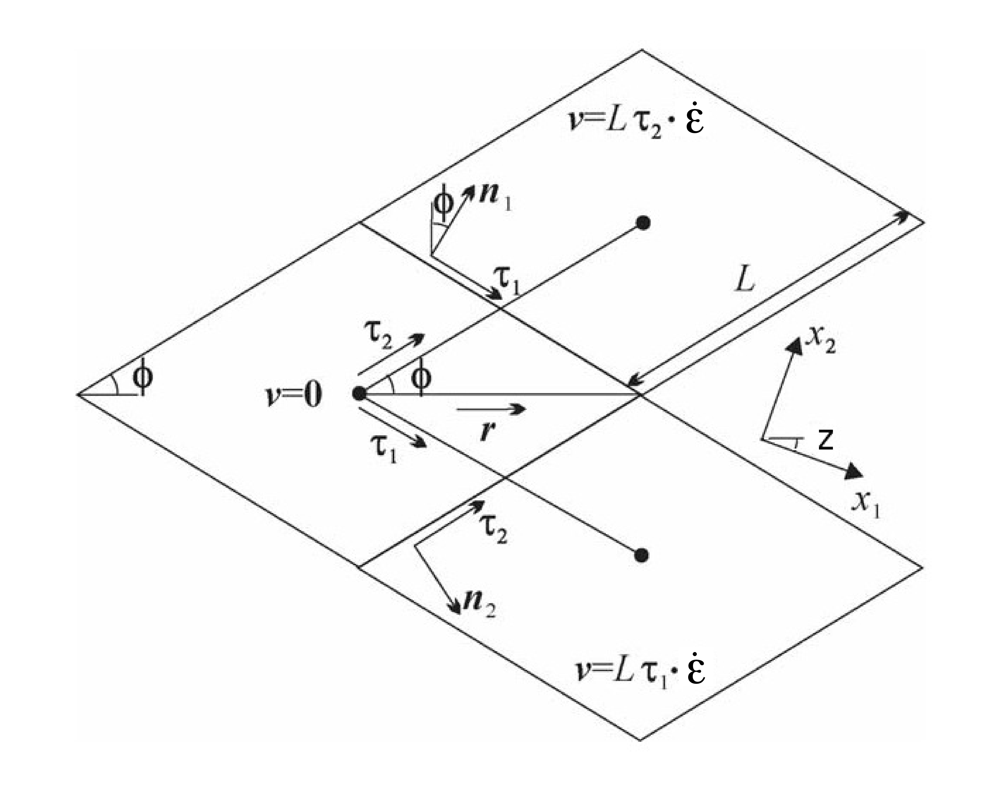
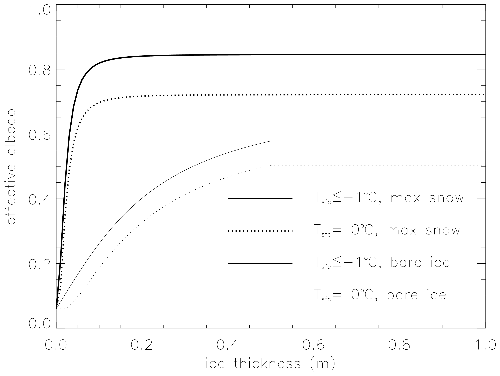

Model components
================

The Arctic and Antarctic sea ice packs are mixtures of open water, thin
first-year ice, thicker multiyear ice, and thick pressure ridges. The
thermodynamic and dynamic properties of the ice pack depend on how much
ice lies in each thickness range. Thus the basic problem in sea ice
modeling is to describe the evolution of the ice thickness distribution
(ITD) in time and space.

The fundamental equation solved by CICE is :cite:`TRMC75`:

.. math::
   \frac{\partial g}{\partial t} = -\nabla \cdot (g {\bf u}) 
    - \frac{\partial}{\partial h} (f g) + \psi,
   :label: transport-g

where :math:`{\bf u}` is the horizontal ice velocity,
:math:`\nabla = (\frac{\partial}{\partial x}, \frac{\partial}{\partial y})`,
:math:`f` is the rate of thermodynamic ice growth, :math:`\psi` is a
ridging redistribution function, and :math:`g` is the ice thickness
distribution function. We define :math:`g({\bf x},h,t)\,dh` as the
fractional area covered by ice in the thickness range :math:`(h,h+dh)`
at a given time and location.

Equation :eq:`transport-g` is solved by partitioning the ice pack in
each grid cell into discrete thickness categories. The number of
categories can be set by the user, with a default value :math:`N_C = 5`.
(Five categories, plus open water, are generally sufficient to simulate
the annual cycles of ice thickness, ice strength, and surface fluxes
:cite:`BHWE01,Lipscomb01`.) Each category :math:`n` has
lower thickness bound :math:`H_{n-1}` and upper bound :math:`H_n`. The
lower bound of the thinnest ice category, :math:`H_0`, is set to zero.
The other boundaries are chosen with greater resolution for small
:math:`h`, since the properties of the ice pack are especially sensitive
to the amount of thin ice :cite:`Maykut82`. The continuous
function :math:`g(h)` is replaced by the discrete variable
:math:`a_{in}`, defined as the fractional area covered by ice in the
open water by :math:`a_{i0}`, giving :math:`\sum_{n=0}^{N_C} a_{in} = 1`
by definition.

Category boundaries are computed in *init\_itd* using one of several
formulas, summarized in :ref:`tab-itd`. 
Setting the namelist variable `kcatbound` equal to 0 or 1 gives lower 
thickness boundaries for any number of thickness categories :math:`N_C`.
:ref:`tab-itd` shows the boundary values for :math:`N_C` = 5 and linear remapping 
of the ice thickness distribution. A third option specifies the boundaries 
based on the World Meteorological Organization classification; the full WMO
thickness distribution is used if :math:`N_C` = 7; if :math:`N_C` = 5 or
6, some of the thinner categories are combined. The original formula
(`kcatbound` = 0) is the default. Category boundaries differ from those
shown in :ref:`tab-itd` for the delta-function ITD. Users may
substitute their own preferred boundaries in *init\_itd*.

:ref:`tab-itd` : *Data exchanged between the CESM flux coupler and the sea ice model
Lower boundary values for thickness categories, in meters, for 
the three distribution options (* `kcatbound` *) and linear remapping (* `kitd` = 1 *). 
In the WMO case, the distribution used depends on the number of categories used.*

.. _tab-itd:

.. table:: Table 2 

   +----------------+------------+---------+--------+--------+--------+
   | distribution   | original   | round   |           WMO            |
   +================+============+=========+========+========+========+
   | `kcatbound`    | 0          | 1       |            2             |
   +----------------+------------+---------+--------+--------+--------+
   | :math:`N_C`    | 5          | 5       | 5      | 6      | 7      |
   +----------------+------------+---------+--------+--------+--------+
   | categories     |             lower bound (m)                     |
   +----------------+------------+---------+--------+--------+--------+
   | 1              | 0.00       | 0.00    | 0.00   | 0.00   | 0.00   |
   +----------------+------------+---------+--------+--------+--------+
   | 2              | 0.64       | 0.60    | 0.30   | 0.15   | 0.10   |
   +----------------+------------+---------+--------+--------+--------+
   | 3              | 1.39       | 1.40    | 0.70   | 0.30   | 0.15   |
   +----------------+------------+---------+--------+--------+--------+
   | 4              | 2.47       | 2.40    | 1.20   | 0.70   | 0.30   |
   +----------------+------------+---------+--------+--------+--------+
   | 5              | 4.57       | 3.60    | 2.00   | 1.20   | 0.70   |
   +----------------+------------+---------+--------+--------+--------+
   | 6              |            |         |        | 2.00   | 1.20   |
   +----------------+------------+---------+--------+--------+--------+
   | 7              |            |         |        |        | 2.00   |
   +----------------+------------+---------+--------+--------+--------+

In addition to the fractional ice area, :math:`a_{in}`, we define the
following state variables for each category :math:`n`. In a change from
previous CICE versions, we no longer carry snow and ice energy as
separate variables; instead they and sea ice salinity are carried as
tracers on snow and ice volume.

-  :math:`v_{in}`, the ice volume, equal to the product of
   :math:`a_{in}` and the ice thickness :math:`h_{in}`.

-  :math:`v_{sn}`, the snow volume, equal to the product of
   :math:`a_{in}` and the snow thickness :math:`h_{sn}`.

-  :math:`e_{ink}`, the internal ice energy in layer :math:`k`, equal to
   the product of the ice layer volume, :math:`v_{in}/N_i`, and the ice
   layer enthalpy, :math:`q_{ink}`. Here :math:`N_i` is the total number
   of ice layers, with a default value :math:`N_i = 4`, and
   :math:`q_{ink}` is the negative of the energy needed to melt a unit
   volume of ice and raise its temperature to; it is discussed in
   Section :ref:`thermo`. (NOTE: In the current code, :math:`e_i<0`
   and :math:`q_i<0` with :math:`e_i = v_iq_i`.)

-  :math:`e_{snk}`, the internal snow energy in layer :math:`k`, equal
   to the product of the snow layer volume, :math:`v_{sn}/N_s`, and the
   snow layer enthalpy, :math:`q_{snk}`, where :math:`N_s` is the number
   of snow layers. (Similarly, :math:`e_s<0` in the code.) CICE allows
   multiple snow layers, but the default value is :math:`N_s=1`.

-  :math:`S_i`, the bulk sea ice salt content in layer :math:`k`, equal
   to the product of the ice layer volume and the sea ice salinity
   tracer.

-  :math:`T_sfn`, the surface temperature.

Since the fractional area is unitless, the volume variables have units
of meters (i.e., m\ :math:`^3` of ice or snow per m\ :math:`^2` of grid
cell area), and the energy variables have units of J/m\ :math:`^2`.

The three terms on the right-hand side of Equation :eq:`transport-g` describe
three kinds of sea ice transport: (1) horizontal transport in
:math:`(x,y)` space; (2) transport in thickness space :math:`h` due to
thermodynamic growth and melting; and (3) transport in thickness space
:math:`h` due to ridging and other mechanical processes. We solve the
equation by operator splitting in three stages, with two of the three
terms on the right set to zero in each stage. We compute horizontal
transport using the incremental remapping scheme of
:cite:`DB00` as adapted for sea ice by
:cite:`LH04`; this scheme is discussed in
Section :ref:`horiz-trans`. Ice is transported in thickness space
using the remapping scheme of :cite:`Lipscomb01`, as
described in Section :ref:`itd-trans`. The mechanical
redistribution scheme, based on :cite:`TRMC75`, :cite:`Rothrock75`,
:cite:`Hibler80`, :cite:`FH95`, and :cite:`LHMJ07` is outlined
in Section :ref:`mech-red`. To solve the horizontal transport and
ridging equations, we need the ice velocity :math:`{\bf u}`, and to
compute transport in thickness space, we must know the the ice growth
rate :math:`f` in each thickness category. We use the
elastic-viscous-plastic (EVP) ice dynamics scheme of
:cite:`HD97`, as modified by :cite:`CGHM04`,
:cite:`Hunke01`, :cite:`HD02` and
:cite:`HD03`, or a new elastic-anisotropic-plastic model
:cite:`WF06,WS09,TFW13` to find the velocity, as
described in Section :ref:`dynam`. Finally, we use a thermodynamic
model to compute :math:`f` (Section :ref:`thermo`). The order in which
these computations are performed in the code itself was chosen so that
quantities sent to the coupler are consistent with each other and as
up-to-date as possible. The Delta-Eddington radiative scheme computes
albedo and shortwave components simultaneously, and in order to have the
most up-to-date values available for the coupler at the end of the
timestep, the order of radiation calculations is shifted. Albedo and
shortwave components are computed after the ice state has been modified
by both thermodynamics and dynamics, so that they are consistent with
the ice area and thickness at the end of the step when sent to the
coupler. However, they are computed using the downwelling shortwave from
the beginning of the timestep. Rather than recompute the albedo and
shortwave components at the beginning of the next timestep using new
values of the downwelling shortwave forcing, the shortwave components
computed at the end of the last timestep are scaled for the new forcing.

.. _tracers:

Tracers
-------

The basic conservation equations for ice area fraction :math:`a_{in}`,
ice volume :math:`v_{in}`, and snow volume :math:`v_{sn}` for each
thickness category :math:`n` are

.. math::
   {\partial\over\partial t} (a_{in}) + \nabla \cdot (a_{in} {\bf u}) = 0,
   :label: transport-ai

.. math::
   \frac{\partial v_{in}}{\partial t} + \nabla \cdot (v_{in} {\bf u}) = 0,
   :label: transport-vi

.. math::
   \frac{\partial v_{sn}}{\partial t} + \nabla \cdot (v_{sn} {\bf u}) = 0.
   :label: transport-vs

The ice and snow volumes can be written equivalently in terms of
tracers, ice thickness :math:`h_{in}` and snow depth :math:`h_{sn}`:

.. math::
   \frac{\partial h_{in}a_{in}}{\partial t} + \nabla \cdot (h_{in}a_{in} {\bf u}) = 0,
   :label: transport-hi

.. math::
   \frac{\partial h_{sn}a_{in}}{\partial t} + \nabla \cdot (h_{sn}a_{in} {\bf u}) = 0.
   :label: transport-hs

Although we maintain ice and snow volume instead of the thicknesses as
state variables in CICE, the tracer form is used for volume transport
(section :ref:`horiz-trans`). There are many other tracers
available, whose values are contained in the `trcrn` array. Their
transport equations typically have one of the following three forms

.. math::
   \frac{\partial \left(a_{in} T_n\right)}{\partial t} + \nabla \cdot (a_{in} T_n {\bf u}) = 0,
   :label: transport-aT

.. math::
   \frac{\partial \left(v_{in} T_n\right)}{\partial t} + \nabla \cdot (v_{in} T_n {\bf u}) = 0,
   :label: transport-viT

.. math::
   \frac{\partial \left(v_{sn} T_n\right)}{\partial t} + \nabla \cdot (v_{sn} T_n {\bf u}) = 0.
   :label: transport-vsT

Equation :eq:`transport-aT` describes the transport of surface
temperature, whereas Equation :eq:`transport-viT` and Equation :eq:`transport-vsT`
describe the transport of ice and snow enthalpy, salt, and passive
tracers such as volume-weighted ice age and snow age. Each tracer field
is given an integer index, `trcr_depend`, which has the value 0, 1, or 2
depending on whether the appropriate conservation equation is
Equation :eq:`transport-aT`, Equation :eq:`transport-viT`, or Equation :eq:`transport-vsT`,
respectively. The total number of tracers is
:math:`N_{tr}\ge 1`. In the default configuration there are two
tracers: surface temperature and volume-weighted ice age. Tracers for
melt ponds (Sections :ref:`pondtr` and :ref:`ponds`), level ice
area and level ice volume (used to diagnose ridged ice area and volume,
Section :ref:`mech-red`) are also available. Users may add any number
of additional tracers that are transported conservatively provided that
`trcr_depend` is defined appropriately. See Section :ref:`addtrcr` for
guidance on adding tracers.

.. _pondtr:

Tracers that depend on other tracers (e.g., melt ponds)
~~~~~~~~~~~~~~~~~~~~~~~~~~~~~~~~~~~~~~~~~~~~~~~~~~~~~~~

Tracers may be defined that depend on other tracers. Melt pond tracers
provide an example (these equations pertain to cesm and topo tracers;
level-ice tracers are similar with an extra factor of :math:`a_{lvl}`,
see Equations :eq:`transport-lvl`–:eq:`transport-ipnd-lvl`. Conservation
equations for pond area fraction :math:`a_{pnd}a_i` and pond volume
:math:`h_{pnd}a_{pnd}a_i`, given the ice velocity :math:`\bf u`, are

.. math::
   {\partial\over\partial t} (a_{pnd}a_{i}) + \nabla \cdot (a_{pnd}a_{i} {\bf u}) = 0,
   :label: transport-apnd

.. math::
   {\partial\over\partial t} (h_{pnd}a_{pnd}a_{i}) + \nabla \cdot (h_{pnd}a_{pnd}a_{i} {\bf u}) = 0.
   :label: transport-hpnd

(These equations represent quantities within one thickness category;
all melt pond calculations are performed for each category, separately.)
Equation :eq:`transport-hpnd` expresses conservation of melt pond
volume, but in this form highlights that the quantity tracked in the
code is the pond depth tracer :math:`h_{pnd}`, which depends on the pond
area tracer :math:`a_{pnd}`. Likewise, :math:`a_{pnd}` is a tracer on
ice area (Equation :eq:`transport-apnd`), which is a state variable, not a
tracer.

For a generic quantity :math:`q` that represents a mean value over the
ice fraction, :math:`q a_i` is the average value over the grid cell.
Thus for cesm or topo melt ponds, :math:`h_{pnd}` can be considered the
actual pond depth, :math:`h_{pnd}a_{pnd}` is the mean pond depth over
the sea ice, and :math:`h_{pnd}a_{pnd}a_i` is the mean pond depth over
the grid cell. These quantities are illustrated in :ref:`fig-tracers`.

.. _fig-tracers:

.. figure:: ./figures/tracergraphic.png
   :align: center
   :scale: 50%  

   Figure 1

:ref:`fig-tracers` : Melt pond tracer definitions. The graphic on the right
illustrates the *grid cell* fraction of ponds or level ice as defined
by the tracers. The chart on the left provides corresponding ice
thickness and pond depth averages over the grid cell, sea ice and
pond area fractions. 

Tracers may need to be modified for physical reasons outside of the
“core" module or subroutine describing their evolution. For example,
when new ice forms in open water, the new ice does not yet have ponds on
it. Likewise when sea ice deforms, we assume that pond water (and ice)
on the portion of ice that ridges is lost to the ocean.

When new ice is added to a grid cell, the *grid cell* total area of melt
ponds is preserved within each category gaining ice,
:math:`a_{pnd}^{t+\Delta t}a_{i}^{t+\Delta t} = a_{pnd}^{t}a_{i}^{t}`, 
or

.. math::
   a_{pnd}^{t+\Delta t}= {a_{pnd}^{t}a_{i}^{t} \over a_{i}^{t+\Delta t} }.
   :label: apnd

Similar calculations are performed for all tracer types, for example
tracer-on-tracer dependencies such as :math:`h_{pnd}`, when needed:

.. math:: 
   h_{pnd}^{t+\Delta t}= {h_{pnd}^{t}a_{pnd}^{t}a_{i}^{t} \over a_{pnd}^{t+\Delta t}a_{i}^{t+\Delta t} }.

In this case (adding new ice), :math:`h_{pnd}` does not change because
:math:`a_{pnd}^{t+\Delta t}a_{i}^{t+\Delta t} = a_{pnd}^{t}a_{i}^{t}`.

When ice is transferred between two thickness categories, we conserve
the total pond area summed over categories :math:`n`,

.. math:: 
   \sum_n a_{pnd}^{t+\Delta t}(n)a_{i}^{t+\Delta t}(n) = \sum_n a_{pnd}^{t}(n)a_{i}^{t}(n).

Thus,

.. math::
   \begin{aligned}
   \label{eq:xfer}
   a_{pnd}^{t+\Delta t}(m)&=& {\sum_n a_{pnd}^{t}(n)a_{i}^{t}(n) - \sum_{n\ne m} a_{pnd}^{t+\Delta t}(n)a_{i}^{t+\Delta t}(n) \over a_i^{t+\Delta t}(m)  } \\
   = {a_{pnd}^t(m)a_i^t(m) + \sum_{n\ne m} \Delta \left(a_{pnd}a_i\right)^{t+\Delta t} \over a_i^{t+\Delta t}(m)  }\end{aligned}

This is more complicated because of the :math:`\Delta` term on the
right-hand side, which is handled manually in **ice\_itd.F90**. Such
tracer calculations are scattered throughout the code, wherever there
are changes to the ice thickness distribution.

Note that if a quantity such as :math:`a_{pnd}` becomes zero in a grid
cell’s thickness category, then all tracers that depend on it also
become zero. If a tracer should be conserved (e.g., aerosols and the
liquid water in topo ponds), additional code must be added to track
changes in the conserved quantity.

More information about the melt pond schemes is in
section :ref:`ponds`.

.. _ice-age:

Ice age
~~~~~~~

The age of the ice, :math:`\tau_{age}`, is treated as an
ice-volume tracer (`trcr\_depend` = 1). It is initialized at 0 when ice
forms as frazil, and the ice ages the length of the timestep during each
timestep. Freezing directly onto the bottom of the ice does not affect
the age, nor does melting. Mechanical redistribution processes and
advection alter the age of ice in any given grid cell in a conservative
manner following changes in ice area. The sea ice age tracer is
validated in :cite:`HB09`.

Another age-related tracer, the area covered by first-year ice
:math:`a_{FY}`, is an area tracer (`trcr\_depend` = 0) that corresponds
more closely to satellite-derived ice age data for first-year ice than
does :math:`\tau_{age}`. It is re-initialized each year on 15
September (`yday` = 259) in the northern hemisphere and 15 March (`yday` =
75) in the southern hemisphere, in non-leap years. This tracer is
increased when new ice forms in open water, in subroutine
*add\_new\_ice* in **ice\_therm\_itd.F90**. The first-year area tracer
is discussed in :cite:`ABTH11`.

.. _ice-bgc:

Sea ice biogeochemistry
~~~~~~~~~~~~~~~~~~~~~~~

Ice algal photosynthesis leads to carbon fixation and pigment buildup
throughout much of the pack ice in springtime, including warm layers in
contact with seawater and the central ice matrix. Turbulence moves seed
organisms and trace elements upward across the ocean interface from the
mixed layer :cite:`AKS93`, and convection allows them to
penetrate deep into the brine channel network. Gravity drainage is
strongly coupled to carbonate and alkalinity relationships; bio-active
gases including molecular oxygen, dimethyl sulfide (DMS) and methane
exhibit dynamic cycling within and around the ice matrix. All may
ultimately be transferred across the upper interface, into snow cover
and toward the atmosphere. Chlorophyll is often concentrated in thin
layers, capable of absorbing downwelling radiation and redistributing
the implied heat locally.

Although biogeochemical activity occurs throughout the sea ice column,
in the present release we restrict ourselves to simulations of activity
taking place in the lowest few vertical centimeters. A thin intermediate
zone located in this vicinity can be considered distinct because it is
relatively warm, extremely porous and necessarily in close contact with
the seawater nutrient supply. The ecosystems supported are therefore
especially intense, so that they constitute a logical starting point for
code development. The resulting band of biological activity will be
referred to most often in what follows as the ‘bottom zone.’ It
constitutes the dominant habitat for ice algae across most of the
noncoastal Arctic and among land fast ice systems of the Southern
Hemisphere. In the literature and some portions of the code, however,
the alternate term ‘skeletal layer’ is used. For many purposes, the two
are interchangeable. But in fact, the latter is a reference to dendritic
structures more typically observable in the wintertime; ‘bottom zone’ is
the more general term.

Ecological succession in the bottom zone interacts intimately with
chemistry of the upper ocean–atmosphere system. Photosynthesis is
constrained initially by light limitation but soon becomes a matter of
resource availability :cite:`AKS93,DJEHMJ11`. Radiation
intensity dictates the timing of bloom inception. The direct inflow of
salt laden water can then be filtered immediately for the dissolved
nutrient forms, which are converted locally into biomass. In association
with the carbon storage, considerable DMS and molecular oxygen are
generated :cite:`EDHHJJLS12`. Melt and flush periods cause
bottom ice organisms to be rejected from the matrix mechanically. The
dominant primary producers among them are pennate diatoms, a class
subject to rapid sinking :cite:`LDM05`. Hence the amount of
bottom layer biological activity dictates high latitude nutrient and
trace gas levels in the early spring, then carbon drawdown moving into
the period of breakup.

Light transmission passes into the bottom zone through overlying layers
of snow and ice. Attenuation by the ice algae is integrated and averaged
over the bottom three centimeters in which they reside. Our current CICE
release treats inflow of the primary Arctic nutrients nitrate and
silicate, along with the major pathway for nitrogen recycling via
ammonia. Both fertilizers and byproducts are permitted to exchange back
out of the porous bottom volume on a time scale of order hours
:cite:`AKS93,LDM05`. Biomass multiplies exponentially as
light and nutrient restrictions are lifted, following the rising polar
sun. Uptake accelerates until there is a transition to flux limitation
:cite:`EDHHJJLS12`. At variable times and locations, a
kinetic balance is often reached in which dissolved nitrogen is
sequestered faster than it can leave the porous volume. Computational
terms involved in the ecodynamic simulation resemble Michaelis-Menten
enzyme kinetics, and have been adapted here from a series of pioneering
ice biogeochemistry models
:cite:`AKS93,JDWSTWLG06,LDM05`. CICE biogeochemical
applications include a series of Pan-Arctic simulations, conceptually
extending from primary production and carbon cycling to the release of
trace gases into the ice domain
:cite:`DJEHMJ11,EDHHJJLS12`.

The bottom ice biogeochemistry module described here is designed for
ready attachment of extra-nutrient cycling, including byproduct and
detrital processing. Our own mechanism for the generation of DMS is
included in the release as an example. For full details please see
descriptions and schematics in :cite:`EDHHJJLS12`.
Generally speaking, the primary nutrient flow as nitrogen simultaneously
supports formation of silicate frustules by the ice diatoms, along with
carbon biomass production and the implied chlorophyll buildup. Synthesis
of organosulfur metabolites is handled simultaneously and in direct
proportion. DMS spins off of this subsystem at much higher levels than
those familiar from open water studies, since the ice algae are
especially abundant and suffer strong cryological, osmotic and oxidant
stress in an extreme environmental regime :cite:`SSTMB07`.
The sulfur transformations are governed by a typical pattern of routing
kinetics within and below the ice :cite:`EDHHJJLS12`, which
reduces the net yield of volatile gas but still permits considerable
buildup and release during the spring thaw.

Biogeochemical processing is modelled as a single layer of reactive
tracers attached to the sea ice bottom. Optional settings are available
via the *zbgc\_nml* namelist in **ice\_in**. The prefix `tr\_bgc`
signifies a biogeochemical tracer, while the postscript `\_sk` indicates
that a particular quantity is restricted to the band of bottom or
skeletal ice material. History fields are controlled in the
*icefields\_bgc\_nml* namelist. As with other CICE history fields, the
suffix `\_ai` indicates that the field is multiplied by ice area and is
therefore a grid-cell-mean quantity.

Setting the flag `skl\_bgc` to true turns on a reduced ‘NP’
(Nitrogen-Plankton) biogeochemistry consisting of nitrate and one algal
tracer. Ammonium (`tr\_bgc\_Am\_sk`), silicate (`tr\_bgc\_Sil\_sk`),
dimethyl sulfoniopropionate (DMSP) in particulate form
(`tr\_bgc\_DMSPp\_sk`), DMSP in dissolved form (`tr\_bgc\_DMSPd\_sk`), and
volatile dimethyl sulfide (`tr\_bgc\_DMS\_sk`) may also be included by
setting the respective flags to true in **ice\_in**.

All biogeochemical tracers (:math:`T_b`) are brine concentrations
multiplied by the skeletal layer thickness (:math:`h_{sk}`). Bulk tracer
concentrations are written to diagnostic files and are found by the
expression :math:`T_b \phi_{sk}/h_{sk}` where :math:`\phi_{sk}` is the
skeletal layer porosity. Both :math:`h_{sk}` and :math:`\phi_{sk}` are
defined in **ice\_zbgc\_shared.F90**.

Tracers :math:`T_b` are area conserved and follow the horizontal
transport equation ([eq:transport\_aT]). The initial concentrations of
tracers are specified in subroutine **init\_bgc** in **ice\_zbgc.F90**.
Silicate and nitrate may be initialized and forced with climatology.
Parameters `sil\_data\_type` and `nit\_data\_type` are set in **ice\_in**
and take the values ‘clim’ (climatology) and ‘default’ (constant).
`nit\_data\_type` may also take the value ‘sss’ which sets nitrate to the
ocean salinity value. For climatology, the data directory `bgc\_data\_dir`
must also be specified. If `restore\_bgc` is true, then values are
linearly restored to climatology according to the restoring timescale
`trestore`.

For each horizontal grid point, local biogeochemical tracer equations
are solved in **ice\_algae.F90**. There are two types of ice–ocean
tracer flux formulations: ‘Jin2006’ modelled after the growth rate
dependent piston velocity of :cite:`JDWSTWLG06`, and
‘constant’ modelled after the constant piston velocity of
:cite:`EDHHJJLS12`. The formulation is specified in
**ice\_in** by setting `bgc\_flux\_type` equal to ‘Jin2006’ or ‘constant’.

In addition to horizontal advection and transport among thickness
categories, biogeochemical tracers (:math:`T_b` where
:math:`b = 1,\ldots, N_b`) satisfy a set of local coupled equations of
the form

.. math::
   \frac{d T_b}{dt}  = w_b \frac{\Delta T_b}{\Delta z} +  R_b({T_j : j = 1,\ldots,N_b})

where :math:`R_b` represents the nonlinear biochemical reaction terms
detailed in :cite:`EDHHJJLS12` and :math:`\Delta z` is a
length scale representing the molecular sublayer of the ice–ocean
interface. Its value is absorbed in the piston velocity parameters. The
piston velocity :math:`w_b` depends on the particular tracer and the
flux formulation.

For ‘Jin2006’, the piston velocity is a function of ice growth and melt
rates. All tracers (algae included) flux with the same piston velocity
during ice growth, :math:`dh/dt > 0`:

.. math::
   w_b   =   - p_g\left|m_1 + m_2 \frac{dh}{dt} - m_3
     \left(\frac{dh}{dt} \right)^2\right|
   :label: pwJin-growth

with parameters :math:`m_1`, :math:`m_2`, :math:`m_3` and :math:`p_g`
defined in **skl\_biogeochemistry**. For ice melt, :math:`dh/dt < 0`,
all tracers with the exception of ice algae flux with

.. math::
   w_b  =  p_m\left|m_2 \frac{dh}{dt} - m_3
       \left(\frac{dh}{dt}  \right)^2\right|
   :label: pwJin-melt

with :math:`p_m` defined in **skl\_biogeochemistry**. The ‘Jin2006’
formulation also requires that for both expressions,
:math:`|w_b| \leq 0.9
h_{sk}/\Delta t`. The concentration difference at the ice–ocean boundary
for each tracer, :math:`\Delta
T_b`, depends on the sign of :math:`w_b`. For growing ice,
:math:`w_b <0`, :math:`\Delta T_b  = T_b/h_{sk} - T_{io}`, where
:math:`T_{io}` is the ocean concentration of tracer :math:`i`. For
melting ice, :math:`w_b > 0`, :math:`\Delta T_b = T_b/h_{sk}`.

In ‘Jin2006’, the algal tracer (:math:`N_a`) responds to ice melt in the
same manner as the other tracers from Equation :eq:`pwJin-melt`. However, this is
not the case for ice growth. Unlike dissolved nutrients, algae are able
to cling to the ice matrix and resist expulsion during desalination. For
this reason, algal tracers do not flux between ice and ocean during ice
growth unless the ice algal brine concentration is less than the ocean
algal concentration (:math:`N_o`). Then the ocean seeds the sea ice
concentration according to

.. math::
   w_b \frac{\Delta N_a}{\Delta z} = \frac{N_oh_{sk}/\phi_{sk} -
     N_a}{\Delta t}
   :label: seed

The ‘constant’ formulation uses a fixed piston velocity (PVc) for
positive ice growth rates for all tracers except :math:`N_a`. As in
‘Jin2006’, congelation ice growth seeds the sea ice algal population
according to Equation :eq:`seed` when :math:`N_a < N_o
h_{sk}/\phi_{sk}`. For bottom ice melt, all tracers follow the
prescription

.. math::
   w_b \frac{\Delta T_b}{\Delta z} =  \left\{ \begin{array}{ll}
      T_b   |dh_i/dt|/h_{sk} \ \ \ \ \ &   \mbox{if }
    |dh_i/dt|\Delta t/h_{sk} < 1  \\
    T_b/\Delta t & \mbox{otherwise.}   \end{array} \right.  
   :label: constant-melt   

All of the necessary fluxes required for coupling to an ocean model
component are contained in a single array, `flux\_bio`.

This bottom-specific biogeochemistry module necessarily simplifies the
full sea ice ecosystem. For the moment, zooplankton comprise an
imaginary tracer of indefinite mass that make their presence felt mainly
through the recycling of ammonia
:cite:`EDHHJJLS12,JDWSTWLG06`. Consumer organisms are
essentially siphoned off of the standard primary production pathway as
a fixed fraction of overall growth :cite:`AKS93`. Transfer
velocities relating the upper water column to ice fluids and solutes are
now parameterized as a function of off-line congelation rates, based on
laboratory brine expulsion data
:cite:`AKS93,EDHHJJLS12,JDWSTWLG06`. Thus far we have
tested removal from the active bottom zone as a single adjustable time
constant, but results have not been formalized or adequately evaluated
against data. Internally consistent connections with gravity drainage
will be implemented in the vertical biogeochemistry module being
developed for future release in CICE.

.. _aero:

Aerosols
~~~~~~~~

Aerosols may be deposited on the ice and gradually work their way
through it until the ice melts and they are passed into the ocean. They
are defined as ice and snow volume tracers (Equations :eq:`transport-viT` and
:eq:`transport-vsT`), with the snow and ice each having two tracers for
each aerosol species, one in the surface scattering layer
(delta-Eddington SSL) and one in the snow or ice interior below the SSL.

Rather than updating aerosols for each change to ice/snow thickness due
to evaporation, melting, snow–ice formation, etc., during the
thermodynamics calculation, these changes are deduced from the
diagnostic variables (`melts`, `meltb`, `snoice`, etc) in
**ice\_aerosol.F90**. Three processes change the volume of ice or snow
but do not change the total amount of aerosol, thus causing the aerosol
concentration (the value of the tracer itself) to increase: evaporation,
snow deposition and basal ice growth. Basal and lateral melting remove
all aerosols in the melted portion. Surface ice and snow melt leave a
significant fraction of the aerosols behind, but they do “scavenge" a
fraction of them given by the parameter `kscav` = [0.03, 0.2, 0.02, 0.02,
0.01, 0.01] (only the first 3 are used in CESM, for their 3 aerosol
species). Scavenging also applies to snow–ice formation. When sea ice
ridges, a fraction of the snow on the ridging ice is thrown into the
ocean, and any aerosols in that fraction are also lost to the ocean.

As upper SSL or interior layers disappear from the snow or ice, aerosols
are transferred to the next lower layer, or into the ocean when no ice
remains. The atmospheric flux `faero\_atm` contains the rates of aerosol
deposition for each species, while `faero\_ocn` has the rate at which the
aerosols are transferred to the ocean.

The aerosol tracer flag `tr\_aero` must be set to true in **ice\_in**, and
the number of aerosol species is set in **comp\_ice**; CESM uses 3.
Results using the aerosol code in the context of CESM are documented in
:cite:`HBBLH12`. Global diagnostics are available when
`print\_global` is true, and history variables include the mass density
for each layer (snow and ice SSL and interior), and atmospheric and
oceanic fluxes, for each species.

.. _brine-ht:

Brine height
~~~~~~~~~~~~

The brine height, :math:`h_b`, is the distance from the ice–ocean
interface to the brine surface. When `tr\_brine` is set true in
**ice\_in** and `TRBRI` is set equal to 1 in **comp\_ice**, the brine
surface can move relative to the ice surface. Physically, this occurs
when the ice is permeable and there is a nonzero pressure head: the
difference between the brine height and the equilibrium sea surface.
Brine height motion is computed in **ice\_brine.F90** from thermodynamic
variables (`melts`, `meltb`, `meltt`, etc) and the ice microstructural state
deduced from internal bulk salinities and temperature. In the current
release, this tracer is for diagnostic purposes only; it is driven by
the prognostic salinity parameterization but is not used for computing
salinity. In future releases it will be used for transporting
biogeochemical tracers vertically through the ice.

Brine height is transported horizontally as the fraction
:math:`f_{bri} = h_b/h_i`, a volume conserved tracer
(Equation :eq:`transport-viT`). Note that unlike the sea ice porosity, brine
height fraction may be greater than 1 when :math:`h_b > h_i`.

Vertical transport processes are, generally, a result of the brine
motion. Therefore the vertical transport equations for biogeochemical
tracers will be defined only where brine is present. This region, from
the ice–ocean interface to the brine height, defines the domain of the
vertical bio-grid, whose resolution is independent of the sea ice
vertical grid and is set at compile time (see
Section :ref:`bio-grid`). The ice microstructural state,
determined in **ice\_brine.F90**, is computed from sea ice salinities
and temperatures linearly interpolated to the bio-grid. When
:math:`h_b > h_i`, the upper surface brine is assumed to have the same
microstructural properties as the ice surface.

Changes to :math:`h_b` occur from ice and snow melt, ice bottom boundary
changes, and from pressure adjustments. The computation of :math:`h_b`
at :math:`t+\Delta
t` is a two step process. First, :math:`h_b` is updated from changes in
ice and snow thickness, ie.

.. math::
   h_b'  =  h_b(t) + \Delta h_b|_{h_i,h_s} .
   :label: hb-thickness-changes

Second, pressure driven adjustments arising from meltwater flushing and
snow loading are applied to :math:`h'_b`. Brine flow due to pressure
forces are governed by Darcy’s equation

.. math::
   w =  -\frac{\Pi^* \bar{\rho} g}{\mu}\frac{h_p}{h_i}.
   :label: Darcy

The vertical component of the net permeability tensor :math:`\Pi^*` is
computed as

.. math::
   \Pi^*  =  \left(\frac{1}{h}\sum_{i=1}^N{\frac{\Delta
         z_i}{\Pi_i}}\right)^{-1}
   :label: netPi

where the sea ice is composed of :math:`N` vertical layers with
:math:`i`\ th layer thickness :math:`\Delta z_i` and permeability
:math:`\Pi_i` ([eq:topo\_permea]). The average sea ice density is
:math:`\bar{\rho}` specified in **ice\_zbgc\_shared.F90**. The hydraulic
head is :math:`h_p = h_b - h_{sl}` where :math:`h_{sl}` is the sea level
given by

.. math:: 
   h_{sl}  =  \frac{\bar{\rho}}{\rho_w}h_i + \frac{\rho_s}{\rho_w}h_s.

Assuming constant :math:`h_i` and :math:`h_s` during Darcy flow, the
rate of change of :math:`h_b` is

.. math::
   \frac{\partial h_b}{\partial t}   =  -w h_p
   :label: h-p

where :math:`w_o = \Pi^* \bar{\rho}
g/(h_i\mu\phi_{top})` and :math:`\phi_{top}` is the upper surface
porosity. When the Darcy flow is downward into the ice
(:math:`w_o < 0`), then :math:`\phi_{top}` equals the sea ice porosity
in the uppermost layer. However, when the flow is upwards into the snow,
then :math:`\phi_{top}` equals the snow porosity `phi\_snow` specified in
**ice\_in**. If a negative number is specified for `phi\_snow`, then the
default value is used: phi\_snow :math:`=1 - \rho_s/\rho_w`.

Since :math:`h_{sl}` remains relatively unchanged during Darcy flow,
Equation :eq:`h-p` has the approximate solution

.. math::
   h_b(t+\Delta t) \approx h_{sl}(t+\Delta t) +  [h'_b - h_{sl}(t+\Delta t)]\exp\left\{-w \Delta t\right\}.
   :label: brine-height

The contribution :math:`\Delta h_b|_{h_i,h_s}` arises from snow and ice
melt and bottom ice changes. Since the ice and brine bottom boundaries
coincide, changes in the ice bottom from growth or melt,
:math:`(\Delta h_i)_{bot}`, equal the bottom brine boundary changes. The
surface contribution from ice and snow melt, however, is opposite in
sign. The ice contribution is as follows. If :math:`h_i > h_b` and the
ice surface is melting, ie. :math:`(\Delta h_i)_{top} <
0`), then melt water increases the brine height:

.. math::
   \left(\Delta h_b\right)_{top}  =   \frac{\rho_i}{\rho_o} \cdot \left\{ \begin{array}{ll}
    -(\Delta h_i)_{top} &  \mbox{if }
    |(\Delta h_i)_{top}| < h_i-h_b  \\
    h_i-h_b & \mbox{otherwise.}   \end{array} \right.

For snow melt (:math:`\Delta h_s < 0`), it is assumed that all snow
melt water contributes a source of surface brine. The total change from
snow melt and ice thickness changes is

.. math::
   \Delta h_b|_{h_i,h_s}  =  \left( \Delta
   h_b\right)_{top} -\left(\Delta h_i\right)_{bot} -\frac{\rho_s}{\rho_o}\Delta h_s.
   :label: dzdt-meltwater

The above brine height calculation is used only when :math:`h_i` and
:math:`h_b` exceed a minimum thickness, `thinS`, specified in
**ice\_zbgc\_shared**. Otherwise

.. math::
   h_b(t+\Delta t)  =  h_b(t) + \Delta h_i
   :label: thinbrine

provided that :math:`|h_{sl}-h_b| \leq 0.001`. This formulation ensures
small Darcy velocities when :math:`h_b` first exceeds `thinS`.

Both the volume fraction :math:`f_{bri}` and the area-weighted brine
height :math:`h_b` can be written to the history file. The history
variable `fbri` contains the volume-averaged brine fraction tracer

.. math:: 
   {{\sum f_{bri} v_i} \over {\sum v_i}},

while hbri is comparable to hi (:math:`h_i`)

.. math:: 
   {{\sum f_{bri} h_i a_i} \over {\sum a_i}},

where the sums are taken over thickness categories.

.. _horiz-trans:

Horizontal transport
--------------------

We wish to solve the continuity or transport equation
(Equation :eq:`transport-ai`) for the fractional ice area in each
thickness category :math:`n`. Equation :eq:`transport-ai` describes
the conservation of ice area under horizontal transport. It is obtained
from Equation :eq:`transport-g` by discretizing :math:`g` and neglecting the
second and third terms on the right-hand side, which are treated
separately (Sections :ref:`itd-trans` and :ref:`mech-red`.

There are similar conservation equations for ice volume
(Equation :eq:`transport-vi`), snow volume (Equation :eq:`transport-vs`), ice
energy and snow energy:

.. math::
   \frac{\partial e_{ink}}{\partial t} + \nabla \cdot (e_{ink} {\bf u}) = 0,
   :label: transport-ei

.. math::
   \frac{\partial e_{snk}}{\partial t} + \nabla \cdot (e_{snk} {\bf u}) = 0.
   :label: transport-es

By default, ice and snow are assumed to have constant densities, so that
volume conservation is equivalent to mass conservation. Variable-density
ice and snow layers can be transported conservatively by defining
tracers corresponding to ice and snow density, as explained in the
introductory comments in **ice\_transport\_remap.F90**. Prognostic
equations for ice and/or snow density may be included in future model
versions but have not yet been implemented.

Two transport schemes are available: upwind and the incremental
remapping scheme of :cite:`DB00` as modified for sea ice by
:cite:`LH04`. The remapping scheme has several desirable features:

-  It conserves the quantity being transported (area, volume, or
   energy).

-  It is non-oscillatory; that is, it does not create spurious ripples
   in the transported fields.

-  It preserves tracer monotonicity. That is, it does not create new
   extrema in the thickness and enthalpy fields; the values at
   time \ :math:`m+1` are bounded by the values at time \ :math:`m`.

-  It is second-order accurate in space and therefore is much less
   diffusive than first-order schemes (e.g., upwind). The accuracy may
   be reduced locally to first order to preserve monotonicity.

-  It is efficient for large numbers of categories or tracers. Much of
   the work is geometrical and is performed only once per grid cell
   instead of being repeated for each quantity being transported.

The time step is limited by the requirement that trajectories projected
backward from grid cell corners are confined to the four surrounding
cells; this is what is meant by incremental remapping as opposed to
general remapping. This requirement leads to a CFL-like condition,

.. math::
   {\max|{\bf u}|\Delta t\over\Delta x}
   \leq 1.

For highly divergent velocity fields the maximum time step must be
reduced by a factor of two to ensure that trajectories do not cross.
However, ice velocity fields in climate models usually have small
divergences per time step relative to the grid size.

The remapping algorithm can be summarized as follows:

#. Given mean values of the ice area and tracer fields in each grid
   cell, construct linear approximations of these fields. Limit the
   field gradients to preserve monotonicity.

#. Given ice velocities at grid cell corners, identify departure regions
   for the fluxes across each cell edge. Divide these departure regions
   into triangles and compute the coordinates of the triangle vertices.

#. Integrate the area and tracer fields over the departure triangles to
   obtain the area, volume, and energy transported across each cell
   edge.

#. Given these transports, update the state variables.

Since all scalar fields are transported by the same velocity field, step
(2) is done only once per time step. The other three steps are repeated
for each field in each thickness category. These steps are described
below.

.. _reconstruct:

Reconstructing area and tracer fields
~~~~~~~~~~~~~~~~~~~~~~~~~~~~~~~~~~~~~

First, using the known values of the state variables, the ice area and
tracer fields are reconstructed in each grid cell as linear functions of
:math:`x` and :math:`y`. For each field we compute the value at the cell
center (i.e., at the origin of a 2D Cartesian coordinate system defined
for that grid cell), along with gradients in the :math:`x` and :math:`y`
directions. The gradients are limited to preserve monotonicity. When
integrated over a grid cell, the reconstructed fields must have mean
values equal to the known state variables, denoted by :math:`\bar{a}`
for fractional area, :math:`\tilde{h}` for thickness, and
:math:`\hat{q}` for enthalpy. The mean values are not, in general, equal
to the values at the cell center. For example, the mean ice area must
equal the value at the centroid, which may not lie at the cell center.

Consider first the fractional ice area, the analog to fluid density
:math:`\rho` in :cite:`DB00`. For each thickness category
we construct a field :math:`a({\bf r})` whose mean is :math:`\bar{a}`,
where :math:`{\bf r} =
(x,y)` is the position vector relative to the cell center. That is, we
require

.. math::
   \int_A a \, dA = {\bar a} \, A,
   :label: mean-area

where :math:`A=\int_A dA` is the grid cell area.
Equation :eq:`mean-area` is satisfied if :math:`a({\bf r})` has the
form

.. math::
   a({\bf r}) = \bar{a} + \alpha_a \left<\nabla a\right> \cdot ({\bf r}-{\bf \bar{r}}),
   :label: recon-area

where :math:`\left<\nabla a\right>` is a centered estimate of the area
gradient within the cell, :math:`\alpha_a` is a limiting coefficient
that enforces monotonicity, and :math:`{\bf \bar{r}}` is the cell
centroid:

.. math:: 
   {\bf \bar{r}} = {1\over A} \int_A {\bf r} \, dA.

It follows from Equation :eq:`recon-area` that the ice area at the cell center
(:math:`\mathbf{r} = 0`) is

.. math:: 
   a_c = \bar{a} - a_x \overline{x} - a_y \overline{y},

where :math:`a_x = \alpha_a (\partial a / \partial x)` and
:math:`a_y = \alpha_a (\partial a / \partial y)` are the limited
gradients in the :math:`x` and :math:`y` directions, respectively, and
the components of :math:`{\bf \bar{r}}`,
:math:`\overline{x} = \int_A x \, dA / A` and
:math:`\overline{y} = \int_A y \, dA / A`, are evaluated using the
triangle integration formulas described in
Section :ref:`integ-flux`. These means, along with higher-order
means such as :math:`\overline{x^2}`, :math:`\overline{xy}`, and
:math:`\overline{y^2}`, are computed once and stored.

Next consider the ice and snow thickness and enthalpy fields. Thickness
is analogous to the tracer concentration :math:`T` in
:cite:`DB00`, but there is no analog in
:cite:`DB00` to the enthalpy. The reconstructed ice or snow
thickness :math:`h({\bf r})` and enthalpy :math:`q(\mathbf{r})` must
satisfy

.. math::
   \int_A a \, h \, dA       =  \bar{a} \, \tilde{h} \, A,
   :label: mean-thickness

.. math::
   \int_A a \, h \, q \, dA  =  \bar{a} \, \tilde{h} \, \hat{q} \, A,
   :label: mean-enthalpy

where :math:`\tilde{h}=h(\tilde{\bf r})` is the thickness at the center
of ice area, and :math:`\hat{q}=q(\hat{\bf r})` is the enthalpy at the
center of ice or snow volume. Equations ([eq:mean\_thickness]) and
([eq:mean\_enthalpy]) are satisfied when :math:`h({\bf r})` and
:math:`q({\bf r})` are given by

.. math::
   h({\bf r}) = \tilde{h} + \alpha_h \left<\nabla h\right> \cdot
                                        ({\bf r}-{\bf \tilde{r}}),
   :label: recon-thickness

.. math::
   q({\bf r}) = \hat{q} + \alpha_q \left<\nabla q\right> \cdot
                                      ({\bf r}-{\bf \hat{r}}),
   :label: recon-enthalpy

where :math:`\alpha_h` and :math:`\alpha_q` are limiting coefficients.
The center of ice area, :math:`{\bf\tilde{r}}`, and the center of ice or
snow volume, :math:`{\bf \hat{r}}`, are given by

.. math:: 
   {\bf \tilde{r}} = {1\over\bar{a} \, A}\int_A a \, {\bf r} \, dA,

.. math::
   {\bf \hat{r}} =
           {1\over\bar{a} \, \tilde{h} \, A}\int_A a \, h \, {\bf r} \, dA.

Evaluating the integrals, we find that the components of
:math:`{\bf \tilde{r}}` are

.. math::
   \tilde{x} = \frac{a_c \overline{x}+a_x \overline{x^2}+a_y \overline{xy}}
                      {\bar{a}},

.. math::
   \tilde{y} = \frac{a_c \overline{y}+a_x \overline{xy} +a_y \overline{y^2}}
                      {\bar{a}},

and the components of :math:`{\bf \hat{r}}` are

.. math::
   \hat{x} = \frac { c_1 \overline{x}     + c_2 \overline{x^2}
                      + c_3 \overline{xy}    + c_4 \overline{x^3}
                      + c_5 \overline{x^2 y} + c_6 \overline{x y^2} }
                      {\bar{a} \, \tilde{h}},

.. math::
   \hat{y} = \frac { c_1 \overline{y}     + c_2 \overline{xy}
                      + c_3 \overline{y^2}   + c_4 \overline{x^2 y}
                      + c_5 \overline{x y^2} + c_6 \overline{y^3}   }
                       {\bar{a} \, \tilde{h}},

where

.. math::
   \begin{aligned}
    c_1 & \equiv & a_c h_c,            \\
    c_2 & \equiv & a_c h_x + a_x h_c,  \\
    c_3 & \equiv & a_c h_y + a_y h_c,  \\
    c_4 & \equiv & a_x h_x,            \\
    c_5 & \equiv & a_x h_y + a_y h_x,  \\
    c_6 & \equiv & a_y h_y.\end{aligned}

From Equation :eq:`recon-thickness` and Equation :eq:`recon-enthalpy`, 
the thickness and enthalpy at the cell center are given by

.. math:: 
   h_c = \tilde{h} - h_x \tilde{x} - h_y \tilde{y},

.. math:: 
   q_c = \hat{q}   - q_x \hat{x}   - q_y \hat{y},

where :math:`h_x`, :math:`h_y`, :math:`q_x` and :math:`q_y` are the
limited gradients of thickness and enthalpy. The surface temperature is
treated the same way as ice or snow thickness, but it has no associated
enthalpy. Tracers obeying conservation equations of the form Equation
:eq:`transport-viT` and Equation :eq:`transport-vsT` are treated in analogy
to ice and snow enthalpy, respectively.

We preserve monotonicity by van Leer limiting. If
:math:`\bar{\phi}(i,j)` denotes the mean value of some field in grid
cell :math:`(i,j)`, we first compute centered gradients of
:math:`\bar{\phi}` in the :math:`x` and :math:`y` directions, then check
whether these gradients give values of :math:`\phi` within cell
:math:`(i,j)` that lie outside the range of :math:`\bar{\phi}` in the
cell and its eight neighbors. Let :math:`\bar{\phi}_{\max}` and
:math:`\bar{\phi}_{\min}` be the maximum and minimum values of
:math:`\bar{\phi}` over the cell and its neighbors, and let
:math:`\phi_{\max}` and :math:`\phi_{\min}` be the maximum and minimum
values of the reconstructed :math:`\phi` within the cell. Since the
reconstruction is linear, :math:`\phi_{\max}` and :math:`\phi_{\min}`
are located at cell corners. If :math:`\phi_{\max} > \bar{\phi}_{\max}`
or :math:` \phi_{\min} < \bar{\phi}_{\min}`, we multiply the unlimited
gradient by :math:`\alpha = \min(\alpha_{\max}, \alpha_{\min})`, where

.. math::
   \alpha_{\max} =
     (\bar{\phi}_{\max} - \bar{\phi}) / (\phi_{\max} -\bar{\phi}),

.. math::
   \alpha_{\min} =
     (\bar{\phi}_{\min} - \bar{\phi}) / (\phi_{\min} -\bar{\phi}).

Otherwise the gradient need not be limited.

Earlier versions of CICE (through 3.14) computed gradients in physical
space. Starting in version 4.0, gradients are computed in a scaled space
in which each grid cell has sides of unit length. The origin is at the
cell center, and the four vertices are located at (0.5, 0.5),
(-0.5,0.5),(-0.5, -0.5) and (0.5, -0.5). In this coordinate system,
several of the above grid-cell-mean quantities vanish (because they are
odd functions of x and/or y), but they have been retained in the code
for generality.

.. _loc-dep-triangles:

Locating departure triangles
~~~~~~~~~~~~~~~~~~~~~~~~~~~~

The method for locating departure triangles is discussed in detail by
:cite:`DB00`. The basic idea is illustrated in
:ref:`fig-deparr`, which shows a shaded quadrilateral departure region
whose contents are transported to the target or home grid cell, labeled
:math:`H`. The neighboring grid cells are labeled by compass directions:
:math:`NW`, :math:`N`, :math:`NE`, :math:`W`, and :math:`E`. The four
vectors point along the velocity field at the cell corners, and the
departure region is formed by joining the starting points of these
vectors. Instead of integrating over the entire departure region, it is
convenient to compute fluxes across cell edges. We identify departure
regions for the north and east edges of each cell, which are also the
south and west edges of neighboring cells. Consider the north edge of
the home cell, across which there are fluxes from the neighboring
:math:`NW` and :math:`N` cells. The contributing region from the
:math:`NW` cell is a triangle with vertices :math:`abc`, and that from
the :math:`N` cell is a quadrilateral that can be divided into two
triangles with vertices :math:`acd` and :math:`ade`. Focusing on
triangle :math:`abc`, we first determine the coordinates of vertices
:math:`b` and :math:`c` relative to the cell corner (vertex :math:`a`),
using Euclidean geometry to find vertex :math:`c`. Then we translate the
three vertices to a coordinate system centered in the :math:`NW` cell.
This translation is needed in order to integrate fields
(Section :ref:`integ-flux`) in the coordinate system where they
have been reconstructed (Section :ref:`reconstruct`). Repeating
this process for the north and east edges of each grid cell, we compute
the vertices of all the departure triangles associated with each cell
edge.

.. _fig-deparr:

.. figure:: ./figures/deparr.png
   :align: center
   :scale: 20%
 
   Figure 2

:ref:`fig-deparr` : In incremental remapping, conserved quantities are
remapped from the shaded departure region, a quadrilateral formed by
connecting the backward trajectories from the four cell corners, to
the grid cell labeled :math:`H`. The region fluxed across the north
edge of cell :math:`H` consists of a triangle (:math:`abc`) in the
:math:`NW` cell and a quadrilateral (two triangles, :math:`acd` and
:math:`ade`) in the :math:`N` cell.

:ref:`fig-triangles`, reproduced from :cite:`DB00`, shows
all possible triangles that can contribute fluxes across the north edge
of a grid cell. There are 20 triangles, which can be organized into five
groups of four mutually exclusive triangles as shown in
:ref:`tab-triangle`. In this table, :math:`(x_1, y_1)` and
:math:`(x_2,y_2)` are the Cartesian coordinates of the departure points
relative to the northwest and northeast cell corners, respectively. The
departure points are joined by a straight line that intersects the west
edge at :math:`(0,y_a)` relative to the northwest corner and intersects
the east edge at :math:`(0,y_b)` relative to the northeast corner. The
east cell triangles and selecting conditions are identical except for a
rotation through 90 degrees.

.. _fig-triangles:

.. figure:: ./figures/triangles.png
   :align: center
   :scale: 20%

   Figure 3

:ref:`fig-triangles` : The 20 possible triangles that can contribute fluxes
across the north edge of a grid cell.

:ref:`tab-triangle` : *Evaluation of contributions from the 20
triangles across the north cell edge. The coordinates* :math:`x_1`,
:math:`x_2`, :math:`y_1`, :math:`y_2`, :math:`y_a`, *and* :math:`y_b` *are
defined in the text. We define* :math:`\tilde{y}_1 =
y_1` *if* :math:`x_1>0`, *else* :math:`\tilde{y}_1 = y_a`. *Similarly,*
:math:`\tilde{y}_2
= y_2` if :math:`x_2<0`, *else* :math:`\tilde{y}_2 = y_b`.

.. _tab-triangle:

.. table:: Table 3 

   +------------+------------+--------------------------------------------------------+----+
   | Triangle   | Triangle   | Selecting logical                                      |    |
   +------------+------------+--------------------------------------------------------+----+
   | group      | label      | condition                                              |    |
   +------------+------------+--------------------------------------------------------+----+
   +------------+------------+--------------------------------------------------------+----+
   | 1          | NW         | :math:`y_a>0` and :math:`y_1\geq0` and :math:`x_1<0`   |    |
   +------------+------------+--------------------------------------------------------+----+
   |            | NW1        | :math:`y_a<0` and :math:`y_1\geq0` and :math:`x_1<0`   |    |
   +------------+------------+--------------------------------------------------------+----+
   |            | W          | :math:`y_a<0` and :math:`y_1<0` and :math:`x_1<0`      |    |
   +------------+------------+--------------------------------------------------------+----+
   |            | W2         | :math:`y_a>0` and :math:`y_1<0` and :math:`x_1<0`      |    |
   +------------+------------+--------------------------------------------------------+----+
   +------------+------------+--------------------------------------------------------+----+
   | 2          | NE         | :math:`y_b>0` and :math:`y_2\geq0` and :math:`x_2>0`   |    |
   +------------+------------+--------------------------------------------------------+----+
   |            | NE1        | :math:`y_b<0` and :math:`y_2\geq0` and :math:`x_2>0`   |    |
   +------------+------------+--------------------------------------------------------+----+
   |            | E          | :math:`y_b<0` and :math:`y_2<0` and :math:`x_2>0`      |    |
   +------------+------------+--------------------------------------------------------+----+
   |            | E2         | :math:`y_b>0` and :math:`y_2<0` and :math:`x_2>0`      |    |
   +------------+------------+--------------------------------------------------------+----+
   +------------+------------+--------------------------------------------------------+----+
   | 3          | W1         | :math:`y_a<0` and :math:`y_1\geq0` and :math:`x_1<0`   |    |
   +------------+------------+--------------------------------------------------------+----+
   |            | NW2        | :math:`y_a>0` and :math:`y_1<0` and :math:`x_1<0`      |    |
   +------------+------------+--------------------------------------------------------+----+
   |            | E1         | :math:`y_b<0` and :math:`y_2\geq0` and :math:`x_2>0`   |    |
   +------------+------------+--------------------------------------------------------+----+
   |            | NE2        | :math:`y_b>0` and :math:`y_2<0` and :math:`x_2>0`      |    |
   +------------+------------+--------------------------------------------------------+----+
   +------------+------------+--------------------------------------------------------+----+
   | 4          | H1a        | :math:`y_a y_b\geq 0` and :math:`y_a+y_b<0`            |    |
   +------------+------------+--------------------------------------------------------+----+
   |            | N1a        | :math:`y_a y_b\geq 0` and :math:`y_a+y_b>0`            |    |
   +------------+------------+--------------------------------------------------------+----+
   |            | H1b        | :math:`y_a y_b<0` and :math:`\tilde{y}_1<0`            |    |
   +------------+------------+--------------------------------------------------------+----+
   |            | N1b        | :math:`y_a y_b<0` and :math:`\tilde{y}_1>0`            |    |
   +------------+------------+--------------------------------------------------------+----+
   +------------+------------+--------------------------------------------------------+----+
   | 5          | H2a        | :math:`y_a y_b\geq 0` and :math:`y_a+y_b<0`            |    |
   +------------+------------+--------------------------------------------------------+----+
   |            | N2a        | :math:`y_a y_b\geq 0` and :math:`y_a+y_b>0`            |    |
   +------------+------------+--------------------------------------------------------+----+
   |            | H2b        | :math:`y_a y_b<0` and :math:`\tilde{y}_2<0`            |    |
   +------------+------------+--------------------------------------------------------+----+
   |            | N2b        | :math:`y_a y_b<0` and :math:`\tilde{y}_2>0`            |    |
   +------------+------------+--------------------------------------------------------+----+
   +------------+------------+--------------------------------------------------------+----+

This scheme was originally designed for rectangular grids. Grid cells in
CICE actually lie on the surface of a sphere and must be projected onto
a plane. The projection used in CICE maps each grid cell to a square
with sides of unit length. Departure triangles across a given cell edge
are computed in a coordinate system whose origin lies at the midpoint of
the edge and whose vertices are at (-0.5, 0) and (0.5, 0). Intersection
points are computed assuming Cartesian geometry with cell edges meeting
at right angles. Let CL and CR denote the left and right vertices, which
are joined by line CLR. Similarly, let DL and DR denote the departure
points, which are joined by line DLR. Also, let IL and IR denote the
intersection points (0, :math:`y_a`) and (0,:math:`y_b`) respectively,
and let IC = (:math:`x_c`, 0) denote the intersection of CLR and DLR. It
can be shown that :math:`y_a`, :math:`y_b`, and :math:`x_c` are given by

.. math::
   \begin{aligned}
    y_a &=& {x_{CL} (y_{DM}-y_{DL}) + x_{DM}y_{DL} - x_{DL}y_{DM}}\over{x_{DM} - x_{DL}}, \\
    y_b &=& {x_{CR} (y_{DR}-y_{DM}) - x_{DM}y_{DR} + x_{DR}y_{DM}}\over{x_{DR} - x_{DM}}, \\
    x_c &=& x_{DL} - y_{DL} \left({x_{DR} - x_{DL}} \over y_{DR} - y_{DL}\right)
    \end{aligned}

Each departure triangle is defined by three of the seven points (CL,
CR, DL, DR, IL, IR, IC).

Given a 2D velocity field **u**, the divergence
:math:`\nabla\cdot{\bf u}` in a given grid cell can be computed from the
local velocities and written in terms of fluxes across each cell edge:

.. math::
    \nabla\cdot{\bf u} = {1\over A}\left[\left({u_{NE}+u_{SE}}\over 2\right)L_E + \left({u_{NW}+u_{SW}}\over 2\right)L_W + \left({u_{NE}+u_{NW}}\over 2\right)L_N + \left({u_{SE}+u_{SW}}\over 2\right)L_S \right],
   :label: divergence

where :math:`L` is an edge length and the indices :math:`N, S, E, W`
denote compass directions. Equation :eq:`divergence` is equivalent to
the divergence computed in the EVP dynamics (Section :ref:`dynam`).
In general, the fluxes in this expression are not equal to those implied
by the above scheme for locating departure regions. For some
applications it may be desirable to prescribe the divergence by
prescribing the area of the departure region for each edge. This can be
done in CICE 4.0 by setting `l\_fixed\_area` = true in
**ice\_transport\_driver.F90** and passing the prescribed departure
areas (`edgearea\_e` and `edgearea\_n`) into the remapping routine. An extra
triangle is then constructed for each departure region to ensure that
the total area is equal to the prescribed value. This idea was suggested
and first implemented by Mats Bentsen of the Nansen Environmental and
Remote Sensing Center (Norway), who applied an earlier version of the
CICE remapping scheme to an ocean model. The implementation in CICE 4.0
is somewhat more general, allowing for departure regions lying on both
sides of a cell edge. The extra triangle is constrained to lie in one
but not both of the grid cells that share the edge. Since this option
has yet to be fully tested in CICE, the current default is
`l\_fixed\_area` = false.

We made one other change in the scheme of :cite:`DB00` for
locating triangles. In their paper, departure points are defined by
projecting cell corner velocities directly backward. That is,

.. math::
   \mathbf{x_D} = -\mathbf{u} \, \Delta t,
   :label: departure_points
  
where :math:`\mathbf{x}_D` is the location of the departure point
relative to the cell corner and :math:`\mathbf{u}` is the velocity at
the corner. This approximation is only first-order accurate. Accuracy
can be improved by estimating the velocity at the midpoint of the
trajectory.

.. _integ-flux:

Integrating fields
~~~~~~~~~~~~~~~~~~

Next, we integrate the reconstructed fields over the departure triangles
to find the total area, volume, and energy transported across each cell
edge. Area transports are easy to compute since the area is linear in
:math:`x` and :math:`y`. Given a triangle with vertices
:math:`\mathbf{x_i} = (x_i,y_i)`, :math:`i\in\{1,2,3\}`, the triangle
area is

.. math::
   A_T = \frac{1}{2}\left|(x_2-x_1)(y_3-y_1) -
   (y_2-y_1)(x_3-x_1)\right|.

The integral :math:`F_a` of any linear function :math:`f(\mathbf{r})`
over a triangle is given by

.. math::
    F_a = A_T f(\mathbf{x_0}),
   :label: I1

where :math:`\mathbf{x}_0 = (x_0,y_0)` is the triangle midpoint,

.. math::
   \mathbf{x}_0={1\over 3}\sum_{i=1}^3\mathbf{x}_i.

To compute the area transport, we evaluate the area at the midpoint,

.. math:: 
   a(\mathbf{x}_0)  = a_c + a_x x_0 + a_y y_0,

and multiply by :math:`A_T`. By convention, northward and eastward
transport is positive, while southward and westward transport is
negative.

Equation :eq:`I1` cannot be used for volume transport, because the
reconstructed volumes are quadratic functions of position. (They are
products of two linear functions, area and thickness.) The integral of a
quadratic polynomial over a triangle requires function evaluations at
three points,

.. math::
    F_h = \frac{A_T}{3}\sum_{i=1}^3 f\left({\mathbf x}^\prime_i\right),
    :label: I2

where :math:`\mathbf{x}_i^\prime = (\mathbf{x}_0+\mathbf{x}_i)/2` are
points lying halfway between the midpoint and the three vertices.
:cite:`DB00` use this formula to compute transports of the
product :math:`\rho \, T`, which is analogous to ice volume. Equation
:eq:`I2` does not work for ice and snow energies, which are cubic
functions—products of area, thickness, and enthalpy. Integrals of a
cubic polynomial over a triangle can be evaluated using a four-point
formula :cite:`Stroud71`:

.. math::
    F_q = A_T \left[ -\frac{9}{16} f(\mathbf{x}_0) +
                 \frac{25}{48} \sum_{i=1}^3 f(\mathbf{x}_i^{\prime\prime})\right]
    :label: I3

where :math:`\mathbf{x_i}^{\prime\prime}=(3 \mathbf{x}_0 + 2
\mathbf{x}_i)/5`. To evaluate functions at specific points, we must
compute many products of the form :math:`a({\bf x}) \, h({\bf x})` and
:math:`a({\bf x}) \, h({\bf x}) \, q({\bf x})`, where each term in the
product is the sum of a cell-center value and two displacement terms. In
the code, the computation is sped up by storing some sums that are used
repeatedly.

.. _updating-state-var:

Updating state variables
~~~~~~~~~~~~~~~~~~~~~~~~

Finally, we compute new values of the state variables in each ice
category and grid cell. The new fractional ice areas
:math:`a_{in}^\prime(i,j)` are given by

.. math::
   a_{in}^\prime(i,j) = a_{in}(i,j) +
                 \frac{F_{aE}(i-1,j) - F_{aE}(i,j)
                     + F_{aN}(i,j-1) - F_{aN}(i,j)}
                      {A(i,j)}
   :label: new-area

where :math:`F_{aE}(i,j)` and :math:`F_{aN}(i,j)` are the area
transports across the east and north edges, respectively, of cell
:math:`(i,j)`, and :math:`A(i,j)` is the grid cell area. All transports
added to one cell are subtracted from a neighboring cell; thus
Equation :eq:`new-area` conserves total ice area.

The new ice volumes and energies are computed analogously. New
thicknesses are given by the ratio of volume to area, and enthalpies by
the ratio of energy to volume. Tracer monotonicity is ensured because

.. math:: 
   h^\prime = {\int_A a \, h \, dA \over \int_A a \, dA},

.. math:: 
   q^\prime  = {\int_A a \, h \, q\,dA \over \int_A a \, h \ dA},

where :math:`h^\prime` and :math:`q^\prime` are the new-time thickness
and enthalpy, given by integrating the old-time ice area, volume, and
energy over a Lagrangian departure region with area :math:`A`. That is,
the new-time thickness and enthalpy are weighted averages over old-time
values, with non-negative weights :math:`a` and :math:`ah`. Thus the
new-time values must lie between the maximum and minimum of the old-time
values.

.. _itd-trans:

Transport in thickness space
----------------------------

Next we solve the equation for ice transport in thickness space due to
thermodynamic growth and melt,

.. math::
   \frac{\partial g}{\partial t} + \frac{\partial}{\partial h} (f g) = 0,
   :label: itd-transport

which is obtained from Equation :eq:`transport-g` by neglecting the first and
third terms on the right-hand side. We use the remapping method of
:cite:`Lipscomb01`, in which thickness categories are
represented as Lagrangian grid cells whose boundaries are projected
forward in time. The thickness distribution function :math:`g` is
approximated as a linear function of :math:`h` in each displaced
category and is then remapped onto the original thickness categories.
This method is numerically smooth and is not too diffusive. It can be
viewed as a 1D simplification of the 2D incremental remapping scheme
described above.

We first compute the displacement of category boundaries in thickness
space. Assume that at time :math:`m` the ice areas :math:`a_n^m` and
mean ice thicknesses :math:`h_n^m` are known for each thickness
category. (For now we omit the subscript :math:`i` that distinguishes
ice from snow.) We use a thermodynamic model (Section :ref:`thermo`)
to compute the new mean thicknesses :math:`h_n^{m+1}` at time
:math:`m+1`. The time step must be small enough that trajectories do not
cross; i.e., :math:`h_n^{m+1} < h_{n+1}^{m+1}` for each pair of adjacent
categories. The growth rate at :math:`h = h_n` is given by
:math:`f_n = (h_n^{m+1} - h_n^m) / \Delta t`. By linear interpolation we
estimate the growth rate :math:`F_n` at the upper category boundary
:math:`H_n`:

.. math:: 
   F_n = f_n + \frac{f_{n+1}-f_n}{h_{n+1}-h_n} \, (H_n - h_n).

If :math:`a_n` or :math:`a_{n+1} = 0`, :math:`F_n` is set to the growth
rate in the nonzero category, and if :math:`a_n = a_{n+1} = 0`, we set
:math:`F_n = 0`. The temporary displaced boundaries are given by

.. math:: 
   H_n^* = H_n + F_n \, \Delta t, \ n = 1 \ {\rm to} \ N-1

The boundaries must not be displaced by more than one category to the
left or right; that is, we require :math:`H_{n-1} < H_n^* < H_{n+1}`.
Without this requirement we would need to do a general remapping rather
than an incremental remapping, at the cost of added complexity.

Next we construct :math:`g(h)` in the displaced thickness categories.
The ice areas in the displaced categories are :math:`a_n^{m+1} = a_n^m`,
since area is conserved following the motion in thickness space (i.e.,
during vertical ice growth or melting). The new ice volumes are
:math:`v_n^{m+1} = (a_n h_n)^{m+1} = a_n^m h_n^{m+1}`. For conciseness,
define :math:`H_L = H_{n-1}^*` and :math:`H_R = H_{n}^*` and drop the
time index :math:`m+1`. We wish to construct a continuous function
:math:`g(h)` within each category such that the total area and volume at
time :math:`m+1` are :math:`a_n` and :math:`v_n`, respectively:

.. math::
   \int_{H_L}^{H_R} g \, dh = a_n,
   :label: area-cons

.. math::
   \int_{H_L}^{H_R} h \, g \, dh = v_n.
   :label: volume-cons

The simplest polynomial that can satisfy both equations is a line. It
is convenient to change coordinates, writing
:math:`g(\eta) = g_1 \eta + g_0`, where :math:`\eta = h - H_L` and the
coefficients :math:`g_0` and :math:`g_1` are to be determined. Then
Equations :eq:`area-cons` and :eq:`volume-cons` can be written as

.. math:: 
   g_1 \frac{\eta_R^2}{2} + g_0 \eta_R = a_n,

.. math:: 
   g_1 \frac{\eta_R^3}{3} + g_0 \frac{\eta_R^2}{2} = a_n \eta_n,

where :math:`\eta_R = H_R - H_L` and :math:`\eta_n = h_n - H_L`. These
equations have the solution

.. math::
   g_0 = \frac{6 a_n}{\eta_R^2} \left(\frac{2 \eta_R}{3} - \eta_n\right),
   :label: g0

.. math::
   g_1 = \frac{12 a_n}{\eta_R^3} \left(\eta_n - \frac{\eta_R}{2}\right).
   :label: g1

Since :math:`g` is linear, its maximum and minimum values lie at the
boundaries, :math:`\eta = 0` and :math:`\eta_R`:

.. math::
   g(0)=\frac{6 a_n}{\eta_R^2} \, \left(\frac{2 \eta_R}{3} - \eta_n\right) = g_0,
   :label: gmin
 
.. math::
   g(\eta_R) = \frac{6 a_n}{\eta_R^2} \, \left(\eta_n - \frac{\eta_R}{3}\right).
   :label: gmax

Equation :eq:`gmin` implies that :math:`g(0) < 0` when
:math:`\eta_n > 2 \eta_R/3`, i.e., when :math:`h_n` lies in the right
third of the thickness range :math:`(H_L, H_R)`. Similarly, Equation :eq:`gmax`
implies that :math:`g(\eta_R) < 0` when :math:`\eta_n < \eta_R/3`, i.e.,
when :math:`h_n` is in the left third of the range. Since negative
values of :math:`g` are unphysical, a different solution is needed when
:math:`h_n` lies outside the central third of the thickness range. If
:math:`h_n` is in the left third of the range, we define a cutoff
thickness, :math:`H_C = 3 h_n - 2 H_L`, and set :math:`g = 0` between
:math:`H_C` and :math:`H_R`. Equations :eq:`g0` and :eq:`g1` are then
valid with :math:`\eta_R` redefined as :math:`H_C - H_L`. And if
:math:`h_n` is in the right third of the range, we define
:math:`H_C = 3 h_n - 2 H_R` and set :math:`g = 0` between :math:`H_L`
and :math:`H_C`. In this case, :eq:`g0` and :eq:`g1` apply with
:math:`\eta_R = H_R - H_C` and :math:`\eta_n = h_n - H_C`.

:ref:`fig-gplot` illustrates the linear reconstruction of :math:`g`
for the simple cases :math:`H_L = 0`, :math:`H_R = 1`, :math:`a_n = 1`,
and :math:`h_n =` 0.2, 0.4, 0.6, and 0.8. Note that :math:`g` slopes
downward (:math:`g_1 < 0`) when :math:`h_n` is less than the midpoint
thickness, :math:`(H_L + H_R)/2 = 1/2`, and upward when :math:`h_n`
exceeds the midpoint thickness. For :math:`h_n = 0.2` and 0.8,
:math:`g = 0` over part of the range.

.. _fig-gplot:

.. figure:: ./figures/gplot.png
   :align: center
   :scale: 20%

   Figure 4

:ref:`fig-gplot` : Linear approximation of the thickness distribution
function :math:`g(h)` for an ice category with left boundary
:math:`H_L = 0`, right boundary :math:`H_R = 1`, fractional area
:math:`a_n = 1`, and mean ice thickness :math:`h_n = 0.2, 0.4, 0.6,` and :math:`0.8`.

Finally, we remap the thickness distribution to the original boundaries
by transferring area and volume between categories. We compute the ice
area :math:`\Delta a_n` and volume :math:`\Delta v_n` between each
original boundary :math:`H_n` and displaced boundary :math:`H_n^*`. If
:math:`H_n^* > H_n`, ice moves from category :math:`n` to :math:`n+1`.
The area and volume transferred are

.. math::
   \Delta a_n = \int_{H_n}^{H_n^*} g \, dh,
   :label: move-area

.. math::
   \Delta v_n = \int_{H_n}^{H_n^*} h \, g \, dh.
   :label: move-volume

If :math:`H_n^* < H_N`, ice area and volume are transferred from
category :math:`n+1` to :math:`n` using Equations :eq:`move-area` and
:eq:`move-volume` with the limits of integration reversed. To evaluate
the integrals we change coordinates from :math:`h` to
:math:`\eta = h - H_L`, where :math:`H_L` is the left limit of the range
over which :math:`g > 0`, and write :math:`g(\eta)` using Equations :eq:`g0` and
:eq:`g1`. In this way we obtain the new areas :math:`a_n` and volumes
:math:`v_n` between the original boundaries :math:`H_{n-1}` and
:math:`H_n` in each category. The new thicknesses,
:math:`h_n = v_n/a_n`, are guaranteed to lie in the range
:math:`(H_{n-1}, H_n)`. If :math:`g = 0` in the part of a category that
is remapped to a neighboring category, no ice is transferred.

Other conserved quantities are transferred in proportion to the ice
volume :math:`\Delta v_{in}`. For example, the transferred ice energy in
layer :math:`k` is
:math:`\Delta e_{ink} = e_{ink} (\Delta v_{in} / v_{in})`.

The left and right boundaries of the domain require special treatment.
If ice is growing in open water at a rate :math:`F_0`, the left boundary
:math:`H_0` is shifted to the right by :math:`F_0 \Delta t` before
:math:`g` is constructed in category 1, then reset to zero after the
remapping is complete. New ice is then added to the grid cell,
conserving area, volume, and energy. If ice cannot grow in open water
(because the ocean is too warm or the net surface energy flux is
downward), :math:`H_0` is fixed at zero, and the growth rate at the left
boundary is estimated as :math:`F_0 = f_1`. If :math:`F_0 < 0`, all ice
thinner than :math:`\Delta h_0 = -F_0 \Delta t` is assumed to have
melted, and the ice area in category 1 is reduced accordingly. The area
of new open water is

.. math:: 
   \Delta a_0 = \int_{0}^{\Delta h_0} g \, dh.

The right boundary :math:`H_N` is not fixed but varies with
:math:`h_N`, the mean ice thickness in the thickest category. Given
:math:`h_N`, we set :math:`H_N = 3 h_N - 2 H_{N-1}`, which ensures that
:math:`g(h) > 0` for :math:`H_{N-1} < h < H_N` and :math:`g(h) = 0` for
:math:`h \geq H_N`. No ice crosses the right boundary. If the ice growth
or melt rates in a given grid cell are too large, the thickness
remapping scheme will not work. Instead, the thickness categories in
that grid cell are treated as delta functions following
:cite:`BHWE01`, and categories outside their prescribed
boundaries are merged with neighboring categories as needed. For time
steps of less than a day and category thickness ranges of 10 cm or more,
this simplification is needed rarely, if ever.

The linear remapping algorithm for thickness is not monotonic for
tracers, although significant errors rarely occur. Usually they appear
as snow temperatures (enthalpy) outside the physical range of values in
very small snow volumes. In this case we transfer the snow and its heat
and tracer contents to the ocean.

.. _mech-red:

Mechanical redistribution
-------------------------

The last term on the right-hand side of Equation :eq:`transport-g`
is :math:`\psi`, which describes the redistribution
of ice in thickness space due to ridging and other mechanical processes.
The mechanical redistribution scheme in CICE is based on
:cite:`TRMC75`, :cite:`Rothrock75`,
:cite:`Hibler80`, :cite:`FH95`, and
:cite:`LHMJ07`. This scheme converts thinner ice to thicker
ice and is applied after horizontal transport. When the ice is
converging, enough ice ridges to ensure that the ice area does not
exceed the grid cell area.

First we specify the participation function: the thickness distribution
:math:`a_P(h) = b(h) \, g(h)` of the ice participating in ridging. (We
use “ridging” as shorthand for all forms of mechanical redistribution,
including rafting.) The weighting function :math:`b(h)` favors ridging
of thin ice and closing of open water in preference to ridging of
thicker ice. There are two options for the form of :math:`b(h)`. If
`krdg\_partic` = 0 in the namelist, we follow :cite:`TRMC75`
and set

.. math::
   b(h) = \left\{\begin{array}{ll}  
          \frac{2}{G^*}(1-\frac{G(h)}{G^*}) & \mbox{if $G(h)<G^*$} \\
                    0                       & \mbox{otherwise}   
                 \end{array}  \right.
   :label: partic-old-contin

where :math:`G(h)` is the fractional area covered by ice thinner than
:math:`h`, and :math:`G^*` is an empirical constant. Integrating
:math:`a_P(h)` between category boundaries :math:`H_{n-1}` and
:math:`H_n`, we obtain the mean value of :math:`a_P` in category
:math:`n`:

.. math::
   a_{Pn} = \frac{2}{G^*} (G_n - G_{n-1})
            \left( 1 - \frac{G_{n-1}+G_n}{2 G^*} \right),
   :label: partic-old-discrete

where :math:`a_{Pn}` is the ratio of the ice area ridging (or open
water area closing) in category :math:`n` to the total area ridging and
closing, and :math:`G_n` is the total fractional ice area in categories
0 to :math:`n`. Equation :eq:`partic-old-discrete` applies to
categories with :math:`G_n < G^*`. If :math:`G_{n-1} < G^* < G_n`, then
Equation :eq:`partic-old-discrete` is valid with :math:`G^*` replacing
:math:`G_n`, and if :math:`G_{n-1} > G^*`, then :math:`a_{Pn} = 0`. If
the open water fraction :math:`a_0 > G^*`, no ice can ridge, because
“ridging” simply reduces the area of open water. As in
:cite:`TRMC75` we set :math:`G^* = 0.15`.

If the spatial resolution is too fine for a given time step
:math:`\Delta t`, the weighting function Equation :eq:`partic-old-contin` can
promote numerical instability. For :math:`\Delta t = \mbox{1 hour}`,
resolutions finer than :math:`\Delta x \sim \mbox{10 km}` are typically
unstable. The instability results from feedback between the ridging
scheme and the dynamics via the ice strength. If the strength changes
significantly on time scales less than :math:`\Delta t`, the
viscous-plastic solution of the momentum equation is inaccurate and
sometimes oscillatory. As a result, the fields of ice area, thickness,
velocity, strength, divergence, and shear can become noisy and
unphysical.

A more stable weighting function was suggested by
:cite:`LHMJ07`:

.. math::
   b(h) = \frac{\exp[-G(h)/a^*]}
               {a^*[1-\exp(-1/a^*)]}
   :label: partic-new-contin

When integrated between category boundaries, Equation :eq:`partic-new-contin`
implies

.. math::
   a_{Pn} = \frac {\exp(-G_{n-1}/a^*) - \exp(-G_{n}/a^*)}
                  {1 - \exp(-1/a^*)}
   :label: partic-new-discrete

This weighting function is used if `krdg\_partic` = 1 in the namelist.
From Equation :eq:`partic-new-contin`, the mean value of :math:`G` for ice
participating in ridging is :math:`a^*`, as compared to :math:`G^*/3`
for Equation :eq:`partic-old-contin`. For typical ice thickness distributions,
setting :math:`a^* = 0.05` with `krdg\_partic` = 1 gives participation
fractions similar to those given by :math:`G^* = 0.15` with `krdg\_partic`
= 0. See :cite:`LHMJ07` for a detailed comparison of these
two participation functions.

Thin ice is converted to thick, ridged ice in a way that reduces the
total ice area while conserving ice volume and internal energy. There
are two namelist options for redistributing ice among thickness
categories. If `krdg\_redist` = 0, ridging ice of thickness :math:`h_n`
forms ridges whose area is distributed uniformly between
:math:`H_{\min} = 2 h_n` and :math:`H_{\max} = 2 \sqrt{H^* h_n}`, as in
:cite:`Hibler80`. The default value of :math:`H^*` is 25 m, as
in earlier versions of CICE. Observations suggest that
:math:`H^* = 50` m gives a better fit to first-year ridges
:cite:`AMI04`, although the lower value may be appropriate
for multiyear ridges :cite:`FH95`. The ratio of the mean
ridge thickness to the thickness of ridging ice is
:math:`k_n = (H_{\min} + H_{\max}) / (2 h_n)`. If the area of category
:math:`n` is reduced by ridging at the rate :math:`r_n`, the area of
thicker categories grows simultaneously at the rate :math:`r_n/k_n`.
Thus the *net* rate of area loss due to ridging of ice in category
:math:`n` is :math:`r_n(1-1/k_n)`.

The ridged ice area and volume are apportioned among categories in the
thickness range :math:`(H_{\min}, H_{\max})`. The fraction of the new
ridge area in category :math:`m` is

.. math::
   f_m^{\mathrm{area}} = \frac{H_R - H_L} 
                              {H_{\max} - H_{\min}},
   :label: ridge-area-old

where :math:`H_L = \max(H_{m-1},H_{\min})` and
:math:`H_R= \min(H_m,H_{\max})`. The fraction of the ridge volume going
to category :math:`m` is

.. math::
   f_m^{\mathrm{vol}} = \frac{(H_R)^2 - (H_L)^2}
                             {(H_{\max})^2 - (H_{\min})^2}.
   :label: ridge-volume-old

This uniform redistribution function tends to produce too little ice in
the 3–5 m range and too much ice thicker than 10 m
:cite:`AMI04`. Observations show that the ITD of ridges is
better approximated by a negative exponential. Setting `krdg\_redist` = 1
gives ridges with an exponential ITD :cite:`LHMJ07`:

.. math::
   g_R(h) \propto \exp[-(h - H_{\min})/\lambda]
   :label: redist-new

for :math:`h \ge H_{\min}`, with :math:`g_R(h) = 0` for
:math:`h < H_{\min}`. Here, :math:`\lambda` is an empirical *e*-folding
scale and :math:`H_{\min}=2h_n` (where :math:`h_n` is the thickness of
ridging ice). We assume that :math:`\lambda = \mu h_n^{1/2}`, where
:math:`\mu` (mu\_rdg) is a tunable parameter with units . Thus the mean
ridge thickness increases in proportion to :math:`h_n^{1/2}`, as in
:cite:`Hibler80`. The value :math:`\mu = 4.0`  gives
:math:`\lambda` in the range 1–4 m for most ridged ice. Ice strengths
with :math:`\mu = 4.0`  and `krdg\_redist` = 1 are roughly comparable to
the strengths with :math:`H^* = 50` m and `krdg\_redist` = 0.

From Equation :eq:`redist-new` it can be shown that the fractional area going
to category :math:`m` as a result of ridging is

.. math::
   f_m^{\mathrm{area}} = \exp[-(H_{m-1} - H_{\min}) / \lambda] 
                        - \exp[-(H_m - H_{\min}) / \lambda].
   :label: ridge-area-new

The fractional volume going to category :math:`m` is

.. math::
   f_m^{\mathrm{vol}} = \frac{(H_{m-1}+\lambda) \exp[-(H_{m-1}-H_{\min})/\lambda]
                              - (H_m + \lambda) \exp[-(H_m - H_{\min}) / \lambda]}
                                {H_{min} + \lambda}.
   :label: ridge-volume-new

Equations :eq:`ridge-area-new` and :eq:`ridge-volume-new` replace
Equations :eq:`ridge-area-old` and :eq:`ridge-volume-old` when `krdg\_redist`
= 1.

Internal ice energy is transferred between categories in proportion to
ice volume. Snow volume and internal energy are transferred in the same
way, except that a fraction of the snow may be deposited in the ocean
instead of added to the new ridge.

The net area removed by ridging and closing is a function of the strain
rates. Let :math:`R_{\mathrm{net}}` be the net rate of area loss for the
ice pack (i.e., the rate of open water area closing, plus the net rate
of ice area loss due to ridging). Following :cite:`FH95`,
:math:`R_{\mathrm{net}}` is given by

.. math::
   R_{\mathrm{net}} = \frac{C_s}{2}
                    (\Delta - |D_D|) - \min(D_D,0),
   :label: Rnet

where :math:`C_s` is the fraction of shear dissipation energy that
contributes to ridge-building, :math:`D_D` is the divergence, and
:math:`\Delta` is a function of the divergence and shear. These strain
rates are computed by the dynamics scheme. The default value of
:math:`C_s` is 0.25.

Next, define :math:`R_{\mathrm{tot}} = \sum_{n=0}^N r_n`. This rate is
related to :math:`R_{\mathrm{net}}` by

.. math::
   R_{\mathrm{net}} =
      \left[ a_{P0} + \sum_{n=1}^N a_{Pn}\left(1-{1\over k_n}\right)\right]
       R_{\mathrm{tot}}.
   :label: Rtot-Rnet

Given :math:`R_{\mathrm{net}}` from Equation :eq:`Rnet`, we
use Equation :eq:`Rtot-Rnet` to compute :math:`R_{\mathrm{tot}}`. Then the area
ridged in category :math:`n` is given by :math:`a_{rn} = r_n \Delta t`,
where :math:`r_n = a_{Pn} R_{\mathrm{tot}}`. The area of new ridges is
:math:`a_{rn} / k_n`, and the volume of new ridges is :math:`a_{rn} h_n`
(since volume is conserved during ridging). We remove the ridging ice
from category :math:`n` and use Equations :eq:`ridge-area-old`
and :eq:`ridge-volume-old`: (or :eq:`ridge-area-new` and
:eq:`ridge-volume-new`) to redistribute the ice among thicker
categories.

Occasionally the ridging rate in thickness category :math:`n` may be
large enough to ridge the entire area :math:`a_n` during a time interval
less than :math:`\Delta t`. In this case :math:`R_{\mathrm{tot}}` is
reduced to the value that exactly ridges an area :math:`a_n` during
:math:`\Delta t`. After each ridging iteration, the total fractional ice
area :math:`a_i` is computed. If :math:`a_i > 1`, the ridging is
repeated with a value of :math:`R_{\mathrm{net}}` sufficient to yield
:math:`a_i = 1`.

Two tracers for tracking the ridged ice area and volume are available.
The actual tracers are for level (undeformed) ice area (`alvl`) and volume
(`vlvl`), which are easier to implement for a couple of reasons: (1) ice
ridged in a given thickness category is spread out among the rest of the
categories, making it more difficult (and expensive) to track than the
level ice remaining behind in the original category; (2) previously
ridged ice may ridge again, so that simply adding a volume of freshly
ridged ice to the volume of previously ridged ice in a grid cell may be
inappropriate. Although the code currently only tracks level ice
internally, both level ice and ridged ice are offered as history output.
They are simply related:

.. math::
   \begin{aligned}
   a_{lvl} + a_{rdg} &=& a_i, \\
   v_{lvl} + v_{rdg} &=& v_i.\end{aligned}

Level ice area fraction and volume increase with new ice formation and
decrease steadily via ridging processes. Without the formation of new
ice, level ice asymptotes to zero because we assume that both level ice
and ridged ice ridge, in proportion to their fractional areas in a grid
cell (in the spirit of the ridging calculation itself which does not
prefer level ice over previously ridged ice).

The ice strength :math:`P` may be computed in either of two ways. If the
namelist parameter kstrength = 0, we use the strength formula from
:cite:`Hibler79`:

.. math::
   P = P^* h \exp[-C(1-a_i)],
   :label: hib-strength

where :math:`P^* = 27,500 \, \mathrm {N/m}` and :math:`C = 20` are
empirical constants, and :math:`h` is the mean ice thickness.
Alternatively, setting kstrength = 1 gives an ice strength closely
related to the ridging scheme. Following
:cite:`Rothrock75`, the strength is assumed proportional
to the change in ice potential energy :math:`\Delta E_P` per unit area
of compressive deformation. Given uniform ridge ITDs (krdg\_redist = 0),
we have

.. math::
   P = C_f \, C_p \, \beta \sum_{n=1}^{N_C}
     \left[ -a_{Pn} \, h_n^2  + \frac{a_{Pn}}{k_n}
        \left( \frac{(H_n^{\max})^3 - (H_n^{\min})^3}
                    {3(H_n^{\max}-H_n^{\min})} \right) \right],
   :label: roth-strength0

where :math:`C_P = (g/2)(\rho_i/\rho_w)(\rho_w-\rho_i)`,
:math:`\beta =R_{\mathrm{tot}}/R_{\mathrm{net}} > 1`
from Equation :eq:`Rtot-Rnet`, and :math:`C_f` is an empirical parameter that
accounts for frictional energy dissipation. Following
:cite:`FH95`, we set :math:`C_f = 17`. The first term in
the summation is the potential energy of ridging ice, and the second,
larger term is the potential energy of the resulting ridges. The factor
of :math:`\beta` is included because :math:`a_{Pn}` is normalized with
respect to the total area of ice ridging, not the net area removed.
Recall that more than one unit area of ice must be ridged to reduce the
net ice area by one unit. For exponential ridge ITDs (`krdg\_redist` = 1),
the ridge potential energy is modified:

.. math::
   P = C_f \, C_p \, \beta \sum_{n=1}^{N_C}
     \left[ -a_{Pn} \, h_n^2  + \frac{a_{Pn}}{k_n}
        \left( H_{\min}^2 + 2H_{\min}\lambda + 2 \lambda^2 \right) \right]  % CHECK BRACES
   :label: roth-strength1

The energy-based ice strength given by Equations :eq:`roth-strength0` or
:eq:`roth-strength1` is more physically realistic than the strength
given by Equation :eq:`hib-strength`. However, use of Equation :eq:`hib-strength` is
less likely to allow numerical instability at a given resolution and
time step. See :cite:`LHMJ07` for more details.

.. _dynam:

Dynamics
--------

There are now different rheologies available in the CICE code. The
elastic-viscous-plastic (EVP) model represents a modification of the
standard viscous-plastic (VP) model for sea ice dynamics
:cite:`Hibler79`. The elastic-anisotropic-plastic (EAP) model,
on the other hand, explicitly accounts for the observed sub-continuum
anisotropy of the sea ice cover :cite:`WF06,WS09`. If
`kdyn` = 1 in the namelist then the EVP rheology is used (module
**ice\_dyn\_evp.F90**), while `kdyn` = 2 is associated with the EAP
rheology (**ice\_dyn\_eap.F90**). At times scales associated with the
wind forcing, the EVP model reduces to the VP model while the EAP model
reduces to the anisotropic rheology described in detail in
:cite:`WF06,TFW13`. At shorter time scales the
adjustment process takes place in both models by a numerically more
efficient elastic wave mechanism. While retaining the essential physics,
this elastic wave modification leads to a fully explicit numerical
scheme which greatly improves the model’s computational efficiency.

The EVP sea ice dynamics model is thoroughly documented in
:cite:`HD97`, :cite:`Hunke01`,
:cite:`HD02` and :cite:`HD03` and the EAP
dynamics in :cite:`TFW13`. Simulation results and
performance of the EVP and EAP models have been compared with the VP
model and with each other in realistic simulations of the Arctic
respectively in :cite:`HZ99` and
:cite:`TFW13`. Here we summarize the equations and
direct the reader to the above references for details. The numerical
implementation in this code release is that of :cite:`HD02`
and :cite:`HD03`, with revisions to the numerical solver as
in :cite:`BFLM13`. The implementation of the EAP sea ice
dynamics into CICE is described in detail in
:cite:`TFW13`.

.. _momentum:

Momentum
~~~~~~~~

The force balance per unit area in the ice pack is given by a
two-dimensional momentum equation :cite:`Hibler79`, obtained
by integrating the 3D equation through the thickness of the ice in the
vertical direction:

.. math::
   m{\partial {\bf u}\over\partial t} = \nabla\cdot{\bf \sigma}
   + \vec{\tau}_a+\vec{\tau}_w - \hat{k}\times mf{\bf u} - mg\nabla H_\circ,
   :label: vpmom

where :math:`m` is the combined mass of ice and snow per unit area and
:math:`\vec{\tau}_a` and :math:`\vec{\tau}_w` are wind and ocean
stresses, respectively. The strength of the ice is represented by the
internal stress tensor :math:`\sigma_{ij}`, and the other two terms on
the right hand side are stresses due to Coriolis effects and the sea
surface slope. The parameterization for the wind and ice–ocean stress
terms must contain the ice concentration as a multiplicative factor to
be consistent with the formal theory of free drift in low ice
concentration regions. A careful explanation of the issue and its
continuum solution is provided in :cite:`HD03` and
:cite:CGHM04`.

The momentum equation is discretized in time as follows, for the classic
EVP approach. First, for clarity, the two components of Equation :eq:`vpmom` are

.. math::
   \begin{aligned}
   m{\partial u\over\partial t} &=& {\partial\sigma_{1j}\over\partial x_j} + \tau_{ax} + 
     a_i c_w \rho_w
     \left|{\bf U}_w - {\bf u}\right| \left[\left(U_w-u\right)\cos\theta - \left(V_w-v\right)\sin\theta\right]
     +mfv - mg{\partial H_\circ\over\partial x}, \\
   m{\partial v\over\partial t} &=& {\partial\sigma_{2j}\over\partial x_j} + \tau_{ay} + 
     a_i c_w \rho_w
     \left|{\bf U}_w - {\bf u}\right| \left[\left(U_w-u\right)\sin\theta - \left(V_w-v\right)\cos\theta\right]
     -mfu - mg{\partial H_\circ\over\partial y}. \end{aligned}

In the code,
:math:`{\tt vrel}=a_i c_w \rho_w\left|{\bf U}_w - {\bf u}^k\right|`,
where :math:`k` denotes the subcycling step. The following equations
illustrate the time discretization and define some of the other
variables used in the code.

.. math::
   \underbrace{\left({m\over\Delta t_e}+{\tt vrel} \cos\theta\right)}_{\tt cca} u^{k+1} 
   - \underbrace{\left(mf+{\tt vrel}\sin\theta\right)}_{\tt ccb}v^{k+1}
    =  \underbrace{{\partial\sigma_{1j}^{k+1}\over\partial x_j}}_{\tt strintx} 
    + \underbrace{\tau_{ax} - mg{\partial H_\circ\over\partial x} }_{\tt forcex}
     + {\tt vrel}\underbrace{\left(U_w\cos\theta-V_w\sin\theta\right)}_{\tt waterx}  + {m\over\Delta t_e}u^k,
   :label: umom

.. math::
    \underbrace{\left(mf+{\tt vrel}\sin\theta\right)}_{\tt ccb} u^{k+1} 
   + \underbrace{\left({m\over\Delta t_e}+{\tt vrel} \cos\theta\right)}_{\tt cca}v^{k+1}
    =  \underbrace{{\partial\sigma_{2j}^{k+1}\over\partial x_j}}_{\tt strinty} 
    + \underbrace{\tau_{ay} - mg{\partial H_\circ\over\partial y} }_{\tt forcey}
     + {\tt vrel}\underbrace{\left(U_w\sin\theta+V_w\cos\theta\right)}_{\tt watery}  + {m\over\Delta t_e}v^k,
   :label: vmom

and vrel\ :math:`\cdot`\ waterx(y) = taux(y).

We solve this system of equations analytically for :math:`u^{k+1}` and
:math:`v^{k+1}`. Define

.. math::
   \hat{u} = F_u + \tau_{ax} - mg{\partial H_\circ\over\partial x} + {\tt vrel} \left(U_w\cos\theta - V_w\sin\theta\right) + {m\over\Delta t_e}u^k 
   :label: cevpuhat

.. math::
   \hat{v} = F_v + \tau_{ay} - mg{\partial H_\circ\over\partial y} + {\tt vrel} \left(U_w\sin\theta + V_w\cos\theta\right) + {m\over\Delta t_e}v^k,
   :label: cevpvhat

where :math:`{\bf F} = \nabla\cdot\sigma^{k+1}`. Then

.. math::
   \begin{aligned}
   \left({m\over\Delta t_e} +{\tt vrel}\cos\theta\right)u^{k+1} - \left(mf + {\tt vrel}\sin\theta\right) v^{k+1} &=& \hat{u}  \\
   \left(mf + {\tt vrel}\sin\theta\right) u^{k+1} + \left({m\over\Delta t_e} +{\tt vrel}\cos\theta\right)v^{k+1} &=& \hat{v}.\end{aligned}

Solving simultaneously for :math:`u^{k+1}` and :math:`v^{k+1}`,

.. math::
   \begin{aligned}
   u^{k+1} = {a \hat{u} + b \hat{v} \over a^2 + b^2} \\
   v^{k+1} = {a \hat{v} - b \hat{u} \over a^2 + b^2}, \end{aligned}

where

.. math::
   a = {m\over\Delta t_e} + {\tt vrel}\cos\theta \\
   :label: cevpa

.. math::
   b = mf + {\tt vrel}\sin\theta.
   :label: cevpb

When the subcycling is finished for each (thermodynamic) time step, the
ice–ocean stress must be constructed from `taux(y)` and the terms
containing `vrel` on the left hand side of the equations.

The Hibler-Bryan form for the ice-ocean stress :cite:`HB87`
is included in **ice\_dyn\_shared.F90** but is currently commented out,
pending further testing.

.. _internal-stress:

Internal stress
~~~~~~~~~~~~~~~

For convenience we formulate the stress tensor :math:`\bf \sigma` in
terms of :math:`\sigma_1=\sigma_{11}+\sigma_{22}`,
:math:`\sigma_2=\sigma_{11}-\sigma_{22}`, and introduce the
divergence, :math:`D_D`, and the horizontal tension and shearing
strain rates, :math:`D_T` and :math:`D_S` respectively.

*Elastic-Viscous-Plastic*

In the EVP model the internal stress tensor is determined from a
regularized version of the VP constitutive law,

.. math::
   {1\over E}{\partial\sigma_1\over\partial t} + {\sigma_1\over 2\zeta} 
     + {P\over 2\zeta} = D_D, \\
   :label: sig1 

.. math::
   {1\over E}{\partial\sigma_2\over\partial t} + {\sigma_2\over 2\eta} = D_T,
   :label: sig2

.. math::
   {1\over E}{\partial\sigma_{12}\over\partial t} + {\sigma_{12}\over
     2\eta} = {1\over 2}D_S,
   :label: sig12

where

.. math::
   D_D = \dot{\epsilon}_{11} + \dot{\epsilon}_{22}, 

.. math::
   D_T = \dot{\epsilon}_{11} - \dot{\epsilon}_{22}, 

.. math::
   D_S = 2\dot{\epsilon}_{12}, 

.. math::
   \dot{\epsilon}_{ij} = {1\over 2}\left({{\partial u_i}\over{\partial x_j}} + {{\partial u_j}\over{\partial x_i}}\right), 

.. math::
   \zeta = {P\over 2\Delta}, 

.. math::
   \eta  = {P\over {2\Delta e^2}}, 

.. math::
   \Delta = \left[D_D^2 + {1\over e^2}\left(D_T^2 + D_S^2\right)\right]^{1/2},

and :math:`P` is a function of the ice thickness and concentration,
described in Section :ref:`mech-red`. The dynamics component
employs a “replacement pressure” (see :cite:`GHA98`, for
example), which serves to prevent residual ice motion due to spatial
variations of :math:`P` when the rates of strain are exactly zero.

Viscosities are updated during the subcycling, so that the entire
dynamics component is subcycled within the time step, and the elastic
parameter :math:`E` is defined in terms of a damping timescale :math:`T`
for elastic waves, :math:`\Delta t_e < T < \Delta t`, as

.. math:: 
   E = {\zeta\over T},

where :math:`T=E_\circ\Delta t` and :math:`E_\circ` (eyc) is a tunable
parameter less than one. The stress equations :eq:`sig1`–:eq:`sig12`
become

.. math::
   \begin{aligned}
   {\partial\sigma_1\over\partial t} + {\sigma_1\over 2T} 
     + {P\over 2T} &=& {P\over 2T\Delta} D_D, \\
   {\partial\sigma_2\over\partial t} + {e^2\sigma_2\over 2T} &=& {P\over
     2T\Delta} D_T,\\
   {\partial\sigma_{12}\over\partial t} + {e^2\sigma_{12}\over  2T} &=&
     {P\over 4T\Delta}D_S.\end{aligned}

All coefficients on the left-hand side are constant except for
:math:`P`, which changes only on the longer time step :math:`\Delta t`.
This modification compensates for the decreased efficiency of including
the viscosity terms in the subcycling. (Note that the viscosities do not
appear explicitly.) Choices of the parameters used to define :math:`E`,
:math:`T` and :math:`\Delta t_e` are discussed in
Sections :ref:`revp` and :ref:`parameters`.

The bilinear discretization used for the stress terms
:math:`\partial\sigma_{ij}/\partial x_j` in the momentum equation is
now used, which enabled the discrete equations to be derived from the
continuous equations written in curvilinear coordinates. In this
manner, metric terms associated with the curvature of the grid are
incorporated into the discretization explicitly. Details pertaining to
the spatial discretization are found in :cite:`HD02`.

*Elastic-Anisotropic-Plastic*

In the EAP model the internal stress tensor is related to the
geometrical properties and orientation of underlying virtual diamond
shaped floes (see :ref:`fig-EAP`). In contrast to the isotropic EVP
rheology, the anisotropic plastic yield curve within the EAP rheology
depends on the relative orientation of the diamond shaped floes (unit
vector :math:`\mathbf r` in :ref:`fig-EAP`), with respect to the
principal direction of the deformation rate (not shown). Local
anisotropy of the sea ice cover is accounted for by an additional
prognostic variable, the structure tensor :math:`\mathbf{A}` defined
by

.. math:: 
   {\mathbf A}=\int_{\mathbb{S}}\vartheta(\mathbf r)\mathbf r\mathbf r d\mathbf r\label{structuretensor}.

where :math:`\mathbb{S}` is a unit-radius circle; **A** is a unit
trace, 2\ :math:`\times`\ 2 matrix. From now on we shall describe the
orientational distribution of floes using the structure tensor. For
simplicity we take the probability density function
:math:`\vartheta(\mathbf r )` to be Gaussian,
:math:`\vartheta(z)=\omega_{1}\exp(-\omega_{2}z^{2})`, where :math:`z`
is the ice floe inclination with respect to the axis :math:`x_{1}` of
preferential alignment of ice floes (see :ref:`fig-EAP`),
:math:`\vartheta(z)` is periodic with period :math:`\pi`, and the
positive coefficients :math:`\omega_{1}` and :math:`\omega_{2}` are
calculated to ensure normalization of :math:`\vartheta(z)`, i.e.
:math:`\int_{0}^{2\pi}\vartheta(z)dz=1`. The ratio of the principal
components of :math:`\mathbf{A}`, :math:`A_{1}/A_{2}`, are derived
from the phenomenological evolution equation for the structure tensor
:math:`\mathbf A`,

.. math:: 
   \frac{D\mathbf{A}}{D t}=\mathbf{F}_{iso}(\mathbf{A})+\mathbf{F}_{frac}(\mathbf{A},\boldsymbol\sigma),
   :label: evolutionA

where :math:`t` is the time, and :math:`D/Dt` is the co-rotational
time derivative accounting for advection and rigid body rotation
(:math:`D\mathbf A/Dt = d\mathbf A/dt -\mathbf W \cdot \mathbf A -\mathbf A \cdot \mathbf W^{T}`)
with :math:`\mathbf W` being the vorticity tensor.
:math:`\mathbf F_{iso}` is a function that accounts for a variety of
processes (thermal cracking, melting, freezing together of floes) that
contribute to a more isotropic nature to the ice cover.
:math:`\mathbf F_{frac}` is a function determining the ice floe
re-orientation due to fracture, and explicitly depends upon sea ice
stress (but not its magnitude). Following :cite:`WF06`,
based on laboratory experiments by :cite:`Schulson01` we
consider four failure mechanisms for the Arctic sea ice cover. These
are determined by the ratio of the principal values of the sea ice
stress :math:`\sigma_{1}` and :math:`\sigma_{2}`: (i) under biaxial
tension, fractures form across the perpendicular principal axes and
therefore counteract any apparent redistribution of the floe
orientation; (ii) if only one of the principal stresses is
compressive, failure occurs through axial splitting along the
compression direction; (iii) under biaxial compression with a low
confinement ratio, (:math:`\sigma_{1}/\sigma_{2}<R`), sea ice fails
Coulombically through formation of slip lines delineating new ice
floes oriented along the largest compressive stress; and finally (iv)
under biaxial compression with a large confinement ratio,
(:math:`\sigma_{1}/\sigma_{2}\ge R`), the ice is expected to fail
along both principal directions so that the cumulative directional
effect balances to zero.

.. _fig-EAP:

   Figure 5

:ref:`fig-EAP` : Geometry of interlocking diamond-shaped floes (taken from
:cite:`WF06`). :math:`\phi` is half of the acute angle
of the diamonds. :math:`L` is the edge length.
:math:`\boldsymbol n_{1}`, :math:`\boldsymbol n_{2}` and
:math:`\boldsymbol\tau_{1}`, :math:`\boldsymbol\tau_{2}` are
respectively the normal and tangential unit vectors along the diamond edges.
:math:`\mathbf v=L\boldsymbol\tau_{2}\cdot\dot{\boldsymbol\epsilon}`
is the relative velocity between the two floes connected by the
vector :math:`L \boldsymbol \tau_{2}`. :math:`\mathbf r` is the unit
vector along the main diagonal of the diamond. Note that the diamonds
illustrated here represent one possible realisation of all possible
orientations. The angle :math:`z` represents the rotation of the
diamonds’ main axis relative to their preferential orientation along
the axis :math:`x_1`.

The new anisotropic rheology requires solving the evolution
Equation :eq:`evolutionA` for the structure tensor in addition to the momentum
and stress equations. The evolution equation for :math:`\mathbf{A}` is
solved within the EVP subcycling loop, and consistently with the
momentum and stress evolution equations, we neglect the advection term
for the structure tensor. Equation :eq:`evolutionA` then reduces to the system
of two equations:

.. math::
   \begin{aligned}
   \frac{\partial A_{11}}{\partial t}&=&-k_{t}\left(A_{11}-\frac{1}{2}\right)+M_{11}  \mbox{,} \\ 
   \frac{\partial A_{12}}{\partial t}&=&-k_{t} A_{12}+M_{12}  \mbox{,}\end{aligned}

where the first terms on the right hand side correspond to the
isotropic contribution, :math:`F_{iso}`, and :math:`M_{11}` and
:math:`M_{12}` are the components of the term :math:`F_{frac}` in
Equation :eq:`evolutionA` that are given in :cite:`WF06` and
:cite:`TFW13`. These evolution equations are
discretized semi-implicitly in time. The degree of anisotropy is
measured by the largest eigenvalue (:math:`A_{1}`) of this tensor
(:math:`A_{2}=1-A_{1}`). :math:`A_{1}=1` corresponds to perfectly
aligned floes and :math:`A_{1}=0.5` to a uniform distribution of floe
orientation. Note that while we have specified the aspect ratio of the
diamond floes, through prescribing :math:`\phi`, we make no assumption
about the size of the diamonds so that formally the theory is scale
invariant.

As described in greater detail in :cite:`WF06`, the
internal ice stress for a single orientation of the ice floes can be
calculated explicitly and decomposed, for an average ice thickness
:math:`h`, into its ridging (r) and sliding (s) contributions

.. math::
   \boldsymbol \sigma^{b}(\mathbf r,h)=P_{r}(h) \boldsymbol \sigma_{r}^{b}(\mathbf r)+P_{s}(h) \boldsymbol \sigma_{s}^{b}(\mathbf r),
   :label: stress1

where :math:`P_{r}` and :math:`P_{s}` are the ridging and sliding
strengths and the ridging and sliding stresses are functions of the
angle :math:`\theta= \arctan(\dot\epsilon_{II}/\dot\epsilon_{I})`, the
angle :math:`y` between the major principal axis of the strain rate
tensor (not shown) and the structure tensor (:math:`x_1` axis in
:ref:`fig-EAP`, and the angle :math:`z` defined in :ref:`fig-EAP`. In
the stress expressions above the underlying floes are assumed parallel,
but in a continuum-scale sea ice region the floes can possess different
orientations in different places and we take the mean sea ice stress
over a collection of floes to be given by the average

.. math:: 
   \boldsymbol\sigma^{EAP}(h)=P_{r}(h)\int_{\mathbb{S}}\vartheta(\mathbf r)\left[\boldsymbol\sigma_{r}^{b}(\mathbf r)+ k \boldsymbol\sigma_{s}^{b}(\mathbf r)\right]d\mathbf r
   :label: stressaverage

where we have introduced the friction parameter :math:`k=P_{s}/P_{r}`
and where we identify the ridging ice strength :math:`P_{r}(h)` with the
strength :math:`P` described in section 1 and used within the EVP
framework.

As is the case for the EVP rheology, elasticity is included in the EAP
description not to describe any physical effect, but to make use of the
efficient, explicit numerical algorithm used to solve the full sea ice
momentum balance. We use the analogous EAP stress equations,

.. math::
   \frac{\partial \sigma_{1}}{\partial t}+\frac{\sigma_1}{2T} = \frac{\sigma^{EAP}_{1}}{2T}  \mbox{,}  
   :label: EAPsigma1

.. math::
   \frac{\partial \sigma_{2}}{\partial t}+\frac{\sigma_2}{2T} = \frac{\sigma^{EAP}_{2}}{2T} \mbox{,}  
   :label: EAPsigma2

.. math::
   \frac{\partial \sigma_{12}}{\partial t}+\frac{\sigma_{12}}{2T} = \frac{\sigma^{EAP}_{12}}{2T} \mbox{,}
   :label: EAPsigma12

where the anisotropic stress :math:`\boldsymbol\sigma^{EAP}` is defined
in a look-up table for the current values of strain rate and structure
tensor. The look-up table is constructed by computing the stress
(normalized by the strength) from Equations :eq:`EAPsigma1`–:eq:`EAPsigma12`
for discrete values of the largest eigenvalue of the structure tensor,
:math:`\frac{1}{2}\le A_{1}\le 1`, the angle :math:`0\le\theta\le2\pi`,
and the angle :math:`-\pi/2\le y\le\pi/2` between the major principal
axis of the strain rate tensor and the structure tensor
:cite:`TFW13`. The updated stress, after the elastic
relaxation, is then passed to the momentum equation and the sea ice
velocities are updated in the usual manner within the subcycling loop of
the EVP rheology. The structure tensor evolution equations are solved
implicitly at the same frequency, :math:`\Delta t_{e}`, as the ice
velocities and internal stresses. Finally, to be coherent with our new
rheology we compute the area loss rate due to ridging as
:math:`\vert\dot{\boldsymbol\epsilon}\vert\alpha_{r}(\theta)`, with
:math:`\alpha_r(\theta)` and :math:`\alpha_s(\theta)` given by
:cite:`WF04`,

.. math::
   \begin{aligned}
   \alpha_{r}(\theta)=\frac{\sigma^{r}_{ij}\dot\epsilon_{ij}}{P_{r} \vert\dot{\boldsymbol\epsilon}\vert } , \qquad \alpha_{s}(\theta)=\frac{\sigma^{s}_{ij}\dot\epsilon_{ij}}{P_{s} \vert\dot{\boldsymbol\epsilon}\vert }.\label{alphas}\end{aligned}

Both ridging rate and sea ice strength are computed in the outer loop
of the dynamics.

.. _revp:

Revised approach
~~~~~~~~~~~~~~~~

A modification of the standard elastic-viscous-plastic (EVP) approach
for sea ice dynamics has been proposed by :cite:`BFLM13`,
that generalizes the EVP elastic modulus :math:`E` and the time
stepping approach for both momentum and stress to use an
under-relaxation technique. In general terms, the momentum and stress
equations become

.. math::
   \begin{aligned}
   {\bf u}^{k+1} &=& {\bf u}^k + \left(\breve{{\bf u}}^k - {\bf u}^{k+1}\right){1\over\beta} \\
   \sigma^{k+1} &=& \sigma^k + \left(\breve{\sigma}^k - \sigma^{k+1}\right){1\over\alpha} \end{aligned}

where :math:`\breve{{\bf u}}` and :math:`\breve{\sigma}` represent
the converged VP solution and :math:`\alpha, \beta < 1`.

*Momentum*

The momentum equations become

.. math::
   \begin{aligned}
   \beta{m\over\Delta t} \left(u^{k+1}-u^k\right) &=& \overline{u} + {\tt vrel}\left(-u^{k+1}\cos\theta + v^{k+1}\sin\theta\right) + mfv^{k+1} - {m\over \Delta t} u^{k+1} \\
   \beta{m\over\Delta t} \left(v^{k+1}-v^k\right) &=& \overline{v} - {\tt vrel}\left(u^{k+1}\sin\theta + v^{k+1}\cos\theta\right) - mfu^{k+1}  - {m\over \Delta t} v^{k+1} \end{aligned}

where

.. math::
   \overline{u} = F_u + \tau_{ax} - mg{\partial H_\circ\over\partial x} + {\tt vrel} \left(U_w\cos\theta - V_w\sin\theta\right) + {m\over\Delta t}u^\circ
   :label: revpuhat

.. math::
   \overline{v} = F_v + \tau_{ay} - mg{\partial H_\circ\over\partial y} +  {\tt vrel} \left(U_w\sin\theta + V_w\cos\theta\right) + {m\over\Delta t}v^\circ,
   :label: revpvhat

:math:`{\bf u}^\circ` is the initial value of velocity at the
beginning of the subcycling (:math:`k=0`), and we use
:math:`{\bf u}^{k+1}` for the ice–ocean stress and Coriolis terms.
Equations :eq:`revpuhat` and :eq:`revpvhat` differ from
Equations :eq:`cevpuhat` and :eq:`cevpvhat` only in the last term.

Solving simultaneously for :math:`{\bf u}^{k+1}` as before, we have

.. math::
   \begin{aligned}
   u^{k+1} = {\tilde{a} \tilde{u} + b \tilde{v} \over \tilde{a}^2 + b^2} \\
   v^{k+1} = {\tilde{a} \tilde{v} - b \tilde{u} \over \tilde{a}^2 + b^2}, \end{aligned}

where

.. math::
   \tilde{a} = \left(1+\beta\right){m\over\Delta t} + {\tt vrel}\cos\theta \\

.. math::
   \tilde{\bf u} = \overline{\bf u} + \beta  {m\over\Delta t}{\bf u}^k,
   :label: tildeu

and :math:`b` is the same as in Equation :eq:`cevpb`.

*Stress*

In CICE’s classic approach, the update to :math:`\sigma_1` at subcycle
step :math:`k+1` is

.. math::
   \sigma_1^{k+1} 
   = \left(\sigma_1^{k} + {P\over\Delta}{\Delta t_e\over 2T} \left(\dot{\epsilon} - \Delta\right)\right) * \left(1 + {\Delta t_e\over 2T}\right)
   :label: sig1time

If we set

.. math:: 
   \alpha_1 = {2T\over \Delta t_e},

then Equation :eq:`sig1time` becomes

.. math:: 
   \sigma_1^{k+1}\left(1+\alpha_1\right) = \alpha_1\sigma_1^k + {P\over\Delta} \left(\dot{\epsilon} - \Delta\right).

This is equivalent to Eq. (23) in :cite:`BFLM13`, but
using :math:`\sigma` at the current subcycle :math:`k+1` in the last
term on the right-hand side. Likewise, setting

.. math:: 
   \alpha_2 = {2T\over e^2\Delta t_e} = {\alpha_1\over e^2}

produces equations equivalent to Eq. (23) in
:cite:`BFLM13` for :math:`\sigma_2` and
:math:`\sigma_{12}`. Therefore the only change needed in the stress
code is to use :math:`\alpha_1` and :math:`\alpha_2` instead of
:math:`2T / \Delta t_e` and :math:`2T /e^2 \Delta t_e`.

However, :cite:`BFLM13` introduce another change to the EVP
stress equations by altering the form of Young’s modulus in the elastic
term: the coefficient of :math:`\partial\sigma_1/\partial t` is
:math:`1/E`, but it is :math:`e^2/E` in the :math:`\sigma_2` and
:math:`\sigma_{12}` equations. This change does not affect the VP
equations to which the EVP equations should converge, but it does affect
the transient path taken during the subcycling. Since EVP subcycling is
finite, the numerical solutions obtained using this method differ from
the original EVP code.

To implement this second change, we need define only
:math:`\alpha_1 = {2T/\Delta t_e}` as above and incorporate the factor
of :math:`e^2` from :math:`\alpha_2` into the equations for
:math:`\sigma_2` and :math:`\sigma_{12}`:

.. math::
   \begin{aligned}
   \sigma_1^{k+1}\left(1+\alpha_1\right) &=&\sigma_1^k +  {\alpha_1}{P\over\Delta} D_D, \\
   \sigma_2^{k+1}\left(1+\alpha_1\right) &=&\sigma_2^k + {\alpha_1\over e^2}{P\over\Delta}  D_T, \\
   \sigma_{12}^{k+1}\left(1+\alpha_1\right) &=&\sigma_{12}^k + {\alpha_1\over 2e^2}{P\over\Delta}  D_S.\end{aligned}

To minimize code changes and unify the two approaches, we define and
apply :math:`1/\alpha_1` and :math:`\beta` in the classic EVP code, and
modify the elastic stress term. These under-relaxation parameters
control the rate at which the iteration converges. Thus for classic EVP
we set

.. math::
   \begin{aligned}
   {\tt arlx1i} &=& {1\over\alpha_1} = {\Delta t_e\over 2T} \\
   {\tt brlx} &=& \beta = {\Delta t\over\Delta t_e}. \end{aligned}

Then

.. math::
   \begin{aligned}
   {\tt denom1} &=& {1\over{1+{\tt arlx1i}}} = {1\over{1+1/\alpha_1}} = {1\over{1+\Delta t_e/ 2T}} \\
   {\tt c1} &=& {P\over\Delta}\,{\tt arlx1i} = {P\over\Delta}{\Delta t_e\over 2T}  \\
   {\tt c0} &=& {{\tt c1}\over e^2} = {P\over\Delta}{\Delta t_e\over 2Te^2}  .\end{aligned}

The stress equations for `stressp` (:math:`\sigma_1`) are unchanged; the
modified equations for `stressm` (:math:`\sigma_2`) and `stress12`
(:math:`\sigma_{12}`) take the form

.. math::
   \begin{aligned}
   {\tt stressm} &=& {\tt stressm + c0}\,D_T \,{\tt denom1}\\
   {\tt stress12} &=& {\tt stress12 + 0.5\,c0}\,D_S \,{\tt denom1}.\end{aligned}

For classic EVP,

.. math:: 
   {\tt cca} = a = {\tt brlx}\,{m\over\Delta t} + {\tt vrel}\cos\theta ={m\over\Delta t_e} + {\tt vrel}\cos\theta.

For revised EVP, arlx1i and brlx are defined separately from
:math:`\Delta t`, :math:`\Delta t_e`, :math:`T` and :math:`e`, and

.. math:: 
   {\tt cca} = \tilde{a} = \left(1+ {\tt brlx}\right){m\over\Delta t} + {\tt vrel}\cos\theta= \left(1+\beta\right){m\over\Delta t} + {\tt vrel}\cos\theta.

:math:`\tilde{\bf u}` must also be defined for revised EVP as in
Equation :eq:`tildeu`. The extra terms in :math:`\tilde{a}` and
:math:`\tilde{\bf u}` are multiplied by a flag (revp) that equals 1 for
revised EVP and 0 for classic EVP. Revised EVP is activated by setting
the namelist parameter `revised\_evp` = true. Note that in the current
implementation, only the modified version of the elastic term is
available for either the classic (`revised\_evp` = false) or the revised
EVP method. A final difference is that the revised approach initializes
the stresses to 0 at the beginning of each time step, while the classic
EVP approach uses the previous time step value.

.. _thermo:

Thermodynamics
--------------

The current CICE version includes three thermodynamics
options, the “zero-layer" thermodynamics of :cite:`Semtner76`
(`ktherm` = 0), the Bitz and Lipscomb model :cite:`BL99`
(`ktherm` = 1) that assumes a fixed salinity profile, and a new “mushy"
formulation (`ktherm` = 2) in which salinity evolves
:cite:`THB13`. For each thickness category, CICE computes
changes in the ice and snow thickness and vertical temperature profile
resulting from radiative, turbulent, and conductive heat fluxes. The ice
has a temperature-dependent specific heam to simulate the effect of
brine pocket melting and freezing, for `ktherm` = 1 and 2.

Each thickness category :math:`n` in each grid cell is treated as a
horizontally uniform column with ice thickness
:math:`h_{in} = v_{in}/a_{in}` and snow thickness
:math:`h_{sn} = v_{sn}/a_{in}`. (Henceforth we omit the category
index \ :math:`n`.) Each column is divided into :math:`N_i` ice layers
of thickness :math:`\Delta h_i = h_i/N_i` and :math:`N_s` snow layers of
thickness :math:`\Delta h_s = h_s/N_s`. The surface temperature (i.e.,
the temperature of ice or snow at the interface with the atmosphere) is
:math:`T_{sf}`, which cannot exceed . The temperature at the
midpoint of the snow layer is :math:`T_s`, and the midpoint ice layer
temperatures are :math:`T_{ik}`, where :math:`k` ranges from 1 to
:math:`N_i`. The temperature at the bottom of the ice is held at
:math:`T_f`, the freezing temperature of the ocean mixed layer. All
temperatures are in degrees Celsius unless stated otherwise.

Each ice layer has an enthalpy :math:`q_{ik}`, defined as the negative
of the energy required to melt a unit volume of ice and raise its
temperature to . Because of internal melting and freezing in brine
pockets, the ice enthalpy depends on the brine pocket volume and is a
function of temperature and salinity. We can also define a snow enthalpy
:math:`q_s`, which depends on temperature alone.

Given surface forcing at the atmosphere–ice and ice–ocean interfaces
along with the ice and snow thicknesses and temperatures/enthalpies at
time \ :math:`m`, the thermodynamic model advances these quantities to
time \ :math:`m+1` (ktherm=2 also advances salinity). The calculation
proceeds in two steps. First we solve a set of equations for the new
temperatures, as discussed in Section :ref:`thermo-temp`. Then we
compute the melting, if any, of ice or snow at the top surface, and the
growth or melting of ice at the bottom surface, as described in
Section :ref:`thermo-growth`. We begin by describing the surface
forcing parameterizations, which are closely related to the ice and snow
surface temperatures.

.. _ponds:

Melt ponds
~~~~~~~~~~

Three explicit melt pond parameterizations are available in CICE, and
all must use the delta-Eddington radiation scheme, described below. The
default (ccsm3) shortwave parameterization incorporates melt ponds
implicitly by adjusting the albedo based on surface conditions.

For each of the three explicit parameterizations, a volume
:math:`\Delta V_{melt}` of melt water produced on a given category may
be added to the melt pond liquid volume:

.. math:: 
   \Delta V_{melt} = {r\over\rho_w} \left({\rho_{i}}\Delta h_{i} + {\rho_{s}}\Delta h_{s} + F_{rain}{\Delta t}\right) a_i,

where

.. math:: 
   r = r_{min} + \left(r_{max} - r_{min}\right) a_i

is the fraction of the total melt water available that is added to the
ponds, :math:`\rho_i` and :math:`\rho_s` are ice and snow densities,
:math:`\Delta h_i` and :math:`\Delta h_s` are the thicknesses of ice and
snow that melted, and :math:`F_{rain}` is the rainfall rate. Namelist
parameters are set for the level-ice (`tr\_pond\_lvl`) parameterization;
in the cesm and topo pond schemes the standard values of :math:`r_{max}`
and :math:`r_{min}` are 0.7 and 0.15, respectively.

Radiatively, the surface of an ice category is divided into fractions of
snow, pond and bare ice. In these melt pond schemes, the actual pond
area and depth are maintained throughout the simulation according to the
physical processes acting on it. However, snow on the sea ice and pond
ice may shield the pond and ice below from solar radiation. These
processes do not alter the actual pond volume; instead they are used to
define an “effective pond fraction" (and likewise, effective pond depth,
snow fraction and snow depth) used only for the shortwave radiation
calculation.

In addition to the physical processes discussed below, tracer equations
and definitions for melt ponds are also described in
Section :ref:`tracers` and :ref:`fig-tracers`.

**CESM formulation** (`tr\_pond\_cesm` = true)

Melt pond area and thickness tracers are carried on each ice thickness
category as in Section :ref:`tracers`. Defined simply as the product
of pond area, :math:`a_p`, and depth, :math:`h_p`, the melt pond volume,
:math:`V_{p}`, grows through addition of ice or snow melt water or rain
water, and shrinks when the ice surface temperature becomes cold,

.. math::
   \begin{aligned}
   {\rm pond \ growth:\ } \ V_{p}^\prime &=& V_{p}(t) +\Delta V_{melt} , \\
   {\rm pond \ contraction:\ } \ V_{p}(t+\Delta t) &=& V_{p}^\prime\exp\left[r_2\left( {\max\left(T_p-T_{sfc}, 0\right) \over T_p}\right)\right], \end{aligned}

where :math:`dh_{i}` and :math:`dh_{s}` represent ice and snow melt at
the top surface of each thickness category and :math:`r_2=0.01`. Here,
:math:`T_p` is a reference temperature equal to -2 :math:`^\circ`\ C.
Pond depth is assumed to be a linear function of the pond fraction
(:math:`h_p=\delta_p a_p`) and is limited by the category ice thickness
(:math:`h_p \le 0.9 h_i`). The pond shape (`pndaspect`)
:math:`\delta_p = 0.8` in the standard CESM pond configuration. The area
and thickness are computed according to the assumed pond shape, and the
pond area is then reduced in the presence of snow for the radiation
calculation. Ponds are allowed only on ice at least 1 cm thick. This
formulation differs slightly from that documented in
:cite:`HBBLH12`.

**Topographic formulation** (`tr\_pond\_topo` = true)

The principle concept of this scheme is that melt water runs downhill
under the influence of gravity and collects on sea ice with increasing
surface height starting at the lowest height
:cite:`FF07,FFT10,FSFH12`. Thus, the topography of the
ice cover plays a crucial role in determining the melt pond cover.
However, CICE does not explicitly represent the topography of sea ice.
Therefore, we split the existing ice thickness distribution function
into a surface height and basal depth distribution assuming that each
sea ice thickness category is in hydrostatic equilibrium at the
beginning of the melt season. We then calculate the position of sea
level assuming that the ice in the whole grid cell is rigid and in
hydrostatic equilibrium. 

.. _fig-topo:

.. figure:: ./figures/topo.png
   :align: center
   :scale: 75%

   Figure 6

:ref:`fig-topo` : (a) Schematic illustration of the relationship between the
height of the pond surface :math:`h_{pnd,tot}`, the volume of water
:math:`V_{Pk}` required to completely fill up to category :math:`k`, the
volume of water :math:`V_{P} - V_{Pk}`, and the depth to which this
fills up category :math:`k + 1`. Ice and snow areas :math:`a_i` and
:math:`a_s` are also depicted. The volume calculation takes account of
the presence of snow, which may be partially or completely saturated.
(b) Schematic illustration indicating pond surface height
:math:`h_{pnd,tot}` and sea level :math:`h_{sl}` measured with respect
to the thinnest surface height category :math:`h_{i1}`, the submerged
portion of the floe :math:`h_{sub}`, and hydraulic head :math:`\Delta H`
. A positive hydraulic head (pond surface above sea level) will flush
melt water through the sea ice into the ocean; a negative hydraulic head
can drive percolation of sea water up onto the ice surface. Here,
:math:`\alpha=0.6` and :math:`\beta=0.4` are the surface height and
basal depth distribution fractions. The height of the steps is the
height of the ice above the reference level, and the width of the steps
is the area of ice of that height. The illustration does not imply a
particular assumed topography, rather it is assumed that all thickness
categories are present at the sub-grid scale so that water will always
flow to the lowest surface height class.

Once a volume of water is produced from ice and snow melting, we
calculate the number of ice categories covered by water. At each time
step, we construct a list of volumes of water
:math:`\{V_{P1}, V_{P2}, . . . V_{P,k-1}, V_{Pk},`
:math:`V_{P,k+1}, . . . \}`, where :math:`V_{Pk}` is the volume of water
required to completely cover the ice and snow in the surface height
categories from :math:`i = 1` up to :math:`i = k`. The volume
:math:`V_{Pk}` is defined so that if the volume of water :math:`V_{P}`
is such that :math:`V_{Pk} < V_{P} < V_{P,k+1}` then the snow and ice in
categories :math:`n = 1` up to :math:`n = k + 1` are covered in melt
water. :ref:`fig-topo` (a) depicts the areas covered in melt water and
saturated snow on the surface height (rather than thickness) categories
:math:`h_{top,k}`. Note in the CICE code, we assume that
:math:`h_{top,n}/h_{in} = 0.6` (an arbitrary choice). The fractional
area of the :math:`n`\ th category covered in snow is :math:`a_{sn}`.
The volume :math:`V_{P1}`, which is the region with vertical hatching,
is the volume of water required to completely fill up the first
thickness category, so that any extra melt water must occupy the second
thickness category, and it is given by the expression

.. math::
   V_{P1} = a_{i1} (h_{top,2}-h_{top,1}) - a_{s1} a_{i1} h_{s1} (1-V_{sw}),
   :label: topo-vol1

where :math:`V_{sw}` is the fraction of the snow volume that can be
occupied by water, and :math:`h_{s1}` is the snow depth on ice height
class 1. In a similar way, the volume required to fill up the first and
second surface categories, :math:`V_{P2}`, is given by

.. math::
   V_{P2} = a_{i1} (h_{top,3}-h_{top,2}) + a_{i2} (h_{top,3}-h_{top,2}) - a_{s2} a_{i2} h_{s2} (1-V_{sw}) + V_{P1}.
   :label: topo-vol2

The general expression for volume :math:`V_{Pk}` is given by

.. math::
   V_{Pk} = \sum^k_{m=0} a_{im} (h_{top,k+1}-h_{top,k}) - a_{sk} a_{ik} h_{sk} (1-V_{sw})
             + \sum^{k-1}_{m=0} V_{Pm}.
   :label: topo-vol

(Note that we have implicitly assumed that
:math:`h_{si} < h_{top,k+1} - h_{top,k}` for all :math:`k`.) No melt
water can be stored on the thickest ice thickness category. If the melt
water volume exceeds the volume calculated above, the remaining melt
water is released to the ocean.

At each time step, the pond height above the level of the thinnest
surface height class, that is, the maximum pond depth, is diagnosed from
the list of volumes :math:`V_{Pk}`. In particular, if the total volume
of melt water :math:`V_{P}` is such that
:math:`V_{Pk} < V_{P} < V_{P,k+1}` then the pond height
:math:`h_{pnd,tot}` is

.. math::
   h_{pnd,tot} = h_{par} + h_{top,k} - h_{top,1},
   :label: topo_hpnd_tot

where :math:`h_{par}` is the height of the pond above the level of the
ice in class :math:`k` and partially fills the volume between
:math:`V_{P,k}` and :math:`V_{P,k+1}`. From :ref:`fig-topo` (a) we see
that :math:`h_{top,k} - h_{top,1}` is the height of the melt water,
which has volume :math:`V_{Pk}`, which completely fills the surface
categories up to category :math:`k`. The remaining volume,
:math:`V_{P} - V_{Pk}`, partially fills category :math:`k + 1` up to the
height :math:`h_{par}` and there are two cases to consider: either the
snow cover on category :math:`k + 1`, with height :math:`h_{s,k+1}`, is
completely covered in melt water (i.e., :math:`h_{par} > h_{s,k+1}`), or
it is not (i.e., :math:`h_{par} \le h_{s,k+1}`). From conservation of
volume, we see from :ref:`fig-topo` (a) that for an incompletely to
completely saturated snow cover on surface ice class :math:`k + 1`,

.. math::
   \begin{aligned}
   V_{P} - V_{Pk} & = & h_{par} \left( \sum^k_{m=1} a_{ik} + a_{i,k+1}(1-a_{s,k+1}) 
   + a_{i,k+1} a_{s,k+1} V_{sw} \right) 
   & & {\rm for} \hspace{3mm} h_{par} \le h_{s,k+1},\end{aligned}
   :label: topo-satsnow1

and for a saturated snow cover with water on top of the snow on surface
ice class :math:`k + 1`,

.. math::
   \begin{aligned}
   V_{P} - V_{Pk} & = & h_{par} \left( \sum^k_{m=1} a_{ik} + a_{i,k+1}(1-a_{s,k+1}) \right) 
      + a_{i,k+1} a_{s,k+1} V_{sw} h_{s,k+1} 
   & & + a_{i,k+1} a_{s,k+1} (h_{par}-h_{s,k+1}) 
   & & {\rm for} \hspace{3mm} h_{par} > h_{s,k+1}.\end{aligned}
   :label: topo-satsnow2

As the melting season progresses, not only does melt water accumulate
upon the upper surface of the sea ice, but the sea ice beneath the melt
water becomes more porous owing to a reduction in solid fraction
:cite:`EGPRF04`. The hydraulic head of melt water on sea
ice (i.e., its height above sea level) drives flushing of melt water
through the porous sea ice and into the underlying ocean. The mushy
thermodynamics scheme (`ktherm` :math:`= 2`) handles flushing. For
ktherm :math:`\ne 2` we model the vertical flushing rate using Darcy’s
law for flow through a porous medium

.. math::
   w = - \frac{\Pi_v}{\mu} \rho_o g \frac{\Delta H}{h_i},
   :label: topo-darcy

where :math:`w` is the vertical mass flux per unit perpendicular
cross-sectional area (i.e., the vertical component of the Darcy
velocity), :math:`\Pi_v` is the vertical component of the permeability
tensor (assumed to be isotropic in the horizontal), :math:`\mu` is the
viscosity of water, :math:`\rho_o` is the ocean density, :math:`g` is
gravitational acceleration, :math:`\Delta H` is the the hydraulic head,
and :math:`h_i` is the thickness of the ice through which the pond
flushes. As proposed by :cite:`GEHMPZ07` the vertical
permeability of sea ice can be calculated from the liquid fraction
:math:`\phi`:

.. math::
   \Pi_v = 3 \times 10^{-8} \phi^3 \rm{m^2}.
   :label: topo-permea

Since the solid fraction varies throughout the depth of the sea ice, so
does the permeability. The rate of vertical drainage is determined by
the lowest (least permeable) layer, corresponding to the highest solid
fraction. From the equations describing sea ice as a mushy layer
:cite:`FUWW06`, the solid fraction is determined by:

.. math::
   \phi = \frac{c_i-S}{c_i-S_{br}(T)},
   :label: topo-solid

where :math:`S` is the bulk salinity of the ice, :math:`S_{br}(T)` is
the concentration of salt in the brine at temperature :math:`T` and
:math:`c_i` is the concentration of salt in the ice crystals (set to
zero).

The hydraulic head is given by the difference in height between the
upper surface of the melt pond :math:`h_{pnd,tot}` and the sea level
:math:`h_{sl}`. The value of the sea level :math:`h_{sl}` is calculated
from

.. math::
   h_{sl} = h_{sub} - 0.4 \sum^{N}_{n=1} a_{in} h_{in} - \beta h_{i1},
   :label: topo-hsl1

where :math:`0.4 \sum^{N}_{n=1} a_{in} h_{i,n}` is the mean thickness
of the basal depth classes, and :math:`h_{sub}` is the depth of the
submerged portion of the floe. :ref:`fig-topo` (b) depicts the
relationship between the hydraulic head and the depths and heights that
appear in Equation :eq:`topo-hsl1`. The depth of the submerged portion
of the floe is determined from hydrostatic equilibrium to be

.. math::
   h_{sub} = \frac{\rho_m}{\rho_w} V_P + \frac{\rho_s}{\rho_w} V_s + \frac{\rho_i}{\rho_w} V_i,
   :label: topo-hsl2

where :math:`\rho_m` is the density of melt water, :math:`V_P` is the
total pond volume, :math:`V_s` is the total snow volume, and :math:`V_i`
is the total ice volume.

When the surface energy balance is negative, a layer of ice is formed at
the upper surface of the ponds. The rate of growth of the ice lid is
given by the Stefan energy budget at the lid-pond interface

.. math::
   \rho_i L_0 \frac{d h_{ipnd}}{dt} = k_i \frac{\partial T_i}{\partial z} - k_p \frac{\partial T_p}{\partial z},
   :label: topo-lid

where :math:`L_0` is the latent heat of fusion of pure ice per unit
volume, :math:`T_i` and :math:`T_p` are the ice surface and pond
temperatures, and :math:`k_i` and :math:`k_p` are the thermal
conductivity of the ice lid and pond respectively. The second term on
the right hand-side is close to zero since the pond is almost uniformly
at the freezing temperature :cite:`TF04`. Approximating the
temperature gradient in the ice lid as linear, the Stefan condition
yields the classic Stefan solution for ice lid depth

.. math::
   h_{ipnd} = \sqrt{\frac{2k_i}{\rho_s L}\Delta T_i t},
   :label: topo-stefan

where :math:`\Delta T` is the temperature difference between the top
and the bottom of the lid. Depending on the surface flux conditions the
ice lid can grow, partially melt, or melt completely. Provided that the
ice lid is thinner than a critical lid depth (1 cm is suggested) then
the pond is regarded as effective, i.e. the pond affects the optical
properties of the ice cover. Effective pond area and pond depth for each
thickness category are passed to the radiation scheme for calculating
albedo. Note that once the ice lid has exceeded the critical thickness,
snow may accumulate on the lid causing a substantial increase in albedo.
In the current CICE model, melt ponds only affect the thermodynamics of
the ice through the albedo. To conserve energy, the ice lid is dismissed
once the pond is completely refrozen.

As the sea ice area shrinks due to melting and ridging, the pond volume
over the lost area is released to the ocean immediately. In
:cite:`FFT10`, the pond volume was carried as an ice area
tracer, but in :cite:`FSFH12` and here, pond area and
thickness are carried as separate tracers, as in
Section :ref:`tracers`.

Unlike the cesm and level-ice melt pond schemes, the liquid pond water
in the topo parameterization is not necessarily virtual; it can be
withheld from being passed to the ocean model until the ponds drain by
setting the namelist variable `l\_mpond\_fresh` = .true. The refrozen pond
lids are still virtual. Extra code needed to track and enforce
conservation of water has been added to **ice\_itd.F90** (subroutine
*zap\_small\_areas*), **ice\_mechred.F90** (subroutine *ridge\_shift*),
**ice\_therm\_itd.F90** (subroutines *linear\_itd* and *lateral\_melt*),
and **ice\_therm\_vertical.F90** (subroutine *thermo\_vertical*), along
with global diagnostics in **ice\_diagnostics.F90**.

**Level-ice formulation** (`tr\_pond\_lvl` = true)

This meltpond parameterization represents a combination of ideas from
the empirical CESM melt pond scheme and the topo approach, and is
documented in :cite:`HHL13`. The ponds evolve according to
physically based process descriptions, assuming a thickness-area ratio
for changes in pond volume. A novel aspect of the new scheme is that the
ponds are carried as tracers on the level (undeformed) ice area of each
thickness category, thus limiting their spatial extent based on the
simulated sea ice topography. This limiting is meant to approximate the
horizontal drainage of melt water into depressions in ice floes. (The
primary difference between the level-ice and topo meltpond
parameterizations lies in how sea ice topography is taken into account
when determining the areal coverage of ponds.) Infiltration of the snow
by melt water postpones the appearance of ponds and the subsequent
acceleration of melting through albedo feedback, while snow on top of
refrozen pond ice also reduces the ponds’ effect on the radiation
budget.

Melt pond processes, described in more detail below, include addition of
liquid water from rain, melting snow and melting surface ice, drainage
of pond water when its weight pushes the ice surface below sea level or
when the ice interior becomes permeable, and refreezing of the pond
water. If snow falls after a layer of ice has formed on the ponds, the
snow may block sunlight from reaching the ponds below. When melt water
forms with snow still on the ice, the water is assumed to infiltrate the
snow. If there is enough water to fill the air spaces within the
snowpack, then the pond becomes visible above the snow, thus decreasing
the albedo and ultimately causing the snow to melt faster. The albedo
also decreases as snow depth decreases, and thus a thin layer of snow
remaining above a pond-saturated layer of snow will have a lower albedo
than if the melt water were not present.

The level-ice formulation assumes a thickness-area ratio for *changes*
in pond volume, while the CESM scheme assumes this ratio for the total
pond volume. Pond volume changes are distributed as changes to the area
and to the depth of the ponds using an assumed aspect ratio, or shape,
given by the parameter :math:`\delta_p` (`pndaspect`),
:math:`\delta_p = {\Delta h_p / \Delta a_{p}}` and
:math:`\Delta V = \Delta h_p \Delta a_{p} = \delta_p\Delta a_p^2  = \Delta h_{p}^2/\delta_p`.
Here, :math:`a_{p} = a_{pnd} a_{lvl}`, the mean pond area over the ice.

Given the ice velocity :math:`\bf u`, conservation equations for level
ice fraction :math:`a_{lvl}a_i`, pond area fraction
:math:`a_{pnd}a_{lvl}a_i`, pond volume :math:`h_{pnd}a_{pnd}a_{lvl}a_i`
and pond ice volume :math:`h_{ipnd}a_{pnd}a_{lvl}a_i` are

.. math::
   {\partial\over\partial t} (a_{lvl}a_{i}) + \nabla \cdot (a_{lvl}a_{i} {\bf u}) = 0,
   :label: transport-lvl

.. math::
   {\partial\over\partial t} (a_{pnd}a_{lvl}a_{i}) + \nabla \cdot (a_{pnd}a_{lvl}a_{i} {\bf u}) = 0,
   :label: transport-apnd-lvl   

.. math::
   {\partial\over\partial t} (h_{pnd}a_{pnd}a_{lvl}a_{i}) + \nabla \cdot (h_{pnd}a_{pnd}a_{lvl}a_{i} {\bf u}) = 0,
   :label: transport-hpnd-lvl

.. math::
   {\partial\over\partial t} (h_{ipnd}a_{pnd}a_{lvl}a_{i}) + \nabla \cdot (h_{ipnd}a_{pnd}a_{lvl}a_{i} {\bf u}) = 0.
   :label: transport-ipnd-lvl

(We have dropped the category subscript here, for clarity.) Equations
:eq:`transport-hpnd-lvl` and :eq:`transport-ipnd-lvl` express
conservation of melt pond volume and pond ice volume, but in this form
highlight that the quantities tracked in the code are the tracers
:math:`h_{pnd}` and :math:`h_{ipnd}`, pond depth and pond ice thickness.
Likewise, the level ice fraction :math:`a_{lvl}` is a tracer on ice area
fraction (Equation :eq:`transport-lvl`), and pond fraction :math:`a_{pnd}` is
a tracer on level ice (Equation :eq:`transport-apnd-lvl`).

*Pond ice.* The ponds are assumed to be well mixed fresh water, and
therefore their temperature is 0\ :math:`^\circ`\ C. If the air
temperature is cold enough, a layer of clear ice may form on top of the
ponds. There are currently three options in the code for refreezing the
pond ice. Only option A tracks the thickness of the lid ice using the
tracer :math:`h_{ipnd}` and includes the radiative effect of snow on top
of the lid.

A. The `frzpnd` = ‘hlid’ option uses a Stefan approximation for growth of
fresh ice and is invoked only when :math:`\Delta V_{melt}=0`.

The basic thermodynamic equation governing ice growth is

.. math::
   \rho_i L {\partial h_i\over\partial t} = k_i{\partial T_i\over\partial z} \sim k_i {\Delta T\over h_i}
   :label: Stefanthermo1

assuming a linear temperature profile through the ice thickness
:math:`h_i`. In discrete form, the solution is

.. math::
   \Delta h_i = \left\{ 
   \begin{array}{ll}    {\sqrt{\beta\Delta t}/2} & \mbox {if $h_i=0$} \\
                                   {\beta\Delta t / 2 h_i} & \mbox {if $h_i>0,$} 
   \end{array} \right.
   :label: hi

where

.. math:: 
   \beta = {2 k_i \Delta T \over \rho_i L} .

When :math:`\Delta V_{melt}>0`, any existing pond ice may also melt. In
this case,

.. math::
   \Delta h_i = -\min\left({\max(F_\circ, 0) \Delta t \over \rho_i L}, h_i\right),
   :label: ipndmelt

where :math:`F_\circ` is the net downward surface flux.

In either case, the change in pond volume associated with growth or melt
of pond ice is

.. math::
   \Delta V_{frz} = -\Delta h_i a_{pnd} a_{lvl} a_i {\rho_i/\rho_0},

where :math:`\rho_0` is the density of fresh water.

B. The `frzpnd` = ‘cesm’ option uses the same empirical function as in the
CESM melt pond parameterization.

*Radiative effects.* Freshwater ice that has formed on top of a melt
pond is assumed to be perfectly clear. Snow may accumulate on top of the
pond ice, however, shading the pond and ice below. The depth of the snow
on the pond ice is initialized as :math:`h_{ps}^0 = F_{snow}\Delta t` at
the first snowfall after the pond ice forms. From that time until either
the pond ice or the pond snow disappears, the pond snow depth tracks the
depth of snow on sea ice (:math:`h_s`) using a constant difference
:math:`\Delta`. As :math:`h_s` melts, :math:`h_{ps}=h_s-\Delta` will be
reduced to zero eventually, at which time the pond ice is fully
uncovered and shortwave radiation passes through.

To prevent a sudden change in the shortwave reaching the sea ice (which
can prevent the thermodynamics from converging), thin layers of snow on
pond ice are assumed to be patchy, thus allowing the shortwave flux to
increase gradually as the layer thins. This is done using the same
parameterization for patchy snow as is used elsewhere in CICE, but with
its own parameter :math:`h_{s1}`:

.. math:: 
   a_{pnd}^{eff} = \left(1 - \min\left(h_{ps}/h_{s1}, 1\right)\right) a_{pnd} a_{lvl}.

If any of the pond ice melts, the radiative flux allowed to pass through
the ice is reduced by the (roughly) equivalent flux required to melt
that ice. This is accomplished (approximately) with
:math:`a_{pnd}^{eff} = (1-f_{frac})a_{pnd}a_{lvl}`, where (see
Equation :eq:`ipndmelt`)

.. math:: 
   f_{frac} = \min\left(-{\rho_i L\Delta h_i\over F_\circ \Delta t}, 1 \right) .

*Snow infiltration by pond water.* If there is snow on top of the sea
ice, melt water may infiltrate the snow. It is a “virtual process” that
affects the model’s thermodynamics through the input parameters of the
radiation scheme; it does not melt the snow or affect the snow heat
content.

A snow pack is considered saturated when its percentage of liquid water
content is greater or equal to 15% (Sturm and others, 2009). We assume
that if the volume fraction of retained melt water to total liquid
content

.. math:: 
   r_p = {V_p\over V_p + V_s \rho_s / \rho_0} < 0.15,

then effectively there are no meltponds present, that is,
:math:`a_{pnd}^{eff}=h_{pnd}^{eff}=0`. Otherwise, we
assume that the snowpack is saturated with liquid water.

We assume that all of the liquid water accumulates at the base of the
snow pack and would eventually melt the surrounding snow. Two
configurations are therefore possible, (1) the top of the liquid lies
below the snow surface and (2) the liquid water volume overtops the
snow, and all of the snow is assumed to have melted into the pond. The
volume of void space within the snow that can be filled with liquid melt
water is

.. math:: 
   V_{mx}=h_{mx}a_{p} = {\left(\rho_0-\rho_s\over \rho_0\right)}h_s a_{p},

and we compare :math:`V_p` with :math:`V_{mx}`.

Case 1: For :math:`V_p < V_{mx}`, we define :math:`V_p^{eff}` to
be the volume of void space filled by the volume :math:`V_p` of melt
water: :math:`\rho_0 V_p =  (\rho_0-\rho_s) V_p^{eff},` or in
terms of depths,

.. math:: 
   h_p^{eff} = {\left(\rho_0  \over \rho_0 - \rho_s\right)}h_{pnd}.

The liquid water under the snow layer is not visible and therefore the
ponds themselves have no direct impact on the radiation
(:math:`a_{pnd}^{eff}=h_{pnd}^{eff}=0`), but the
effective snow thickness used for the radiation scheme is reduced to

.. math:: 
   h_s^{eff} = h_s - h_p^{eff}a_p = h_s - {\rho_0 \over \rho_0 - \rho_s}h_{pnd} a_p.

Here, the factor :math:`a_p=a_{pnd}a_{lvl}` averages the reduced snow
depth over the ponds with the full snow depth over the remainder of the
ice; that is, :math:`h_s^{eff} = h_s(1-a_p) + (h_s -h_p^{eff})a_p.`

Case 2: Similarly, for :math:`V_p \ge V_{mx}`, the total mass in the
liquid is :math:`\rho_0 V_p + \rho_s V_s = \rho_0 V_p^{eff},` or

.. math:: 
   h_p^{eff} = {\rho_0 h_{pnd} + \rho_s h_{s} \over \rho_0}.

Thus the effective depth of the pond is the depth of the whole slush
layer :math:`h_p^{eff}`. In this case,
:math:`a_{pnd}^{eff}=a_{pnd}a_{lvl}`.

*Drainage.* A portion :math:`1-r` of the available melt water drains
immediately into the ocean. Once the volume changes described above have
been applied and the resulting pond area and depth calculated, the pond
depth may be further reduced if the top surface of the ice would be
below sea level or if the sea ice becomes permeable.

We require that the sea ice surface remain at or above sea level. If the
weight of the pond water would push the mean ice–snow interface of a
thickness category below sea level, some or all of the pond water is
removed to bring the interface back to sea level via Archimedes’
Principle written in terms of the draft :math:`d`,

.. math:: 
   \rho_i h_i + \rho_s h_s + \rho_0 h_p = \rho_w d \le \rho_w h_i.

There is a separate freeboard calculation in the thermodynamics which
considers only the ice and snow and converts flooded snow to sea ice.
Because the current melt ponds are “virtual" in the sense that they only
have a radiative influence, we do not allow the pond mass to change the
sea ice and snow masses at this time, although this issue may need to be
reconsidered in the future, especially for the Antarctic.

The mushy thermodynamics scheme (`ktherm` :math:`= 2`) handles flushing.
For `ktherm` :math:`\ne 2`, the permeability of the sea ice is calculated
using the internal ice temperatures :math:`T_i` (computed from the
enthalpies as in the sea ice thermodynamics). The brine salinity and
liquid fraction are given by :cite:`Notz05` [eq 3.6]
:math:`S_{br} = {1/ (10^{-3} - 0.054/T_i)}` and :math:`\phi = S/S_{br}`,
where :math:`S` is the bulk salinity of the combined ice and brine. The
ice is considered permeable if :math:`\phi \ge 0.05` with a permeability
of :math:`p=3\times 10^{-8}\min(\phi^3)` (the minimum being taken over
all of the ice layers). A hydraulic pressure head is computed as
:math:`P=g\rho_w\Delta h` where :math:`\Delta h` is the height of the
pond and sea ice above sea level. Then the volume of water drained is
given by

.. math:: 
   \Delta V_{perm} = -a_{pnd} \min\left(h_{pnd}, {p P d_p \Delta t \over \mu h_i}\right),

where :math:`d_p` is a scaling factor (dpscale), and
:math:`\mu=1.79\times 10^{-3}` kg m :math:`^{-1}` s :math:`^{-1}` is the
dynamic viscosity.

*Conservation elsewhere.* When ice ridges and when new ice forms in open
water, the level ice area changes and ponds must be handled
appropriately. For example, when sea ice deforms, some of the level ice
is transformed into ridged ice. We assume that pond water (and ice) on
the portion of level ice that ridges is lost to the ocean. All of the
tracer volumes are altered at this point in the code, even though
:math:`h_{pnd}` and :math:`h_{ipnd}` should not change; compensating
factors in the tracer volumes cancel out (subroutine *ridge\_shift* in
**ice\_mechred.F90**).

When new ice forms in open water, level ice is added to the existing sea
ice, but the new level ice does not yet have ponds on top of it.
Therefore the fractional coverage of ponds on level ice decreases
(thicknesses are unchanged). This is accomplished in
**ice\_therm\_itd.F90** (subroutine *add\_new\_ice*) by maintaining the
same mean pond area in a grid cell after the addition of new ice,

.. math:: 
   a_{pnd}^\prime (a_{lvl}+\Delta a_{lvl}) (a_i+\Delta a_i)   = a_{pnd} a_{lvl} a_i,

and solving for the new pond area tracer :math:`a_{pnd}^\prime` given
the newly formed ice area :math:`\Delta a_i = \Delta a_{lvl}`.

.. _sfc-forcing:

Thermodynamic surface forcing balance
~~~~~~~~~~~~~~~~~~~~~~~~~~~~~~~~~~~~~

The net surface energy flux from the atmosphere to the ice (with all
fluxes defined as positive downward) is

.. math::
   F_0 = F_s + F_l + F_{L\downarrow} + F_{L\uparrow} +
            (1-\alpha) (1-i_0) F_{sw},

where :math:`F_s` is the sensible heat flux, :math:`F_l` is the latent
heat flux, :math:`F_{L\downarrow}` is the incoming longwave flux,
:math:`F_{L\uparrow}` is the outgoing longwave flux, :math:`F_{sw}` is
the incoming shortwave flux, :math:`\alpha` is the shortwave albedo, and
:math:`i_0` is the fraction of absorbed shortwave flux that penetrates
into the ice. The albedo may be altered by the presence of melt ponds.
Each of the explicit melt pond parameterizations (CESM, topo and
level-ice ponds) should be used in conjunction with the Delta-Eddington
shortwave scheme, described below.

*Shortwave radiation: Delta-Eddington*

Two methods for computing albedo and shortwave fluxes are available, the
default (“ccsm3") method, described below, and a multiple scattering
radiative transfer scheme that uses a Delta-Eddington approach.
“Inherent" optical properties (IOPs) for snow and sea ice, such as
extinction coefficient and single scattering albedo, are prescribed
based on physical measurements; reflected, absorbed and transmitted
shortwave radiation (“apparent" optical properties) are then computed
for each snow and ice layer in a self-consistent manner. Absorptive
effects of inclusions in the ice/snow matrix such as dust and algae can
also be included, along with radiative treatment of melt ponds and other
changes in physical properties, for example granularization associated
with snow aging. The Delta-Eddington formulation is described in detail
in :cite:`BL07`. Since publication of this technical paper,
a number of improvements have been made to the Delta-Eddington scheme,
including a surface scattering layer and internal shortwave absorption
for snow, generalization for multiple snow layers and more than four
layers of ice, and updated IOP values.

The namelist parameters `R\_ice` and `R\_pnd` adjust the albedo of bare or
ponded ice by the product of the namelist value and one standard
deviation. For example, if `R\_ice` = 0.1, the albedo increases by
:math:`0.1\sigma`. Similarly, setting `R\_snw` = 0.1 decreases the snow
grain radius by :math:`0.1\sigma` (thus increasing the albedo). Two
additional tuning parameters are available for this scheme, `dT\_mlt` and
`rsnw\_mlt`. `dT\_mlt` is the temperature change needed for a change in snow
grain radius from non-melting to melting, and `rsnw\_mlt` is the maximum
snow grain radius when melting. An absorption coefficient for algae
(`kalg`) may also be set. See :cite:`BL07` for details; the
CESM melt pond and Delta-Eddington parameterizations are further
explained and validated in :cite:`HBBLH12`.

*Shortwave radiation: CCSM3*

In the parameterization used in the previous version of the Community
Climate System Model (CCSM3), the albedo depends on the temperature and
thickness of ice and snow and on the spectral distribution of the
incoming solar radiation. Albedo parameters have been chosen to fit
observations from the SHEBA field experiment. For
:math:`T_{sf} < -1^{circ}C` and :math:`h_i > ` `ahmax`, the bare ice
albedo is 0.78 for visible wavelengths (:math:`<700`\ nm) and 0.36 for
near IR wavelengths (:math:`>700`\ nm). As :math:`h_i` decreases from
ahmax to zero, the ice albedo decreases smoothly (using an arctangent
function) to the ocean albedo, 0.06. The ice albedo in both spectral
bands decreases by 0.075 as :math:`T_{sf}` rises from
:math:`-1^{circ}C` to . The albedo of cold snow (:math:`T_{sf} <
-1^{circ}C`) is 0.98 for visible wavelengths and 0.70 for near IR
wavelengths. The visible snow albedo decreases by 0.10 and the near IR
albedo by 0.15 as :math:`T_{sf}` increases from :math:`-1^{circ}C`
to . The total albedo is an area-weighted average of the ice and snow
albedos, where the fractional snow-covered area is

.. math:: 
   f_{snow} = \frac{h_s}{h_s + h_{snowpatch}},

and :math:`h_{snowpatch} = 0.02 \ {\mathrm m}`. The envelope
of albedo values is shown in :ref:`fig-albedo`. This albedo
formulation incorporates the effects of melt ponds implicitly; the
explicit melt pond parameterization is not used in this case.

.. _fig-albedo:

 
   Figure 7

:ref:`fig-albedo` : Albedo as a function of ice thickness and temperature,
for the two extrema in snow depth, for the default (CCSM3) shortwave
option. Maximum snow depth is computed based on Archimedes’ Principle
for the given ice thickness. These curves represent the envelope of
possible albedo values. 

The net absorbed shortwave flux is :math:`F_{swabs} = \sum
(1-\alpha_j) F_{sw\downarrow}`, where the summation is over four
radiative categories (direct and diffuse visible, direct and diffuse
near infrared). The flux penetrating into the ice is :math:`I_0
= i_0 \, F_{swabs}`, where :math:`i_0 = 0.70 \, (1-f_{snow})`
for visible radiation and :math:`i_0 = 0` for near IR. Radiation
penetrating into the ice is attenuated according to Beer’s Law:

.. math::
   I(z) = I_0 \exp(-\kappa_i z),
   :label: Beers-law

where :math:`I(z)` is the shortwave flux that reaches depth :math:`z`
beneath the surface without being absorbed, and :math:`\kappa_i` is the
bulk extinction coefficient for solar radiation in ice, set to
:math:`1.4 \
{\mathrm m^{-1}}` for visible wavelengths :cite:`ESC95`. A
fraction :math:`\exp(-\kappa_i h_i)` of the penetrating solar radiation
passes through the ice to the ocean
(:math:`F_{sw\Downarrow}`). 

*Longwave radiation, turbulent fluxes*

While incoming shortwave and longwave radiation are obtained from the
atmosphere, outgoing longwave radiation and the turbulent heat fluxes
are derived quantities. Outgoing longwave takes the standard blackbody
form, :math:`F_{L\uparrow}=\epsilon\sigma
\left(T_{sf}^{K}\right)^4`, where :math:`\epsilon=0.95` is the
emissivity of snow or ice, :math:`\sigma` is the Stefan-Boltzmann
constant and :math:`T_{sf}^{K}` is the surface temperature in
Kelvin. (The longwave fluxes are partitioned such that
:math:`\epsilon F_{L\downarrow}` is absorbed at the surface, the
remaining :math:`\left(1-\epsilon\right)F_{L\downarrow}` being returned
to the atmosphere via :math:`F_{L\uparrow}`.) The sensible heat flux is
proportional to the difference between air potential temperature and the
surface temperature of the snow or snow-free ice,

.. math:: 
   F_s = C_s \left(\Theta_a - T_{sf}^K\right).

:math:`C_s` and :math:`C_l` (below) are nonlinear turbulent heat
transfer coefficients described in Section :ref:`atmo`. Similarly,
the latent heat flux is proportional to the difference between
:math:`Q_a` and the surface saturation specific humidity :math:`Q_{sf}`:

.. math::
   \begin{aligned}
   F_l&=& C_l\left(Q_a - Q_{sf}\right),\\
   Q_{sf}&=&(q_1 / \rho_a)  \exp(-q_2 / T_{sf}^K),\end{aligned}

where :math:`q_1 = 1.16378 \times 10^7 \, \mathrm{kg/m^3}`,
:math:`q_2 =
5897.8 \, \mathrm{K}`, :math:`T_{sf}^K` is the surface temperature in
Kelvin, and :math:`\rho_a` is the surface air density.

The net downward heat flux from the ice to the ocean is given by
:cite:`MM95`:

.. math::
   F_{bot} = -\rho_w c_w c_h u_* (T_w - T_f),
   :label: fbot

where :math:`\rho_w` is the density of seawater, :math:`c_w` is the
specific heat of seawater, :math:`c_h = 0.006` is a heat transfer
coefficient, :math:`u_*=\sqrt{\left|\vec{\tau}_w\right|/\rho_w}` is the
friction velocity, and :math:`T_w` is the sea surface temperature. A
minimum value of :math:`u_*` is available; we recommend
:math:`u_{*\min} = 5\times 10^{-4}` m/s, but the optimal value may
depend on the ocean forcing used and can be as low as 0.

:math:`F_{bot}` is limited by the total amount of heat available from
the ocean, :math:`F_{frzmlt}`. Additional heat,
:math:`F_{side}`, is used to melt the ice laterally following
:cite:`MP87` and :cite:`Steele92`.
:math:`F_{bot}` and the fraction of ice melting laterally are scaled so
that :math:`F_{bot} + F_{side} \ge F_{frzmlt}` in the case that
:math:` F_{frzmlt}<0` (melting; see
Section :ref:`thermo-growth`).

.. _thermo-temp:

New temperatures
~~~~~~~~~~~~~~~~

**Zero-layer thermodynamics** (`ktherm` = 0)
An option for zero-layer thermodynamics :cite:`Semtner76` is
available in this version of CICE by setting the namelist parameter
ktherm to 0 and changing the number of ice layers, nilyr, in
**ice\_domain\_size.F90** to 1. In the zero-layer case, the ice is
fresh and the thermodynamic calculations are much simpler than in the
other configurations, which we describe here.

**Bitz and Lipscomb thermodynamics** (`ktherm` = 1)

The “BL99" thermodynamic sea ice model is based on
:cite:`MU71` and :cite:`BL99`, and is
described more fully in :cite:`Lipscomb98`. The vertical
salinity profile is prescribed and is unchanging in time. The snow is
assumed to be fresh, and the midpoint salinity :math:`S_{ik}` in each
ice layer is given by

.. math::
   S_{ik} = {1\over 2}S_{\max} [1-\cos(\pi z^{(\frac{a}{z+b})})],
   :label: salinity

where :math:`z \equiv (k-1/2)/N_i`, :math:`S_{\max} = 3.2` ppt, and
:math:`a=0.407` and :math:`b=0.573` are determined from a
least-squares fit to the salinity profile observed in multiyear sea
ice by :cite:`Schwarzacher59`. This profile varies from
:math:`S=0` at the top surface (:math:`z = 0`) to :math:`S=S_{\max}`
at the bottom surface (:math:`z=1`) and is similar to that used by
:cite:`MU71`. Equation :eq:`salinity` is fairly accurate
for ice that has drained at the top surface due to summer melting. It
is not a good approximation for cold first-year ice, which has a more
vertically uniform salinity because it has not yet drained. However,
the effects of salinity on heat capacity are small for temperatures
well below freezing, so the salinity error does not lead to
significant temperature errors.

*Temperature updates.* 

Given the temperatures :math:`T_{sf}^m`,
:math:`T_s^m`, and :math:`T_{ik}^m` at time \ :math:`m`, we solve a set
of finite-difference equations to obtain the new temperatures at
time \ :math:`m+1`. Each temperature is coupled to the temperatures of
the layers immediately above and below by heat conduction terms that are
treated implicitly. For example, the rate of change of :math:`T_{ik}`
depends on the new temperatures in layers :math:`k-1`, :math:`k`, and
:math:`k+1`. Thus we have a set of equations of the form

.. math::
   {\bf A} {\bf x} = {\bf b},
   :label: tridiag

where :math:`{\bf A}` is a tridiagonal matrix, :math:`{\bf x}` is a
column vector whose components are the unknown new temperatures, and
:math:`{\bf b}` is another column vector. Given :math:`{\bf A}` and
:math:`{\bf b}`, we can compute :math:`{\bf x}` with a standard
tridiagonal solver.

There are four general cases: (1) :math:`T_{sf} < 0^{circ}C`, snow
present; (2) :math:`T_{sf} = 0^{circ}C`, snow present;
(3) :math:`T_{sf} < 0^{circ}C`, snow absent; and
(4) :math:`T_{sf} = 0^{circ}C`, snow absent. For case 1 we have
one equation (the top row of the matrix) for the new surface
temperature, :math:`N_s` equations for the new snow temperatures, and
:math:`N_i` equations for the new ice temperatures. For cases 2 and 4 we
omit the equation for the surface temperature, which is held at , and
for cases 3 and 4 we omit the snow temperature equations. Snow is
considered absent if the snow depth is less than a user-specified
minimum value, `hs\_min`. (Very thin snow layers are still transported
conservatively by the transport modules; they are simply ignored by the
thermodynamics.)

The rate of temperature change in the ice interior is given by
:cite:`MU71`:

.. math::
   \rho_i c_i \frac{\partial T_i}{\partial t} =
    \frac{\partial}{\partial z} \left(K_i \frac{\partial T_i}{\partial z}\right)
    - \frac{\partial}{\partial z} [I_{pen}(z)],
   :label: ice-temp-change

where :math:`\rho_i = 917 \ \mathrm {kg/m^{3}}` is the sea ice density
(assumed to be uniform), :math:`c_i(T,S)` is the specific heat of sea
ice, :math:`K_i(T,S)` is the thermal conductivity of sea ice,
:math:`I_{pen}` is the flux of penetrating solar radiation at
depth :math:`z`, and :math:`z` is the vertical coordinate, defined to be
positive downward with :math:`z = 0` at the top surface. If shortwave =
‘default’, the penetrating radiation is given by Beer’s Law:

.. math:: 
   I_{pen}(z) = I_0 \exp(-\kappa_i z),

where :math:`I_0` is the penetrating solar flux at the top ice surface
and :math:`\kappa_i` is an extinction coefficient. If shortwave =
‘dEdd’, then solar absorption is computed by the Delta-Eddington scheme.

The specific heat of sea ice is given to an excellent approximation by
:cite:`Ono67`

.. math::
   c_i(T,S) = c_0 + \frac{L_0 \mu S}{T^2},
   :label: heat-capacity

where :math:`c_0 = 2106` J/kg/deg is the specific heat of fresh ice at
, :math:`L_0 = 3.34 \times 10^5` J/kg is the latent heat of fusion of
fresh ice at , and :math:`\mu = 0.054` deg/ppt is the (liquidus) ratio
between the freezing temperature and salinity of brine.

Following :cite:`Untersteiner64` and
:cite:`MU71`, the standard thermal conductivity
(`conduct` = ‘MU71’) is given by

.. math::
   K_i(T,S) = K_0 + \frac{\beta S}{T},
   :label: conductivity

where :math:`K_0 = 2.03` W/m/deg is the conductivity of fresh ice and
:math:`\beta = 0.13` W/m/ppt is an empirical constant. Experimental
results :cite:`TWMH01` suggest that Equation :eq:`conductivity` may
not be a good description of the thermal conductivity of sea ice. In
particular, the measured conductivity does not markedly decrease as
:math:`T` approaches , but does decrease near the top surface
(regardless of temperature).

An alternative parameterization based on the “bubbly brine" model of
:cite:`PETB07` for conductivity is available
(`conduct` = ‘bubbly’):

.. math::
    K_i={\rho_i\over\rho_0}\left(2.11-0.011T+0.09 S/T\right),
   :label: Pringle

where :math:`\rho_i` and :math:`\rho_0=917` kg/m :math:`^3` are
densities of sea ice and pure ice. Whereas the parameterization in
Equation :eq:`conductivity` asymptotes to a constant conductivity of
2.03 W m\ :math:`^{-1}` K :math:`^{-1}` with decreasing :math:`T`,
:math:`K_i` in Equation :eq:`Pringle` continues to increase with colder
temperatures.

The equation for temperature changes in snow is analogous to
Equation :eq:`ice-temp-change`, with :math:`\rho_s = 330` kg/m :math:`^3`,
:math:`c_s = c_0`, and :math:`K_s = 0.30` W/m/deg replacing the
corresponding ice values. If shortwave = ‘default’, then the penetrating
solar radiation is equal to zero for snow-covered ice, since most of the
incoming sunlight is absorbed near the top surface. If shortwave =
‘dEdd’, however, then :math:`I_{pen}` is nonzero in snow layers.

It is possible that more shortwave penetrates into an ice layer than is
needed to completely melt the layer, or else it causes the computed
temperature to be greater than the melting temperature, which until now
has caused the vertical thermodynamics code to abort. A parameter
`frac` = 0.9 sets the fraction of the ice layer than can be melted through.
A minimum temperature difference for absorption of radiation is also
set, currently `dTemp` = 0.02 (K). The limiting occurs in
**ice\_therm\_vertical.F90**, for both the default and delta Eddington
radiation schemes. If the available energy would melt through a layer,
then penetrating shortwave is first reduced, possibly to zero, and if
that is insufficient then the local conductivity is also reduced to
bring the layer temperature just to the melting point.

We now convert Equation :eq:`ice-temp-change` to finite-difference form. The
resulting equations are second-order accurate in space, except possibly
at material boundaries, and first-order accurate in time. Before writing
the equations in full we give finite-difference expressions for some of
the terms.

First consider the terms on the left-hand side of
Equation :eq:`ice-temp-change`. We write the time derivatives as

.. math::
   \frac{\partial T}{\partial t} =
      \frac{T^{m+1} - T^m}{\Delta t},

where :math:`T` is the temperature of either ice or snow and :math:`m`
is a time index. The specific heat of ice layer :math:`k` is
approximated as

.. math::
   c_{ik} = c_0 + \frac{L_0 \mu S_{ik}} {T_{ik}^m \, T_{ik}^{m+1}},
   :label: heat-capacity-fd

which ensures that energy is conserved during a change in temperature.
This can be shown by using Equation :eq:`heat-capacity` to integrate
:math:`c_i \, dT` from :math:`T_{ik}^m` to :math:`T_{ik}^{m+1}`; the
result is :math:`c_{ik}(T_{ik}^{m+1} - T_{ik}^m)`, where :math:`c_{ik}`
is given by Equation :eq:`heat-capacity-fd`. The specific heat is a nonlinear
function of :math:`T_{ik}^{m+1}`, the unknown new temperature. We can
retain a set of linear equations, however, by initially guessing
:math:`T_{ik}^{m+1} = T_{ik}^m` and then iterating the solution,
updating :math:`T_{ik}^{m+1}` in Equation :eq:`heat-capacity-fd` with each
iteration until the solution converges.

Next consider the first term on the right-hand side of
Equation :eq:`ice-temp-change`. The first term describes heat diffusion and is
discretized for a given ice or snow layer :math:`k` as

.. math::
   \frac{\partial}{\partial z} \left(K \frac{\partial T}{\partial z}\right) =
    \frac{1}{\Delta h} 
     \left[ {K_k^*(T_{k-1}^{m+1} - T_{k}^{m+1})} - K_{k+1}^*(T_{k}^{m+1} - T_{k+1}^{m+1}) \right],
   :label: ice-dT-dz

where :math:`\Delta h` is the layer thickness and :math:`K_{k}` is the
effective conductivity at the upper boundary of layer :math:`k`. This
discretization is centered and second-order accurate in space, except at
the boundaries. The flux terms on the right-hand side (RHS) are treated
implicitly; i.e., they depend on the temperatures at the new time
:math:`m+1`. The resulting scheme is first-order accurate in time and
unconditionally stable. The effective conductivity :math:`K^*` at the
interface of layers :math:`k-1` and :math:`k` is defined as

.. math:: 
   K_k^* = {2K_{k-1}K_k\over{K_{k-1}h_k + K_k h_{k-1}}},

which reduces to the appropriate values in the limits
:math:`K_k \gg K_{k-1}` (or vice versa) and :math:`h_k \gg h_{k-1}` (or
vice versa). The effective conductivity at the top (bottom) interface of
the ice-snow column is given by :math:`K^*=2K/\Delta h`, where :math:`K`
and :math:`\Delta h` are the thermal conductivity and thickness of the
top (bottom) layer. The second term on the RHS of
Equation :eq:`ice-temp-change` is discretized as

.. math:: 
   {\partial\over\partial z}\left[I_{pen}(z)\right] = I_0{{\tau_{k-1}-\tau_k}\over \Delta h} = {I_k\over\Delta h}

where :math:`\tau_k` is the fraction of the penetrating solar radiation
:math:`I_0` that is transmitted through layer :math:`k` without being
absorbed.

We now construct a system of equations for the new temperatures. For
:math:`T_{sf}<0^{circ}C` we require

.. math::
   F_0 = F_{ct},
   :label: top-surface

where :math:`F_{ct}` is the conductive flux from the top surface to the
ice interior, and both fluxes are evaluated at time :math:`m+1`.
Although :math:`F_0` is a nonlinear function of :math:`T_{sf}`,
we can make the linear approximation

.. math::
   F_0^{m+1} = F_0^* + \left( \frac{dF_0}{dT_{sf}} \right)^* \,
                              (T_{sf}^{m+1} - T_{sf}^*),

where :math:`T_{sf}^*` is the surface temperature from the
most recent iteration, and :math:`F_0^*` and
:math:`(dF_0/dT_{sf})^*` are functions of
:math:`T_{sf}^*`. We initialize
:math:`T_{sf}^* = T_{sf}^m` and update it with each
iteration. Thus we can rewrite Equation :eq:`top-surface` as

.. math::
   F_0^* + \left(\frac{dF_0}{dT_{sf}}\right)^* \, (T_
   {sf}^{m+1} - T_{sf}^*) =    K_1^* (T_{sf}^{m+1} - T_1^{m+1}),

Rearranging terms, we obtain

.. math::
   \left[ \left(\frac{dF_0}{dT_{sf}}\right)^* - K_1^* \right]
   T_{sf}^{m+1} +  K_1^* T_1^{m+1} =
   \left(\frac{dF_0}{dT_{sf}}\right)^* \, T_{sf}^* - F_0^*,
   :label: surface-case1

the first equation in the set of equations :eq:`tridiag`. The
temperature change in ice/snow layer :math:`k` is

.. math::
   \rho_k c_k \frac{(T_k^{m+1} - T_k^m)}{\Delta t} =
      \frac{1}{\Delta h_k} [K_k^*    (T_{k-1}^{m+1} - T_k^{m+1})
                   - K_{k+1}(T_k^{m+1} - T_{k+1}^{m+1})],
   :label: case1-prelim

where :math:`T_0 = T_{sf}` in the equation for layer 1. In
tridiagonal matrix form, Equation :eq:`case1-prelim` becomes

.. math::
   -\eta_k K_k T_{k-1}^{m+1} + \left[ 1 + \eta_k(K_k+K_{k+1}) \right]T_k^{m+1} -\eta_k K_{k+1} T_{k+1}^{m+1} = T_k^m + \eta_k I_k,
   :label: tridiag-form

where :math:`\eta_k = \Delta t/(\rho_k c_k \Delta h_k)`. In the
equation for the bottom ice layer, the temperature at the ice–ocean
interface is held fixed at :math:`T_f`, the freezing temperature of the
mixed layer; thus the last term on the LHS is known and is moved to the
RHS. If :math:`T_{sf} = 0^{circ}C` , then there is no surface flux
equation. In this case the first equation in Equation :eq:`tridiag` is similar
to Equation :eq:`tridiag-form`, but with the first term on the LHS moved to the
RHS.

These equations are modified if :math:`T_{sf}` and
:math:`F_{ct}` are computed within the atmospheric model and
passed to CICE (calc\_Tsfc = false; see Section :ref:`atmo`). In this case there
is no surface flux equation. The top layer temperature is computed by an
equation similar to Equation :eq:`tridiag-form` but with the first term on the
LHS replaced by :math:`\eta_1 F_{ct}` and moved to the RHS. The
main drawback of treating the surface temperature and fluxes explicitly
is that the solution scheme is no longer unconditionally stable.
Instead, the effective conductivity in the top layer must satisfy a
diffusive CFL condition:

.. math:: 
   K^* \le {\rho ch \over \Delta t}.

For thin layers and typical coupling intervals (:math:`\sim 1` hr),
:math:`K^*` may need to be limited before being passed to the atmosphere
via the coupler. Otherwise, the fluxes that are returned to CICE may
result in oscillating, highly inaccurate temperatures. The effect of
limiting is to treat the ice as a poor heat conductor. As a result,
winter growth rates are reduced, and the ice is likely to be too thin
(other things being equal). The values of `hs\_min` and :math:`\Delta t`
must therefore be chosen with care. If `hs\_min` is too small, frequent
limiting is required, but if `hs\_min` is too large, snow will be ignored
when its thermodynamic effects are significant. Likewise, infrequent
coupling requires more limiting, whereas frequent coupling is
computationally expensive.

This completes the specification of the matrix equations for the four
cases. We compute the new temperatures using a tridiagonal solver. After
each iteration we check to see whether the following conditions hold:

#. :math:`T_{sf} \leq 0^{circ}C`.

#. The change in :math:`T_{sf}` since the previous iteration is
   less than a prescribed limit, :math:`\Delta T_{\max}`.

#. :math:`F_0 \geq F_{ct}`. (If :math:`F_0 < F_{ct}`, ice would be
   growing at the top surface, which is not allowed.)

#. The rate at which energy is added to the ice by the external fluxes
   equals the rate at which the internal ice energy is changing, to
   within a prescribed limit :math:`\Delta F_{\max}`.

We also check the convergence rate of :math:`T_{sf}`. If :math:`T_{sf}`
is oscillating and failing to converge, we average temperatures from
successive iterations to improve convergence. When all these conditions
are satisfied—usually within two to four iterations for
:math:`\Delta T_{\max} \approx 0.01^{circ}C` and :math:`\Delta F_{max}
\approx 0.01 \ \mathrm{W/m^2}`—the calculation is complete.

To compute growth and melt rates (Section :ref:`thermo-growth`,
we derive expressions for the enthalpy :math:`q`. The enthalpy of snow
(or fresh ice) is given by

.. math::
    q_s(T) = - \rho_s (-c_0 T + L_0).

Sea ice enthalpy is more complex, because of brine pockets whose
salinity varies inversely with temperature. Since the salinity is
prescribed, there is a one-to-one relationship between temperature and
enthalpy. The specific heat of sea ice, given by
Equation :eq:`heat-capacity`, includes not only the energy needed to warm or
cool ice, but also the energy used to freeze or melt ice adjacent to
brine pockets. Equation :eq:`heat-capacity` can be integrated to
give the energy :math:`\delta_e` required to raise the temperature of
a unit mass of sea ice of salinity :math:`S` from :math:`T` to
:math:`T^\prime`:

.. math::
   \delta_e(T,T^\prime) = c_0 (T^\prime - T)
             + L_0 \mu S \left(\frac{1}{T} - \frac{1}{T^\prime}\right).

If we let :math:`T^\prime = T_{m} \equiv -\mu S`, the temperature at
which the ice is completely melted, we have

.. math::
   \delta_e(T,T_m) = c_0 (T_{m} - T)
                   + L_0 \left(1 - \frac{T_m}{T}\right).

Multiplying by :math:`\rho_i` to change the units from
:math:`\mathrm {J/kg}` to :math:`\mathrm {J/m^{3}}` and adding a term
for the energy needed to raise the meltwater temperature to , we
obtain the sea ice enthalpy:

.. math::
   q_i(T,S) = - \rho_i \left[ c_0(T_m-T)
              + L_0 \left(1-\frac{T_m}{T}\right) - c_w T_m.
                     \right]
   :label: ice-enthalpy

Note that Equation :eq:`ice-enthalpy` is a quadratic equation in :math:`T`.
Given the layer enthalpies we can compute the temperatures using the
quadratic formula:

.. math:: 
   T = \frac{-b - \sqrt{b^2 - 4 a c}} {2 a},

where

.. math::
   \begin{aligned}
   a & = & c_0,  \\
   b & = & (c_w - c_0) \, T_m - \frac{q_i}{\rho_i} - L_0, \\
   c & = & L_0 T_m.\end{aligned}

The other root is unphysical.

**Mushy thermodynamics** (`ktherm` = 2)

The “mushy" thermodynamics option treats the sea ice as a mushy layer
:cite:`FUWW06` in which the ice is assumed to be composed
of microscopic brine inclusions surrounded by a matrix of pure water
ice. Both enthalpy and salinity are prognostic variables. The size of
the brine inclusions is assumed to be much smaller than the size of
the ice layers, allowing a continuum approximation: a bulk sea-ice
quantity is taken to be the liquid-fraction-weighted average of that
quantity in the ice and in the brine.

*Enthalpy and mushy physics.* 

The mush enthalpy, :math:`q`, is related
to the temperature, :math:`T`, and the brine volume, :math:`\phi`, by

.. math::
   \begin{aligned}
   q =& \phi q_{br} &+\, (1-\phi) q_{i}
   =& \phi \rho_{w} c_{w} T &+\, (1-\phi) (\rho_i c_i T - \rho_i L_0) 
   \label{enthalpy_definition}\end{aligned}
   :label: enth-def

where :math:`q_{br}` is the brine enthalpy, :math:`q_i` is the pure ice
enthalpy, :math:`\rho_i` and :math:`c_i` are density and heat capacity
of the ice, :math:`\rho_{w}` and :math:`c_{w}` are density and heat
capacity of the brine and :math:`L_0` is the latent heat of melting of
pure ice. We assume that the specific heats of the ice and brine are
fixed at the values of cp\_ice and cp\_ocn, respectively. The enthalpy
is the energy required to raise the temperature of the sea ice to ,
including both sensible and latent heat changes. Since the sea ice
contains salt, it usually will be fully melted at a temperature below
:math:`0^{circ}C`.
Equations :eq:`ice-enthalpy` and :eq:`enth-def` are
equivalent except for the density used in the term representing the
energy required to bring the melt water temperature to (:math:`\rho_i`
and :math:`\rho_w` in equations :eq:`ice-enthalpy` and
:eq:`enth-def`, respectively).

The liquid fraction, :math:`\phi`, of sea ice is given by

.. math:: 
   \phi = \frac{S}{S_{br}}

where the brine salinity, :math:`S_{br}`, is given by the liquidus
relation using the ice temperature.

Within the parameterizations of brine drainage the brine density is a
function of brine salinity :cite:`Notz05`:

.. math:: 
   \rho(S_{br})=1000.3 + 0.78237 S_{br} + 2.8008\times10^{-4} S_{br}^2.

Outside the parameterizations of brine drainage the densities of brine
and ice are fixed at the values of :math:`\rho_w` and :math:`\rho_i`,
respectively.

The permeability of ice is computed from the liquid fraction as in
:cite:`GEHMPZ07`:

.. math:: 
   \Pi(\phi) = 3\times10^{-8} (\phi - \phi_\Pi)^3

where :math:`\phi_\Pi` is 0.05.

The liquidus relation used in the mushy layer module is based on
observations of :cite:`Assur58`. A piecewise linear
relation can be fitted to observations of Z (the ratio of mass of salt
(in g) to mass of pure water (in kg) in brine) to the melting
temperature: :math:`Z = aT + b`. Salinity is the mass of salt (in g) per
mass of brine (in kg) so is related to Z by

.. math:: 
   \frac{1}{S} = \frac{1}{1000} + \frac{1}{Z}.

The data is well fitted with two linear regions,

.. math:: 
   S_{br} = \frac{(T+J_1)}{(T/1000 + L_1)}l_0 + \frac{(T+J_2)}{(T/1000 + L_2)}(1-l_0)

where

.. math::
   l_0 = \left\lbrace \begin{array}{lcl}
   1 & \mathrm{if} & T \ge T_0 \\
   0 & \mathrm{if} & T <  T_0\end{array} \right.,

.. math:: 
   J_{1,2} = \frac{b_{1,2}}{a_{1,2}},

.. math:: 
   L_{1,2} =  \frac{(1 + b_{1,2}/1000)}{a_{1,2}}.

:math:`T_0` is the temperature at which the two linear regions meet.
Fitting to the data, :math:`T_0=-7.636^\circ`\ C,
:math:`a_1=-18.48 \;\mathrm{g} \;\mathrm{kg}^{-1} \;\mathrm{K}^{-1}`,
:math:`a_2=-10.3085\;\mathrm{g} \;\mathrm{kg}^{-1} \;\mathrm{K}^{-1}`,
:math:`b_1=0` and :math:`b_2=62.4 \;\mathrm{g}\;\mathrm{kg}^{-1}`.

*Two stage outer iteration.* 

As for the BL99 thermodynamics
:cite:`BL99` there are two qualitatively different
situations that must be considered when solving for the vertical
thermodynamics: the surface can be melting and at the melting
temperature, or the surface can be colder than the melting temperature
and not melting. In the BL99 thermodynamics these two situations were
treated within the same iterative loop, but here they are dealt with
separately. If at the beginning of the time step the ice surface is cold
and not melting, we solve the ice temperatures assuming that this is
also true at the end of the time step. Once we have solved for the new
temperatures we test to see if the answer is consistent with this
assumption. If the surface temperature is below the melting temperature
then we have found the appropriate consistent solution. If the surface
is above the melting temperature at the end of the initial solution
attempt, we recalculate the new temperatures assuming the surface
temperature is fixed at the melting temperature. Alternatively if the
surface is at the melting temperature at the start of a time step, we
assume initially that this is also the case at the end of the time step,
solve for the new temperatures and then check that the surface
conductive heat flux is less than the surface atmospheric heat flux as
is required for a melting surface. If this is not the case, the
temperatures are recalculated assuming the surface is colder than
melting. We have found that solutions of the temperature equations that
only treat one of the two qualitatively different solutions at a time
are more numerically robust than if both are solved together. The
surface state rarely changes qualitatively during the solution so the
method is also numerically efficient.

*Temperature updates.* 

During the calculation of the new temperatures
and salinities, the liquid fraction is held fixed at the value from the
previous time step. Updating the liquid fraction during the Picard
iteration described below was found to be numerically unstable. Keeping
the liquid fraction fixed drastically improves the numerical stability
of the method without significantly changing the solution.

Temperatures are calculated in a similar way to BL99 with an outer
Picard iteration of an inner tridiagonal matrix solve. The conservation
equation for the internal ice temperatures is

.. math:: 
   \frac{\partial{q}}{\partial{t}}=\frac{\partial{}}{\partial{z}} \left( K \frac{\partial{T}}{\partial{z}} \right) + w \frac{\partial{q_{br}}}{\partial{z}} + F

where :math:`q` is the sea ice enthalpy, :math:`K` is the bulk thermal
conductivity of the ice, :math:`w` is the vertical Darcy velocity of the
brine, :math:`q_{br}` is the brine enthalpy and :math:`F` is the
internally absorbed shortwave radiation. The first term on the right
represents heat conduction and the second term represents the vertical
advection of heat by gravity drainage and flushing.

The conductivity of the mush is given by

.. math:: 
   K = \phi K_{br} + (1-\phi) K_{i}

where :math:`K_i = 2.3` Wm:math:`^{-1}`\ K\ :math:`^{-1}` is the
conductivity of pure ice and
:math:`K_{br}=0.5375` Wm:math:`^{-1}`\ K\ :math:`^{-1}` is the
conductivity of the brine. The thermal conductivity of brine is a
function of temperature and salinity, but here we take it as a constant
value for the middle of the temperature range experienced by sea ice,
:math:`-10^\circ`\ C :cite:`SP86`, assuming the brine
liquidus salinity at :math:`-10^\circ`\ C.

We discretize the terms that include temperature in the heat
conservation equation as

.. math::
   \frac{q^{t}_k - q^{t_0}_k}{\Delta t} = \frac{\frac{K^*_{k+1}}{\Delta z^\prime_{k+1}} (T^t_{k+1} - T^t_k) - \frac{K^*_k}{\Delta z^\prime_k} (T^t_k - T^t_{k-1})}{\Delta h}
   :label: mushyheat

where the superscript signifies whether the quantity is evaluated at
the start (:math:`t_0`) or the end (:math:`t`) of the time step and the
subscript indicates the vertical layer. Writing out the temperature
dependence of the enthalpy term we have

.. math:: 
   \frac{\left(\phi (c_w \rho_w - c_i \rho_i) + c_i \rho_i\right) T^t_k - (1-\phi) \rho_i L - q^{t_0}_k}{\Delta t} = \frac{ \frac{K^*_{k+1}}{\Delta z^\prime_{k+1}} (T^t_{k+1} - T^t_k) - \frac{K^*_k}{\Delta z^\prime_k} (T^t_k - T^t_{k-1})}{\Delta h}.

The mush thermal conductivities are fixed at the start of the timestep.
For the lowest ice layer :math:`T_{k+1}` is replaced with
:math:`T_{bot}`, the temperature of the ice base. :math:`\Delta h` is
the layer thickness and :math:`z^\prime_k` is the distance between the
:math:`k-1` and :math:`k` layer centers.

Similarly, for the snow layer temperatures we have the following
discretized equation:

.. math::
   \frac{c_i \rho_s T^t_k - \rho_s L_0- q^{t_0}_k}{\Delta t} = \frac{ \frac{K^*_{k+1}}{\Delta z^\prime_{k+1}} (T^t_{k+1} - T^t_k) - \frac{K^*_k}{\Delta z^\prime_k} (T^t_k - T^t_{k-1})}{\Delta h}.

For the upper-most layer (either ice layer or snow layer if it present)
:math:`T_{k-1}` is replaced with :math:`T_{sf}`, the temperature of the
surface.

If the surface is colder than the melting temperature then we also have
to solve for the surface temperature, :math:`T_{sf}`. Here we follow the
methodology of BL99 described above.

These discretized temperature equations form a tridiagional matrix for
the new temperatures and are solved with a standard tridiagonal solver.
A Picard iteration is used to incorporate nonlinearity in the equations.
The surface heat flux is a function of surface temperature and with each
iteration, the surface heat flux is calculated with the new surface
temperature until convergence is achieved. Convergence normally occurs
after a few iterations once the temperature changes during an iteration
fall below :math:`5\times10^{-4}\;^\circ\mathrm{C}` and the energy
conservation error falls below 0.9ferrmax.

*Salinity updates.* 

Several physical processes alter the sea ice bulk
salinity. New ice forms with the salinity of the sea water from which it
formed. Gravity drainage reduces the bulk salinity of newly formed sea
ice, while flushing of melt water through the ice also alters the
salinity profile.

The salinity equation takes the form

.. math:: 
   \frac{\partial{S}}{\partial{t}} = w \frac{\partial{S_{br}}}{\partial{z}} + G

where :math:`w` is a vertical Darcy velocity and :math:`G` is a source
term. The right-hand side depends indirectly on the bulk salinity
through the liquid fraction (:math:`S = \phi S_{br}`). Since
:math:`\phi` is fixed for the time step, we solve the salinity equation
explicitly after the temperature equation is solved.

A. Gravity drainage. Sea ice initially retains all the salt present in
the sea water from which it formed. Cold temperatures near the top
surface of forming sea ice result in higher brine salinities there,
because the brine is always at its melting temperature. This colder,
saltier brine is denser than the underlying sea water and the brine
undergoes convective overturning with the ocean. As the dense, cold
brine drains out of the ice, it is replaced by fresher seawater,
lowering the bulk salinity of the ice. Following
:cite:`THB13`, gravity drainage is assumed to occur as two
simultaneously operating modes: a rapid mode operating principally near
the ice base and a slow mode occurring everywhere.

*Rapid drainage* takes the form of a vertically varying upward Darcy
flow. The contribution to the bulk salinity equation for the rapid mode
is

.. math:: 
   \left. \frac{\partial{S}}{\partial{t}} \right|_{rapid} = w(z) \frac{\partial{S_{br}}}{\partial{z}}

where :math:`S` is the bulk salinity and :math:`B_{br}` is the brine
salinity, specified by the liquidus relation with ice temperature. This
equation is discretized using an upwind advection scheme,

.. math:: 
   \frac{S_k^t - S_k^{t_0}}{\Delta t} = w_k \frac{S_{br k+1} - S_{br k}}{\Delta z}.

The upward advective flow also carries heat, contributing a term to the
heat conservation Equation :eq:`mushyheat`,

.. math:: 
   \left. \frac{\partial{q}}{\partial{t}}  \right|_{rapid} = w(z) \frac{\partial{q_{br}}}{\partial{z}}

where :math:`q_{br}` is the brine enthalpy. This term is discretized as

.. math:: 
   \left.\frac{q_k^t - q_k^{t_0}}{\Delta t}  \right|_{rapid} = w_k \frac{q_{br\,k+1} - q_{br\,k}}{\Delta z}.

.. math:: 
   w_k = \max_{j=k,n}\left(\tilde{w}_j \right)

where the maximum is taken over all the ice layers between layer
:math:`k` and the ice base. :math:`\tilde{w}_j` is given by

.. math::
   \tilde{w}(z) = w \left( \frac{Ra(z) - Ra_c}{Ra(z)} \right).
   :label: mushyvel

where :math:`Ra_c` is a critical Rayleigh number and :math:`Ra(z)` is
the local Rayleigh number at a particular level,

.. math:: 
   Ra(z) = \frac{g \Delta \rho \Pi (h-z)}{\kappa \eta}

where :math:`\Delta \rho` is the difference in density between the
brine at :math:`z` and the ocean, :math:`\Pi` is the minimum
permeability between :math:`z` and the ocean, :math:`h` is the ice
thickness, :math:`\kappa` is the brine thermal diffusivity and
:math:`\eta` is the brine dynamic viscosity. Equation ([eq:mushyvel])
reduces the flow rate for Rayleigh numbers below the critical Rayleigh
number.

The unmodified flow rate, :math:`w`, is determined from a hydraulic
pressure balance argument for upward flow through the mush and returning
downward flow through ice free channels:

.. math:: 
   w(z) \Delta x^2=A_m \left(-\frac{\Delta P}{l} + B_m\right)

where

.. math::
   \begin{aligned}
   \frac{\Delta P}{l} &=& \frac{A_p B_p + A_mB_m}{A_m+A_p},\\
   A_m&=& \frac{\Delta x^2}{\eta} \frac{n}{\sum^n_{k=1}\frac{1}{\Pi(k)}},\\
   B_m&=& -\frac{g}{n}\sum_{k=1}^n \rho(k),\\
   A_p&=& \frac{\pi a^4}{8 \eta},\\
   B_p&=& -\rho_p g.\end{aligned}

There are three tunable parameters in the above parameterization,
:math:`a`, the diameter of the channel, :math:`\Delta x`, the horizontal
size of the mush draining through each channel, and :math:`Ra_c`, the
critical Rayleigh number. :math:`\rho_p` is the density of brine in the
channel which we take to be the density of brine in the mush at the
level that the brine is draining from. :math:`l` is the thickness of
mush from the ice base to the top of the layer in question. We assume
that :math:`\Delta x` is proportional to :math:`l` so that
:math:`\Delta x = 2 \beta l`. :math:`a` (`a\_rapid\_mode`), :math:`\beta`
(`aspect\_rapid\_mode`) and :math:`Ra_c` (`Ra\_c\_rapid\_mode`) are all
namelist parameters with default values of :math:`0.5\;\mathrm{mm}`, 1
and 10, respectively. The value :math:`\beta=1` gives a square aspect
ratio for the convective flow in the mush.

The *slow drainage* mode takes the form of a simple relaxation of bulk
salinity:

.. math:: 
   \left.\frac{\partial{S(z)}}{\partial{t}}\right|_{slow} = -\lambda (S(z) - S_c).

The decay constant, :math:`\lambda`, is modeled as

.. math:: 
   \lambda =S^\ast \max \left( \frac{T_{bot} - T_{sf}}{h},0\right)

where :math:`S^\ast` is a tuning parameter for the drainage strength,
:math:`T_{bot}` is the basal ice temperature, :math:`T_{sf}` is the
upper surface temperature and :math:`h` is the ice thickness. The bulk
salinity relaxes to a value, :math:`S_c(z)`, given by

.. math:: 
   S_c(z) = \phi_c S_{br}(z)

where :math:`S_{br}(z)` is the brine salinity at depth :math:`z` and
:math:`\phi_c` is a critical liquid fraction. Both :math:`S^\ast` and
:math:`\phi_c` are namelist parameters,
`dSdt\_slow\_mode` :math:`=1.5\times10^{-7}\;\mathrm{m}\;\mathrm{s}^{-1}\;\mathrm{K}^{-1}`
and `phi\_c\_slow\_mode` :math:`=0.05`.

B. Downwards flushing. Melt pond water drains through sea ice and
flushes out brine, reducing the bulk salinity of the sea ice. This is
modeled with the mushy physics option as a vertical Darcy flow through
the ice that affects both the enthalpy and bulk salinity of the sea ice:

.. math:: 
   \left.\frac{\partial{q}}{\partial{t}}\right|_{flush} = w_f \frac{\partial{q_{br}}}{\partial{z}}

.. math:: 
   \left.\frac{\partial{S}}{\partial{t}} \right|_{flush}= w_f \frac{\partial{S_{br}}}{\partial{z}}

These equations are discretized with an upwind advection scheme. The
flushing Darcy flow, :math:`w_f`, is given by

.. math:: 
   w_f=\frac{\overline{\Pi} \rho_w g \Delta h}{h \eta},

where :math:`\overline{\Pi}` is the harmonic mean of the ice layer
permeabilities and :math:`\Delta h` is the hydraulic head driving melt
water through the sea ice. It is the difference in height between the
top of the melt pond and sea level.

*Basal boundary condition.* 

In traditional Stefan problems the ice
growth rate is calculated by determining the difference in heat flux on
either side of the ice/ocean interface and equating this energy
difference to the latent heat of new ice formed. Thus,

.. math::
   (1-\phi_i) L_0 \rho_i \frac{\partial{h}}{\partial{t}} = K \left. \frac{\partial{T}}{\partial{z}} \right|_i - K_w \left. \frac{\partial{T}}{\partial{z}} \right|_w
   :label: growth-stefan

where :math:`(1-\phi_i)` is the solid fraction of new ice formed and
the right hand is the difference in heat flux at the ice–ocean interface
between the ice side and the ocean side of the interface. However, with
mushy layers there is usually no discontinuity in solid fraction across
the interface, so :math:`\phi_i=1` and Equation :eq:`growth-stefan`
cannot be used explicitly. To circumvent this problem we set the
interface solid fraction to be 0.15, a value that reproduces
observations. :math:`\phi_i` is a namelist parameter (`phi\_i\_mushy` =
0.85). The basal ice temperature is set to the liquidus temperature
:math:`T_f` of the ocean surface salinity.

*Tracer consistency.* 

In order to ensure conservation of energy and salt
content, the advection routines will occasionally limit changes to
either enthalpy or bulk salinity. The mushy thermodynamics routine
determines temperature from both enthalpy and bulk salinity. Since the
limiting changes performed in the advection routine are not applied
consistently (from a mushy physics point of view) to both enthalpy and
bulk salinity, the resulting temperature may be changed to be greater
than the limit allowed in the thermodynamics routines. If this situation
is detected, the code corrects the enthalpy so the temperature is below
the limiting value. Conservation of energy is ensured by placing the
excess energy in the ocean, and the code writes a warning that this has
occurred to the diagnostics file. This situation only occurs with the
mushy thermodynamics, and it should only occur very infrequently and
have a minimal effect on results. The addition of the heat to the ocean
may reduce ice formation by a small amount afterwards.

.. _thermo-growth:

Growth and melting
~~~~~~~~~~~~~~~~~~

Melting at the top surface is given by

.. math::
   q \, \delta h = \left\{\begin{array}{ll}
   (F_0-F_{ct}) \, \Delta t & \mbox{if $F_0>F_{ct}$} \\
   0                   & \mbox{otherwise}
            \end{array}
            \right.
   :label: top-melting

where :math:`q` is the enthalpy of the surface ice or snow layer [1]_
(recall that :math:`q < 0`) and :math:`\delta h` is the change in
thickness. If the layer melts completely, the remaining flux is used to
melt the layers beneath. Any energy left over when the ice and snow are
gone is added to the ocean mixed layer. Ice cannot grow at the top
surface due to conductive fluxes; however, snow–ice can form. New
snowfall is added at the end of the thermodynamic time step.

Growth and melting at the bottom ice surface are governed by

.. math::
   q \, \delta h = (F_{cb} - F_{bot}) \,
   \Delta t,
   :label: bottom-melting

where :math:`F_{bot}` is given by Equation :eq:`fbot` and :math:`F_{cb}` is the
conductive heat flux at the bottom surface:

.. math:: 
   F_{cb} =   \frac{K_{i,N+1}}{\Delta h_i}  (T_{iN} - T_f).

If ice is melting at the bottom surface, :math:`q`
in Equation :eq:`bottom-melting` is the enthalpy of the bottom ice layer. If
ice is growing, :math:`q` is the enthalpy of new ice with temperature
:math:`T_f` and salinity :math:`S_{max}` (`ktherm` = 1) or ocean surface
salinity (`ktherm` = 2). This ice is added to the bottom layer.

In general, frazil ice formed in the ocean is added to the thinnest ice
category. The new ice is grown in the open water area of the grid cell
to a specified minimum thickness; if the open water area is nearly zero
or if there is more new ice than will fit into the thinnest ice
category, then the new ice is spread over the entire cell.

If the latent heat flux is negative (i.e., latent heat is transferred
from the ice to the atmosphere), snow or snow-free ice sublimates at the
top surface. If the latent heat flux is positive, vapor from the
atmosphere is deposited at the surface as snow or ice. The thickness
change of the surface layer is given by

.. math:: 
   (\rho L_v - q) \delta h = F_l \Delta t,
   :label: latent-heat

where :math:`\rho` is the density of the surface material (snow or
ice), and :math:`L_v = 2.501 \times 10^6 \ \mathrm{J/kg}` is the latent
heat of vaporization of liquid water at . Note that :math:`\rho L_v` is
nearly an order of magnitude larger than typical values of :math:`q`.
For positive latent heat fluxes, the deposited snow or ice is assumed to
have the same enthalpy as the existing surface layer.

After growth and melting, the various ice layers no longer have equal
thicknesses. We therefore adjust the layer interfaces, conserving
energy, so as to restore layers of equal thickness
:math:`\Delta h_i = h_i / N_i`. This is done by computing the overlap
:math:`\eta_{km}` of each new layer :math:`k` with each old layer
:math:`m`:

.. math:: 
   \eta_{km} = \min(z_m,z_k) - \max(z_{m-1},z_{k-1}),

where :math:`z_m` and :math:`z_k` are the vertical coordinates of the
old and new layers, respectively. The enthalpies of the new layers are

.. math:: 
   q_k = \frac{1}{\Delta h_i} \sum_{m=1}^{N_i} \eta_{km} q_m.

Lateral melting is accomplished by multiplying the state variables by
:math:`1-r_{side}`, where :math:`r_{side}` is the fraction of ice melted
laterally :cite:`MP87,Steele92`, and adjusting the ice
energy and fluxes as appropriate. We assume a floe diameter of 300 m.

*Snow ice formation.* 

At the end of the time step we check whether the
snow is deep enough to lie partially below the surface of the ocean
(freeboard). From Archimedes’ principle, the base of the snow is at sea
level when

.. math:: 
   \rho_i h_i + \rho_s h_s = \rho_w h_i.

Thus the snow base lies below sea level when

.. math:: 
   h^* \equiv h_s - \frac {(\rho_w-\rho_i) h_i}{\rho_s} > 0.

In this case, for `ktherm` = 1 (BL99) we raise the snow base to sea level
by converting some snow to ice:

.. math::
   \begin{aligned}
   \delta h_s & = & \frac{-\rho_i h^*}{\rho_w},  \\
   \delta h_i & = & \frac{\rho_s h^*}{\rho_w}.\end{aligned}

In rare cases this process can increase the ice thickness
substantially. For this reason snow–ice conversions are postponed until
after the remapping in thickness space
(Section :ref:`itd-trans`), which assumes that ice growth during
a single time step is fairly small.

For `ktherm` = 2 (mushy), we model the snow–ice formation process as
follows: If the ice surface is below sea level then we replace some snow
with the same thickness of sea ice. The thickness change chosen is that
which brings the ice surface to sea level. The new ice has a porosity of
the snow, which is calculated as

.. math:: 
   \phi = 1 - \frac{\rho_s}{\rho_i}

where :math:`\rho_s` is the density of snow and :math:`\rho_i` is the
density of fresh ice. The salinity of the brine occupying the above
porosity within the new ice is taken as the sea surface salinity. Once
the new ice is formed, the vertical ice and snow layers are regridded
into equal thicknesses while conserving energy and salt.

.. [1]
   The mushy thermodynamics option does not include the enthalpy
   associated with raising the meltwater temperature to in these
   calculations, unlike BL99, which does include it. This extra heat is
   returned to the ocean (or the atmosphere, in the case of evaporation)
   with the melt water.
