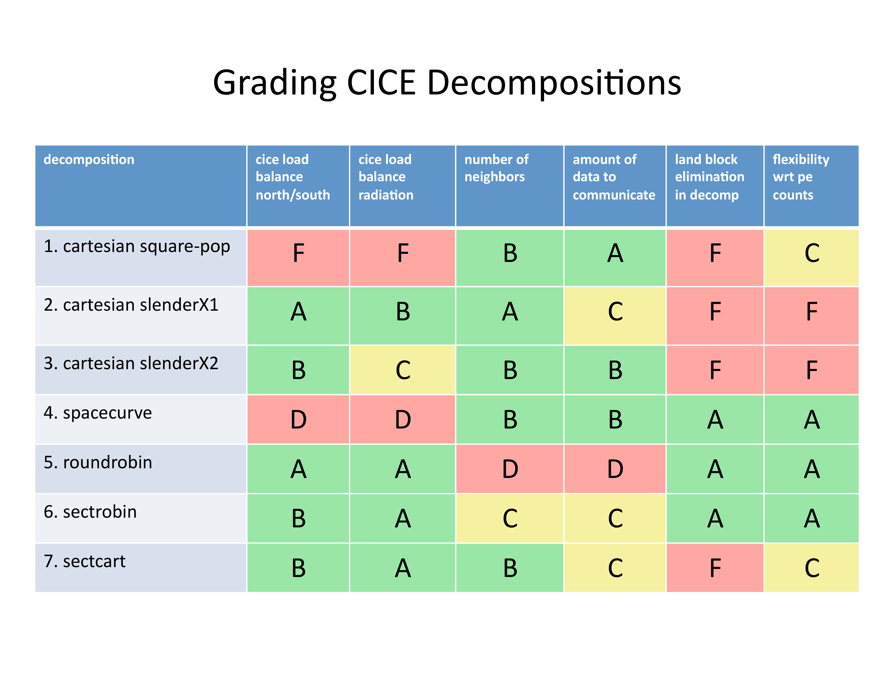

Numerical implementation
========================

CICE is written in FORTRAN90 and runs on platforms using UNIX, LINUX,
and other operating systems. The code is parallelized via grid
decomposition with MPI or OpenMP threads and includes some optimizations
for vector architectures.

A second, “external” layer of parallelization involves message passing
between CICE and the flux coupler, which may be running on different
processors in a distributed system. The parallelization scheme for CICE
was designed so that MPI could be used for the coupling along with MPI,
OpenMP or no parallelization internally. The internal parallelization
method is set at compile time with the `NTASK` and `THRD` definitions in the
compile script. Message passing between the ice model and the CESM flux
coupler is accomplished with MPI, regardless of the type of internal
parallelization used for CICE, although the ice model may be coupled to
another system without using MPI.

.. _dirstructure:

Directory structure
-------------------

The present code distribution includes make files, several scripts and
some input files. The main directory is **cice/**, and a run directory
(**rundir/**) is created upon initial execution of the script
**comp\_ice**. One year of atmospheric forcing data is also available
from the code distribution web site (see the **README** file for
details).

basic information

**bld/** makefiles

**Macros.**\ :math:`\langle`\ OS\ :math:`\rangle`.\ :math:`\langle`\ SITE\ :math:`\rangle`.\ :math:`\langle`\ machine\ :math:`\rangle`
    macro definitions for the given operating system, used by
    **Makefile**.\ :math:`\langle` \ OS\ :math:`\rangle`

**Makefile.**\ :math:`\langle`\ OS\ :math:`\rangle`
    primary makefile for the given operating system
    (**:math:`\langle`\ std\ :math:`\rangle`** works for most systems)

**makedep.c**
    perl script that determines module dependencies

script that sets up the run directory and compiles the code

modules based on “shared" code in CESM

**shr\_orb\_mod.F90**
    orbital parameterizations

documentation

**cicedoc.pdf**
    this document

**PDF/**
    PDF documents of numerous publications related to CICE

institution-specific modules

**cice/**
    official driver for CICE v5 (LANL)

    **CICE.F90**
        main program

    **CICE\_FinalMod.F90**
        routines for finishing and exiting a run

    **CICE\_InitMod.F90**
        routines for initializing a run

    **CICE\_RunMod.F90**
        main driver routines for time stepping

    **CICE\_RunMod.F90\_debug**
        debugging version of **CICE\_RunMod.F90**

    **ice\_constants.F90**
        physical and numerical constants and parameters

sample diagnostic output files

input files that may be modified for other CICE configurations

**col/**
    column configuration files

    **ice\_in**
        namelist input data (data paths depend on particular system)

**gx1/**
    :math:`\left<1^\circ\right>` displaced pole grid files

    **global\_gx1.grid**
        :math:`\left<1^\circ\right>` displaced pole grid (binary)

    **global\_gx1.kmt**
        :math:`\left<1^\circ\right>` land mask (binary)

    **ice.restart\_file**
        pointer for restart file name

    **ice\_in**
        namelist input data (data paths depend on particular system)

    **ice\_in\_v4.1**
        namelist input data for default CICE v4.1 configuration

    **iced\_gx1\_v5.nc**
         restart file used for initial condition

**gx3/**
    :math:`\left<3^\circ\right>` displaced pole grid files

    **global\_gx3.grid**
        :math:`\left<3^\circ\right>` displaced pole grid (binary)

    **global\_gx3.kmt**
        :math:`\left<3^\circ\right>` land mask (binary)

    **global\_gx3.grid.nc**
        :math:`\left<3^\circ\right>` displaced pole grid ()

    **global\_gx3.kmt.nc**
        :math:`\left<3^\circ\right>` land mask ()

    **ice.restart\_file**
        pointer for restart file name

    **ice\_in**
        namelist input data (data paths depend on particular system)

    **iced\_gx3\_v5.nc**
         restart file used for initial condition

convert\_restarts.f90
    Fortran code to convert restart files from v4.1 to v5 (4 ice layers)

**run\_ice.**\ :math:`\langle`\ OS\ :math:`\rangle`.\ :math:`\langle`\ SITE\ :math:`\rangle`.\ :math:`\langle`\ machine\ :math:`\rangle`
    sample script for running on the given operating system

binary history and restart modules

**ice\_history\_write.F90**
    subroutines with binary output

**ice\_restart.F90**
    read/write binary restart files

 history and restart modules

**ice\_history\_write.F90**
    subroutines with  output

**ice\_restart.F90**
    read/write   restart files

parallel I/O history and restart modules

**ice\_history\_write.F90**
    subroutines with   output using PIO

**ice\_pio.F90**
    subroutines specific to PIO

**ice\_restart.F90**
    read/write  restart files using PIO

modules that require MPI calls

**ice\_boundary.F90**
    boundary conditions

**ice\_broadcast.F90**
    routines for broadcasting data across processors

**ice\_communicate.F90**
    routines for communicating between processors

**ice\_exit.F90**
    aborts or exits the run

**ice\_gather\_scatter.F90**
    gathers/scatters data to/from one processor from/to all processors

**ice\_global\_reductions.F90**
    global sums, minvals, maxvals, etc., across processors

**ice\_timers.F90**
    timing routines

same modules as in **mpi/** but without MPI calls

general CICE source code

handles most work associated with the aerosol tracers

handles most work associated with the age tracer

skeletal layer biogeochemistry

stability-based parameterization for calculation of turbulent
ice–atmosphere fluxes

for decomposing global domain into blocks

evolves the brine height tracer

keeps track of what time it is

miscellaneous diagnostic and debugging routines

for distributing blocks across processors

decompositions, distributions and related parallel processing info

domain and block sizes

elastic-anisotropic-plastic dynamics component

elastic-viscous-plastic dynamics component

code shared by EVP and EAP dynamics

unit numbers for I/O

handles most work associated with the first-year ice area tracer

fluxes needed/produced by the model

routines to read and interpolate forcing data for stand-alone ice model
runs

grid and land masks

initialization and accumulation of history output variables

history output of biogeochemistry variables

history output of form drag variables

history output of ridging variables

history output of melt pond variables

code shared by all history modules

namelist and initializations

utilities for managing ice thickness distribution

basic definitions of reals, integers, etc.

handles most work associated with the level ice area and volume tracers

mechanical redistribution component (ridging)

CESM melt pond parameterization

level-ice melt pond parameterization

topo melt pond parameterization

mixed layer ocean model

orbital parameters for Delta-Eddington shortwave parameterization

utilities for reading and writing files

driver for reading/writing restart files

code shared by all restart options

basic restoring for open boundary conditions

shortwave and albedo parameterizations

space-filling-curves distribution method

essential arrays to describe the state of the ice

routines for time stepping the major code components

zero-layer thermodynamics of :cite:`Semtner76`

multilayer thermodynamics of :cite:`BL99`

thermodynamic changes mostly related to ice thickness distribution

mushy-theory thermodynamics of:cite:`THB13`

code shared by all thermodynamics parameterizations

vertical growth rates and fluxes

driver for horizontal advection

horizontal advection via incremental remapping

driver for ice biogeochemistry and brine tracer motion

parameters and shared code for biogeochemistry and brine height

execution or “run” directory created when the code is compiled using the
**comp\_ice** script (gx3)

**cice**
    code executable

**compile/**
    directory containing object files, etc.

**grid**
    horizontal grid file from **cice/input\_templates/gx3/**

**ice.log.[ID]**
    diagnostic output file

**ice\_in**
    namelist input data from **cice/input\_templates/gx3/**

**history/iceh.[timeID].nc**
    output history file

**kmt**
    land mask file from **cice/input\_templates/gx3/**

**restart/**
    restart directory

    **iced\_gx3\_v5.nc**
        initial condition from **cice/input\_templates/gx3/**

    **ice.restart\_file**
        restart pointer from **cice/input\_templates/gx3/**

**run\_ice**
    batch run script file from **cice/input\_templates/**

Grid, boundary conditions and masks
-----------------------------------

The spatial discretization is specialized for a generalized orthogonal
B-grid as in :cite:`Murray96` or
:cite:`SKM95`. The ice and snow area, volume and energy are
given at the center of the cell, velocity is defined at the corners, and
the internal ice stress tensor takes four different values within a grid
cell; bilinear approximations are used for the stress tensor and the ice
velocity across the cell, as described in :cite:`HD02`.
This tends to avoid the grid decoupling problems associated with the
B-grid. EVP is available on the C-grid through the MITgcm code
distribution, http://mitgcm.org/viewvc/MITgcm/MITgcm/pkg/seaice/. 

Since ice thickness and thermodynamic variables such as temperature are given
in the center of each cell, the grid cells are referred to as “T cells.”
We also occasionally refer to “U cells,” which are centered on the
northeast corner of the corresponding T cells and have velocity in the
center of each. The velocity components are aligned along grid lines.

The user has several choices of grid routines: *popgrid* reads grid
lengths and other parameters for a nonuniform grid (including tripole
and regional grids), and *rectgrid* creates a regular rectangular grid,
including that used for the column configuration. The input files
**global\_gx3.grid** and **global\_gx3.kmt** contain the
:math:`\left<3^\circ\right>` POP grid and land mask;
**global\_gx1.grid** and **global\_gx1.kmt** contain the
:math:`\left<1^\circ\right>` grid and land mask. These are binary
unformatted, direct access files produced on an SGI (Big Endian). If you
are using an incompatible (Little Endian) architecture, choose
`rectangular` instead of `displaced\_pole` in **ice\_in**, or follow
procedures as for conejo
(:math:`\langle`\ **OS**\ :math:`\rangle.\langle`\ **SITE**\ :math:`\rangle.\langle`\ **machine**\ :math:`\rangle`
= Linux.LANL.conejo). There are versions of the gx3 grid files
available.

In CESM, the sea ice model may exchange coupling fluxes using a
different grid than the computational grid. This functionality is
activated using the namelist variable `gridcpl\_file`.

Grid domains and blocks
~~~~~~~~~~~~~~~~~~~~~~~

In general, the global gridded domain is
`nx\_global` :math:`\times`\ `ny\_global`, while the subdomains used in the
block distribution are `nx\_block` :math:`\times`\ `ny\_block`. The
physical portion of a subdomain is indexed as [`ilo:ihi`, `jlo:jhi`], with
nghost “ghost” or “halo" cells outside the domain used for boundary
conditions. These parameters are illustrated in :ref:`fig-grid` in one
dimension. The routines *global\_scatter* and *global\_gather*
distribute information from the global domain to the local domains and
back, respectively. If MPI is not being used for grid decomposition in
the ice model, these routines simply adjust the indexing on the global
domain to the single, local domain index coordinates. Although we
recommend that the user choose the local domains so that the global
domain is evenly divided, if this is not possible then the furthest east
and/or north blocks will contain nonphysical points (“padding”). These
points are excluded from the computation domain and have little effect
on model performance.

.. _fig-grid:

.. figure:: ./figures/grid.png
   :align: center
   :scale: 20%

   Figure 8

:ref:`fig-grid` : Grid parameters for a sample one-dimensional, 20-cell
global domain decomposed into four local subdomains. Each local
domain has one ghost (halo) cell on each side, and the physical
portion of the local domains are labeled `ilo:ihi`. The parameter
`nx\_block` is the total number of cells in the local domain, including
ghost cells, and the same numbering system is applied to each of the
four subdomains.

The user chooses a block size `BLCKX` :math:`\times`\ `BLCKY` and the
number of processors `NTASK` in **comp\_ice**. Parameters in the
*domain\_nml* namelist in **ice\_in** determine how the blocks are
distributed across the processors, and how the processors are
distributed across the grid domain. Recommended combinations of these
parameters for best performance are given in Section :ref:`performance`.
The script **comp\_ice** computes the maximum number of blocks on each
processor for typical Cartesian distributions, but for non-Cartesian
cases `MXBLCKS` may need to be set in the script. The code will print this
information to the log file before aborting, and the user will need to
adjust `MXBLCKS` in **comp\_ice** and recompile. The code will also print
a warning if the maximum number of blocks is too large. Although this is
not fatal, it does require excess memory.

A loop at the end of routine *create\_blocks* in module
**ice\_blocks.F90** will print the locations for all of the blocks on
the global grid if dbug is set to be true. Likewise, a similar loop at
the end of routine *create\_local\_block\_ids* in module
**ice\_distribution.F90** will print the processor and local block
number for each block. With this information, the grid decomposition
into processors and blocks can be ascertained. The dbug flag must be
manually set in the code in each case (independently of the dbug flag in
**ice\_in**), as there may be hundreds or thousands of blocks to print
and this information should be needed only rarely. This information is
much easier to look at using a debugger such as Totalview.

Alternatively, a new variable is provided in the history files, `blkmask`,
which labels the blocks in the grid decomposition according to `blkmask` =
`my\_task` + `iblk/100`.

Tripole grids
~~~~~~~~~~~~~

The tripole grid is a device for constructing a global grid with a
normal south pole and southern boundary condition, which avoids placing
a physical boundary or grid singularity in the Arctic Ocean. Instead of
a single north pole, it has two “poles” in the north, both located on
land, with a line of grid points between them. This line of points is
called the “fold,” and it is the “top row” of the physical grid. One
pole is at the left-hand end of the top row, and the other is in the
middle of the row. The grid is constructed by “folding” the top row, so
that the left-hand half and the right-hand half of it coincide. Two
choices for constructing the tripole grid are available. The one first
introduced to CICE is called “U-fold”, which means that the poles and
the grid cells between them are U cells on the grid. Alternatively the
poles and the cells between them can be grid T cells, making a “T-fold.”
Both of these options are also supported by the OPA/NEMO ocean model,
which calls the U-fold an “f-fold” (because it uses the Arakawa C-grid
in which U cells are on T-rows). The choice of tripole grid is given by
the namelist variable `ns\_boundary\_type`, ‘tripole’ for the U-fold and
‘tripoleT’ for the T-fold grid.

In the U-fold tripole grid, the poles have U-index
:math:`{\tt nx\_global}/2` and `nx\_global` on the top U-row of the
physical grid, and points with U-index i and :math:`{\tt nx\_global-i}`
are coincident. Let the fold have U-row index :math:`n` on the global
grid; this will also be the T-row index of the T-row to the south of the
fold. There are ghost (halo) T- and U-rows to the north, beyond the
fold, on the logical grid. The point with index i along the ghost T-row
of index :math:`n+1` physically coincides with point
:math:`{\tt nx\_global}-{\tt i}+1` on the T-row of index :math:`n`. The
ghost U-row of index :math:`n+1` physically coincides with the U-row of
index :math:`n-1`.

In the T-fold tripole grid, the poles have T-index 1 and and
:math:`{\tt nx\_global}/2+1` on the top T-row of the physical grid, and
points with T-index i and :math:`{\tt nx\_global}-{\tt i}+2` are
coincident. Let the fold have T-row index :math:`n` on the global grid.
It is usual for the northernmost row of the physical domain to be a
U-row, but in the case of the T-fold, the U-row of index :math:`n` is
“beyond” the fold; although it is not a ghost row, it is not physically
independent, because it coincides with U-row :math:`n-1`, and it
therefore has to be treated like a ghost row. Points i on U-row
:math:`n` coincides with :math:`{\tt nx\_global}-{\tt i}+1` on U-row
:math:`n-1`. There are still ghost T- and U-rows :math:`n+1` to the
north of U-row :math:`n`. Ghost T-row :math:`n+1` coincides with T-row
:math:`n-1`, and ghost U-row :math:`n+1` coincides with U-row
:math:`n-2`.

The tripole grid thus requires two special kinds of treatment for
certain rows, arranged by the halo-update routines. First, within rows
along the fold, coincident points must always have the same value. This
is achieved by averaging them in pairs. Second, values for ghost rows
and the “quasi-ghost” U-row on the T-fold grid are reflected copies of
the coincident physical rows. Both operations involve the tripole
buffer, which is used to assemble the data for the affected rows.
Special treatment is also required in the scattering routine, and when
computing global sums one of each pair of coincident points has to be
excluded.

.. _bio-grid:

Bio-grid
~~~~~~~~

The bio-grid is a vertical grid used for solving the brine height
variable :math:`h_b`. In the future, it will also be used for
discretizing the vertical transport equations of biogeochemical tracers.
The bio-grid is a non-dimensional vertical grid which takes the value
zero at :math:`h_b` and one at the ice–ocean interface. The number of
grid levels is specified during compilation in **comp\_ice** by setting
the variable `NBGCLYR` equal to an integer (:math:`n_b`) .

Ice tracers and microstructural properties defined on the bio-grid are
referenced in two ways: as `bgrid` :math:`=n_b+2` points and as
igrid\ :math:`=n_b+1` points. For both bgrid and igrid, the first and
last points reference :math:`h_b` and the ice–ocean interface,
respectively, and so take the values :math:`0` and :math:`1`,
respectively. For bgrid, the interior points :math:`[2, n_b+1]` are
spaced at :math:`1/n_b` intervals beginning with `bgrid(2)` :math:` =
1/(2n_b)`. The `igrid` interior points :math:`[2, n_b]` are also
equidistant with the same spacing, but physically coincide with points
midway between those of `bgrid`.

Column configuration
~~~~~~~~~~~~~~~~~~~~

A column modeling capability is available. Because of the boundary
conditions and other spatial assumptions in the model, this is not a
single column, but a small array of columns (minimum grid size is 5x5).
However, the code is set up so that only the single, central column is
used (all other columns are designated as land). The column is located
near Barrow (71.35N, 156.5W). Options for choosing the column
configuration are given in **comp\_ice** (choose `RES col`) and in the
namelist file, **input\_templates/col/ice\_in**. Here, `istep0` and the
initial conditions are set such that the run begins September 1 with no
ice. The grid type is rectangular, dynamics are turned off (`kdyn` = 0) and
one processor is used.

History variables available for column output are ice and snow
temperature, `Tinz` and `Tsnz`. These variables also include thickness
category as a fourth dimension.

Boundary conditions
~~~~~~~~~~~~~~~~~~~

Much of the infrastructure used in CICE, including the boundary
routines, is adopted from POP. The boundary routines perform boundary
communications among processors when MPI is in use and among blocks
whenever there is more than one block per processor.

Open/cyclic boundary conditions are the default in CICE; the physical
domain can still be closed using the land mask. In our bipolar,
displaced-pole grids, one row of grid cells along the north and south
boundaries is located on land, and along east/west domain boundaries not
masked by land, periodic conditions wrap the domain around the globe.
CICE can be run on regional grids with open boundary conditions; except
for variables describing grid lengths, non-land halo cells along the
grid edge must be filled by restoring them to specified values. The
namelist variable `restore\_ice` turns this functionality on and off; the
restoring timescale `trestore` may be used (it is also used for restoring
ocean sea surface temperature in stand-alone ice runs). This
implementation is only intended to provide the “hooks" for a more
sophisticated treatment; the rectangular grid option can be used to test
this configuration. The ‘displaced\_pole’ grid option should not be used
unless the regional grid contains land all along the north and south
boundaries. The current form of the boundary condition routines does not
allow Neumann boundary conditions, which must be set explicitly. This
has been done in an unreleased branch of the code; contact Elizabeth for
more information.

For exact restarts using restoring, set `restart\_ext` = true in namelist
to use the extended-grid subroutines.

On tripole grids, the order of operations used for calculating elements
of the stress tensor can differ on either side of the fold, leading to
round-off differences. Although restarts using the extended grid
routines are exact for a given run, the solution will differ from
another run in which restarts are written at different times. For this
reason, explicit halo updates of the stress tensor are implemented for
the tripole grid, both within the dynamics calculation and for restarts.
This has not been implemented yet for tripoleT grids, pending further
testing.

Masks
~~~~~

A land mask hm (:math:`M_h`) is specified in the cell centers, with 0
representing land and 1 representing ocean cells. A corresponding mask
uvm (:math:`M_u`) for velocity and other corner quantities is given by

.. math:: 
   M_u(i,j)=\min\{M_h(l),\,l=(i,j),\,(i+1,j),\,(i,j+1),\,(i+1,j+1)\}.

The logical masks `tmask` and `umask` (which correspond to the real masks
`hm` and `uvm`, respectively) are useful in conditional statements.

In addition to the land masks, two other masks are implemented in
*evp\_prep* in order to reduce the dynamics component’s work on a global
grid. At each time step the logical masks `ice\_tmask` and `ice\_umask` are
determined from the current ice extent, such that they have the value
“true” wherever ice exists. They also include a border of cells around
the ice pack for numerical purposes. These masks are used in the
dynamics component to prevent unnecessary calculations on grid points
where there is no ice. They are not used in the thermodynamics
component, so that ice may form in previously ice-free cells. Like the
land masks `hm` and `uvm`, the ice extent masks `ice\_tmask` and `ice\_umask`
are for T cells and U cells, respectively.

Improved parallel performance may result from utilizing halo masks for
boundary updates of the full ice state, incremental remapping transport,
or for EVP or EAP dynamics. These options are accessed through the
logical namelist flags `maskhalo\_bound`, `maskhalo\_remap`, and
`maskhalo\_dyn`, respectively. Only the halo cells containing needed
information are communicated.

Two additional masks are created for the user’s convenience: `lmask\_n`
and `lmask\_s` can be used to compute or write data only for the northern
or southern hemispheres, respectively. Special constants (`spval` and
`spval\_dbl`, each equal to :math:`10^{30}`) are used to indicate land
points in the history files and diagnostics.

.. _init:

Initialization and coupling
---------------------------

The ice model’s parameters and variables are initialized in several
steps. Many constants and physical parameters are set in
**ice\_constants.F90**. Namelist variables (:ref:`tabnamelist`),
whose values can be altered at run time, are handled in *input\_data*
and other initialization routines. These variables are given default
values in the code, which may then be changed when the input file
**ice\_in** is read. Other physical constants, numerical parameters, and
variables are first set in initialization routines for each ice model
component or module. Then, if the ice model is being restarted from a
previous run, core variables are read and reinitialized in
*restartfile*, while tracer variables needed for specific configurations
are read in separate restart routines associated with each tracer or
specialized parameterization. Finally, albedo and other quantities
dependent on the initial ice state are set. Some of these parameters
will be described in more detail in :ref:`tabnamelist`.

The restart files supplied with the code release include the core
variables on the default configuration, that is, with seven vertical
layers and the ice thickness distribution defined by `kcatbound` = 0.
Restart information for some tracers is also included in the  restart
files.

Three namelist variables control model initialization, `ice\_ic`, `runtype`,
and `restart`, as described in :ref:`tab-ic`. It is possible to do an
initial run from a file **filename** in two ways: (1) set runtype =
‘initial’, restart = true and ice\_ic = **filename**, or (2) runtype =
‘continue’ and pointer\_file = **./restart/ice.restart\_file** where
**./restart/ice.restart\_file** contains the line
“./restart/[filename]". The first option is convenient when repeatedly
starting from a given file when subsequent restart files have been
written. With this arrangement, the tracer restart flags can be set to
true or false, depending on whether the tracer restart data exist. With
the second option, tracer restart flags are set to ‘continue’ for all
active tracers.

An additional namelist option, `restart\_ext` specifies whether halo cells
are included in the restart files. This option is useful for tripole and
regional grids, but can not be used with PIO.

MPI is initialized in *init\_communicate* for both coupled and
stand-alone MPI runs. The ice component communicates with a flux coupler
or other climate components via external routiines that handle the
variables listed in :ref:`tab-flux-cpl`. For stand-alone runs,
routines in **ice\_forcing.F90** read and interpolate data from files,
and are intended merely to provide guidance for the user to write his or
her own routines. Whether the code is to be run in stand-alone or
coupled mode is determined at compile time, as described below.

:ref:`tab-ic` : *Ice initial state resulting from combinations of*
`ice\_ic`, `runtype` and `restart`. :math:`^a`\ *If false, restart is reset to
true.* :math:`^b`\ *restart is reset to false.* :math:`^c`\ ice\_ic *is
reset to ‘none.’*

.. _tab-ic:

.. table:: Table 4

   +----------------+--------------------------+--------------------------------------+----------------------------------------+
   | ice\_ic        |                          |                                      |                                        |
   +================+==========================+======================================+========================================+
   |                | initial/false            | initial/true                         | continue/true (or false\ :math:`^a`)   |
   +----------------+--------------------------+--------------------------------------+----------------------------------------+
   | none           | no ice                   | no ice\ :math:`^b`                   | restart using **pointer\_file**        |
   +----------------+--------------------------+--------------------------------------+----------------------------------------+
   | default        | SST/latitude dependent   | SST/latitude dependent\ :math:`^b`   | restart using **pointer\_file**        |
   +----------------+--------------------------+--------------------------------------+----------------------------------------+
   | **filename**   | no ice\ :math:`^c`       | start from **filename**              | restart using **pointer\_file**        |
   +----------------+--------------------------+--------------------------------------+----------------------------------------+

.. _parameters:

Choosing an appropriate time step
---------------------------------

The time step is chosen based on stability of the transport component
(both horizontal and in thickness space) and on resolution of the
physical forcing. CICE allows the dynamics, advection and ridging
portion of the code to be run with a shorter timestep,
:math:`\Delta t_{dyn}` (`dt\_dyn`), than the thermodynamics timestep
:math:`\Delta t` (`dt`). In this case, `dt` and the integer ndtd are
specified, and `dt\_dyn` = `dt/ndtd`.

A conservative estimate of the horizontal transport time step bound, or
CFL condition, under remapping yields

.. math:: 
   \Delta t_{dyn} < {\min\left(\Delta x, \Delta y\right)\over 2\max\left(u, v\right)}.

Numerical estimates for this bound for several POP grids, assuming
:math:`\max(u, v)=0.5` m/s, are as follows:

.. csv-table::
   :widths: 20,40,40,40,40
   
   grid label,N pole singularity,dimensions,min :math:`\sqrt{\Delta x\cdot\Delta y}`,max :math:`\Delta t_{dyn}`
   gx3,Greenland,:math:`100\times 116`,:math:`39\times 10^3` m,10.8hr
   gx1,Greenland,:math:`320\times 384`,:math:`18\times 10^3` m,5.0hr
   p4,Canada,:math:`900\times 600`,:math:`6.5\times 10^3` m,1.8hr

As discussed in section :ref:`mech-red` and
:cite:`LHMJ07`, the maximum time step in practice is
usually determined by the time scale for large changes in the ice
strength (which depends in part on wind strength). Using the strength
parameterization of :cite:`Rothrock75`, as in
Equation :eq:`roth-strength0`, limits the time step to :math:`\sim`\ 30
minutes for the old ridging scheme (`krdg\_partic` = 0), and to
:math:`\sim`\ 2 hours for the new scheme (`krdg\_partic` = 1), assuming
:math:`\Delta x` = 10 km. Practical limits may be somewhat less,
depending on the strength of the atmospheric winds.

Transport in thickness space imposes a similar restraint on the time
step, given by the ice growth/melt rate and the smallest range of
thickness among the categories,
:math:`\Delta t<\min(\Delta H)/2\max(f)`, where :math:`\Delta H` is the
distance between category boundaries and :math:`f` is the thermodynamic
growth rate. For the 5-category ice thickness distribution used as the
default in this distribution, this is not a stringent limitation:
:math:`\Delta t < 19.4` hr, assuming :math:`\max(f) = 40` cm/day.

In the classic EVP or EAP approach (`kdyn` = 1 or 2, `revised\_evp` = false),
the dynamics component is subcycled ndte (:math:`N`) times per dynamics
time step so that the elastic waves essentially disappear before the
next time step. The subcycling time step (:math:`\Delta
t_e`) is thus

.. math::
   dte = dt\_dyn/ndte.

A second parameter, :math:`E_\circ` (`eyc`), defines the elastic wave
damping timescale :math:`T`, described in Section :ref:`dynam`, as
`eyc`\ * `dt\_dyn`. The forcing terms are not updated during the subcycling.
Given the small step (`dte`) at which the EVP dynamics model is subcycled,
the elastic parameter :math:`E` is also limited by stability
constraints, as discussed in :cite:`HD97`. Linear stability
analysis for the dynamics component shows that the numerical method is
stable as long as the subcycling time step :math:`\Delta t_e`
sufficiently resolves the damping timescale :math:`T`. For the stability
analysis we had to make several simplifications of the problem; hence
the location of the boundary between stable and unstable regions is
merely an estimate. In practice, the ratio
:math:`\Delta t_e ~:~ T ~:~ \Delta t`  = 1 : 40 : 120 provides both
stability and acceptable efficiency for time steps (:math:`\Delta t`) on
the order of 1 hour.

For the revised EVP approach (`kdyn` = 1, `revised\_evp` = true), the
relaxation parameter `arlx1i` effectively sets the damping timescale in
the problem, and `brlx` represents the effective subcycling
:cite:`BFLM13`. In practice the parameters :math:`S_e>0.5`
and :math:`\xi<1` are set, along with an estimate of the ice strength
per unit mass, and the damping and subcycling parameters are then
calculated. With the addition of the revised EVP approach to CICE, the
code now uses these parameters internally for both classic and revised
EVP configurations (see Section :ref:`revp`).

Note that only :math:`T` and :math:`\Delta t_e` figure into the
stability of the dynamics component; :math:`\Delta t` does not. Although
the time step may not be tightly limited by stability considerations,
large time steps (*e.g.,* :math:`\Delta t=1` day, given daily forcing)
do not produce accurate results in the dynamics component. The reasons
for this error are discussed in :cite:`HD97`; see
:cite:`HZ99` for its practical effects. The thermodynamics
component is stable for any time step, as long as the surface
temperature :math:`T_{sfc}` is computed internally. The
numerical constraint on the thermodynamics time step is associated with
the transport scheme rather than the thermodynamic solver.

Model output
------------

.. _history:

History files
~~~~~~~~~~~~~

Model output data is averaged over the period(s) given by `histfreq` and
`histfreq\_n`, and written to binary or  files prepended by `history\_file`
in **ice\_in**. That is, if `history\_file` = ‘iceh’ then the filenames
will have the form **iceh.[timeID].nc** or **iceh.[timeID].da**,
depending on the output file format chosen in **comp\_ice** (set
`IO\_TYPE`). The  history files are CF-compliant; header information for
data contained in the  files is displayed with the command `ncdump -h
filename.nc`. Parallel  output is available using the PIO library; the
attribute `io\_flavor` distinguishes output files written with PIO from
those written with standard netCDF. With binary files, a separate header
file is written with equivalent information. Standard fields are output
according to settings in the **icefields\_nml** namelist in **ice\_in**.
The user may add (or subtract) variables not already available in the
namelist by following the instructions in section :ref:`addhist`.

With this release, the history module has been divided into several
modules based on the desired formatting and on the variables
themselves. Parameters, variables and routines needed by multiple
modules is in **ice\_history\_shared.F90**, while the primary routines
for initializing and accumulating all of the history variables are in
**ice\_history.F90**. These routines call format-specific code in the
**io\_binary**, **io\_netcdf** and **io\_pio** directories. History
variables specific to certain components or parameterizations are
collected in their own history modules (**ice\_history\_bgc.F90**,
**ice\_history\_drag.F90**, **ice\_history\_mechred.F90**,
**ice\_history\_pond.F90**).

The history modules allow output at different frequencies. Five output
frequencies (1, `h`, `d`, `m`, `y`) are available simultaneously during a run.
The same variable can be output at different frequencies (say daily and
monthly) via its namelist flag, `f\_` :math:`\left<{var}\right>`, which
is now a character string corresponding to `histfreq` or ‘x’ for none.
(Grid variable flags are still logicals, since they are written to all
files, no matter what the frequency is.) If there are no namelist flags
with a given `histfreq` value, or if an element of `histfreq\_n` is 0, then
no file will be written at that frequency. The output period can be
discerned from the filenames.

For example, in namelist:

::

  `histfreq` = ’1’, ’h’, ’d’, ’m’, ’y’
  `histfreq\_n` = 1, 6, 0, 1, 1
  `f\_hi` = ’1’
  `f\_hs` = ’h’
  `f\_Tsfc` = ’d’
  `f\_aice` = ’m’
  `f\_meltb` = ’mh’
  `f\_iage` = ’x’

Here, `hi` will be written to a file on every timestep, `hs` will be
written once every 6 hours, `aice` once a month, `meltb` once a month AND
once every 6 hours, and `Tsfc` and `iage` will not be written.

From an efficiency standpoint, it is best to set unused frequencies in
`histfreq` to ‘x’. Having output at all 5 frequencies takes nearly 5 times
as long as for a single frequency. If you only want monthly output, the
most efficient setting is `histfreq` = ’m’,’x’,’x’,’x’,’x’. The code counts
the number of desired streams (`nstreams`) based on `histfreq`.

The history variable names must be unique for netcdf, so in cases where
a variable is written at more than one frequency, the variable name is
appended with the frequency in files after the first one. In the example
above, `meltb` is called `meltb` in the monthly file (for backward
compatibility with the default configuration) and `meltb\_h` in the
6-hourly file.

Using the same frequency twice in `histfreq` will have unexpected
consequences and currently will cause the code to abort. It is not
possible at the moment to output averages once a month and also once
every 3 months, for example.

If `write\_ic` is set to true in **ice\_in**, a snapshot of the same set
of history fields at the start of the run will be written to the history
directory in **iceh\_ic.[timeID].nc(da)**. Several history variables are
hard-coded for instantaneous output regardless of the averaging flag, at
the frequency given by their namelist flag.

The normalized principal components of internal ice stress are computed
in *principal\_stress* and written to the history file. This calculation
is not necessary for the simulation; principal stresses are merely
computed for diagnostic purposes and included here for the user’s
convenience.

Several history variables are available in two forms, a value
representing an average over the sea ice fraction of the grid cell, and
another that is multiplied by :math:`a_i`, representing an average over
the grid cell area. Our naming convention attaches the suffix “\_ai" to
the grid-cell-mean variable names.

Diagnostic files
~~~~~~~~~~~~~~~~

Like `histfreq`, the parameter `diagfreq` can be used to regulate how often
output is written to a log file. The log file unit to which diagnostic
output is written is set in **ice\_fileunits.F90**. If `diag\_type` =
‘stdout’, then it is written to standard out (or to **ice.log.[ID]** if
you redirect standard out as in **run\_ice**); otherwise it is written
to the file given by `diag\_file`. In addition to the standard diagnostic
output (maximum area-averaged thickness, velocity, average albedo, total
ice area, and total ice and snow volumes), the namelist options
`print\_points` and `print\_global` cause additional diagnostic information
to be computed and written. `print\_global` outputs global sums that are
useful for checking global conservation of mass and energy.
`print\_points` writes data for two specific grid points. Currently, one
point is near the North Pole and the other is in the Weddell Sea; these
may be changed in **ice\_in**.

Timers are declared and initialized in **ice\_timers.F90**, and the code
to be timed is wrapped with calls to *ice\_timer\_start* and
*ice\_timer\_stop*. Finally, *ice\_timer\_print* writes the results to
the log file. The optional “stats" argument (true/false) prints
additional statistics. Calling *ice\_timer\_print\_all* prints all of
the timings at once, rather than having to call each individually.
Currently, the timers are set up as in :ref:`timers`.
Section :ref:`addtimer` contains instructions for adding timers.

The timings provided by these timers are not mutually exclusive. For
example, the column timer (5) includes the timings from 6–10, and
subroutine *bound* (timer 15) is called from many different places in
the code, including the dynamics and advection routines.

The timers use *MPI\_WTIME* for parallel runs and the F90 intrinsic
*system\_clock* for single-processor runs.

:ref:`timers` : *CICE timers*

.. _timers:

.. table:: Table 5

   +--------------+-------------+----------------------------------------------------+
   | **Timer**    |             |                                                    |
   +--------------+-------------+----------------------------------------------------+
   | **Index**    | **Label**   |                                                    |
   +--------------+-------------+----------------------------------------------------+
   | 1            | Total       | the entire run                                     |
   +--------------+-------------+----------------------------------------------------+
   | 2            | Step        | total minus initialization and exit                |
   +--------------+-------------+----------------------------------------------------+
   | 3            | Dynamics    | EVP                                                |
   +--------------+-------------+----------------------------------------------------+
   | 4            | Advection   | horizontal transport                               |
   +--------------+-------------+----------------------------------------------------+
   | 5            | Column      | all vertical (column) processes                    |
   +--------------+-------------+----------------------------------------------------+
   | 6            | Thermo      | vertical thermodynamics                            |
   +--------------+-------------+----------------------------------------------------+
   | 7            | Shortwave   | SW radiation and albedo                            |
   +--------------+-------------+----------------------------------------------------+
   | 8            | Meltponds   | melt ponds                                         |
   +--------------+-------------+----------------------------------------------------+
   | 9            | Ridging     | mechanical redistribution                          |
   +--------------+-------------+----------------------------------------------------+
   | 10           | Cat Conv    | transport in thickness space                       |
   +--------------+-------------+----------------------------------------------------+
   | 11           | Coupling    | sending/receiving coupler messages                 |
   +--------------+-------------+----------------------------------------------------+
   | 12           | ReadWrite   | reading/writing files                              |
   +--------------+-------------+----------------------------------------------------+
   | 13           | Diags       | diagnostics (log file)                             |
   +--------------+-------------+----------------------------------------------------+
   | 14           | History     | history output                                     |
   +--------------+-------------+----------------------------------------------------+
   | 15           | Bound       | boundary conditions and subdomain communications   |
   +--------------+-------------+----------------------------------------------------+
   | 16           | BGC         | biogeochemistry                                    |
   +--------------+-------------+----------------------------------------------------+

Restart files
~~~~~~~~~~~~~

CICE now provides restart data in binary unformatted or  formats, via
the `IO\_TYPE` flag in **comp\_ice** and namelist variable
`restart\_format`. Restart and history files must use the same format. As
with the history output, there is also an option for writing parallel
restart files using PIO.

The restart files created by CICE contain all of the variables needed
for a full, exact restart. The filename begins with the character string
‘iced.’, and the restart dump frequency is given by the namelist
variables `dumpfreq` and `dumpfreq\_n`. The pointer to the filename from
which the restart data is to be read for a continuation run is set in
`pointer\_file`. The code assumes that auxiliary binary tracer restart
files will be identified using the same pointer and file name prefix,
but with an additional character string in the file name that is
associated with each tracer set. All variables are included in  restart
files.

Additional namelist flags provide further control of restart behavior.
`dump\_last` = true causes a set of restart files to be written at the end
of a run when it is otherwise not scheduled to occur. The flag
`use\_restart\_time` enables the user to choose to use the model date
provided in the restart files. If `use\_restart\_time` = false then the
initial model date stamp is determined from the namelist parameters.
lcdf64 = true sets 64-bit  output, allowing larger file sizes with
version 3.

Routines for gathering, scattering and (unformatted) reading and writing
of the “extended" global grid, including the physical domain and ghost
(halo) cells around the outer edges, allow exact restarts on regional
grids with open boundary conditions, and they will also simplify
restarts on the various tripole grids. They are accessed by setting
`restart\_ext` = true in namelist. Extended grid restarts are not
available when using PIO; in this case extra halo update calls fill
ghost cells for tripole grids (do not use PIO for regional grids).

Two restart files are included with the CICE v5 code distribution, for
the gx3 and gx1 grids. The were created using the default model
configuration (settings as in **comp\_ice** and **ice\_in**), but
initialized with no ice. The gx3 case was run for 1 year using the 1997
forcing data provided with the code. The gx1 case was run for 20 years,
so that the date of restart in the file is 1978-01-01. Note that the
restart dates provided in the restart files can be overridden using the
namelist variables `use\_restart\_time`, `year\_init` and `istep0`. The
forcing time can also be overridden using `fyear\_init`.

Several changes in CICE v5 have made restarting from v4.1 restart files
difficult. First, the ice and snow enthalpy state variables are now
carried as tracers instead of separate arrays, and salinity has been
added as a necessary restart field. Second, the default number of ice
layers has been increased from 4 to 7. Third, netcdf format is now used
for all I/O; it is no longer possible to have history output as  and
restart output in binary format. However, some facilities are included
with CICE v5 for converting v4.1 restart files to the new file structure
and format, provided that the same number of ice layers and basic
physics packages will be used for the new runs. See Section
:ref:`restarttrouble` for details.

Execution procedures
--------------------

To compile and execute the code: in the source directory,

#. Download the forcing data used for testing from the CICE-Consortium github page,
   https://github.com/CICE-Consortium .

#. Create **Macros.\*** and **run\_ice.\*** files for your particular
   platform, if they do not already exist (type ‘uname -s’ at the prompt
   to get :math:`\langle`\ OS\ :math:`\rangle`).

#. Alter directories in the script **comp\_ice**.

#. Run **comp\_ice** to set up the run directory and make the executable
   ‘**cice**’.

#. | To clean the compile directory and start fresh, simply execute
     ‘/bin/rm -rf compile’ from the run directory.

In the run directory,

#. Alter `atm\_data\_dir` and `ocn\_data\_dir` in the namelist file
   **ice\_in**.

#. Alter the script **run\_ice** for your system.

#. Execute **run\_ice**.

If this fails, see Section :ref:`setup`.

This procedure creates the output log file **ice.log.[ID]**, and if
`npt` is long enough compared with `dumpfreq` and `histfreq`, dump files
**iced.[timeID]** and   (or binary) history output files
**iceh\_[timeID].nc (.da)**. Using the :math:`\left<3^\circ\right>`
grid, the log file should be similar to
**ice.log.\ :math:`\langle`\ OS\ :math:`\rangle`**, provided for the
user’s convenience. These log files were created using MPI on 4
processors on the :math:`\left<3^\circ\right>` grid.

Several options are available in **comp\_ice** for configuring the run,
shown in :ref:`comp-ice`. If `NTASK` = 1, then the **serial/**
code is used, otherwise the code in **mpi/** is used. Loops over blocks
have been threaded throughout the code, so that their work will be
divided among `OMP\_NUM\_THREADS` if `THRD` is ‘yes.’ Note that the value of
`NTASK` in **comp\_ice** must equal the value of `nprocs` in **ice\_in**.
Generally the value of `MXBLCKS` computed by **comp\_ice** is sufficient,
but sometimes it will need to be set explicitly, as discussed in
Section :ref:`performance`. To conserve memory, match the tracer requests
in **comp\_ice** with those in **ice\_in**. CESM uses 3 aerosol tracers;
the number given in **comp\_ice** must be less than or equal to the
maximum allowed in **ice\_domain\_size.F90**.

The scripts define a number of environment variables, mostly as
directories that you will need to edit for your own environment.
`$SYSTEM\_USERDIR`, which on machines at Oak Ridge National Laboratory
points automatically to scratch space, is intended to be a disk where
the run directory resides. `SHRDIR` is a path to the CESM shared code.

:ref:`comp-ice` : Configuration options available in **comp_ice**.

.. _comp-ice:

.. table:: Table 6

   +---------------------+--------------------------------------+------------------------------------------------------------------------------------+
   | variable            | options                              | description                                                                        |
   +=====================+======================================+====================================================================================+
   |RES                  | col, gx3, gx1                        | grid resolution                                                                    |
   +---------------------+--------------------------------------+------------------------------------------------------------------------------------+
   |NTASK                | (integer)                            | total number of processors                                                         |
   +---------------------+--------------------------------------+------------------------------------------------------------------------------------+
   |BLCKX                | (integer)                            | number of grid cells on each block in the x-direction :math:`^\dagger`             |
   +---------------------+--------------------------------------+------------------------------------------------------------------------------------+
   |BLCKY                | (integer)                            | number of grid cells on each block in the y-direction :math:`^\dagger`             |
   +---------------------+--------------------------------------+------------------------------------------------------------------------------------+
   |MXBLCKS              | (integer)                            | maximum number of blocks per processor                                             |
   +---------------------+--------------------------------------+------------------------------------------------------------------------------------+
   |NICELYR              | (integer)                            | number of vertical layers in the ice                                               |
   +---------------------+--------------------------------------+------------------------------------------------------------------------------------+
   |NSNWLYR              | (integer)                            | number of vertical layers in the snow                                              |
   +---------------------+--------------------------------------+------------------------------------------------------------------------------------+
   |NICECAT              | (integer)                            | number of ice thickness categories                                                 |
   +---------------------+--------------------------------------+------------------------------------------------------------------------------------+ 
   |TRAGE                | 0 or 1                               | set to 1 for ice age tracer                                                        |
   +---------------------+--------------------------------------+------------------------------------------------------------------------------------+
   |TRFY                 | 0 or 1                               | set to 1 for first-year ice age tracer                                             |
   +---------------------+--------------------------------------+------------------------------------------------------------------------------------+
   |TRLVL                | 0 or 1                               | set to 1 for level and deformed ice tracers                                        |
   +---------------------+--------------------------------------+------------------------------------------------------------------------------------+
   |TRPND                | 0 or 1                               | set to 1 for melt pond tracers                                                     |
   +---------------------+--------------------------------------+------------------------------------------------------------------------------------+
   |NTRAERO              | 0 or 1                               | number of aerosol tracers                                                          |
   +---------------------+--------------------------------------+------------------------------------------------------------------------------------+
   |TRBRINE              | set to 1 for brine height tracer     |                                                                                    |
   +---------------------+--------------------------------------+------------------------------------------------------------------------------------+
   |NBGCLYR              | (integer)                            | number of vertical layers for biogeochemical transport                             |
   +---------------------+--------------------------------------+------------------------------------------------------------------------------------+
   |IO_TYPE              | none/netcdf/pio                      | use ‘none’ if  library is unavailable,‘pio’ for PIO                                |
   +---------------------+--------------------------------------+------------------------------------------------------------------------------------+ 
   |DITTO                | yes/no                               | for reproducible diagnostics                                                       |
   +---------------------+--------------------------------------+------------------------------------------------------------------------------------+
   |BARRIERS             | yes/no                               | flushes MPI buffers during global scatters and gathers                             |
   +---------------------+--------------------------------------+------------------------------------------------------------------------------------+
   |THRD                 | yes/no                               | set to yes for OpenMP threaded parallelism                                         |
   +---------------------+--------------------------------------+------------------------------------------------------------------------------------+
   |OMP_NUM_THREADS      | (integer)                            | the number of OpenMP threads requested                                             |
   +---------------------+--------------------------------------+------------------------------------------------------------------------------------+
   |NUMIN                | (integer)                            | smallest unit number assigned to CICE files                                        |
   +---------------------+--------------------------------------+------------------------------------------------------------------------------------+
   |NUMAX                | (integer)                            | largest unit number assigned to CICE files                                         |
   +---------------------+--------------------------------------+------------------------------------------------------------------------------------+

The ‘reproducible’ option (`DITTO`) makes diagnostics bit-for-bit when
varying the number of processors. (The simulation results are
bit-for-bit regardless, because they do not require global sums or
max/mins as do the diagnostics.) This was done mainly by increasing the
precision for the global reduction calculations, except for regular
double-precision (r8) calculations involving MPI; MPI can not handle
MPI\_REAL16 on some architectures. Instead, these cases perform sums or
max/min calculations across the global block structure, so that the
results are bit-for-bit as long as the block distribution is the same
(the number of processors can be different).

A more flexible option is available for double-precision MPI
calculations, using the namelist variable `bfbflag`. When true, this flag
produces bit-for-bit identical diagnostics with different tasks,
threads, blocks and grid decompositions.

CICE namelist variables available for changes after compile time appear
in **ice.log.\*** with values read from the file **ice\_in**; their
definitions are given in Section :ref:`index`. For example, to run for a
different length of time, say three days, set `npt` = 72 in **ice\_in**.
At present, the user supplies the time step `dt`, the number of
dynamics/advection/ridging subcycles `ndtd`, and for classic EVP, the
number of EVP subcycles `ndte`; `dte` is then calculated in subroutine
*init\_evp*. The primary reason for doing it this way is to ensure that
`ndte` is an integer. (This is done differently for `revised\_evp` = true.;
see Section :ref:`dynam`).

To restart from a previous run, set restart = true in **ice\_in**. There
are two ways of restarting from a given file. The restart pointer file
**ice.restart\_file** (created by the previous run) contains the name of
the last written data file (**iced.[timeID]**). Alternatively, a
filename can be assigned to ice\_ic in **ice\_in**. Consult
Section :ref:`init` for more details. Restarts are exact for MPI or
single processor runs.

.. _performance:

Performance
-----------

Namelist options (*domain\_nml*) provide considerable flexibility for
finding the most efficient processor and block configuration. Some of
these choices are illustration in :ref:`fig-distrb`. `processor\_shape`
chooses between tall, thin processor domains (`slenderX1` or `slenderX2`,
often better for sea ice simulations on global grids where nearly all of
the work is at the top and bottom of the grid with little to do in
between) and close-to-square domains, which maximize the volume to
surface ratio (and therefore on-processor computations to message
passing, if there were ice in every grid cell). In cases where the
number of processors is not a perfect square (4, 9, 16...), the
`processor\_shape` namelist variable allows the user to choose how the
processors are arranged. Here again, it is better in the sea ice model
to have more processors in x than in y, for example, 8 processors
arranged 4x2 (`square-ice`) rather than 2x4 (`square-pop`). The latter
option is offered for direct-communication compatibility with POP, in
which this is the default.

The user provides the total number of processors and the block
dimensions in the setup script (**comp\_ice**). When moving toward
smaller, more numerous blocks, there is a point where the code becomes
less efficient; blocks should not have fewer than about 20 grid cells in
each direction. Squarish blocks optimize the volume-to-surface ratio for
communications.

.. _fig-distrb:

.. figure:: ./figures/distrb.png
   :align: center
   :scale: 50%

   Figure 9

:ref:`fig-distrb` : Distribution of 256 blocks across 16 processors,
represented by colors, on the gx1 grid: (a) cartesian, slenderX1, (b)
cartesian, slenderX2, (c) cartesian, square-ice (square-pop is
equivalent here), (d) rake with block weighting, (e) rake with
latitude weighting, (f) spacecurve. Each block consists of 20x24 grid
cells, and white blocks consist entirely of land cells.

The `distribution\_type` options allow standard Cartesian distribution of
blocks, redistribution via a ‘rake’ algorithm for improved load
balancing across processors, and redistribution based on space-filling
curves. There are also three additional distribution types
(‘roundrobin,’ ‘sectrobin,’ ‘sectcart’) that improve land-block
elimination rates and also allow more flexibility in the number of
processors used. The rake and space-filling curve algorithms are
primarily helpful when using squarish processor domains where some
processors (located near the equator) would otherwise have little work
to do. Processor domains need not be rectangular, however.

`distribution\_wght` chooses how the work-per-block estimates are
weighted. The ‘block’ option is the default in POP, which uses a lot of
array syntax requiring calculations over entire blocks (whether or not
land is present), and is provided here for direct-communication
compatibility with POP. The ‘latitude’ option weights the blocks based
on latitude and the number of ocean grid cells they contain.

The rake distribution type is initialized as a standard, Cartesian
distribution. Using the work-per-block estimates, blocks are “raked"
onto neighboring processors as needed to improve load balancing
characteristics among processors, first in the x direction and then in
y.

Space-filling curves reduce a multi-dimensional space (2D, in our case)
to one dimension. The curve is composed of a string of blocks that is
snipped into sections, again based on the work per processor, and each
piece is placed on a processor for optimal load balancing. This option
requires that the block size be chosen such that the number of blocks in
the x direction equals the number of blocks in the y direction, and that
number must be factorable as :math:`2^n 3^m 5^p` where :math:`n, m, p`
are integers. For example, a 16x16 array of blocks, each containing
20x24 grid cells, fills the gx1 grid (:math:`n=4, m=p=0`). If either of
these conditions is not met, a Cartesian distribution is used instead.

While the Cartesian distribution groups sets of blocks by processor, the
‘roundrobin’ distribution loops through the blocks and processors
together, putting one block on each processor until the blocks are gone.
This provides good load balancing but poor communication characteristics
due to the number of neighbors and the amount of data needed to
communicate. The ‘sectrobin’ and ‘sectcart’ algorithms loop similarly,
but put groups of blocks on each processor to improve the communication
characteristics. In the ‘sectcart’ case, the domain is divided into two
(east-west) halves and the loops are done over each, sequentially.
:ref:`fig-distribscorecard` provides an overview of the pros and cons
for the distribution types.

.. _fig-distribscorecard:

   Figure 10

:ref:`fig-distribscorecard` : Scorecard for block distribution choices in
CICE, courtesy T. Craig. For more information, see
http://www.cesm.ucar.edu/events/ws.2012/Presentations/SEWG2/craig.pdf

The `maskhalo` options in the namelist improve performance by removing
unnecessary halo communications where there is no ice. There is some
overhead in setting up the halo masks, which is done during the
timestepping procedure as the ice area changes, but this option
usually improves timings even for relatively small processor counts.
T. Craig has found that performance improved by more than 20% for
combinations of updated decompositions and masked haloes, in CESM’s
version of CICE. A practical guide for choosing a CICE grid
decomposition, based on experience in CESM, is available:
http://oceans11.lanl.gov/drupal/CICE/DecompositionGuide

Throughout the code, (i, j) loops have been combined into a single loop,
often over just ocean cells or those containing sea ice. This was done
to reduce unnecessary operations and to improve vector performance.

:ref:`fig-timings` illustrates the computational expense of various
options, relative to the total time (excluding initialization) of a
7-layer configuration using BL99 thermodynamics, EVP dynamics, and the
‘ccsm3’ shortwave parameterization on the gx1 grid, run for one year
from a no-ice initial condition. The block distribution consisted of
20 \ :math:`\times` 192 blocks spread over 32 processors (‘slenderX2’)
with no threads and -O2 optimization. Timings varied by about
:math:`\pm3`\ % in identically configured runs due to machine load.
Extra time required for tracers has two components, that needed to carry
the tracer itself (advection, category conversions) and that needed for
the calculations associated with the particular tracer. The age tracers
(FY and iage) require very little extra calculation, so their timings
represent essentially the time needed just to carry an extra tracer. The
topo melt pond scheme is slightly faster than the others because it
calculates pond area and volume once per grid cell, while the others
calculate it for each thickness category.

.. _fig-timings:

.. figure:: ./figures/histograms.png
   :align: center
   :scale: 20%

   Figure 11

:ref:`fig-timings` : Change in ‘TimeLoop’ timings from the 7-layer
configuration using BL99 thermodynamics and EVP dynamics. Timings
were made on a nondedicated machine, with variations of about
:math:`\pm3`\ % in identically configured runs (light grey). Darker
grey indicates the time needed for extra required options; The
Delta-Eddington radiation scheme is required for all melt pond
schemes and the aerosol tracers, and the level-ice pond
parameterization additionally requires the level-ice tracers.

Adding things
-------------

.. _addtimer:

Timers
~~~~~~

Timing any section of code, or multiple sections, consists of defining
the timer and then wrapping the code with start and stop commands for
that timer. Printing of the timer output is done simultaneously for all
timers. To add a timer, first declare it (`timer\_[tmr]`) at the top of
**ice\_timers.F90** (we recommend doing this in both the **mpi/** and
**serial/** directories), then add a call to *get\_ice\_timer* in the
subroutine *init\_ice\_timers*. In the module containing the code to be
timed, `call ice\_timer\_start`(`timer\_[tmr]`) at the beginning of the
section to be timed, and a similar call to `ice\_timer\_stop` at the end.
A use `ice\_timers` statement may need to be added to the subroutine being
modified. Be careful not to have one command outside of a loop and the
other command inside. Timers can be run for individual blocks, if
desired, by including the block ID in the timer calls.

.. _addhist:

History fields
~~~~~~~~~~~~~~

To add a variable to be printed in the history output, search for
‘example’ in **ice\_history\_shared.F90**:

#. add a frequency flag for the new field

#. add the flag to the namelist (here and also in **ice\_in**)

#. add an index number

and in **ice\_history.F90**:

#. broadcast the flag

#. add a call to `define\_hist\_field`

#. add a call to `accum\_hist\_field`

The example is for a standard, two-dimensional (horizontal) field; for
other array sizes, choose another history variable with a similar shape
as an example. Some history variables, especially tracers, are grouped
in other files according to their purpose (bgc, melt ponds, etc.).

To add an output frequency for an existing variable, see
section :ref:`history`.

.. _addtrcr:

Tracers
~~~~~~~

Each optional tracer has its own module, **ice\_[tracer].F90**, which
also contains as much of the additional tracer code as possible, and for
backward compatibility of binary restart files, each new tracer has its
own binary restart file. We recommend that the logical namelist variable
`tr\_[tracer]` be used for all calls involving the new tracer outside of
**ice\_[tracer].F90**, in case other users do not want to use that
tracer.

A number of optional tracers are available in the code, including ice
age, first-year ice area, melt pond area and volume, brine height,
aerosols, and level ice area and volume (from which ridged ice
quantities are derived). Salinity, enthalpies, age, aerosols, level-ice
volume, brine height and most melt pond quantities are volume-weighted
tracers, while first-year area, pond area, level-ice area and all of the
biogeochemistry tracers in this release are area-weighted tracers. In
the absence of sources and sinks, the total mass of a volume-weighted
tracer such as aerosol (kg) is conserved under transport in horizontal
and thickness space (the mass in a given grid cell will change), whereas
the aerosol concentration (kg/m) is unchanged following the motion, and
in particular, the concentration is unchanged when there is surface or
basal melting. The proper units for a volume-weighted mass tracer in the
tracer array are kg/m.

In several places in the code, tracer computations must be performed on
the conserved “tracer volume" rather than the tracer itself; for
example, the conserved quantity is :math:`h_{pnd}a_{pnd}a_{lvl}a_{i}`,
not :math:`h_{pnd}`. Conserved quantities are thus computed according to
the tracer dependencies, and code must be included to account for new
dependencies (e.g., :math:`a_{lvl}` and :math:`a_{pnd}` in
**ice\_itd.F90** and **ice\_mechred.F90**).

To add a tracer, follow these steps using one of the existing tracers as
a pattern.

#. **ice\_domain\_size.F90**: increase `max\_ntrcr` (can also add option
   to **comp\_ice** and **bld/Macros.\***)

#. **ice\_state.F90**: declare `nt\_[tracer]` and `tr\_[tracer]`

#. **ice\_[tracer].F90**: create initialization, physics, restart
   routines

#. **ice\_fileunits.F90**: add new dump and restart file units

#. **ice\_init.F90**: (some of this may be done in **ice\_[tracer].F90**
   instead)

   -  add new module and `tr\_[tracer]` to list of used modules and
      variables

   -  add logical namelist variable `tr\_[tracer]`

   -  initialize namelist variable

   -  broadcast namelist variable

   -  print namelist variable to diagnostic output file

   -  increment number of tracers in use based on namelist input (`ntrcr`)

   -  define tracer types (`trcr\_depend` = 0 for ice area tracers, 1 for
      ice volume, 2 for snow volume, 2+nt\_[tracer] for dependence on
      other tracers)

#. **ice\_itd.F90**, **ice\_mechred.F90**: Account for new dependencies
   if needed.

#. **CICE\_InitMod.F90**: initialize tracer (includes reading restart
   file)

#. **CICE\_RunMod.F90**, **ice\_step\_mod.F90**:

   -  call routine to write tracer restart data

   -  call physics routines in **ice\_[tracer].F90** (often called from
      **ice\_step\_mod.F90**)

#. **ice\_restart.F90**: define restart variables (for binary,  and PIO)

#. **ice\_history\_[tracer].F90**: add history variables
   (Section :ref:`addhist`)

#. **ice\_in**: add namelist variables to *tracer\_nml* and
   *icefields\_nml*

#. If strict conservation is necessary, add diagnostics as noted for
   topo ponds in Section :ref:`ponds`.

