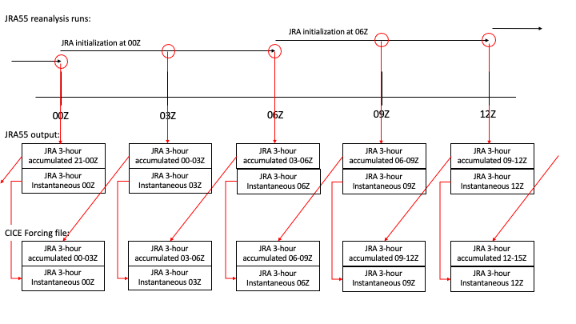

:tocdepth: 3

.. _forcing:

Standalone Forcing
======================

Users are strongly encouraged to run CICE in a coupled system (see :ref:`coupl`) to improve
quality of science.  The standalone mode is best used for technical testing
and only preliminary science testing.  Several different input forcing datasets have
been implemented over the history of CICE.  Some have become obsolete, others
have been supplanted by newer forcing data options, and others have been implemented
by outside users and are not testable by the Consortium.  The forcing code has
generally not been maintained by the Consortium and only a subset of the code is
tested by the Consortium.

The forcing implementation can be found in the file 
**cicecore/cicedynB/general/ice_forcing.F90**.  As noted above, only a subset of the
forcing modes are tested and supported.  In many ways, the implemetation is fairly
primitive, in part due to historical reasons and in part because standalone runs
are discouraged for evaluating complex science.  In general, most implementations
use aspects of the following approach,

- Input files are organized by year.
- Namelist inputs ``fyear`` and ``ycycle`` specify the forcing year dataset.
- The forcing year is computed on the fly and is assumed to be cyclical over the forcing dataset length defined by ``ycycle``.
- The namelist ``atm_dat_dir`` specifies the directory of the atmosphere input data files and the namelist ``atm_data_type`` defines the atmospheric forcing mode.
- The namelist ``ocn_dat_dir`` specifies the directory of the ocean input data files and the namelist ``ocn_data_type`` defines the ocean forcing mode.
- The filenames follow a particular naming convention that is defined in the source code (ie. subroutine **JRA55_gx1_files**).  The forcing year is typically found just before the **.nc** part of the filename and there are tools (subroutine **file_year**) to update the filename based on the model year and appropriate forcing year.
- The input data time axis is generally NOT read by the forcing subroutine.  The forcing frequency is hardwired into the model and the file record number is computed based on the forcing frequency and model time.  Mixing leap year input data and noleap model calendars (and vice versa) is not handled particularly gracefully.  The CICE model does not read or check against the input data time axis.
- Data is read on the model grid, no spatial interpolation exists.
- Data is often time interpolated linearly between two input timestamps to the model time each model timestep.

In general, the following variables need to be defined by the forcing module,

From Atmosphere:

- zlvl    = atmosphere level height (m)
- uatm    = model grid i-direction wind velocity component (m/s)
- vatm    = model grid j-direction wind velocity component (m/s)
- strax   = model grid i-direction wind stress (N/m^2)
- stray   = model grid j-direction wind stress (N/m^2)
- potT    = air potential temperature  (K)
- Tair    = air temperature  (K)
- Qa      = specific humidity (kg/kg)
- rhoa    = air density (kg/m^3)
- flw     = incoming longwave radiation (W/m^2)
- fsw     = incoming shortwave radiation (W/m^2)
- swvdr   = sw down, visible, direct  (W/m^2)
- swvdf   = sw down, visible, diffuse (W/m^2)
- swidr   = sw down, near IR, direct  (W/m^2)
- swidf   = sw down, near IR, diffuse (W/m^2)
- frain   = rainfall rate (kg/m^2 s)
- fsnow   = snowfall rate (kg/m^2 s)

From Ocean:

- uocn    = ocean current, x-direction (m/s)
- vocn    = ocean current, y-direction (m/s)
- ss_tltx = sea surface slope, x-direction (m/m)
- ss_tlty = sea surface slope, y-direction (m/m)
- hwater  = water depth for basal stress calc (landfast ice)
- sss     = sea surface salinity (ppt)
- sst     = sea surface temperature (C)
- frzmlt  = freezing/melting potential (W/m^2)
- frzmlt_init= frzmlt used in current time step (W/m^2)
- Tf      = freezing temperature (C)
- qdp     = deep ocean heat flux (W/m^2), negative upward
- hmix    = mixed layer depth (m)
- daice_da= data assimilation concentration increment rate (concentration s-1)(only used in hadgem drivers)

All variables have reasonable but static defaults and these will be used in ``default`` mode.

To advance the forcing, the subroutines **get_forcing_atmo** and
**get_forcing_ocn** are called each timestep from the step
loop.  That subroutine computes the forcing year (``fyear``), calls the appropriate
forcing data method, and then calls **prepare_forcing** which converts the 
input data fields to model forcing fields.

.. _JRA55forcing:

JRA55 Atmosphere Forcing
-------------------------

The current default atmosphere forcing for gx3, gx1, and tx1 standalone grids for
Consortium testing is the JRA55 forcing
dataset :cite:`Tsujino18`.  The Consortium has released 5 years of forcing data, 
2005-2009 for gx3, gx1, and tx1 grids.  Each year is a separate file and 
the dataset is on a gregorian time axis which includes leap days.

.. _fig-jra55data:

   Schematic of JRA55 CICE forcing file generation.

The forcing is read and interpolated in subroutine **JRA55_data**.  In particular,
air temperature (``airtmp``), east and north wind speed (``wndewd`` and ``wndnwd``), 
specific humidity (``spchmd``), incoming short and longwave radiation (``glbrad`` and ``dswsfc``),
and precipitation (``ttlpcp``) are read from the input files.   The JRA55 reanalysis is 
run with updated initial conditions every 6 hours and output is written every 3 hours.
The four state fields (air temperature, winds, specific humidity)
are instantaneous data, while the three flux fields (radition, precipitation) are 3
hour averages.  In the JRA55 forcing files provided by the Consortium, the time 
defined for 3 hour average fields is shifted 3 hours to the start time of the 3 
hour interval.  **NOTE that this is different
from the implementation on the original JRA55 files and also different from how models
normally define time on an accumulated/averaged field**.  This is all shown 
schematically in Figure :ref:`fig-jra55data`.  

The state fields are linearly 
time interpolated between input timestamps 
while the flux fields are read and held constant during each 3 hour model period.
The forcing frequency is hardwired to 3 hours in the implementation,
and the record number is computed based on the time of the current model year.
Time interpolation coefficients are computed in the **JRA55_data** subroutine.

The forcing data is converted to model inputs in the subroutine **prepare_forcing**
called in **get_forcing_atmo**.  To clarify, the JRA55 input data includes

- uatm    = T-cell centered, model grid i-direction wind velocity component (m/s)
- vatm    = T-cell-centered, model grid j-direction wind velocity component (m/s)
- Tair    = air temperature  (K)
- Qa      = specific humidity (kg/kg)
- flw     = incoming longwave radiation (W/m^2)
- fsw     = incoming shortwave radiation (W/m^2)
- fsnow   = snowfall rate (kg/m^2 s)

and model forcing inputs are derived from those fields and the defaults.

Because the input files are on the gregorian time axis, the model can run with the regular
365 day (noleap) calendar, but in that case, the Feb 29 input data will be used on 
March 1, and all data
after March 1 will be shifted one day.  December 31 in leap years will be skipped when
running with a CICE calendar with no leap days.

.. _NCARforcing:

NCAR Atmosphere Forcing
-------------------------

The NCAR atmospheric forcing was used in earlier standalone runs on the gx3 grid, and the
Consortium continues to do some limited testing with this forcing dataset.
Monthly average data for fsw, cldf, fsnow are read.  6-hourly data for
Tair, uatm, vatm, rhoa, and Qa are also read.
Users are encouraged to switch to the JRA55 (see :ref:`JRA55forcing`) dataset.  This
atmosphere forcing dataset may be deprecated in the future.

.. _LYqforcing:

LYq Atmosphere Forcing
-------------------------

The LYq (:cite:`Hunke07`) forcing was used in earlier standalone 
runs on the gx1 grid, and the
Consortium continues to do some very limited testing with this forcing dataset.
This dataset is largely based on the CORE II data.
Monthly average data for cldf and fsnow is read while 6-hourly data for Qa, Tair, 
uatm, and vatm are read with other fields derived or set by default.
Users are encouraged to switch to the JRA55 (see :ref:`JRA55forcing`) dataset. This
atmosphere forcing dataset may be deprecated in the future.

.. _defaultforcing:

Default Atmosphere Forcing
----------------------------

The default atmosphere forcing option sets the atmosphere forcing
internally.  No files are read.  Values for forcing fields are defined
at initialization in subroutine **init_coupler_flux** and held
constant thereafter.  Different conditions can be specified thru the
``default_season`` namelist variable.

.. _box2001forcing:

Box2001 Atmosphere Forcing
-------------------------

The box2001 forcing dataset in generated internally.  No files are read.  The
dataset is used to test an idealized box case as defined in :cite:`Hunke01`.

.. _otheratmforcing:

Other Atmosphere Forcing
-------------------------

There are a few other atmospheric forcing modes, as defined by ``atm_data_type``, but
they are not tested by the Consortium on a regular basis.

.. _defaultocnforcing:

Default Ocean Forcing
-------------------------

The ``default`` ocean setting is the standard setting used in standalone CICE runs.
In this mode, the sea surface salinity is set to 34 ppt and the sea surface
temperature is set to the freezing temperature at all grid points and
held constant unless the mixed layer parameterization is turned on, in which
case the SST evolves.  Other ocean coupling fields are set to zero.  No files are read.

.. _otherocnforcing:

Other Ocean Forcing
-------------------------

There are a few other ocean forcing modes, as defined by ``ocn_data_type``, but
they are not tested by the Consortium on a regular basis.

