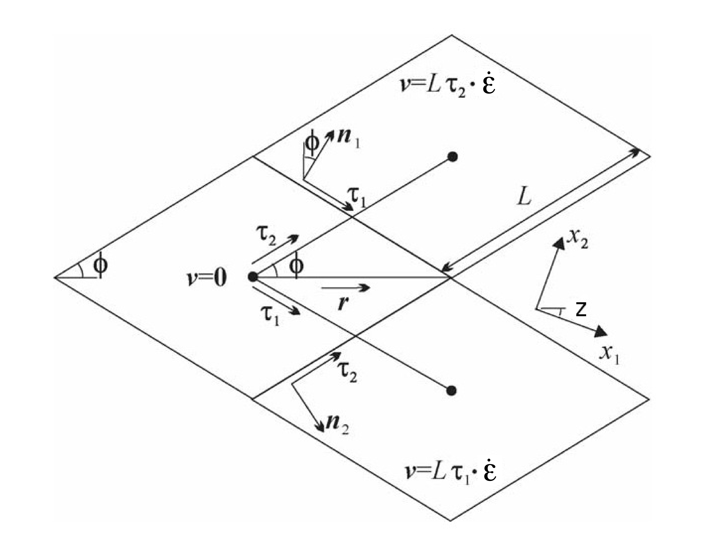

:tocdepth: 3

.. _dynam:

Dynamics
========

There are different approaches in the CICE code for representing sea ice
rheology and for solving the sea ice momentum equation. The
elastic-viscous-plastic (EVP) model represents a modification of the
standard viscous-plastic (VP) model for sea ice dynamics
:cite:`Hibler79`. The elastic-anisotropic-plastic (EAP) model,
on the other hand, explicitly accounts for the observed sub-continuum
anisotropy of the sea ice cover :cite:`Wilchinsky06,Weiss09`. If
``kdyn`` = 1 in the namelist then the EVP model is used (module
**ice\_dyn\_evp.F90**), while ``kdyn`` = 2 is associated with the EAP
model (**ice\_dyn\_eap.F90**), and ``kdyn`` = 3 is associated with the
VP model (**ice\_dyn\_vp.F90**).

At times scales associated with the
wind forcing, the EVP model reduces to the VP model while the EAP model
reduces to the anisotropic rheology described in detail in
:cite:`Wilchinsky06,Tsamados13`. At shorter time scales the
adjustment process takes place in both models by a numerically more
efficient elastic wave mechanism. While retaining the essential physics,
this elastic wave modification leads to a fully explicit numerical
scheme which greatly improves the model’s computational efficiency.

The EVP sea ice dynamics model is thoroughly documented in
:cite:`Hunke97`, :cite:`Hunke01`,
:cite:`Hunke02` and :cite:`Hunke03` and the EAP
dynamics in :cite:`Tsamados13`. Simulation results and
performance of the EVP and EAP models have been compared with the VP
model and with each other in realistic simulations of the Arctic
respectively in :cite:`Hunke99` and
:cite:`Tsamados13`.

The EVP numerical
implementation in this code release is that of :cite:`Hunke02`
and :cite:`Hunke03`, with revisions to the numerical solver as
in :cite:`Bouillon13`. The implementation of the EAP sea ice
dynamics into CICE is described in detail in
:cite:`Tsamados13`.

The VP solver implementation mostly follows :cite:`Lemieux08`, with
FGMRES :cite:`Saad93` as the linear solver and GMRES as the preconditioner.
Note that the VP solver has not yet been tested on the ``tx1`` grid or with
threading enabled.

Here we summarize the equations and
direct the reader to the above references for details.

.. _momentum:

********
Momentum
********

The force balance per unit area in the ice pack is given by a
two-dimensional momentum equation :cite:`Hibler79`, obtained
by integrating the 3D equation through the thickness of the ice in the
vertical direction:

.. math::
   m{\partial {\bf u}\over\partial t} = \nabla\cdot{\bf \sigma}
   + \vec{\tau}_a+\vec{\tau}_w + \vec{\tau}_b - \hat{k}\times mf{\bf u} - mg\nabla H_\circ,
   :label: vpmom

where :math:`m` is the combined mass of ice and snow per unit area and
:math:`\vec{\tau}_a` and :math:`\vec{\tau}_w` are wind and ocean
stresses, respectively. The term :math:`\vec{\tau}_b` is a 
seabed stress (also referred to as basal stress) that represents the grounding of pressure
ridges in shallow water :cite:`Lemieux16`. The mechanical properties of the ice are represented by the
internal stress tensor :math:`\sigma_{ij}`. The other two terms on
the right hand side are stresses due to Coriolis effects and the sea
surface slope. The parameterization for the wind and ice–ocean stress
terms must contain the ice concentration as a multiplicative factor to
be consistent with the formal theory of free drift in low ice
concentration regions. A careful explanation of the issue and its
continuum solution is provided in :cite:`Hunke03` and
:cite:`Connolley04`.

For clarity, the two components of Equation :eq:`vpmom` are

.. math::
   \begin{aligned}
   m{\partial u\over\partial t} &= {\partial\sigma_{1j}\over\partial x_j} + \tau_{ax} + 
     a_i c_w \rho_w
     \left|{\bf U}_w - {\bf u}\right| \left[\left(U_w-u\right)\cos\theta - \left(V_w-v\right)\sin\theta\right]
     -C_bu +mfv - mg{\partial H_\circ\over\partial x}, \\
   m{\partial v\over\partial t} &= {\partial\sigma_{2j}\over\partial x_j} + \tau_{ay} + 
     a_i c_w \rho_w
     \left|{\bf U}_w - {\bf u}\right| \left[\left(U_w-u\right)\sin\theta + \left(V_w-v\right)\cos\theta\right]
     -C_bv-mfu - mg{\partial H_\circ\over\partial y}. \end{aligned}
   :label: momsys

A bilinear discretization is used for the stress terms
:math:`\partial\sigma_{ij}/\partial x_j`,
which enables the discrete equations to be derived from the
continuous equations written in curvilinear coordinates. In this
manner, metric terms associated with the curvature of the grid are
incorporated into the discretization explicitly. Details pertaining to
the spatial discretization are found in :cite:`Hunke02`.

.. _evp-momentum:

Elastic-Viscous-Plastic
~~~~~~~~~~~~~~~~~~~~~~~

The momentum equation is discretized in time as follows, for the classic
EVP approach.
In the code,
:math:`{\tt vrel}=a_i c_w \rho_w\left|{\bf U}_w - {\bf u}^k\right|` and 
:math:`C_b=T_b \left( \sqrt{(u^k)^2+(v^k)^2}+u_0 \right)^{-1}`, 
where :math:`k` denotes the subcycling step. The following equations
illustrate the time discretization and define some of the other
variables used in the code.

.. math::
   \underbrace{\left({m\over\Delta t_e}+{\tt vrel} \cos\theta\ + C_b \right)}_{\tt cca} u^{k+1} 
   - \underbrace{\left(mf+{\tt vrel}\sin\theta\right)}_{\tt ccb}v^{k+1}
    =  &\underbrace{{\partial\sigma_{1j}^{k+1}\over\partial x_j}}_{\tt strintx}
    + \underbrace{\tau_{ax} - mg{\partial H_\circ\over\partial x} }_{\tt forcex} \\
     &+ {\tt vrel}\underbrace{\left(U_w\cos\theta-V_w\sin\theta\right)}_{\tt waterx}  + {m\over\Delta t_e}u^k,
   :label: umom

.. math::
    \underbrace{\left(mf+{\tt vrel}\sin\theta\right)}_{\tt ccb} u^{k+1} 
   + \underbrace{\left({m\over\Delta t_e}+{\tt vrel} \cos\theta + C_b \right)}_{\tt cca}v^{k+1}
    =  &\underbrace{{\partial\sigma_{2j}^{k+1}\over\partial x_j}}_{\tt strinty}
    + \underbrace{\tau_{ay} - mg{\partial H_\circ\over\partial y} }_{\tt forcey} \\
     &+ {\tt vrel}\underbrace{\left(U_w\sin\theta+V_w\cos\theta\right)}_{\tt watery}  + {m\over\Delta t_e}v^k,
   :label: vmom

and :math:`{\tt vrel}\ \cdot\ {\tt waterx(y)}= {\tt taux(y)}`.

We solve this system of equations analytically for :math:`u^{k+1}` and
:math:`v^{k+1}`. Define

.. math::
   \hat{u} = F_u + \tau_{ax} - mg{\partial H_\circ\over\partial x} + {\tt vrel} \left(U_w\cos\theta - V_w\sin\theta\right) + {m\over\Delta t_e}u^k 
   :label: cevpuhat

.. math::
   \hat{v} = F_v + \tau_{ay} - mg{\partial H_\circ\over\partial y} + {\tt vrel} \left(U_w\sin\theta + V_w\cos\theta\right) + {m\over\Delta t_e}v^k,
   :label: cevpvhat

where :math:`{\bf F} = \nabla\cdot\sigma^{k+1}`. Then

.. math::
   \begin{aligned}
   \left({m\over\Delta t_e} +{\tt vrel}\cos\theta\ + C_b \right)u^{k+1} - \left(mf + {\tt vrel}\sin\theta\right) v^{k+1} &= \hat{u}  \\
   \left(mf + {\tt vrel}\sin\theta\right) u^{k+1} + \left({m\over\Delta t_e} +{\tt vrel}\cos\theta + C_b \right)v^{k+1} &= \hat{v}.\end{aligned}

Solving simultaneously for :math:`u^{k+1}` and :math:`v^{k+1}`,

.. math::
   \begin{aligned}
   u^{k+1} = {a \hat{u} + b \hat{v} \over a^2 + b^2} \\
   v^{k+1} = {a \hat{v} - b \hat{u} \over a^2 + b^2}, \end{aligned}

where

.. math::
   a = {m\over\Delta t_e} + {\tt vrel}\cos\theta + C_b \\
   :label: cevpa

.. math::
   b = mf + {\tt vrel}\sin\theta.
   :label: cevpb
   
.. _vp-momentum:

Viscous-Plastic
~~~~~~~~~~~~~~~

In the VP approach, equation :eq:`momsys` is discretized implicitly using a Backward Euler approach,
and stresses are not computed explicitly:

.. math::
  \begin{align}
  m\frac{(u^{n}-u^{n-1})}{\Delta t} &= \frac{\partial \sigma_{1j}^n}{\partial x_j}
  - \tau_{w,x}^n + \tau_{b,x}^n +  mfv^n
   + r_{x}^n,
  \\
  m\frac{(v^{n}-v^{n-1})}{\Delta t} &= \frac{\partial \sigma^{n} _{2j}}{\partial x_j}
  - \tau_{w,y}^n + \tau_{b,y}^n   -mfu^{n}
   + r_{y}^n
  \end{align}
  :label: u_sit

where :math:`r = (r_x,r_y)` contains all terms that do not depend on the velocities :math:`u^n, v^n` (namely the sea surface tilt and the wind stress).
As the water drag, seabed stress and rheology term depend on the velocity field, the only unknowns in equation :eq:`u_sit` are :math:`u^n` and :math:`v^n`.

Once discretized in space, equation :eq:`u_sit` leads to a system of :math:`N` nonlinear equations with :math:`N` unknowns that can be concisely written as

.. math::
  \mathbf{A}(\mathbf{u})\mathbf{u} = \mathbf{b}(\mathbf{u}),
  :label: nonlin_sys

where :math:`\mathbf{A}` is an :math:`N\times N` matrix and :math:`\mathbf{u}` and :math:`\mathbf{b}` are vectors of size :math:`N`.
Note that we have dropped the time level index :math:`n`.
The vector :math:`\mathbf{u}` is formed by stacking first the :math:`u` components, followed by the :math:`v` components of the discretized ice velocity.
The vector :math:`\mathbf{b}` is a function of the velocity vector :math:`\mathbf{u}` because of the water and seabed stress terms as well as parts of the rheology term that depend non-linearly on :math:`\mathbf{u}`.

The nonlinear system :eq:`nonlin_sys` is solved using a Picard iteration method.
Starting from a previous iterate :math:`\mathbf{u}_{k-1}`, the nonlinear system is linearized by substituting :math:`\mathbf{u}_{k-1}` in the expression of the matrix :math:`\mathbf{A}` and the vector :math:`\mathbf{b}`:

.. math::
  \mathbf{A}(\mathbf{u}_{k-1})\mathbf{u}_{k} =  \mathbf{b}(\mathbf{u}_{k-1})
  :label: picard

The resulting linear system is solved using the Flexible Generalized Minimum RESidual (FGMRES, :cite:`Saad93`) method and this process is repeated iteratively.

The maximum number of Picard iterations can be set using the namelist flag ``maxits_nonlin``.
The relative tolerance for the Picard solver can be set using the namelist flag ``reltol_nonlin``.
The Picard iterative process stops when :math:`\left\lVert \mathbf{u}_{k} \right\rVert_2 < {\tt reltol\_nonlin} \cdot \left\lVert\mathbf{u}_{0}\right\rVert_2` or when ``maxits_nonlin`` is reached.

Parameters for the FGMRES linear solver and the preconditioner can be controlled using additional namelist flags (see :ref:`dynamics_nml`).

Ice-Ocean stress
~~~~~~~~~~~~~~~~

At the end of each (thermodynamic) time step, the
ice–ocean stress must be constructed from :math:`{\tt taux(y)}` and the terms
containing :math:`{\tt vrel}` on the left hand side of the equations.

The Hibler-Bryan form for the ice-ocean stress :cite:`Hibler87`
is included in **ice\_dyn\_shared.F90** but is currently commented out,
pending further testing.

.. _seabed-stress:

***************
Seabed stress
***************

CICE includes two options for calculating the seabed stress,
i.e. the term in the momentum equation that represents the interaction
between grounded ice keels and the seabed. The seabed stress can be
activated by setting ``seabed_stress`` to true in the namelist. The seabed stress (or basal
stress) parameterization of :cite:`Lemieux16` is chosen if ``seabed_stress_method`` = ``LKD`` while the approach based on the probability of contact between the ice and the seabed is used if ``seabed_stress_method`` = ``probabilistic``.

For both parameterizations, the components of the seabed
stress are expressed as :math:`\tau_{bx}=C_bu` and
:math:`\tau_{by}=C_bv`, where :math:`C_b` is a seabed stress
coefficient.

The two parameterizations differ in their calculation of
the :math:`C_b` coefficients. 

Note that the user must provide a bathymetry field for using these
grounding schemes. It is suggested to have a bathymetry field with water depths
larger than 5 m that represents well shallow water (less than 30 m) regions such as the Laptev Sea
and the East Siberian Sea.   

Seabed stress based on linear keel draft (LKD)
~~~~~~~~~~~~~~~~~~~~~~~~~~~~~~~~~~~~~~~~~

This parameterization for the seabed stress is described in
:cite:`Lemieux16`. It assumes that the largest keel draft varies linearly with the mean thickness in a grid cell (i.e. sea ice volume). The :math:`C_b` coefficients are expressed as

.. math::
   C_b= k_2 \max [0,(h_u - h_{cu})]  e^{-\alpha_b * (1 - a_u)} (\sqrt{u^2+v^2}+u_0)^{-1}, \\
   :label: Cb 

where :math:`k_2` determines the maximum seabed stress that can be sustained by the grounded parameterized ridge(s), :math:`u_0` 
is a small residual velocity and :math:`\alpha_b` is a parameter to ensure that the seabed stress quickly drops when 
the ice concentration is smaller than 1. In the code, :math:`k_2 \max [0,(h_u - h_{cu})]  e^{-\alpha_b * (1 - a_u)}` is defined as 
:math:`T_b`. The quantities :math:`h_u`, :math:`a_{u}` and :math:`h_{cu}` are calculated at 
the 'u' point based on local ice conditions (surrounding tracer points). They are respectively given by 

.. math::
   h_u=\max[v_i(i,j),v_i(i+1,j),v_i(i,j+1),v_i(i+1,j+1)], \\
   :label: hu 
   
.. math::
   a_u=\max[a_i(i,j),a_i(i+1,j),a_i(i,j+1),a_i(i+1,j+1)]. \\
   :label: au      
   
.. math::
   h_{cu}=a_u h_{wu} / k_1, \\
   :label: hcu

where the :math:`a_i` and :math:`v_i` are the total ice concentrations and ice volumes around the :math:`u` point :math:`i,j` and 
:math:`k_1` is a parameter that defines the critical ice thickness :math:`h_{cu}` at which the parameterized 
ridge(s) reaches the seafloor for a water depth :math:`h_{wu}=\min[h_w(i,j),h_w(i+1,j),h_w(i,j+1),h_w(i+1,j+1)]`. Given the formulation of :math:`C_b` in equation :eq:`Cb`, the seabed stress components are non-zero only 
when :math:`h_u > h_{cu}`. 

The maximum seabed stress depends on the weight of the ridge 
above hydrostatic balance and the value of :math:`k_2`. It is, however, the parameter :math:`k_1` that has the most notable impact on the simulated extent of landfast ice. 
The value of :math:`k_1` can be changed at runtime using the namelist variable ``k1``. 

To prevent unrealistic grounding, :math:`T_b` is set to zero when :math:`h_{wu}` 
is larger than 30 m. This maximum value is chosen based on observations of large 
keels in the Arctic Ocean :cite:`Amundrud04`.

Seabed stress based on probabilistic approach
~~~~~~~~~~~~~~~~~~~~~~~~~~~~~~~~~~~~~~~~~~~~~

This more sophisticated grounding parameterization computes the seabed stress based
on the probability of contact between the ice thickness distribution
(ITD) and the seabed. Multi-thickness category models such as CICE typically use a
few thickness categories (5-10). This crude representation of the ITD
does not resolve the tail of the ITD, which is crucial for grounding
events. 

To represent the tail of the distribution, the simulated ITD is
converted to a positively skewed probability function :math:`f(x)`
with :math:`x` the sea ice thickness. The mean and variance are set 
equal to the ones of the original ITD. A
log-normal distribution is used for :math:`f(x)`.

It is assumed that the bathymetry :math:`y` (at the 't' point) follows a normal
distribution :math:`b(y)`. The mean of :math:`b(y)` comes from the user's bathymetry field and the
standard deviation :math:`\sigma_b` is currently fixed to 2.5 m. Two
possible improvements would be to specify a distribution based on high
resolution bathymetry data and to take into account variations of the
water depth due to changes in the sea surface height. 

Assuming hydrostatic balance and neglecting the impact of snow, the draft of floating ice of thickness
:math:`x` is :math:`D(x)=\rho_i x / \rho_w` where :math:`\rho_i` is the sea ice density. Hence, the probability of contact (:math:`P_c`) between the
ITD and the seabed is given by

.. math::
   P_c=\int_{0}^{\inf} \int_{0}^{D(x)} g(x)b(y) dy dx \label{prob_contact}.

:math:`T_b` is first calculated at the 't' point (referred to as :math:`T_{bt}`). :math:`T_{bt}` depends on the weight of the ridge in excess of hydrostatic balance. The parameterization first calculates

.. math::
   T_{bt}^*=\mu_s g \int_{0}^{\inf} \int_{0}^{D(x)} (\rho_i x - \rho_w
   y)g(x)b(y) dy dx, \\
   :label: Tbt

and then obtains :math:`T_{bt}` by multiplying :math:`T_{bt}^*` by :math:`e^{-\alpha_b * (1 - a_i)}` (similar to what is done for ``seabed_stress_method`` = ``LKD``).

To calculate :math:`T_{bt}^*` in equation :eq:`Tbt`, :math:`f(x)` and :math:`b(y)` are discretized using many small categories (100). :math:`f(x)` is discretized between 0 and 50 m while :math:`b(y)` is truncated at plus and minus three :math:`\sigma_b`. :math:`f(x)` is also modified by setting it to	zero after a certain percentile of the log-normal distribution. This percentile, which is currently set to 99.7%, notably affects the simulation of landfast ice and is used as a tuning parameter. Its impact is similar to the one of the parameter :math:`k_1` for the LKD method.

:math:`T_b` at the 'u' point is calculated from the 't' point values around it according to 

.. math::
   T_b=\max[T_{bt}(i,j),T_{bt}(i+1,j),T_{bt}(i,j+1),T_{bt}(i+1,j+1)]. \\
   :label: Tb

Following again the LKD method, the seabed stress coefficients are finally expressed as

.. math::
   C_b= T_b (\sqrt{u^2+v^2}+u_0)^{-1}, \\
   :label: Cb2

.. _internal-stress:

***************
Internal stress
***************

For convenience we formulate the stress tensor :math:`\bf \sigma` in
terms of :math:`\sigma_1=\sigma_{11}+\sigma_{22}`,
:math:`\sigma_2=\sigma_{11}-\sigma_{22}`, and introduce the
divergence, :math:`D_D`, and the horizontal tension and shearing
strain rates, :math:`D_T` and :math:`D_S` respectively:

.. math::
   D_D = \dot{\epsilon}_{11} + \dot{\epsilon}_{22}, 

.. math::
   D_T = \dot{\epsilon}_{11} - \dot{\epsilon}_{22}, 

.. math::
   D_S = 2\dot{\epsilon}_{12}, 

where

.. math::
   \dot{\epsilon}_{ij} = {1\over 2}\left({{\partial u_i}\over{\partial x_j}} + {{\partial u_j}\over{\partial x_i}}\right)

CICE can output the internal ice pressure which is an important field to support navigation in ice-infested water.
The internal ice pressure (``sigP``) is the average of the normal stresses multiplied by :math:`-1` and 
is therefore simply equal to :math:`-\sigma_1/2`.

Following the approach of :cite:`Konig10` (see also :cite:`Lemieux16`), the 
elliptical yield curve can be modified such that the ice has isotropic tensile strength. 
The tensile strength :math:`T_p` is expressed as a fraction of the ice strength :math:`P`, that is :math:`T_p=k_t P` 
where :math:`k_t` should be set to a value between 0 and 1 (this can
be changed at runtime with the namelist parameter ``Ktens``). The ice
strength :math:`P` is a function of the ice thickness distribution as
described in the `Icepack
Documentation<https://cice-consortium-icepack.readthedocs.io/en/master/science_guide/index.html>`_.

.. _stress-vp:

Viscous-Plastic
~~~~~~~~~~~~~~~

The VP constitutive law is given by

.. math::
   \sigma_{ij} = 2 \eta \dot{\epsilon}_{ij} + (\zeta - \eta) D_D - P_R(1 - k_t)\frac{\delta_{ij}}{2}
   :label: vp-const

where :math:`\eta` and :math:`\zeta` are the bulk and shear viscosities.
An elliptical yield curve is used, with the viscosities given by

.. math::
   \zeta = {P(1+k_t)\over 2\Delta}, 

.. math::
   \eta  = {P(1+k_t)\over {2\Delta e^2}}, 

where

.. math::
   \Delta = \left[D_D^2 + {1\over e^2}\left(D_T^2 + D_S^2\right)\right]^{1/2}

and :math:`P_R` is a “replacement pressure” (see :cite:`Geiger98`, for
example), which serves to prevent residual ice motion due to spatial
variations of :math:`P` when the rates of strain are exactly zero.

The parameter :math:`e` is the  ratio of the major and minor axes of the elliptical yield curve, also called the ellipse aspect ratio. It can be changed using the namelist parameter ``e_ratio``.

.. _stress-evp:

Elastic-Viscous-Plastic
~~~~~~~~~~~~~~~~~~~~~~~

In the EVP model the internal stress tensor is determined from a
regularized version of the VP constitutive law :eq:`vp-const`.  The constitutive law is therefore

.. math::
   {1\over E}{\partial\sigma_1\over\partial t} + {\sigma_1\over 2\zeta}
     + {P_R(1-k_t)\over 2\zeta} = D_D, \\
   :label: sig1

.. math::
   {1\over E}{\partial\sigma_2\over\partial t} + {\sigma_2\over 2\eta} = D_T,
   :label: sig2

.. math::
   {1\over E}{\partial\sigma_{12}\over\partial t} + {\sigma_{12}\over
     2\eta} = {1\over 2}D_S,
   :label: sig12

Viscosities are updated during the subcycling, so that the entire
dynamics component is subcycled within the time step, and the elastic
parameter :math:`E` is defined in terms of a damping timescale :math:`T`
for elastic waves, :math:`\Delta t_e < T < \Delta t`, as

.. math:: 
   E = {\zeta\over T},

where :math:`T=E_\circ\Delta t` and :math:`E_\circ` (eyc) is a tunable
parameter less than one. Including the modification proposed by :cite:`Bouillon13` for equations :eq:`sig2` and :eq:`sig12` in order to improve numerical convergence, the stress equations become

.. math::
   \begin{aligned}
   {\partial\sigma_1\over\partial t} + {\sigma_1\over 2T} 
     + {P_R(1-k_t)\over 2T} &=& {P(1+k_t)\over 2T\Delta} D_D, \\
   {\partial\sigma_2\over\partial t} + {\sigma_2\over 2T} &=& {P(1+k_t)\over
     2Te^2\Delta} D_T,\\
   {\partial\sigma_{12}\over\partial t} + {\sigma_{12}\over  2T} &=&
     {P(1+k_t)\over 4Te^2\Delta}D_S.\end{aligned}

Once discretized in time, these last three equations are written as

.. math::
   \begin{aligned}
   {(\sigma_1^{k+1}-\sigma_1^{k})\over\Delta t_e} + {\sigma_1^{k+1}\over 2T} 
     + {P_R^k(1-k_t)\over 2T} &=& {P(1+k_t)\over 2T\Delta^k} D_D^k, \\
   {(\sigma_2^{k+1}-\sigma_2^{k})\over\Delta t_e} + {\sigma_2^{k+1}\over 2T} &=& {P(1+k_t)\over
     2Te^2\Delta^k} D_T^k,\\
   {(\sigma_{12}^{k+1}-\sigma_{12}^{k})\over\Delta t_e} + {\sigma_{12}^{k+1}\over  2T} &=&
     {P(1+k_t)\over 4Te^2\Delta^k}D_S^k,\end{aligned}
   :label: sigdisc  
     

where :math:`k` denotes again the subcycling step. All coefficients on the left-hand side are constant except for
:math:`P_R`. This modification compensates for the decreased efficiency of including
the viscosity terms in the subcycling. (Note that the viscosities do not
appear explicitly.) Choices of the parameters used to define :math:`E`,
:math:`T` and :math:`\Delta t_e` are discussed in
Sections :ref:`revp` and :ref:`parameters`.

.. _stress-eap:

Elastic-Anisotropic-Plastic
~~~~~~~~~~~~~~~~~~~~~~~~~~~

In the EAP model the internal stress tensor is related to the
geometrical properties and orientation of underlying virtual diamond
shaped floes (see :ref:`fig-EAP`). In contrast to the isotropic EVP
rheology, the anisotropic plastic yield curve within the EAP rheology
depends on the relative orientation of the diamond shaped floes (unit
vector :math:`\mathbf r` in :ref:`fig-EAP`), with respect to the
principal direction of the deformation rate (not shown). Local
anisotropy of the sea ice cover is accounted for by an additional
prognostic variable, the structure tensor :math:`\mathbf{A}` defined
by

.. math:: 
   {\mathbf A}=\int_{\mathbb{S}}\vartheta(\mathbf r)\mathbf r\mathbf r d\mathbf r\label{structuretensor}.

where :math:`\mathbb{S}` is a unit-radius circle; **A** is a unit
trace, 2\ :math:`\times`\ 2 matrix. From now on we shall describe the
orientational distribution of floes using the structure tensor. For
simplicity we take the probability density function
:math:`\vartheta(\mathbf r )` to be Gaussian,
:math:`\vartheta(z)=\omega_{1}\exp(-\omega_{2}z^{2})`, where :math:`z`
is the ice floe inclination with respect to the axis :math:`x_{1}` of
preferential alignment of ice floes (see :ref:`fig-EAP`),
:math:`\vartheta(z)` is periodic with period :math:`\pi`, and the
positive coefficients :math:`\omega_{1}` and :math:`\omega_{2}` are
calculated to ensure normalization of :math:`\vartheta(z)`, i.e.
:math:`\int_{0}^{2\pi}\vartheta(z)dz=1`. The ratio of the principal
components of :math:`\mathbf{A}`, :math:`A_{1}/A_{2}`, are derived
from the phenomenological evolution equation for the structure tensor
:math:`\mathbf A`,

.. math:: 
   \frac{D\mathbf{A}}{D t}=\mathbf{F}_{iso}(\mathbf{A})+\mathbf{F}_{frac}(\mathbf{A},\boldsymbol\sigma),
   :label: evolutionA

where :math:`t` is the time, and :math:`D/Dt` is the co-rotational
time derivative accounting for advection and rigid body rotation
(:math:`D\mathbf A/Dt = d\mathbf A/dt -\mathbf W \cdot \mathbf A -\mathbf A \cdot \mathbf W^{T}`)
with :math:`\mathbf W` being the vorticity tensor.
:math:`\mathbf F_{iso}` is a function that accounts for a variety of
processes (thermal cracking, melting, freezing together of floes) that
contribute to a more isotropic nature to the ice cover.
:math:`\mathbf F_{frac}` is a function determining the ice floe
re-orientation due to fracture, and explicitly depends upon sea ice
stress (but not its magnitude). Following :cite:`Wilchinsky06`,
based on laboratory experiments by :cite:`Schulson01` we
consider four failure mechanisms for the Arctic sea ice cover. These
are determined by the ratio of the principal values of the sea ice
stress :math:`\sigma_{1}` and :math:`\sigma_{2}`: (i) under biaxial
tension, fractures form across the perpendicular principal axes and
therefore counteract any apparent redistribution of the floe
orientation; (ii) if only one of the principal stresses is
compressive, failure occurs through axial splitting along the
compression direction; (iii) under biaxial compression with a low
confinement ratio, (:math:`\sigma_{1}/\sigma_{2}<R`), sea ice fails
Coulombically through formation of slip lines delineating new ice
floes oriented along the largest compressive stress; and finally (iv)
under biaxial compression with a large confinement ratio,
(:math:`\sigma_{1}/\sigma_{2}\ge R`), the ice is expected to fail
along both principal directions so that the cumulative directional
effect balances to zero.

.. _fig-EAP:

   Diamond-shaped floes

Figure :ref:`fig-EAP` shows geometry of interlocking diamond-shaped floes (taken from
:cite:`Wilchinsky06`). :math:`\phi` is half of the acute angle
of the diamonds. :math:`L` is the edge length.
:math:`\boldsymbol n_{1}`, :math:`\boldsymbol n_{2}` and
:math:`\boldsymbol\tau_{1}`, :math:`\boldsymbol\tau_{2}` are
respectively the normal and tangential unit vectors along the diamond edges.
:math:`\mathbf v=L\boldsymbol\tau_{2}\cdot\dot{\boldsymbol\epsilon}`
is the relative velocity between the two floes connected by the
vector :math:`L \boldsymbol \tau_{2}`. :math:`\mathbf r` is the unit
vector along the main diagonal of the diamond. Note that the diamonds
illustrated here represent one possible realisation of all possible
orientations. The angle :math:`z` represents the rotation of the
diamonds’ main axis relative to their preferential orientation along
the axis :math:`x_1`.

The new anisotropic rheology requires solving the evolution
Equation :eq:`evolutionA` for the structure tensor in addition to the momentum
and stress equations. The evolution equation for :math:`\mathbf{A}` is
solved within the EVP subcycling loop, and consistently with the
momentum and stress evolution equations, we neglect the advection term
for the structure tensor. Equation :eq:`evolutionA` then reduces to the system
of two equations:

.. math::
   \begin{aligned}
   \frac{\partial A_{11}}{\partial t}&=&-k_{t}\left(A_{11}-\frac{1}{2}\right)+M_{11}  \mbox{,} \\ 
   \frac{\partial A_{12}}{\partial t}&=&-k_{t} A_{12}+M_{12}  \mbox{,}\end{aligned}

where the first terms on the right hand side correspond to the
isotropic contribution, :math:`F_{iso}`, and :math:`M_{11}` and
:math:`M_{12}` are the components of the term :math:`F_{frac}` in
Equation :eq:`evolutionA` that are given in :cite:`Wilchinsky06` and
:cite:`Tsamados13`. These evolution equations are
discretized semi-implicitly in time. The degree of anisotropy is
measured by the largest eigenvalue (:math:`A_{1}`) of this tensor
(:math:`A_{2}=1-A_{1}`). :math:`A_{1}=1` corresponds to perfectly
aligned floes and :math:`A_{1}=0.5` to a uniform distribution of floe
orientation. Note that while we have specified the aspect ratio of the
diamond floes, through prescribing :math:`\phi`, we make no assumption
about the size of the diamonds so that formally the theory is scale
invariant.

As described in greater detail in :cite:`Wilchinsky06`, the
internal ice stress for a single orientation of the ice floes can be
calculated explicitly and decomposed, for an average ice thickness
:math:`h`, into its ridging (r) and sliding (s) contributions

.. math::
   \boldsymbol \sigma^{b}(\mathbf r,h)=P_{r}(h) \boldsymbol \sigma_{r}^{b}(\mathbf r)+P_{s}(h) \boldsymbol \sigma_{s}^{b}(\mathbf r),
   :label: stress1

where :math:`P_{r}` and :math:`P_{s}` are the ridging and sliding
strengths and the ridging and sliding stresses are functions of the
angle :math:`\theta= \arctan(\dot\epsilon_{II}/\dot\epsilon_{I})`, the
angle :math:`y` between the major principal axis of the strain rate
tensor (not shown) and the structure tensor (:math:`x_1` axis in
:ref:`fig-EAP`, and the angle :math:`z` defined in :ref:`fig-EAP`. In
the stress expressions above the underlying floes are assumed parallel,
but in a continuum-scale sea ice region the floes can possess different
orientations in different places and we take the mean sea ice stress
over a collection of floes to be given by the average

.. math:: 
   \boldsymbol\sigma^{EAP}(h)=P_{r}(h)\int_{\mathbb{S}}\vartheta(\mathbf r)\left[\boldsymbol\sigma_{r}^{b}(\mathbf r)+ k \boldsymbol\sigma_{s}^{b}(\mathbf r)\right]d\mathbf r
   :label: stressaverage

where we have introduced the friction parameter :math:`k=P_{s}/P_{r}`
and where we identify the ridging ice strength :math:`P_{r}(h)` with the
strength :math:`P` described in section 1 and used within the EVP
framework.

As is the case for the EVP rheology, elasticity is included in the EAP
description not to describe any physical effect, but to make use of the
efficient, explicit numerical algorithm used to solve the full sea ice
momentum balance. We use the analogous EAP stress equations,

.. math::
   \frac{\partial \sigma_{1}}{\partial t}+\frac{\sigma_1}{2T} = \frac{\sigma^{EAP}_{1}}{2T}  \mbox{,}  
   :label: EAPsigma1

.. math::
   \frac{\partial \sigma_{2}}{\partial t}+\frac{\sigma_2}{2T} = \frac{\sigma^{EAP}_{2}}{2T} \mbox{,}  
   :label: EAPsigma2

.. math::
   \frac{\partial \sigma_{12}}{\partial t}+\frac{\sigma_{12}}{2T} = \frac{\sigma^{EAP}_{12}}{2T} \mbox{,}
   :label: EAPsigma12

where the anisotropic stress :math:`\boldsymbol\sigma^{EAP}` is defined
in a look-up table for the current values of strain rate and structure
tensor. The look-up table is constructed by computing the stress
(normalized by the strength) from Equations :eq:`EAPsigma1`–:eq:`EAPsigma12`
for discrete values of the largest eigenvalue of the structure tensor,
:math:`\frac{1}{2}\le A_{1}\le 1`, the angle :math:`0\le\theta\le2\pi`,
and the angle :math:`-\pi/2\le y\le\pi/2` between the major principal
axis of the strain rate tensor and the structure tensor
:cite:`Tsamados13`. The updated stress, after the elastic
relaxation, is then passed to the momentum equation and the sea ice
velocities are updated in the usual manner within the subcycling loop of
the EVP rheology. The structure tensor evolution equations are solved
implicitly at the same frequency, :math:`\Delta t_{e}`, as the ice
velocities and internal stresses. Finally, to be coherent with our new
rheology we compute the area loss rate due to ridging as
:math:`\vert\dot{\boldsymbol\epsilon}\vert\alpha_{r}(\theta)`, with
:math:`\alpha_r(\theta)` and :math:`\alpha_s(\theta)` given by
:cite:`Wilchinsky04`,

.. math::
   \begin{aligned}
   \alpha_{r}(\theta)=\frac{\sigma^{r}_{ij}\dot\epsilon_{ij}}{P_{r} \vert\dot{\boldsymbol\epsilon}\vert } , \qquad \alpha_{s}(\theta)=\frac{\sigma^{s}_{ij}\dot\epsilon_{ij}}{P_{s} \vert\dot{\boldsymbol\epsilon}\vert }.\label{alphas}\end{aligned}

Both ridging rate and sea ice strength are computed in the outer loop
of the dynamics.

.. _revp:

****************
Revised approach
****************

The revised EVP approach is based on a pseudo-time iterative scheme :cite:`Lemieux12`, :cite:`Bouillon13`, :cite:`Kimmritz15`. By construction, the revised EVP approach should lead to the VP solution 
(given the right numerical parameters and a sufficiently large number of iterations). To do so, the inertial term is formulated such that it matches the backward Euler approach of 
implicit solvers and there is an additional term for the pseudo-time iteration. Hence, with the revised approach, the discretized momentum equations :eq:`umom` and :eq:`vmom` become  

.. math::
    {\beta^*(u^{k+1}-u^k)\over\Delta t_e} + {m(u^{k+1}-u^n)\over\Delta t} + {\left({\tt vrel} \cos\theta + C_b \right)} u^{k+1} 
    - {\left(mf+{\tt vrel}\sin\theta\right)} v^{k+1}
    = {{\partial\sigma_{1j}^{k+1}\over\partial x_j}} 
    + {\tau_{ax} - mg{\partial H_\circ\over\partial x} }
    + {\tt vrel} {\left(U_w\cos\theta-V_w\sin\theta\right)},
    :label: umomr

.. math::
    {\beta^*(v^{k+1}-v^k)\over\Delta t_e} + {m(v^{k+1}-v^n)\over\Delta t} + {\left({\tt vrel} \cos\theta + C_b \right)}v^{k+1} 
    + {\left(mf+{\tt vrel}\sin\theta\right)} u^{k+1} 
    = {{\partial\sigma_{2j}^{k+1}\over\partial x_j}} 
    + {\tau_{ay} - mg{\partial H_\circ\over\partial y} }
    + {\tt vrel}{\left(U_w\sin\theta+V_w\cos\theta\right)},
    :label: vmomr

where :math:`\beta^*` is a numerical parameter and :math:`u^n, v^n` are the components of the previous time level solution. 
With :math:`\beta=\beta^* \Delta t \left(  m \Delta t_e \right)^{-1}` :cite:`Bouillon13`, these equations can be written as
 
.. math::
   \underbrace{\left((\beta+1){m\over\Delta t}+{\tt vrel} \cos\theta\ + C_b \right)}_{\tt cca} u^{k+1} 
   - \underbrace{\left(mf+{\tt vrel}\sin\theta\right)}_{\tt ccb}v^{k+1}
    =  \underbrace{{\partial\sigma_{1j}^{k+1}\over\partial x_j}}_{\tt strintx} 
    + \underbrace{\tau_{ax} - mg{\partial H_\circ\over\partial x} }_{\tt forcex}
     + {\tt vrel}\underbrace{\left(U_w\cos\theta-V_w\sin\theta\right)}_{\tt waterx}  + {m\over\Delta t}(\beta u^k + u^n),
   :label: umomr2

.. math::
    \underbrace{\left(mf+{\tt vrel}\sin\theta\right)}_{\tt ccb} u^{k+1} 
   + \underbrace{\left((\beta+1){m\over\Delta t}+{\tt vrel} \cos\theta + C_b \right)}_{\tt cca}v^{k+1}
    =  \underbrace{{\partial\sigma_{2j}^{k+1}\over\partial x_j}}_{\tt strinty} 
    + \underbrace{\tau_{ay} - mg{\partial H_\circ\over\partial y} }_{\tt forcey}
     + {\tt vrel}\underbrace{\left(U_w\sin\theta+V_w\cos\theta\right)}_{\tt watery}  + {m\over\Delta t}(\beta v^k + v^n),
   :label: vmomr2  

At this point, the solutions :math:`u^{k+1}` and :math:`v^{k+1}` are obtained in the same manner as for the standard EVP approach (see equations :eq:`cevpuhat` to :eq:`cevpb`).

Introducing another numerical parameter :math:`\alpha=2T \Delta t_e ^{-1}` :cite:`Bouillon13`, the stress equations in :eq:`sigdisc` become

.. math::
   \begin{aligned}
   {\alpha (\sigma_1^{k+1}-\sigma_1^{k})} + {\sigma_1^{k}} 
     + {P_R^k(1-k_t)} &=& {P(1+k_t)\over \Delta^k} D_D^k, \\
   {\alpha (\sigma_2^{k+1}-\sigma_2^{k})} + {\sigma_2^{k}} &=& {P(1+k_t)\over
     e^2\Delta^k} D_T^k,\\
   {\alpha (\sigma_{12}^{k+1}-\sigma_{12}^{k})} + {\sigma_{12}^{k}} &=&
     {P(1+k_t)\over 2e^2\Delta^k}D_S^k,\end{aligned}
   
where as opposed to the classic EVP, the second term in each equation is at iteration :math:`k` :cite:`Bouillon13`. Also, as opposed to the classic EVP, 
:math:`\Delta t_e` times the number of subcycles (or iterations) does not need to be equal to the advective time step :math:`\Delta t`. 
Finally, as with the classic EVP approach, the stresses are initialized using the previous time level values. 
The revised EVP is activated by setting the namelist parameter ``revised_evp = true``. 
In the code :math:`\alpha` is ``arlx`` and :math:`\beta` is ``brlx``. The values of ``arlx`` and ``brlx`` can be set in the namelist. 
It is recommended to use large values of these parameters and to set :math:`\alpha=\beta` :cite:`Kimmritz15`.
