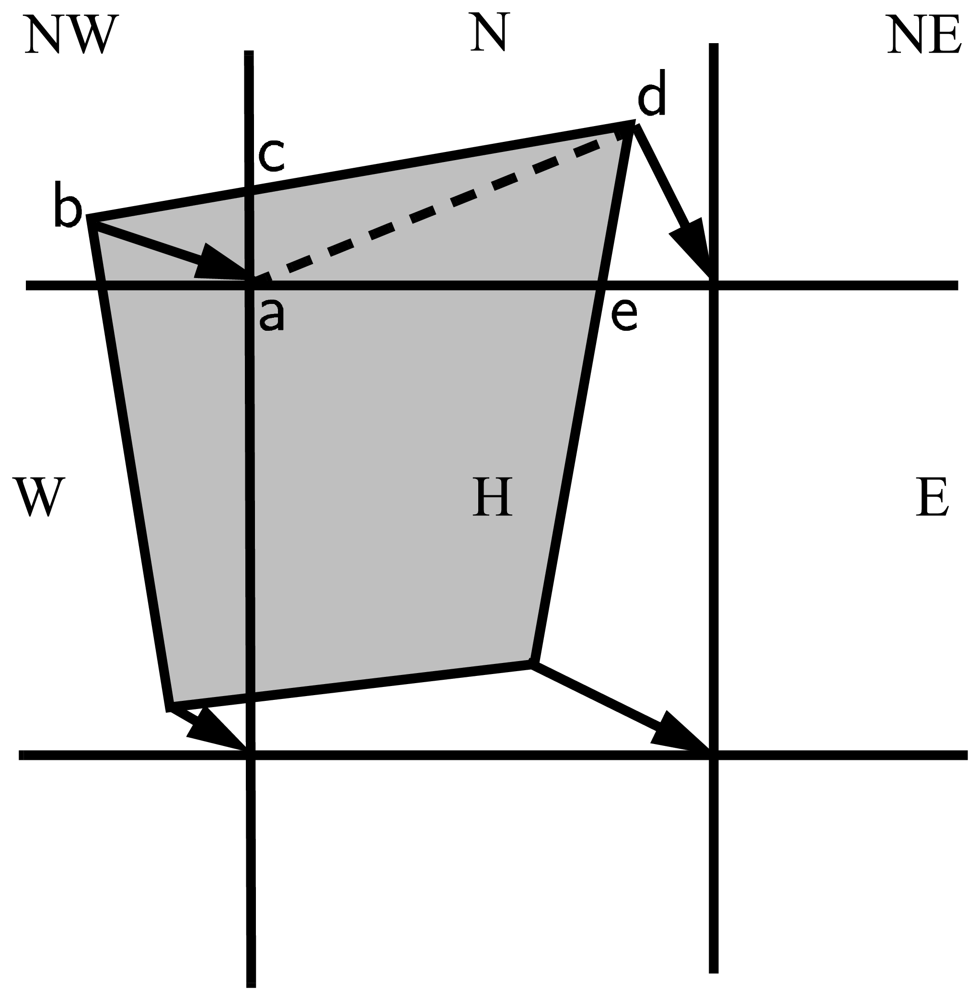
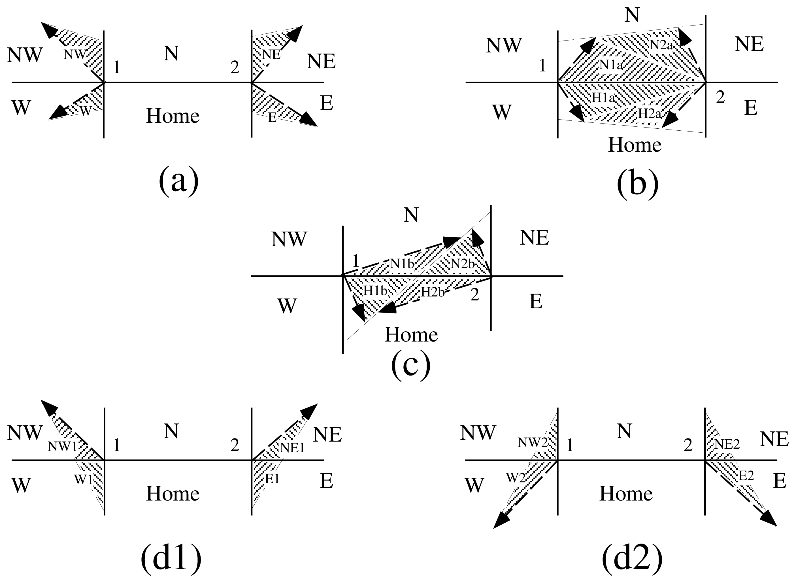

:tocdepth: 3

.. _horiz-trans:

Horizontal Transport
====================

We wish to solve the continuity or transport equation
(Equation :eq:`transport-ai`) for the fractional ice area in each
thickness category :math:`n`. Equation :eq:`transport-ai` describes
the conservation of ice area under horizontal transport. It is obtained
from Equation :eq:`transport-g` by discretizing :math:`g` and neglecting the
second and third terms on the right-hand side, which are treated
separately (As described in the `Icepack Documentation <https://cice-consortium-icepack.readthedocs.io/en/master/science_guide/index.html>`_).

There are similar conservation equations for ice volume
(Equation :eq:`transport-vi`), snow volume (Equation :eq:`transport-vs`), ice
energy and snow energy:

.. math::
   \frac{\partial e_{ink}}{\partial t} + \nabla \cdot (e_{ink} {\bf u}) = 0,
   :label: transport-ei

.. math::
   \frac{\partial e_{snk}}{\partial t} + \nabla \cdot (e_{snk} {\bf u}) = 0.
   :label: transport-es

By default, ice and snow are assumed to have constant densities, so that
volume conservation is equivalent to mass conservation. Variable-density
ice and snow layers can be transported conservatively by defining
tracers corresponding to ice and snow density, as explained in the
introductory comments in **ice\_transport\_remap.F90**. Prognostic
equations for ice and/or snow density may be included in future model
versions but have not yet been implemented.

One transport scheme is available, the incremental
remapping scheme of :cite:`Dukowicz00` as modified for sea ice by
:cite:`Lipscomb04`. The remapping scheme has several desirable features:

-  It conserves the quantity being transported (area, volume, or
   energy).

-  It is non-oscillatory; that is, it does not create spurious ripples
   in the transported fields.

-  It preserves tracer monotonicity. That is, it does not create new
   extrema in the thickness and enthalpy fields; the values at
   time \ :math:`m+1` are bounded by the values at time \ :math:`m`.

-  It is second-order accurate in space and therefore is much less
   diffusive than first-order schemes (e.g., upwind). The accuracy may
   be reduced locally to first order to preserve monotonicity.

-  It is efficient for large numbers of categories or tracers. Much of
   the work is geometrical and is performed only once per grid cell
   instead of being repeated for each quantity being transported.

The time step is limited by the requirement that trajectories projected
backward from grid cell corners are confined to the four surrounding
cells; this is what is meant by incremental remapping as opposed to
general remapping. This requirement leads to a CFL-like condition,

.. math::
   {\max|{\bf u}|\Delta t\over\Delta x}
   \leq 1.

For highly divergent velocity fields the maximum time step must be
reduced by a factor of two to ensure that trajectories do not cross.
However, ice velocity fields in climate models usually have small
divergences per time step relative to the grid size.

The remapping algorithm can be summarized as follows:

#. Given mean values of the ice area and tracer fields in each grid
   cell, construct linear approximations of these fields. Limit the
   field gradients to preserve monotonicity.

#. Given ice velocities at grid cell corners, identify departure regions
   for the fluxes across each cell edge. Divide these departure regions
   into triangles and compute the coordinates of the triangle vertices.

#. Integrate the area and tracer fields over the departure triangles to
   obtain the area, volume, and energy transported across each cell
   edge.

#. Given these transports, update the state variables.

Since all scalar fields are transported by the same velocity field, step
(2) is done only once per time step. The other three steps are repeated
for each field in each thickness category. These steps are described
below.

After the transport calculation, the sum of ice and open water areas within a 
grid cell may not add up to 1. The mechanical deformation parameterization in 
`Icepack <https://cice-consortium-icepack.readthedocs.io/en/master/science_guide/index.html>`_ 
corrects this issue by ridging the ice and creating open water 
such that the ice and open water areas again add up to 1.

.. _reconstruct:

*************************************
Reconstructing area and tracer fields
*************************************

First, using the known values of the state variables, the ice area and
tracer fields are reconstructed in each grid cell as linear functions of
:math:`x` and :math:`y`. For each field we compute the value at the cell
center (i.e., at the origin of a 2D Cartesian coordinate system defined
for that grid cell), along with gradients in the :math:`x` and :math:`y`
directions. The gradients are limited to preserve monotonicity. When
integrated over a grid cell, the reconstructed fields must have mean
values equal to the known state variables, denoted by :math:`\bar{a}`
for fractional area, :math:`\tilde{h}` for thickness, and
:math:`\hat{q}` for enthalpy. The mean values are not, in general, equal
to the values at the cell center. For example, the mean ice area must
equal the value at the centroid, which may not lie at the cell center.

Consider first the fractional ice area, the analog to fluid density
:math:`\rho` in :cite:`Dukowicz00`. For each thickness category
we construct a field :math:`a({\bf r})` whose mean is :math:`\bar{a}`,
where :math:`{\bf r} =
(x,y)` is the position vector relative to the cell center. That is, we
require

.. math::
   \int_A a \, dA = {\bar a} \, A,
   :label: mean-area

where :math:`A=\int_A dA` is the grid cell area.
Equation :eq:`mean-area` is satisfied if :math:`a({\bf r})` has the
form

.. math::
   a({\bf r}) = \bar{a} + \alpha_a \left<\nabla a\right> \cdot ({\bf r}-{\bf \bar{r}}),
   :label: recon-area

where :math:`\left<\nabla a\right>` is a centered estimate of the area
gradient within the cell, :math:`\alpha_a` is a limiting coefficient
that enforces monotonicity, and :math:`{\bf \bar{r}}` is the cell
centroid:

.. math:: 
   {\bf \bar{r}} = {1\over A} \int_A {\bf r} \, dA.

It follows from Equation :eq:`recon-area` that the ice area at the cell center
(:math:`\mathbf{r} = 0`) is

.. math:: 
   a_c = \bar{a} - a_x \overline{x} - a_y \overline{y},

where :math:`a_x = \alpha_a (\partial a / \partial x)` and
:math:`a_y = \alpha_a (\partial a / \partial y)` are the limited
gradients in the :math:`x` and :math:`y` directions, respectively, and
the components of :math:`{\bf \bar{r}}`,
:math:`\overline{x} = \int_A x \, dA / A` and
:math:`\overline{y} = \int_A y \, dA / A`, are evaluated using the
triangle integration formulas described in
Section :ref:`integ-flux`. These means, along with higher-order
means such as :math:`\overline{x^2}`, :math:`\overline{xy}`, and
:math:`\overline{y^2}`, are computed once and stored.

Next consider the ice and snow thickness and enthalpy fields. Thickness
is analogous to the tracer concentration :math:`T` in
:cite:`Dukowicz00`, but there is no analog in
:cite:`Dukowicz00` to the enthalpy. The reconstructed ice or snow
thickness :math:`h({\bf r})` and enthalpy :math:`q(\mathbf{r})` must
satisfy

.. math::
   \int_A a \, h \, dA       =  \bar{a} \, \tilde{h} \, A,
   :label: mean-thickness

.. math::
   \int_A a \, h \, q \, dA  =  \bar{a} \, \tilde{h} \, \hat{q} \, A,
   :label: mean-enthalpy

where :math:`\tilde{h}=h(\tilde{\bf r})` is the thickness at the center
of ice area, and :math:`\hat{q}=q(\hat{\bf r})` is the enthalpy at the
center of ice or snow volume. Equations :eq:`mean-thickness` and
:eq:`mean-enthalpy` are satisfied when :math:`h({\bf r})` and
:math:`q({\bf r})` are given by

.. math::
   h({\bf r}) = \tilde{h} + \alpha_h \left<\nabla h\right> \cdot
                                        ({\bf r}-{\bf \tilde{r}}),
   :label: recon-thickness

.. math::
   q({\bf r}) = \hat{q} + \alpha_q \left<\nabla q\right> \cdot
                                      ({\bf r}-{\bf \hat{r}}),
   :label: recon-enthalpy

where :math:`\alpha_h` and :math:`\alpha_q` are limiting coefficients.
The center of ice area, :math:`{\bf\tilde{r}}`, and the center of ice or
snow volume, :math:`{\bf \hat{r}}`, are given by

.. math:: 
   {\bf \tilde{r}} = {1\over\bar{a} \, A}\int_A a \, {\bf r} \, dA,

.. math::
   {\bf \hat{r}} =
           {1\over\bar{a} \, \tilde{h} \, A}\int_A a \, h \, {\bf r} \, dA.

Evaluating the integrals, we find that the components of
:math:`{\bf \tilde{r}}` are

.. math::
   \tilde{x} = \frac{a_c \overline{x}+a_x \overline{x^2}+a_y \overline{xy}}
                      {\bar{a}},

.. math::
   \tilde{y} = \frac{a_c \overline{y}+a_x \overline{xy} +a_y \overline{y^2}}
                      {\bar{a}},

and the components of :math:`{\bf \hat{r}}` are

.. math::
   \hat{x} = \frac { c_1 \overline{x}     + c_2 \overline{x^2}
                      + c_3 \overline{xy}    + c_4 \overline{x^3}
                      + c_5 \overline{x^2 y} + c_6 \overline{x y^2} }
                      {\bar{a} \, \tilde{h}},

.. math::
   \hat{y} = \frac { c_1 \overline{y}     + c_2 \overline{xy}
                      + c_3 \overline{y^2}   + c_4 \overline{x^2 y}
                      + c_5 \overline{x y^2} + c_6 \overline{y^3}   }
                       {\bar{a} \, \tilde{h}},

where

.. math::
   \begin{aligned}
    c_1 & \equiv & a_c h_c,            \\
    c_2 & \equiv & a_c h_x + a_x h_c,  \\
    c_3 & \equiv & a_c h_y + a_y h_c,  \\
    c_4 & \equiv & a_x h_x,            \\
    c_5 & \equiv & a_x h_y + a_y h_x,  \\
    c_6 & \equiv & a_y h_y.\end{aligned}

From Equation :eq:`recon-thickness` and Equation :eq:`recon-enthalpy`, 
the thickness and enthalpy at the cell center are given by

.. math:: 
   h_c = \tilde{h} - h_x \tilde{x} - h_y \tilde{y},

.. math:: 
   q_c = \hat{q}   - q_x \hat{x}   - q_y \hat{y},

where :math:`h_x`, :math:`h_y`, :math:`q_x` and :math:`q_y` are the
limited gradients of thickness and enthalpy. The surface temperature is
treated the same way as ice or snow thickness, but it has no associated
enthalpy. Tracers obeying conservation equations of the form Equation
:eq:`transport-viT` and Equation :eq:`transport-vsT` are treated in analogy
to ice and snow enthalpy, respectively.

We preserve monotonicity by van Leer limiting. If
:math:`\bar{\phi}(i,j)` denotes the mean value of some field in grid
cell :math:`(i,j)`, we first compute centered gradients of
:math:`\bar{\phi}` in the :math:`x` and :math:`y` directions, then check
whether these gradients give values of :math:`\phi` within cell
:math:`(i,j)` that lie outside the range of :math:`\bar{\phi}` in the
cell and its eight neighbors. Let :math:`\bar{\phi}_{\max}` and
:math:`\bar{\phi}_{\min}` be the maximum and minimum values of
:math:`\bar{\phi}` over the cell and its neighbors, and let
:math:`\phi_{\max}` and :math:`\phi_{\min}` be the maximum and minimum
values of the reconstructed :math:`\phi` within the cell. Since the
reconstruction is linear, :math:`\phi_{\max}` and :math:`\phi_{\min}`
are located at cell corners. If :math:`\phi_{\max} > \bar{\phi}_{\max}`
or :math:`\phi_{\min} < \bar{\phi}_{\min}`, we multiply the unlimited
gradient by :math:`\alpha = \min(\alpha_{\max}, \alpha_{\min})`, where

.. math::
   \alpha_{\max} =
     (\bar{\phi}_{\max} - \bar{\phi}) / (\phi_{\max} -\bar{\phi}),

.. math::
   \alpha_{\min} =
     (\bar{\phi}_{\min} - \bar{\phi}) / (\phi_{\min} -\bar{\phi}).

Otherwise the gradient need not be limited.

Earlier versions of CICE (through v3.14) computed gradients in physical
space. Starting in v4.0, gradients are computed in a scaled space
in which each grid cell has sides of unit length. The origin is at the
cell center, and the four vertices are located at (0.5, 0.5),
(-0.5,0.5),(-0.5, -0.5) and (0.5, -0.5). In this coordinate system,
several of the above grid-cell-mean quantities vanish (because they are
odd functions of x and/or y), but they have been retained in the code
for generality.

.. _loc-dep-triangles:

****************************
Locating departure triangles
****************************

The method for locating departure triangles is discussed in detail by
:cite:`Dukowicz00`. The basic idea is illustrated in
:ref:`fig-deparr`, which shows a shaded quadrilateral departure region
whose contents are transported to the target or home grid cell, labeled
:math:`H`. The neighboring grid cells are labeled by compass directions:
:math:`NW`, :math:`N`, :math:`NE`, :math:`W`, and :math:`E`. The four
vectors point along the velocity field at the cell corners, and the
departure region is formed by joining the starting points of these
vectors. Instead of integrating over the entire departure region, it is
convenient to compute fluxes across cell edges. We identify departure
regions for the north and east edges of each cell, which are also the
south and west edges of neighboring cells. Consider the north edge of
the home cell, across which there are fluxes from the neighboring
:math:`NW` and :math:`N` cells. The contributing region from the
:math:`NW` cell is a triangle with vertices :math:`abc`, and that from
the :math:`N` cell is a quadrilateral that can be divided into two
triangles with vertices :math:`acd` and :math:`ade`. Focusing on
triangle :math:`abc`, we first determine the coordinates of vertices
:math:`b` and :math:`c` relative to the cell corner (vertex :math:`a`),
using Euclidean geometry to find vertex :math:`c`. Then we translate the
three vertices to a coordinate system centered in the :math:`NW` cell.
This translation is needed in order to integrate fields
(Section :ref:`integ-flux`) in the coordinate system where they
have been reconstructed (Section :ref:`reconstruct`). Repeating
this process for the north and east edges of each grid cell, we compute
the vertices of all the departure triangles associated with each cell
edge.

.. _fig-deparr:

 
   Departure Region

Figure :ref:`fig-deparr` shows that in incremental remapping, conserved quantities are
remapped from the shaded departure region, a quadrilateral formed by
connecting the backward trajectories from the four cell corners, to
the grid cell labeled :math:`H`. The region fluxed across the north
edge of cell :math:`H` consists of a triangle (:math:`abc`) in the
:math:`NW` cell and a quadrilateral (two triangles, :math:`acd` and
:math:`ade`) in the :math:`N` cell.

Figure :ref:`fig-triangles`, reproduced from :cite:`Dukowicz00`, shows
all possible triangles that can contribute fluxes across the north edge
of a grid cell. There are 20 triangles, which can be organized into five
groups of four mutually exclusive triangles as shown in
:ref:`tab-triangle`. In this table, :math:`(x_1, y_1)` and
:math:`(x_2,y_2)` are the Cartesian coordinates of the departure points
relative to the northwest and northeast cell corners, respectively. The
departure points are joined by a straight line that intersects the west
edge at :math:`(0,y_a)` relative to the northwest corner and intersects
the east edge at :math:`(0,y_b)` relative to the northeast corner. The
east cell triangles and selecting conditions are identical except for a
rotation through 90 degrees.

.. _fig-triangles:

   Triangles

Table :ref:`tab-triangle` show the evaluation of contributions from the 20
triangles across the north cell edge. The coordinates :math:`x_1`,
:math:`x_2`, :math:`y_1`, :math:`y_2`, :math:`y_a`, and :math:`y_b` are
defined in the text. We define :math:`\tilde{y}_1 =
y_1` if :math:`x_1>0`, else :math:`\tilde{y}_1 = y_a`. Similarly,
:math:`\tilde{y}_2
= y_2` if :math:`x_2<0`, else :math:`\tilde{y}_2 = y_b`.

.. _tab-triangle:

.. table:: Triangular Contributions

   +------------+------------+--------------------------------------------------------+----+
   | Triangle   | Triangle   | Selecting logical condition                            |    |
   | group      | label      |                                                        |    |
   +------------+------------+--------------------------------------------------------+----+
   | 1          | NW         | :math:`y_a>0` and :math:`y_1\geq0` and :math:`x_1<0`   |    |
   +------------+------------+--------------------------------------------------------+----+
   |            | NW1        | :math:`y_a<0` and :math:`y_1\geq0` and :math:`x_1<0`   |    |
   +------------+------------+--------------------------------------------------------+----+
   |            | W          | :math:`y_a<0` and :math:`y_1<0` and :math:`x_1<0`      |    |
   +------------+------------+--------------------------------------------------------+----+
   |            | W2         | :math:`y_a>0` and :math:`y_1<0` and :math:`x_1<0`      |    |
   +------------+------------+--------------------------------------------------------+----+
   +------------+------------+--------------------------------------------------------+----+
   | 2          | NE         | :math:`y_b>0` and :math:`y_2\geq0` and :math:`x_2>0`   |    |
   +------------+------------+--------------------------------------------------------+----+
   |            | NE1        | :math:`y_b<0` and :math:`y_2\geq0` and :math:`x_2>0`   |    |
   +------------+------------+--------------------------------------------------------+----+
   |            | E          | :math:`y_b<0` and :math:`y_2<0` and :math:`x_2>0`      |    |
   +------------+------------+--------------------------------------------------------+----+
   |            | E2         | :math:`y_b>0` and :math:`y_2<0` and :math:`x_2>0`      |    |
   +------------+------------+--------------------------------------------------------+----+
   +------------+------------+--------------------------------------------------------+----+
   | 3          | W1         | :math:`y_a<0` and :math:`y_1\geq0` and :math:`x_1<0`   |    |
   +------------+------------+--------------------------------------------------------+----+
   |            | NW2        | :math:`y_a>0` and :math:`y_1<0` and :math:`x_1<0`      |    |
   +------------+------------+--------------------------------------------------------+----+
   |            | E1         | :math:`y_b<0` and :math:`y_2\geq0` and :math:`x_2>0`   |    |
   +------------+------------+--------------------------------------------------------+----+
   |            | NE2        | :math:`y_b>0` and :math:`y_2<0` and :math:`x_2>0`      |    |
   +------------+------------+--------------------------------------------------------+----+
   +------------+------------+--------------------------------------------------------+----+
   | 4          | H1a        | :math:`y_a y_b\geq 0` and :math:`y_a+y_b<0`            |    |
   +------------+------------+--------------------------------------------------------+----+
   |            | N1a        | :math:`y_a y_b\geq 0` and :math:`y_a+y_b>0`            |    |
   +------------+------------+--------------------------------------------------------+----+
   |            | H1b        | :math:`y_a y_b<0` and :math:`\tilde{y}_1<0`            |    |
   +------------+------------+--------------------------------------------------------+----+
   |            | N1b        | :math:`y_a y_b<0` and :math:`\tilde{y}_1>0`            |    |
   +------------+------------+--------------------------------------------------------+----+
   +------------+------------+--------------------------------------------------------+----+
   | 5          | H2a        | :math:`y_a y_b\geq 0` and :math:`y_a+y_b<0`            |    |
   +------------+------------+--------------------------------------------------------+----+
   |            | N2a        | :math:`y_a y_b\geq 0` and :math:`y_a+y_b>0`            |    |
   +------------+------------+--------------------------------------------------------+----+
   |            | H2b        | :math:`y_a y_b<0` and :math:`\tilde{y}_2<0`            |    |
   +------------+------------+--------------------------------------------------------+----+
   |            | N2b        | :math:`y_a y_b<0` and :math:`\tilde{y}_2>0`            |    |
   +------------+------------+--------------------------------------------------------+----+
   +------------+------------+--------------------------------------------------------+----+

This scheme was originally designed for rectangular grids. Grid cells in
CICE actually lie on the surface of a sphere and must be projected onto
a plane. The projection used in CICE maps each grid cell to a square
with sides of unit length. Departure triangles across a given cell edge
are computed in a coordinate system whose origin lies at the midpoint of
the edge and whose vertices are at (-0.5, 0) and (0.5, 0). Intersection
points are computed assuming Cartesian geometry with cell edges meeting
at right angles. Let CL and CR denote the left and right vertices, which
are joined by line CLR. Similarly, let DL and DR denote the departure
points, which are joined by line DLR. Also, let IL and IR denote the
intersection points (0, :math:`y_a`) and (0, :math:`y_b`) respectively,
and let IC = (:math:`x_c`, 0) denote the intersection of CLR and DLR. It
can be shown that :math:`y_a`, :math:`y_b`, and :math:`x_c` are given by

.. math::
   \begin{aligned}
    y_a &=& {x_{CL} (y_{DM}-y_{DL}) + x_{DM}y_{DL} - x_{DL}y_{DM}}\over{x_{DM} - x_{DL}}, \\
    y_b &=& {x_{CR} (y_{DR}-y_{DM}) - x_{DM}y_{DR} + x_{DR}y_{DM}}\over{x_{DR} - x_{DM}}, \\
    x_c &=& x_{DL} - y_{DL} \left({x_{DR} - x_{DL}} \over y_{DR} - y_{DL}\right)
    \end{aligned}

Each departure triangle is defined by three of the seven points (CL,
CR, DL, DR, IL, IR, IC).

Given a 2D velocity field **u**, the divergence
:math:`\nabla\cdot{\bf u}` in a given grid cell can be computed from the
local velocities and written in terms of fluxes across each cell edge:

.. math::
    \nabla\cdot{\bf u} = {1\over A}\left[\left({u_{NE}+u_{SE}}\over 2\right)L_E + \left({u_{NW}+u_{SW}}\over 2\right)L_W + \left({u_{NE}+u_{NW}}\over 2\right)L_N + \left({u_{SE}+u_{SW}}\over 2\right)L_S \right],
   :label: divergence

where :math:`L` is an edge length and the indices :math:`N, S, E, W`
denote compass directions. Equation :eq:`divergence` is equivalent to
the divergence computed in the EVP dynamics (Section :ref:`dynam`).
In general, the fluxes in this expression are not equal to those implied
by the above scheme for locating departure regions. For some
applications it may be desirable to prescribe the divergence by
prescribing the area of the departure region for each edge. This can be
done in CICE 4.0 by setting `l\_fixed\_area` = true in
**ice\_transport\_driver.F90** and passing the prescribed departure
areas (`edgearea\_e` and `edgearea\_n`) into the remapping routine. An extra
triangle is then constructed for each departure region to ensure that
the total area is equal to the prescribed value. This idea was suggested
and first implemented by Mats Bentsen of the Nansen Environmental and
Remote Sensing Center (Norway), who applied an earlier version of the
CICE remapping scheme to an ocean model. The implementation in CICE v4.0
is somewhat more general, allowing for departure regions lying on both
sides of a cell edge. The extra triangle is constrained to lie in one
but not both of the grid cells that share the edge. Since this option
has yet to be fully tested in CICE, the current default is
`l\_fixed\_area` = false.

We made one other change in the scheme of :cite:`Dukowicz00` for
locating triangles. In their paper, departure points are defined by
projecting cell corner velocities directly backward. That is,

.. math::
   \mathbf{x_D} = -\mathbf{u} \, \Delta t,
   :label: departure_points
  
where :math:`\mathbf{x}_D` is the location of the departure point
relative to the cell corner and :math:`\mathbf{u}` is the velocity at
the corner. This approximation is only first-order accurate. Accuracy
can be improved by estimating the velocity at the midpoint of the
trajectory.

.. _integ-flux:

******************
Integrating fields
******************

Next, we integrate the reconstructed fields over the departure triangles
to find the total area, volume, and energy transported across each cell
edge. Area transports are easy to compute since the area is linear in
:math:`x` and :math:`y`. Given a triangle with vertices
:math:`\mathbf{x_i} = (x_i,y_i)`, :math:`i\in\{1,2,3\}`, the triangle
area is

.. math::
   A_T = \frac{1}{2}\left|(x_2-x_1)(y_3-y_1) -
   (y_2-y_1)(x_3-x_1)\right|.

The integral :math:`F_a` of any linear function :math:`f(\mathbf{r})`
over a triangle is given by

.. math::
    F_a = A_T f(\mathbf{x_0}),
   :label: I1

where :math:`\mathbf{x}_0 = (x_0,y_0)` is the triangle midpoint,

.. math::
   \mathbf{x}_0={1\over 3}\sum_{i=1}^3\mathbf{x}_i.

To compute the area transport, we evaluate the area at the midpoint,

.. math:: 
   a(\mathbf{x}_0)  = a_c + a_x x_0 + a_y y_0,

and multiply by :math:`A_T`. By convention, northward and eastward
transport is positive, while southward and westward transport is
negative.

Equation :eq:`I1` cannot be used for volume transport, because the
reconstructed volumes are quadratic functions of position. (They are
products of two linear functions, area and thickness.) The integral of a
quadratic polynomial over a triangle requires function evaluations at
three points,

.. math::
    F_h = \frac{A_T}{3}\sum_{i=1}^3 f\left({\mathbf x}^\prime_i\right),
    :label: I2

where :math:`\mathbf{x}_i^\prime = (\mathbf{x}_0+\mathbf{x}_i)/2` are
points lying halfway between the midpoint and the three vertices.
:cite:`Dukowicz00` use this formula to compute transports of the
product :math:`\rho \, T`, which is analogous to ice volume. Equation
:eq:`I2` does not work for ice and snow energies, which are cubic
functions—products of area, thickness, and enthalpy. Integrals of a
cubic polynomial over a triangle can be evaluated using a four-point
formula :cite:`Stroud71`:

.. math::
    F_q = A_T \left[ -\frac{9}{16} f(\mathbf{x}_0) +
                 \frac{25}{48} \sum_{i=1}^3 f(\mathbf{x}_i^{\prime\prime})\right]
    :label: I3

where :math:`\mathbf{x_i}^{\prime\prime}=(3 \mathbf{x}_0 + 2
\mathbf{x}_i)/5`. To evaluate functions at specific points, we must
compute many products of the form :math:`a({\bf x}) \, h({\bf x})` and
:math:`a({\bf x}) \, h({\bf x}) \, q({\bf x})`, where each term in the
product is the sum of a cell-center value and two displacement terms. In
the code, the computation is sped up by storing some sums that are used
repeatedly.

.. _updating-state-var:

************************
Updating state variables
************************

Finally, we compute new values of the state variables in each ice
category and grid cell. The new fractional ice areas
:math:`a_{in}^\prime(i,j)` are given by

.. math::
   a_{in}^\prime(i,j) = a_{in}(i,j) +
                 \frac{F_{aE}(i-1,j) - F_{aE}(i,j)
                     + F_{aN}(i,j-1) - F_{aN}(i,j)}
                      {A(i,j)}
   :label: new-area

where :math:`F_{aE}(i,j)` and :math:`F_{aN}(i,j)` are the area
transports across the east and north edges, respectively, of cell
:math:`(i,j)`, and :math:`A(i,j)` is the grid cell area. All transports
added to one cell are subtracted from a neighboring cell; thus
Equation :eq:`new-area` conserves total ice area.

The new ice volumes and energies are computed analogously. New
thicknesses are given by the ratio of volume to area, and enthalpies by
the ratio of energy to volume. Tracer monotonicity is ensured because

.. math:: 
   h^\prime = {\int_A a \, h \, dA \over \int_A a \, dA},

.. math:: 
   q^\prime  = {\int_A a \, h \, q\,dA \over \int_A a \, h \ dA},

where :math:`h^\prime` and :math:`q^\prime` are the new-time thickness
and enthalpy, given by integrating the old-time ice area, volume, and
energy over a Lagrangian departure region with area :math:`A`. That is,
the new-time thickness and enthalpy are weighted averages over old-time
values, with non-negative weights :math:`a` and :math:`ah`. Thus the
new-time values must lie between the maximum and minimum of the old-time
values.
