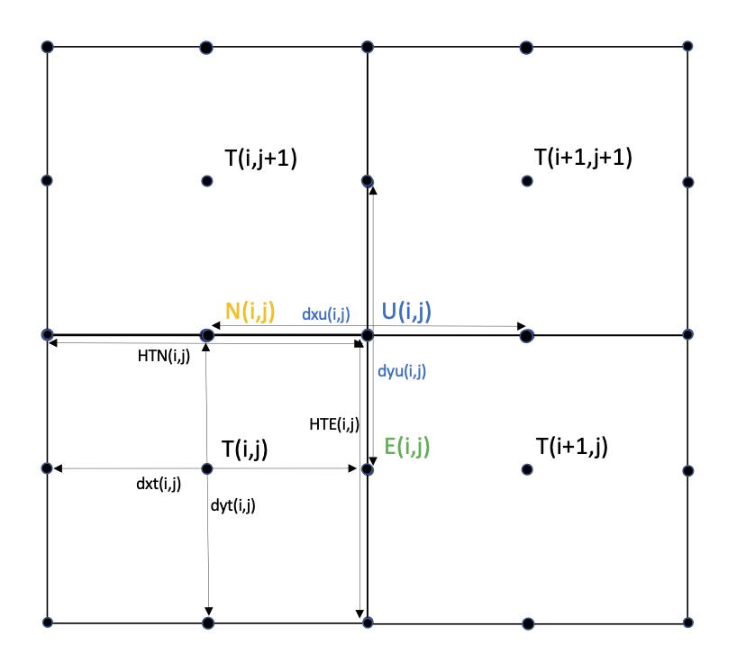

:tocdepth: 3

Implementation
========================

CICE is written in FORTRAN90 and runs on platforms using UNIX, LINUX,
and other operating systems. The current coding standard is Fortran2003
with use of Fortran2008 feature CONTIGUOUS in the 1d evp solver.
The code is based on a two-dimensional 
horizontal orthogonal grid that is broken into two-dimensional horizontal
blocks and parallelized over blocks 
with MPI and OpenMP threads.  The code also includes some optimizations
for vector architectures.

CICE consists of source code under the **cicecore/** directory that supports
model dynamics and top-level control.  The column physics source code is
under the **icepack/** directory and this is implemented as a submodule in
github from a separate repository (`CICE <https://github.com/CICE-Consortium/Icepack>`_)
There is also a **configuration/** directory that includes scripts
for configuring CICE cases.

.. _coupling:

.. _dirstructure:

~~~~~~~~~~~~~~~~~~~
Directory structure
~~~~~~~~~~~~~~~~~~~

The present code distribution includes source code and scripts.  Forcing
data is available from the ftp site.  The directory structure of CICE is
as follows

**COPYRIGHT.pdf**
  copyright notice

**LICENSE.pdf**
  license for using and sharing the code

**DistributionPolicy.pdf**
  policy for using and sharing the code

**README.md**
  basic information and pointers

**icepack/**
  the Icepack module.  The icepack subdirectory includes Icepack specific scripts, drivers, and documentation.  CICE only uses the columnphysics source code under **icepack/columnphysics/**.

**cicecore/**
  CICE source code

**cicecore/cicedyn/**
  routines associated with the dynamics core

**cicecore/drivers/**
  top-level CICE drivers and coupling layers

**cicecore/shared/**
  CICE source code that is independent of the dynamical core

**cicecore/version.txt**
  file that indicates the CICE model version.

**configuration/scripts/**
  support scripts, see :ref:`dev_scripts`

**doc/**
  documentation

**cice.setup**
  main CICE script for creating cases

**dot files**
  various files that begin with . and store information about the git repository or other tools.

A case (compile) directory is created upon initial execution of the script 
**cice.setup** at the user-specified location provided after the -c flag. 
Executing the command ``./cice.setup -h`` provides helpful information for 
this tool.

~~~~~~~~~~~~~~~~~~~~~~~~~~~~~~~~~~~
Grid, boundary conditions and masks
~~~~~~~~~~~~~~~~~~~~~~~~~~~~~~~~~~~

The spatial discretization of the original implementation is specialized 
for a generalized orthogonal B-grid as in :cite:`Murray96` or
:cite:`Smith95`. Figure :ref:`fig-Bgrid` is a schematic of CICE 
B-grid. This cell with the tracer point :math:`t(i,j)` in the middle
is referred to as T-cell. The ice and snow area, volume and energy are
given at the t-point. The velocity :math:`{\bf u}(i,j)`
associated with :math:`t(i,j)` is defined in the northeast (NE)
corner. The other corners of the T-cell are northwest (NW), southwest
(SW) and southeast (SE). The lengths of the four edges of the T-cell
are respectively HTN, HTW, HTS and HTE for the northern, western,
southern and eastern edges. The lengths of the T-cell through the
middle are respectively dxT and dyT along the x and y axis. 

We also occasionally refer to “U-cells,” which are centered on the
northeast corner of the corresponding T-cells and have velocity in the
center of each. The velocity components are aligned along grid lines.

The internal ice stress tensor takes four different values within a grid
cell with the B-grid implementation; bilinear approximations are used for the stress tensor and the ice
velocity across the cell, as described in :cite:`Hunke02`.
This tends to avoid the grid decoupling problems associated with the
B-grid.

.. _fig-Bgrid:

   Schematic of CICE B-grid. 

The ability to solve on the C and CD grids was added later. With the C-grid, 
the u velocity points are located on the E edges and the v velocity points 
are located on the N edges of the T cell rather than at the T cell corners. 
On the CD-grid, the u and v velocity points are located on both the N and E edges. 
To support this capability, N and E grids were added to the existing T and U grids, 
and the N and E grids are defined at the northern and eastern edge of the T cell. 
This is shown in Figure :ref:`fig-Cgrid`.

.. _fig-Cgrid:

   Schematic of CICE CD-grid. 

The user has several ways to initialize the grid, which can be read from 
files or created internally. The *rectgrid* code creates a regular rectangular 
grid (use the namelist option ``grid_type='rectangular'``). The *popgrid* and *popgrid_nc* 
code reads grid lengths and other parameters for a nonuniform grid (including tripole
and regional grids). The *mom_grid* code reads grids for a nonuniform grid defined 
in the mom mosaic (supergrid) format.

For the *popgrid* formats, the input files **grid_gx3.bin** and **kmt_gx3.bin** contain the
:math:`\left<3^\circ\right>` POP grid and land mask;
**grid_gx1.bin** and **kmt_gx1.bin** contain the
:math:`\left<1^\circ\right>` grid and land mask, and **grid_tx1.bin** 
and **kmt_tx1.bin** contain the :math:`\left<1^\circ\right>` POP 
tripole grid and land mask. These are binary unformatted, direct access,
Big Endian files. 

The are also input files in netcdf format for the **gx3** grid,
(**grid_gx3.nc** and **kmt_gx3.nc**) which can serve as a template for defining
other grids. At a minimum the grid file needs to to contain ULAT, ULON, HTN, HTE
and ANGLE variables. If the variables exist, ANGLET, TLON and TLAT will also be 
read from a netcdf grid file, otherwise they will be derived internally. 

For the *mom_nc* formats (``grid_format='mom_nc'``), a grid file following
the MOM supergrid convention as generated by `FRE-NCTools <https://github.com/NOAA-GFDL/FRE-NCtools>`_ 
and described in `this short summary <https://gist.github.com/adcroft/c1e207024fe1189b43dddc5f1fe7dd6c>`_ 
is required. CICE derives the required grid variables to match the grid implementation 
in MOM6. All lat/lon and grid lengths are read from the file. Cell areas for A & B grid 
cells are loaded from the file, and cell areas for C grid cells are calculated internally.
Rotation angles for cells are also calculated interally. All calculations match the methods
used in MOM6 for consistency.

The kmt (mask) netcdf file is used with both pop netcdf and mom netcdf grids. 
It needs a variable named kmt or mask, set to 0 for land and 1 for ocean.

The input grid file for the B-grid and CD-grid is identical. 
Table :ref:`tab-gridvars` lists the primary prognostic grid variable names on the different grids.

.. _tab-gridvars:

.. table:: Primary CICE Prognostic Grid Variable Names

   +----------------+-------+-------+-------+-------+
   | variable       |   T   |   U   |   N   |   E   |
   +================+=======+=======+=======+=======+
   | longitude      |  TLON |  ULON |  NLON |  ELON |
   +----------------+-------+-------+-------+-------+
   | latitude       |  TLAT |  ULAT |  NLAT |  ELAT |
   +----------------+-------+-------+-------+-------+
   | dx             |  dxT  |  dxU  |  dxN  |  dxE  |
   +----------------+-------+-------+-------+-------+
   | dy             |  dyT  |  dyU  |  dyN  |  dyE  |
   +----------------+-------+-------+-------+-------+
   | area           | tarea | uarea | narea | earea |
   +----------------+-------+-------+-------+-------+
   | mask (logical) | tmask | umask | nmask | emask |
   +----------------+-------+-------+-------+-------+
   | mask (real)    |  hm   | uvm   | npm   | epm   |
   +----------------+-------+-------+-------+-------+

In CESM, the sea ice model may exchange coupling fluxes using a
different grid than the computational grid. This functionality is
activated using the namelist variable ``gridcpl_file``.

***********************
Grid domains and blocks
***********************

In general, the global gridded domain is
``nx_global`` :math:`\times`\ ``ny_global``, while the subdomains used in the
block distribution are ``nx_block`` :math:`\times`\ ``ny_block``. The
physical portion of a subdomain is indexed as [``ilo:ihi``, ``jlo:jhi``], with
nghost “ghost” or “halo" cells outside the domain used for boundary
conditions. These parameters are illustrated in :ref:`fig-grid` in one
dimension. The routines *global_scatter* and *global_gather*
distribute information from the global domain to the local domains and
back, respectively. If MPI is not being used for grid decomposition in
the ice model, these routines simply adjust the indexing on the global
domain to the single, local domain index coordinates. Although we
recommend that the user choose the local domains so that the global
domain is evenly divided, if this is not possible then the furthest east
and/or north blocks will contain nonphysical points (“padding”). These
points are excluded from the computation domain and have little effect
on model performance.  ``nghost`` is a hardcoded parameter in **ice_blocks.F90**.
While the halo code has been implemented to support arbitrary sized halos,
``nghost`` is set to 1 and has not been formally tested on larger halos.

.. _fig-grid:

   Grid parameters

Figure :ref:`fig-grid` shows the grid parameters for a sample one-dimensional, 20-cell
global domain decomposed into four local subdomains. Each local
domain has one ghost (halo) cell on each side, and the physical
portion of the local domains are labeled ``ilo:ihi``. The parameter
``nx_block`` is the total number of cells in the local domain, including
ghost cells, and the same numbering system is applied to each of the
four subdomains.

The user sets the ``NTASKS`` and ``NTHRDS`` settings in **cice.settings** 
and chooses a block size, ``block_size_x`` :math:`\times`\ ``block_size_y``,
and decomposition information ``distribution_type``, ``processor_shape``, 
and ``distribution_wgt`` in **ice_in**. 
This information is used to determine how the blocks are
distributed across the processors. The model is parallelized over blocks
for both MPI and OpenMP.  Some suggested combinations for these
parameters for best performance are given in Section :ref:`performance`.
The script **cice.setup** computes some default decompositions and layouts
but the user can override the defaults by manually changing the values in 
`ice_in`.  The number of blocks per processor can vary, and this is computed
internally when the namelist ``max_blocks=-1``.  ``max_blocks``
can also be set by the user, although this may use extra memory and the
model will abort if ``max_blocks`` is set too small for the decomposition.
At runtime, the model will print decomposition
information to the log file, and if the block size or max blocks is 
inconsistent with the task and thread size, the model will abort.  The 
code will also print a warning if the maximum number of blocks is too large. 
Although this is not fatal, it does use extra memory.

A loop at the end of routine *create_blocks* in module
**ice_blocks.F90** will print the locations for all of the blocks on
the global grid if the namelist variable ``debug_blocks`` is set to be true. Likewise, a similar loop at
the end of routine *create_local_block_ids* in module
**ice_distribution.F90** will print the processor and local block
number for each block. With this information, the grid decomposition
into processors and blocks can be ascertained. This ``debug_blocks`` variable 
should be used carefully as there may be hundreds or thousands of blocks to print
and this information should be needed only rarely. ``debug_blocks`` 
can be set to true using the
``debugblocks`` option with **cice.setup**. This information is
much easier to look at using a debugger such as Totalview.  There is also
an output field that can be activated in `icefields_nml`, ``f_blkmask``, 
that prints out the variable ``blkmask`` to the history file and 
which labels the blocks in the grid decomposition according to ``blkmask =
my_task + iblk/100``.

The namelist ``add_mpi_barriers`` can be set to ``.true.`` to help 
throttle communication for communication intensive configurations.  This
may slow the code down a bit.  These barriers have been added to
a few select locations, but it's possible others may be needed.  As a general
rule, ``add_mpi_barriers`` should be ``.false.``.

*************
Tripole grids
*************

The tripole grid is a device for constructing a global grid with a
normal south pole and southern boundary condition, which avoids placing
a physical boundary or grid singularity in the Arctic Ocean. Instead of
a single north pole, it has two “poles” in the north, both located on
land, with a line of grid points between them. This line of points is
called the “fold,” and it is the “top row” of the physical grid. One
pole is at the left-hand end of the top row, and the other is in the
middle of the row. The grid is constructed by “folding” the top row, so
that the left-hand half and the right-hand half of it coincide. Two
choices for constructing the tripole grid are available. The one first
introduced to CICE is called “U-fold”, which means that the poles and
the grid cells between them are U-cells on the grid. Alternatively the
poles and the cells between them can be grid T-cells, making a “T-fold.”
Both of these options are also supported by the OPA/NEMO ocean model,
which calls the U-fold an “f-fold” (because it uses the Arakawa C-grid
in which U-cells are on T-rows). The choice of tripole grid is given by
the namelist variable ``ns_boundary_type``, ‘tripole’ for the U-fold and
‘tripoleT’ for the T-fold grid.

In the U-fold tripole grid, the poles have U-index
:math:`nx\_global/2` and :math:`nx\_global` on the top U-row of the
physical grid, and points with U-index :math:`i` and :math:`nx\_global-i`
are coincident. Let the fold have U-row index :math:`n` on the global
grid; this will also be the T-row index of the T-row to the south of the
fold. There are ghost (halo) T- and U-rows to the north, beyond the
fold, on the logical grid. The point with index i along the ghost T-row
of index :math:`n+1` physically coincides with point
:math:`nx\_global-i+1` on the T-row of index :math:`n`. The
ghost U-row of index :math:`n+1` physically coincides with the U-row of
index :math:`n-1`.  In the schematics below, symbols A-H represent
grid points from 1:nx_global at a given j index and the setup of the
tripole seam is depicted within a few rows of the seam.

.. _tab-tripole:

.. table:: Tripole (u-fold) Grid Schematic
   :align: center

   +--------------+---------------------------------------+--------------+
   | global j     |                                       | global j     |
   | index        |          grid point IDs (i index)     | index source |
   +==============+====+====+====+====+====+====+====+====+==============+
   | ny_global+2  |  H |  G |  F |  E |  D |  C |  B |  A | ny_global-1  |
   +--------------+----+----+----+----+----+----+----+----+--------------+
   | ny_global+1  |  H |  G |  F |  E |  D |  C |  B |  A | ny_global    |
   +--------------+----+----+----+----+----+----+----+----+--------------+
   | ny_global    |  A |  B |  C |  D |  E |  F |  G |  H |              |
   +--------------+----+----+----+----+----+----+----+----+--------------+
   | ny_global-1  |  A |  B |  C |  D |  E |  F |  G |  H |              |
   +--------------+----+----+----+----+----+----+----+----+--------------+

In the T-fold tripole grid, the poles have T-index :math:`1` and and
:math:`nx\_global/2+1` on the top T-row of the physical grid, and
points with T-index :math:`i` and :math:`nx\_global-i+2` are
coincident. Let the fold have T-row index :math:`n` on the global grid.
It is usual for the northernmost row of the physical domain to be a
U-row, but in the case of the T-fold, the U-row of index :math:`n` is
“beyond” the fold; although it is not a ghost row, it is not physically
independent, because it coincides with U-row :math:`n-1`, and it
therefore has to be treated like a ghost row. Points i on U-row
:math:`n` coincides with :math:`nx\_global-i+1` on U-row
:math:`n-1`. There are still ghost T- and U-rows :math:`n+1` to the
north of U-row :math:`n`. Ghost T-row :math:`n+1` coincides with T-row
:math:`n-1`, and ghost U-row :math:`n+1` coincides with U-row
:math:`n-2`.

.. _tab-tripoleT:

.. table:: TripoleT (t-fold) Grid Schematic
   :align: center

   +--------------+--------------------------------------------+--------------+
   | global j     |                                            | global j     |
   | index        |          grid point IDs (i index)          | index source |
   +==============+====+====+====+====+====+====+====+====+====+==============+
   | ny_global+2  |    |  H |  G |  F |  E |  D |  C |  B |  A | ny_global-2  |
   +--------------+----+----+----+----+----+----+----+----+----+--------------+
   | ny_global+1  |    |  H |  G |  F |  E |  D |  C |  B |  A | ny_global-1  |
   +--------------+----+----+----+----+----+----+----+----+----+--------------+
   | ny_global    |  A | BH | CG | DF |  E | FD | GC | HB |    |              |
   +--------------+----+----+----+----+----+----+----+----+----+--------------+
   | ny_global-1  |  A |  B |  C |  D |  E |  F |  G |  H |    |              |
   +--------------+----+----+----+----+----+----+----+----+----+--------------+
   | ny_global-2  |  A |  B |  C |  D |  E |  F |  G |  H |    |              |
   +--------------+----+----+----+----+----+----+----+----+----+--------------+

The tripole grid thus requires two special kinds of treatment for
certain rows, arranged by the halo-update routines. First, within rows
along the fold, coincident points must always have the same value. This
is achieved by averaging them in pairs. Second, values for ghost rows
and the “quasi-ghost” U-row on the T-fold grid are reflected copies of
the coincident physical rows. Both operations involve the tripole
buffer, which is used to assemble the data for the affected rows.
Special treatment is also required in the scattering routine, and when
computing global sums one of each pair of coincident points has to be
excluded.  Halos of center, east, north, and northeast points are supported,
and each requires slightly different halo indexing across the tripole seam.

*****************
Rectangular grids
*****************

Rectangular test grids can be defined for CICE.  They are generated 
internally and defined by several namelist
settings including ``grid_type`` = ``rectangular``, ``nx_global``, ``ny_global``, 
``dx_rect``, ``dy_rect``, ``lonrefrect``, and ``latrefrect``.  Forcing and 
initial condition can be set via namelists ``atm_data_type``, ``ocn_data_type``,
``ice_data_type``, ``ice_data_conc``, ``ice_data_dist``.  Variable grid spacing
is also supported with the namelist settings ``scale_dxdy`` which turns on 
the option, and ``dxscale`` and ``dyscale`` which sets the variable grid scaling
factor.  Values of 1.0 will produced constant grid spacing.  For rectangular grids,
``lonrefrect`` and ``latrefrect`` define the lower left longitude and latitude
value of the grid, ``dx_rect`` and ``dy_rect`` define the base grid spacing, and
``dxscale`` and ``dyscale`` provide the grid space scaling.  The base spacing
is set in the center of the rectangular domain and the scaling is applied symetrically
outward as a multiplicative factor in the x and y directions.

Several predefined rectangular grids are available in CICE with
**cice.setup --grid** including ``gbox12``, ``gbox80``, ``gbox128``, and ``gbox180``
where 12, 80, 128, and 180 are the number of gridcells in each direction.
Several predefined options also exist, set with **cice.setup --set**, to
establish varied idealized configurations of box tests including ``box2001``, 
``boxadv``, ``boxchan``, ``boxchan1e``, ``boxchan1n``, ``boxnodyn``, ``boxrestore``, ``boxslotcyl``, and
``boxopen``, ``boxclosed``, and ``boxforcee``.  See **cice.setup --help** for a current 
list of supported settings.

**************
Vertical Grids
**************

The sea ice physics described in a single column or grid cell is contained in the Icepack
submodule, which can be run independently of the CICE model. Icepack includes a vertical
grid for the physics and a "bio-grid" for biogeochemistry, described in the Icepack
Documentation. History variables available for column output are ice and snow temperature, 
Tinz and Tsnz, and the ice salinity profile, Sinz. These variables also include thickness 
category as a fourth dimension. 

*******************
Boundary Conditions
*******************

Much of the infrastructure used in CICE, including the boundary
routines, is adopted from POP. The boundary routines perform boundary
communications among processors when MPI is in use and among blocks
whenever there is more than one block per processor.

Boundary conditions are defined by the ``ns_boundary_type`` and ``ew_boundary_type``
namelist inputs.  Valid values are ``open``, ``closed``, and ``cyclic``.  In addition,
``tripole`` and ``tripoleT`` are options for the ``ns_boundary_type``.
``closed`` imposes a land mask on the boundary with a two gridcell depth
and is only supported for rectangular grids.  In general,
where the boundary is land or where there is no ice on the boundary, 
the boundary_type settings and boundary conditions play no role.

In the displaced-pole global grids, the mask (kmt) file has at least one row of 
grid cells along the north and south boundaries that is land.  Along the east/west 
domain boundaries, periodic conditions wrap the domain around the globe.  In
this example,
the appropriate namelist settings are ``ns_boundary_type`` = ``open``,
``ew_boundary_type`` = ``cyclic``.

CICE can be run on regional grids with ``open``, ``closed``, or ``cyclic`` 
boundary conditions.
Except for variables describing grid lengths, non-land halo cells along the
grid edge must be filled with some boundary conditions 
if ice is present at that location.  The outside halo is handled automatically
with ``closed`` or ``cyclic`` conditions.  With open boundary conditions, one can imagine 
several different ways to set the outside boundary including reading values from
an external file or deriving values on that halo based on the interior 
solution while specifying zero gradient, constant gradient, specified state,
zero flux, or other boundary conditions.  Mathematically specified boundary 
conditions are currently not supported in the CICE model.

The namelist variable ``restore_ice`` turns on a restoring capability on the
boundary by setting the boundary halo to values read from a file.  The
restoring timescale ``trestore`` may be used (it is also used for restoring
ocean sea surface temperature in stand-alone ice runs). This
implementation is only intended to provide the “hooks" for a more
sophisticated treatment.  The rectangular grid option can be used to test
this configuration. 

For exact restarts using restoring, set ``restart_ext`` = true in namelist
to use the extended-grid subroutines.

On tripole grids, the order of operations used for calculating elements
of the stress tensor can differ on either side of the fold, leading to
round-off differences. Although restarts using the extended grid
routines are exact for a given run, the solution will differ from
another run in which restarts are written at different times. For this
reason, explicit halo updates of the stress tensor are implemented for
the tripole grid, both within the dynamics calculation and for restarts.
This has not been implemented yet for tripoleT grids, pending further
testing.

*****
Masks
*****

A land mask hm (:math:`M_h`) is specified in the cell centers (on the
T-grid), with 0
representing land and 1 representing ocean cells. Corresponding masks
for the U, N, and E grids are given by

.. math:: 
   M_u(i,j)=\min\{M_h(l),\,l=(i,j),\,(i+1,j),\,(i,j+1),\,(i+1,j+1)\}.

.. math:: 
   M_n(i,j)=\min\{M_h(l),\,l=(i,j),\,(i,j+1)\}.

.. math:: 
   M_e(i,j)=\min\{M_h(l),\,l=(i,j),\,(i+1,j)\}.

The logical masks ``tmask``, ``umask``, ``nmask``, and ``emask`` 
(which correspond to the real masks ``hm``, ``uvm``, ``npm``, and ``epm`` 
respectively) are useful in conditional statements.

In addition to the land masks, two other masks are implemented in
*dyn_prep* in order to reduce the dynamics component’s work on a global
grid. At each time step the logical masks ``iceTmask`` and ``iceUmask`` are
determined from the current ice extent, such that they have the value
“true” wherever ice exists. They also include a border of cells around
the ice pack for numerical purposes. These masks are used in the
dynamics component to prevent unnecessary calculations on grid points
where there is no ice. They are not used in the thermodynamics
component, so that ice may form in previously ice-free cells. Like the
land masks ``hm`` and ``uvm``, the ice extent masks ``iceTmask`` and ``iceUmask``
are for T-cells and U-cells, respectively. Note that the ice extent masks 
``iceEmask`` and ``iceNmask`` are also defined when using the C or CD grid.

Improved parallel performance may result from utilizing halo masks for
boundary updates of the full ice state, incremental remapping transport,
or for EVP or EAP dynamics. These options are accessed through the
logical namelist flags ``maskhalo_bound``, ``maskhalo_remap``, and
``maskhalo_dyn``, respectively. Only the halo cells containing needed
information are communicated.

Two additional masks are created for the user’s convenience: ``lmask_n``
and ``lmask_s`` can be used to compute or write data only for the northern
or southern hemispheres, respectively. Special constants (``spval`` and
``spval_dbl``, each equal to :math:`10^{30}`) are used to indicate land
points in the history files and diagnostics.

.. _interpolation:

****************************
Interpolating between grids
****************************

Fields in CICE are generally defined at particular grid locations, such as T cell centers, 
U corners, or N or E edges. These are assigned internally in CICE based on the ``grid_ice``
namelist variable. Forcing/coupling fields are also associated with a
specific set of grid locations that may or may not be the same as on the internal CICE model grid.
The namelist variables ``grid_atm`` and ``grid_ocn`` define the forcing/coupling grids.
The ``grid_ice``, ``grid_atm``, and ``grid_ocn`` variables are independent and take
values like ``A``, ``B``, ``C``, or ``CD`` consistent with the Arakawa grid convention :cite:`Arakawa77`.
The relationship between the grid system and the internal grids is shown in :ref:`tab-gridsys`.

.. _tab-gridsys:

.. table:: Grid System and Type Definitions
   :align: center

   +--------------+----------------+----------------+----------------+
   | grid system  |   thermo grid  | u dynamic grid | v dynamic grid |
   +==============+================+================+================+
   |     A        |       T        |       T        |       T        |
   +--------------+----------------+----------------+----------------+
   |     B        |       T        |       U        |       U        |
   +--------------+----------------+----------------+----------------+
   |     C        |       T        |       E        |       N        |
   +--------------+----------------+----------------+----------------+
   |     CD       |       T        |       N+E      |       N+E      |
   +--------------+----------------+----------------+----------------+

For all grid systems, thermodynamic variables are always defined on the ``T`` grid for the model and 
model forcing/coupling fields.  However, the dynamics u and v fields vary.
In the ``CD`` grid, there are twice as many u and v fields as on the other grids.  Within the CICE model,
the variables ``grid_ice_thrm``, ``grid_ice_dynu``, ``grid_ice_dynv``, ``grid_atm_thrm``, 
``grid_atm_dynu``, ``grid_atm_dynv``, ``grid_ocn_thrm``, ``grid_ocn_dynu``,  and ``grid_ocn_dynv`` are
character strings (``T``, ``U``, ``N``, ``E`` , ``NE``) derived from the ``grid_ice``, ``grid_atm``, 
and ``grid_ocn`` namelist values.

The CICE model has several internal methods that will interpolate (a.k.a. map or average) fields on 
(``T``, ``U``, ``N``, ``E``, ``NE``) grids to (``T``, ``U``, ``N``, ``E``).  An interpolation
to an identical grid results in a field copy.  The generic interface to this method is ``grid_average_X2Y``,
and there are several forms.

.. code-block:: fortran

      subroutine grid_average_X2Y(type,work1,grid1,work2,grid2)
        character(len=*)    , intent(in)  :: type           ! mapping type (S, A, F)
        real (kind=dbl_kind), intent(in)  :: work1(:,:,:)   ! input field(nx_block, ny_block, max_blocks)
        character(len=*)    , intent(in)  :: grid1          ! work1 grid (T, U, N, E)
        real (kind=dbl_kind), intent(out) :: work2(:,:,:)   ! output field(nx_block, ny_block, max_blocks)
        character(len=*)    , intent(in)  :: grid2          ! work2 grid (T, U, N, E)

where type is an interpolation type with the following valid values,

type = ``S`` is a normalized, masked, area-weighted interpolation

.. math:: 
   work2 = \frac{\sum_{i=1}^{n} (M_{1i}A_{1i}work1_{i})} {\sum_{i=1}^{n} (M_{1i}A_{1i})}

type = ``A`` is a normalized, unmasked, area-weighted interpolation

.. math:: 
   work2 = \frac{\sum_{i=1}^{n} (A_{1i}work1_{i})} {\sum_{i=1}^{n} (A_{1i})}

type = ``F`` is a normalized, unmasked, conservative flux interpolation

.. math:: 
   work2 = \frac{\sum_{i=1}^{n} (A_{1i}work1_{i})} {n*A_{2}}

with A defined as the appropriate gridcell area and M as the gridcell mask.
Another form of the ``grid_average_X2Y`` is

.. code-block:: fortran

      subroutine grid_average_X2Y(type,work1,grid1,wght1,mask1,work2,grid2)
        character(len=*)    , intent(in)  :: type           ! mapping type (S, A, F)
        real (kind=dbl_kind), intent(in)  :: work1(:,:,:)   ! input field(nx_block, ny_block, max_blocks)
        real (kind=dbl_kind), intent(in)  :: wght1(:,:,:)   ! input weight(nx_block, ny_block, max_blocks)
        real (kind=dbl_kind), intent(in)  :: mask1(:,:,:)   ! input mask(nx_block, ny_block, max_blocks)
        character(len=*)    , intent(in)  :: grid1          ! work1 grid (T, U, N, E)
        real (kind=dbl_kind), intent(out) :: work2(:,:,:)   ! output field(nx_block, ny_block, max_blocks)
        character(len=*)    , intent(in)  :: grid2          ! work2 grid (T, U, N, E)

In this case, the input arrays `wght1` and `mask1` are used in the interpolation equations instead of gridcell
area and mask.  This version allows the user to define the weights and mask
explicitly.  This implementation is supported only for type = ``S`` or ``A`` interpolations.

A final form of the ``grid_average_X2Y`` interface is

.. code-block:: fortran

      subroutine grid_average_X2Y(type,work1a,grid1a,work1b,grid1b,work2,grid2)
        character(len=*)    , intent(in)  :: type           ! mapping type (S, A, F)
        real (kind=dbl_kind), intent(in)  :: work1a(:,:,:)  ! input field(nx_block, ny_block, max_blocks)
        character(len=*)    , intent(in)  :: grid1a         ! work1 grid (N, E)
        real (kind=dbl_kind), intent(in)  :: work1b(:,:,:)  ! input field(nx_block, ny_block, max_blocks)
        character(len=*)    , intent(in)  :: grid1b         ! work1 grid (N, E)
        real (kind=dbl_kind), intent(out) :: work2(:,:,:)   ! output field(nx_block, ny_block, max_blocks)
        character(len=*)    , intent(in)  :: grid2          ! work2 grid (T, U)

This version supports mapping from an ``NE`` grid to a ``T`` or ``U`` grid.  In this case, the ``1a`` arguments
are for either the `N` or `E` field and the 1b arguments are for the complementary field (``E`` or ``N`` respectively).
At present, only ``S`` type mappings are supported with this interface.

In all cases, the work1, wght1, and mask1 input arrays should have correct halo values when called.  Examples of usage
can be found in the source code, but the following example maps the uocn and vocn fields from their native 
forcing/coupling grid to the ``U`` grid using a masked, area-weighted, average method.

.. code-block:: fortran

      call grid_average_X2Y('S', uocn, grid_ocn_dynu, uocnU, 'U')
      call grid_average_X2Y('S', vocn, grid_ocn_dynv, vocnU, 'U')

.. _performance:

***************
Performance
***************

Namelist options (*domain_nml*) provide considerable flexibility for
finding efficient processor and block configuration. Some of
these choices are illustrated in :ref:`fig-distrb`.  Users have control
of many aspects of the decomposition such as the block size (``block_size_x``,
``block_size_y``), the ``distribution_type``, the ``distribution_wght``,
the ``distribution_wght_file`` (when ``distribution_type`` = ``wghtfile``), 
and the ``processor_shape`` (when ``distribution_type`` = ``cartesian``).

The user specifies the total number of tasks and threads in **cice.settings**
and the block size and decompostion in the namelist file. The main trades 
offs are the relative
efficiency of large square blocks versus model internal load balance
as CICE computation cost is very small for ice-free blocks.  The code
is parallelized over blocks for both MPI and OpenMP.
Smaller, more numerous blocks provides an opportunity for better load
balance by allocating each processor both ice-covered and ice-free
blocks.  But smaller, more numerous blocks becomes
less efficient due to MPI communication associated with halo updates.
In practice, blocks should probably not have fewer than about 8 to 10 grid 
cells in each direction, and more square blocks tend to optimize the 
volume-to-surface ratio important for communication cost.  Often 3 to 8
blocks per processor provide the decompositions flexiblity to
create reasonable load balance configurations.

Like MPI, load balance
of blocks across threads is important for efficient performance.  Most of the OpenMP
threading is implemented with ``SCHEDULE(runtime)``, so the OMP_SCHEDULE env
variable can be used to set the OpenMPI schedule.  The default ``OMP_SCHEDULE``
setting is defined by the
variable ``ICE_OMPSCHE`` in **cice.settings**.  ``OMP_SCHEDULE`` values of "STATIC,1"
and "DYNAMIC,1" are worth testing.  The OpenMP implementation in
CICE is constantly under review, but users should validate results and
performance on their machine.  CICE should be bit-for-bit with different block sizes,
different decompositions, different MPI task counts, and different OpenMP threads.
Finally, we recommend the ``OMP_STACKSIZE`` env variable should be set to 32M or greater.

The ``distribution_type`` options allow standard cartesian distributions 
of blocks, redistribution via a ‘rake’ algorithm for improved load
balancing across processors, and redistribution based on space-filling
curves. There are also additional distribution types
(‘roundrobin,’ ‘sectrobin,’ ‘sectcart’, and 'spiralcenter') that support 
alternative decompositions and also allow more flexibility in the number of
processors used.  Finally, there is a 'wghtfile' decomposition that
generates a decomposition based on weights specified in an input file.

.. _fig-distrb:

.. figure:: ./figures/distrb.png
   :scale: 50%

   Distribution options

Figure :ref:`fig-distrb` shows distribution of 256 blocks across 16 processors,
represented by colors, on the gx1 grid: (a) cartesian, slenderX1, (b)
cartesian, slenderX2, (c) cartesian, square-ice (square-pop is
equivalent here), (d) rake with block weighting, (e) rake with
latitude weighting, (f) spacecurve. Each block consists of 20x24 grid
cells, and white blocks consist entirely of land cells.

.. _fig-distrbB:

.. figure:: ./figures/distrbB.png
   :scale: 50%

   Decomposition options

Figure :ref:`fig-distrbB` shows sample decompositions for (a) spiral center and
(b) wghtfile for an Arctic polar grid. (c) is the weight field
in the input file use to drive the decompostion in (b).

``processor_shape`` is used with the ``distribution_type`` cartesian option,
and it allocates blocks to processors in various groupings such as
tall, thin processor domains (``slenderX1`` or ``slenderX2``,
often better for sea ice simulations on global grids where nearly all of
the work is at the top and bottom of the grid with little to do in
between) and close-to-square domains (``square-pop`` or ``square-ice``), 
which maximize the volume to
surface ratio (and therefore on-processor computations to message
passing, if there were ice in every grid cell). In cases where the
number of processors is not a perfect square (4, 9, 16...), the
``processor_shape`` namelist variable allows the user to choose how the
processors are arranged. Here again, it is better in the sea ice model
to have more processors in x than in y, for example, 8 processors
arranged 4x2 (``square-ice``) rather than 2x4 (``square-pop``). The latter
option is offered for direct-communication compatibility with POP, in
which this is the default.

``distribution_wght`` chooses how the work-per-block estimates are
weighted. The ‘block’ option is the default in POP and it weights each
block equally.  This is useful in POP which always has work in
each block and is written with a lot of
array syntax requiring calculations over entire blocks (whether or not
land is present).  This option is provided in CICE as well for 
direct-communication compatibility with POP. Blocks that contain 100%
land grid cells are eliminated with 'block'.  The 'blockfull' option is identical
to 'block' but does not do land block elimination.  The 'blockall' option
does not do land block elimination and blocks with all land are given
minimal weight.  The ‘latitude’ option 
weights the blocks based on latitude and the number of ocean grid 
cells they contain.  Many of the non-cartesian decompositions support 
automatic land block elimination and provide alternative ways to
decompose blocks without needing the ``distribution_wght``.

The rake distribution type is initialized as a standard, Cartesian
distribution. Using the work-per-block estimates, blocks are “raked"
onto neighboring processors as needed to improve load balancing
characteristics among processors, first in the x direction and then in
y.

Space-filling curves reduce a multi-dimensional space (2D, in our case)
to one dimension. The curve is composed of a string of blocks that is
snipped into sections, again based on the work per processor, and each
piece is placed on a processor for optimal load balancing. This option
requires that the block size be chosen such that the number of blocks in
the x direction and the number of blocks in the y direction
must be factorable as :math:`2^n 3^m 5^p` where :math:`n, m, p`
are integers. For example, a 16x16 array of blocks, each containing
20x24 grid cells, fills the gx1 grid (:math:`n=4, m=p=0`). If either of
these conditions is not met, the spacecurve decomposition will fail.

While the Cartesian distribution groups sets of blocks by processor, the
‘roundrobin’ distribution loops through the blocks and processors
together, putting one block on each processor until the blocks are gone.
This provides good load balancing but poor communication characteristics
due to the number of neighbors and the amount of data needed to
communicate. The ‘sectrobin’ and ‘sectcart’ algorithms loop similarly,
but put groups of blocks on each processor to improve the communication
characteristics. In the ‘sectcart’ case, the domain is divided into four
(east-west,north-south) quarters and the loops are done over each, sequentially.

The ``wghtfile`` decomposition drives the decomposition based on 
weights provided in a weight file.  That file should be a netCDF
file with a double real field called ``wght`` containing the relative
weight of each gridcell.  :ref:`fig-distrbB` (b) and (c) show
an example.  The weights associated with each gridcell will be
summed on a per block basis and normalized to about 10 bins to
carry out the distribution of highest to lowest block weights 
to processors.  :ref:`fig-distribscorecard` provides an overview 
of the pros and cons of the various distribution types.

.. _fig-distribscorecard:

.. figure:: ./figures/scorecard.png
   :scale: 50%

   Scorecard

Figure :ref:`fig-distribscorecard` shows the scorecard for block distribution choices in
CICE, courtesy T. Craig. For more information, see :cite:`Craig14` or
http://www.cesm.ucar.edu/events/workshops/ws.2012/presentations/sewg/craig.pdf

The ``maskhalo`` options in the namelist improve performance by removing
unnecessary halo communications where there is no ice. There is some
overhead in setting up the halo masks, which is done during the
timestepping procedure as the ice area changes, but this option
usually improves timings even for relatively small processor counts.
T. Craig has found that performance improved by more than 20% for
combinations of updated decompositions and masked haloes, in CESM’s
version of CICE.

Throughout the code, (i, j) loops have been combined into a single loop,
often over just ocean cells or those containing sea ice. This was done
to reduce unnecessary operations and to improve vector performance.

:ref:`fig-timings` illustrates the CICE v5 computational expense of various
options, relative to the total time (excluding initialization) of a
7-layer configuration using BL99 thermodynamics, EVP dynamics, and the
‘ccsm3’ shortwave parameterization on the gx1 grid, run for one year
from a no-ice initial condition. The block distribution consisted of
20 \ :math:`\times` 192 blocks spread over 32 processors (‘slenderX2’)
with no threads and -O2 optimization. Timings varied by about
:math:`\pm3`\ % in identically configured runs due to machine load.
Extra time required for tracers has two components, that needed to carry
the tracer itself (advection, category conversions) and that needed for
the calculations associated with the particular tracer. The age tracers
(FY and iage) require very little extra calculation, so their timings
represent essentially the time needed just to carry an extra tracer. The
topo melt pond scheme is slightly faster than the others because it
calculates pond area and volume once per grid cell, while the others
calculate it for each thickness category.

.. _fig-timings:

.. figure:: ./figures/histograms.png
   :scale: 20%

   Timings

Figure :ref:`fig-timings` shows change in ‘TimeLoop’ timings from the 7-layer
configuration using BL99 thermodynamics and EVP dynamics. Timings
were made on a nondedicated machine, with variations of about
:math:`\pm3`\ % in identically configured runs (light grey). Darker
grey indicates the time needed for extra required options; The
Delta-Eddington radiation scheme is required for all melt pond
schemes and the aerosol tracers, and the level-ice pond
parameterization additionally requires the level-ice tracers.

.. _timemanagerplus:

~~~~~~~~~~~~~~~~~~~~~~~~~~~~~~~
Time Manager and Initialization
~~~~~~~~~~~~~~~~~~~~~~~~~~~~~~~

The time manager is an important piece of the CICE model.

.. _timemanager:

****************************
Time Manager
****************************

The primary prognostic variables in the time manager are ``myear``, 
``mmonth``, ``mday``, and ``msec``.  These are integers and identify
the current model year, month, day, and second respectively.
The model timestep is ``dt`` with units of seconds.  See :ref:`parameters`
for additional information about choosing an appropriate timestep.
The internal variables ``istep``, ``istep0``, and ``istep1`` keep
track of the number of timesteps.  ``istep`` is the counter for
the current run and is set to 0 at the start of each run.  ``istep0``
is the step count at the start of a long multi-restart run, and
``istep1`` is the step count of a long multi-restart run and
is continuous across model restarts.

In general, the time manager should be advanced by calling
*advance_timestep*.  This subroutine in **ice_calendar.F90**
automatically advances the model time by ``dt``.  It also advances
the istep numbers and calls subroutine *calendar* to update
additional calendar data.  

The namelist variable ``use_restart_time`` specifies whether to
use the time and step numbers saved on a restart file or whether
to set the initial model time to the namelist values defined by
``year_init``, ``month_init``, ``day_init``, and ``sec_init``.
Normally, ``use_restart_time`` is set to false on the initial run.
In continue mode, use_restart_time is ignored and the restart
date is always used to initialize the model run.
More information about the restart capability can be found in :ref:`restartfiles`.

Several different calendars are supported including noleap (365 days
per year), 360-day (twelve 30 day months per year), and proleptic gregorian
(leap days every 4 years except every 100 years except every 400
years). The proleptic gregorian calendar avoids any discontinuties over time by 
following the same pattern of leap years before the first year of the gregorian 
calendar (1582, see 
`cf-conventions <https://cfconventions.org/Data/cf-conventions/cf-conventions-1.12/cf-conventions.html#calendar>`_). 
The calendar is set by specifying ``days_per_year`` and ``use_leap_years`` in the
namelist, and the following combinations are supported,

.. _tab-cal:

.. table:: Supported Calendar Options

   +----------------------+----------------------+----------------------+
   | ``days_per_year``    |  ``use_leap_years``  | calendar             |
   +======================+======================+======================+
   | 365                  |  false               | noleap               |
   +----------------------+----------------------+----------------------+
   | 365                  |  true                | proleptic gregorian  |
   +----------------------+----------------------+----------------------+
   | 360                  |  false               | 360-day              |
   +----------------------+----------------------+----------------------+

The history (:ref:`history`) and restart (:ref:`restartfiles`) 
outputs and frequencies are specified in namelist and
are computed relative to a reference date defined by the namelist
``histfreq_base`` and ``dumpfreq_base``.  Valid values for each are 
`zero` and `init`.  If set to `zero`, all output will be relative 
to the absolute reference year-month-day date, 0000-01-01.  This is the default
value for ``histfreq_base``, so runs with different initial
dates will have identical output.  If the ``histfreq_base`` or 
``dumpfreq_base`` are set to `init`, all frequencies
will be relative to the model initial date specified by ``year_init``,
``month_init``, and ``day_init``.  ``sec_init`` plays no role
in setting output frequencies.  `init` is the default for
``dumpfreq_base`` and makes it easy to generate restarts
5 or 10 model days after startup as we often do in testing.
Both ``histfreq_base`` and ``dumpfreq_base`` are arrays
and can be set for each stream separately.

In general, output is always
written at the start of the year, month, day, or hour without
any ability to shift the phase.  For instance, monthly output
is always written on the first of the month.  It is not possible,
for instance, to write monthly data once a month on the 10th of the month.
In the same way, quarterly data for Dec-Jan-Feb vs Jan-Feb-Mar
is not easily controlled.  A better approach is to create monthly
data and then to aggregate to quarters as a post-processing step.
The history and restart (``histfreq``, ``dumpfreq``) setting `1` 
indicates output at a frequency of timesteps.  This is the character
`1` as opposed to the integer 1.  This frequency output
is computed using ``istep1``, the model timestep.  This
may vary with each run depending on several factors including the
model timestep, initial date, and value of ``istep0``.  

The model year is limited by some integer math.  In particular, calculation
of elapsed hours in **ice_calendar.F90**, and the model year is
limited to the value of ``myear_max`` set in that file.  Currently, that's
200,000 years.

The time manager was updated in early 2021.  The standalone model
was modified, and some tests were done in a coupled framework after
modifications to the high level coupling interface.  For some coupled models, the 
coupling interface may need to be updated when updating CICE with the new time manager.
In particular, the old prognostic variable ``time`` no longer exists in CICE,
``year_init`` only defines the model initial year, and
the calendar subroutine is called without any arguments.  One can
set the namelist variables  ``year_init``, ``month_init``, ``day_init``, 
``sec_init``, and ``dt`` in conjuction with ``days_per_year`` and 
``use_leap_years`` to initialize the model date, timestep, and calendar.
To overwrite the default/namelist settings in the coupling layer,
set the **ice_calendar.F90** variables ``myear``, ``mmonth``, ``mday``, 
``msec`` and ``dt`` after the namelists have been read.  Subroutine
*calendar* should then be called to update all the calendar data.
Finally, subroutine *advance_timestep* should be used to advance
the model time manager.  It advances the step numbers, advances
time by ``dt``, and updates the calendar data.  The older method
of manually advancing the steps and adding ``dt`` to ``time`` should
be deprecated.

.. _init:

****************************
Initialization and Restarts
****************************

The ice model’s parameters and variables are initialized in several
steps. Many constants and physical parameters are set in
**ice_constants.F90**. Namelist variables (:ref:`tabnamelist`),
whose values can be altered at run time, are handled in *input_data*
and other initialization routines. These variables are given default
values in the code, which may then be changed when the input file
**ice_in** is read. Other physical constants, numerical parameters, and
variables are first set in initialization routines for each ice model
component or module. Then, if the ice model is being restarted from a
previous run, core variables are read and reinitialized in
*restartfile*, while tracer variables needed for specific configurations
are read in separate restart routines associated with each tracer or
specialized parameterization. Finally, albedo and other quantities
dependent on the initial ice state are set. Some of these parameters
will be described in more detail in :ref:`tabnamelist`.

The restart files supplied with the code release include the core
variables on the default configuration, that is, with seven vertical
layers and the ice thickness distribution defined by ``kcatbound`` = 0.
Restart information for some tracers is also included in the netCDF restart
files.

Three namelist variables generally control model initialization, ``runtype``,
``ice_ic``, and ``use_restart_time``.  The valid values for ``runtype``
are ``initial`` or ``continue``.  When ``runtype`` = `continue`, the
restart filename is stored in a small text (pointer) file, ``use_restart_time``
is forced to true and ``ice_ic`` plays no role.  When ``runtype`` =
`initial`, ``ice_ic`` has three options, ``none``, ``internal``,
or *filename*.  These initial states are no-ice, namelist driven initial
condition, and ice defined by a file respectively.  If ``ice_ic`` is set
to ``internal``, the initial state is defined by the namelist values
``ice_data_type``, ``ice_data_dist``, and ``ice_data_conc``.  In `initial` mode,
``use_restart_time`` should generally be set to false and the initial
time is then defined by ``year_init``, ``month_init``, ``day_init``, 
and ``sec_init``.  These combinations options are summarized in 
:ref:`tab-ic`. 

Restart files and initial condition files are generally the same format and
can be the same files.
They contain the model state from a particular instance in time.  In general,
that state includes the physical and dynamical state as well as the
state of optional tracers.  Reading of various tracer groups can
be independently controlled by various restart flags.  In other
words, a restart file can be used to initialize a new configuration
where new tracers are used (i.e. bgc).  In that case, the physical
state of the model will be read, but if bgc tracers don't exist on the
restart file, they can be initialized from scratch.

In ``continue`` mode, a pointer file is used to restart the model.
In this mode, the CICE model writes out a small text (pointer) file
to the run directory that names the most recent restart file.   On
restart, the model reads the pointer file which defines the
name of the restart file.  The model then reads that restart file.
By having this feature, the ice namelist does not need to be constantly
updated with the latest
restart filename, and the model can be automatically resubmitted.
Manually editing the pointer file in the middle of a run will reset
the restart filename and allow the run to continue.

Table :ref:`tab-ic` shows ``runtype``, ``ice_ic``, and ``use_restart_time``
namelist combinations for initializing
the model.  If namelist defines the start date, it's done with
``year_init``, ``month_init``, ``day_init``, and ``sec_init``.

.. _tab-ic:

.. table:: Ice Initialization

   +----------------+--------------------------+--------------------------------------+----------------------------------------+
   | ``runtype``    | ``ice_ic``               | ``use_restart_time``                 | Note                                   |
   +================+==========================+======================================+========================================+
   | `initial`      | `none`                   | not used                             | no ice,                                |
   |                |                          |                                      | namelist defines start date            |
   +----------------+--------------------------+--------------------------------------+----------------------------------------+
   | `initial`      | `internal` or            | not used                             | set by namelist ice_data_type,         |
   |                | `default`                |                                      | ice_data_dist, ice_data_conc           |
   +----------------+--------------------------+--------------------------------------+----------------------------------------+
   | `initial`      | *filename*               | false                                | read ice state from filename,          |
   |                |                          |                                      | namelist defines start date            |
   +----------------+--------------------------+--------------------------------------+----------------------------------------+
   | `initial`      | *filename*               | true                                 | read ice state from filename,          |
   |                |                          |                                      | restart file defines start date        |
   +----------------+--------------------------+--------------------------------------+----------------------------------------+
   | `continue`     | not used                 | not used                             | pointer file defines restart file,     |
   |                |                          |                                      | restart file defines start date        |
   +----------------+--------------------------+--------------------------------------+----------------------------------------+

An additional namelist option, ``restart_ext`` specifies whether halo cells
are included in the restart files. This option is useful for tripole and
regional grids, but can not be used with PIO.

An additional namelist option, ``restart_coszen`` specifies whether the
cosine of the zenith angle is included in the restart files. This is mainly
used in coupled models.

MPI is initialized in *init_communicate* for both coupled and
stand-alone MPI runs. The ice component communicates with a flux coupler
or other climate components via external routines that handle the
variables listed in the `Icepack documentation <https://cice-consortium-icepack.readthedocs.io/en/main/science_guide/index.html>`_.
For stand-alone runs,
routines in **ice_forcing.F90** read and interpolate data from files,
and are intended merely to provide guidance for the user to write his or
her own routines. Whether the code is to be run in stand-alone or
coupled mode is determined at compile time, as described below.

.. _parameters:

**********************************
Choosing an appropriate time step
**********************************

The time step is chosen based on stability of the transport component
(both horizontal and in thickness space) and on resolution of the
physical forcing. CICE allows the dynamics, advection and ridging
portion of the code to be run with a shorter timestep,
:math:`\Delta t_{dyn}` (``dt_dyn``), than the thermodynamics timestep
:math:`\Delta t` (``dt``). In this case, ``dt`` and the integer ndtd are
specified, and ``dt_dyn`` = ``dt/ndtd``.

A conservative estimate of the horizontal transport time step bound, or
CFL condition, under remapping yields

.. math:: 
   \Delta t_{dyn} < {\min\left(\Delta x, \Delta y\right)\over 2\max\left(u, v\right)}.

Numerical estimates for this bound for several POP grids, assuming
:math:`\max(u, v)=0.5` m/s, are as follows:

.. csv-table:: *Time Step Bound*
   :widths: 20,40,40,40,40
   
   grid label,N pole singularity,dimensions,min :math:`\sqrt{\Delta x\cdot\Delta y}`,max :math:`\Delta t_{dyn}`
   gx3,Greenland,:math:`100\times 116`,:math:`39\times 10^3` m,10.8hr
   gx1,Greenland,:math:`320\times 384`,:math:`18\times 10^3` m,5.0hr
   p4,Canada,:math:`900\times 600`,:math:`6.5\times 10^3` m,1.8hr

As discussed in :cite:`Lipscomb07`, the maximum time step in practice is
usually determined by the time scale for large changes in the ice
strength (which depends in part on wind strength). Using the strength
parameterization of :cite:`Rothrock75`, limits the time step to :math:`\sim`\ 30
minutes for the old ridging scheme (``krdg_partic`` = 0), and to
:math:`\sim`\ 2 hours for the new scheme (``krdg_partic`` = 1), assuming
:math:`\Delta x` = 10 km. Practical limits may be somewhat less,
depending on the strength of the atmospheric winds.

Transport in thickness space imposes a similar restraint on the time
step, given by the ice growth/melt rate and the smallest range of
thickness among the categories,
:math:`\Delta t<\min(\Delta H)/2\max(f)`, where :math:`\Delta H` is the
distance between category boundaries and :math:`f` is the thermodynamic
growth rate. For the 5-category ice thickness distribution used as the
default in this distribution, this is not a stringent limitation:
:math:`\Delta t < 19.4` hr, assuming :math:`\max(f) = 40` cm/day.

In the classic EVP or EAP approach (``kdyn`` = 1 or 2, ``revised_evp`` = false),
the dynamics component is subcycled ndte (:math:`N`) times per dynamics
time step so that the elastic waves essentially disappear before the
next time step. The subcycling time step (:math:`\Delta
t_e`) is thus

.. math::
   dte = dt\_dyn/ndte.

A second parameter, :math:`E_\circ` (``elasticDamp``), defines the elastic wave
damping timescale :math:`T`, described in Section :ref:`dynam`, as
``elasticDamp * dt_dyn``. The forcing terms are not updated during the subcycling.
Given the small step (``dte``) at which the EVP dynamics model is subcycled,
the elastic parameter :math:`E` is also limited by stability
constraints, as discussed in :cite:`Hunke97`. Linear stability
analysis for the dynamics component shows that the numerical method is
stable as long as the subcycling time step :math:`\Delta t_e`
sufficiently resolves the damping timescale :math:`T`. For the stability
analysis we had to make several simplifications of the problem; hence
the location of the boundary between stable and unstable regions is
merely an estimate. The current default parameters for the EVP and EAP are :math:`ndte=240` and :math:`E_\circ=0.36`. For high resolution applications, it is however recommended to increase the value of :math:`ndte` :cite:`Koldunov19`, :cite:`Bouchat22`.

Note that only :math:`T` and :math:`\Delta t_e` figure into the
stability of the dynamics component; :math:`\Delta t` does not. Although
the time step may not be tightly limited by stability considerations,
large time steps (*e.g.,* :math:`\Delta t=1` day, given daily forcing)
do not produce accurate results in the dynamics component. The reasons
for this error are discussed in :cite:`Hunke97`; see
:cite:`Hunke99` for its practical effects. The thermodynamics
component is stable for any time step, as long as the surface
temperature :math:`T_{sfc}` is computed internally. The
numerical constraint on the thermodynamics time step is associated with
the transport scheme rather than the thermodynamic solver.

For the revised EVP approach (``kdyn`` = 1, ``revised_evp`` = true), the
relaxation parameter ``arlx1i`` effectively sets the damping timescale in
the problem, and ``brlx`` represents the effective subcycling
:cite:`Bouillon13` (see Section :ref:`revp`).

.. _modelio:

~~~~~~~~~~~~~~~~~~~~~~~~
Model Input and Output
~~~~~~~~~~~~~~~~~~~~~~~~

.. _iooverview:

*************
IO Overview
*************

CICE provides the ability to read and write binary unformatted or netCDF
data via a number of different methods.  The IO implementation is specified
both at build-time (via selection of specific source code) and run-time (via namelist).
Three different IO packages are available in CICE under the directory
**cicecore/cicedyn/infrastructure/io**.  Those are io_binary, io_netcdf, and
io_pio2, and those support IO thru binary, netCDF (https://www.unidata.ucar.edu/software/netcdf), 
and PIO (https://github.com/NCAR/ParallelIO) interfaces respectively.
The io_pio2 directory supports both PIO1 and PIO2 and can write data thru the
netCDF or parallel netCDF (pnetCDF) interface.  The netCDF history files are CF-compliant, and
header information for data contained in the netCDF files is displayed with 
the command ``ncdump -h filename.nc``.  To select the io source code, set ``ICE_IOTYPE``
in **cice.settings** to ``binary``, ``netcdf``, ``pio1``, or ``pio2``.

At run-time, more detailed IO settings are available.  ``restart_format`` and
``history_format`` namelist options specify the method and format further.  Valid options
are listed in :ref:`formats`.  These options specify the format of new files created
by CICE.  Existing files can be read in any format as long as it's consistent
with ``ICE_IOTYPE`` defined.  Note that with ``ICE_IOTYPE = binary``, the format name
is actually ignored.    The CICE netCDF output contains a global metadata attribute, ``io_flavor``,
that indicates the format chosen for the file.  ``ncdump -k filename.nc`` also
provides information about the specific netCDF file format.
In general, the detailed format is not enforced for input files, so any netCDF format 
can be read in CICE regardless of CICE namelist settings.

.. _formats:

.. table:: CICE IO formats

   +--------------+----------------------+-------------+---------------------+
   | **Namelist** | **Format**           | **Written** |  **Valid With**     |
   | **Option**   |                      | **Thru**    |  **ICE_IOTYPE**     |
   +--------------+----------------------+-------------+---------------------+
   | binary       | Fortran binary       | fortran     | binary              |
   +--------------+----------------------+-------------+---------------------+
   | cdf1         | netCDF3-classic      | netCDF      | netcdf, pio1, pio2  |
   +--------------+----------------------+-------------+---------------------+
   | cdf2         | netCDF3-64bit-offset | netCDF      | netcdf, pio1, pio2  |
   +--------------+----------------------+-------------+---------------------+
   | cdf5         | netCDF3-64bit-data   | netCDF      | netcdf, pio1, pio2  |
   +--------------+----------------------+-------------+---------------------+
   | default      | binary or cdf1,      | varies      | binary, netcdf,     |
   |              | depends on ICE_IOTYPE|             | pio1, pio2          |
   +--------------+----------------------+-------------+---------------------+
   | hdf5         | netCDF4 hdf5         | netCDF      | netcdf, pio1, pio2  |
   +--------------+----------------------+-------------+---------------------+
   | pnetcdf1     | netCDF3-classic      | pnetCDF     | pio1, pio2          |
   +--------------+----------------------+-------------+---------------------+
   | pnetcdf2     | netCDF3-64bit-offset | pnetCDF     | pio1, pio2          |
   +--------------+----------------------+-------------+---------------------+
   | pnetcdf5     | netCDF3-64bit-data   | pnetCDF     | pio1, pio2          |
   +--------------+----------------------+-------------+---------------------+

There are additional namelist options that affect PIO performance for both
restart and history output.  [``history_,restart_``] 
[``iotasks,root,stride``]
namelist options control the PIO processor/task usage and specify the total number of 
IO tasks, the root IO task, and the IO task stride respectively.
``history_rearranger`` and ``restart_rearranger`` 
define the PIO rearranger strategy.  Finally, [``history_,restart_``]  
[``deflate,chunksize``] provide
controls for hdf5 compression and chunking for the ``hdf5`` options
in both netCDF and PIO output.  ``hdf5`` is written serially thru the
netCDF library and in parallel thru the PIO library in CICE.  Additional
details about the netCDF and PIO settings and implementations can 
found in (https://www.unidata.ucar.edu/software/netcdf)
and (https://github.com/NCAR/ParallelIO).

netCDF requires CICE compilation with a netCDF library built externally.  
PIO requires CICE compilation with a PIO and netCDF library built externally.  
Both netCDF and PIO can be built with many options which may require additional libraries
such as MPI, hdf5, or pnetCDF.  There are CPPs that will deprecate cdf2,
cdf5, and hdf5 support should the netcdf library be built without those features.
Those CPPs are ``NO_CDF2``, ``NO_CDF5``, and ``NO_HDF5``.  Those can be added
to the Macros machine file explicity when needed.

.. _history:

*************
History files
*************

CICE provides history data output in binary unformatted or netCDF formats via
separate implementations of binary, netCDF, and PIO interfaces as described
above.  In addition, ``history_format`` as well as other history namelist
options control the specific file format as well as features related to 
IO performance, see :ref:`iooverview`.

The data is written at the period(s) given by ``histfreq`` and
``histfreq_n`` relative to a reference date specified by ``histfreq_base``.  
The files are written to binary or netCDF files prepended by the ``history_file``
and ``history_suffix``
namelist setting. The settings for history files are set in the 
**setup_nml** section of **ice_in** (see :ref:`tabnamelist`). 
The history filenames will have a form like
**[history_file][history_suffix][_freq].[timeID].[nc,da]**
depending on the namelist options chosen.  With binary files, a separate header
file is written with equivalent information. Standard fields are output
according to settings in the **icefields_nml** section of **ice_in** 
(see :ref:`tabnamelist`).
The user may add (or subtract) variables not already available in the
namelist by following the instructions in section :ref:`addhist`. 

The history implementation has been divided into several
modules based on the desired formatting and on the variables
themselves. Parameters, variables and routines needed by multiple
modules is in **ice_history_shared.F90**, while the primary routines
for initializing and accumulating all of the history variables are in
**ice_history.F90**. These routines call format-specific code in the
**io_binary**, **io_netcdf** and **io_pio2** directories. History
variables specific to certain components or parameterizations are
collected in their own history modules (**ice_history_bgc.F90**,
**ice_history_drag.F90**, **ice_history_mechred.F90**,
**ice_history_pond.F90**).

The history modules allow output at different frequencies. Five output
options (``1``, ``h``, ``d``, ``m``, ``y``) are available simultaneously for ``histfreq``
during a run, and each stream must have a unique value for ``histfreq``.  In other words, ``d``
cannot be used by two different streams.  Each stream has an associated frequency
set by ``histfreq_n``.  The frequency is
relative to a reference date specified by the corresponding entry in ``histfreq_base``.
Each stream can be instantaneous or time averaged
data over the frequency internal.  The ``hist_avg`` namelist turns on time averaging
for each stream individually.
The same model variable can be written to multiple history streams (ie. daily ``d`` and
monthly ``m``) via its namelist flag, `f_` :math:`\left<{var}\right>`, while ``x``
turns that history variable off.  For example, ``f_aice = 'md'`` will write aice to the
monthly and daily streams.
Grid variable history output flags are logicals and written to all stream files if
turned on.  If there are no namelist flags
with a given ``histfreq`` value, or if an element of ``histfreq_n`` is 0, then
no file will be written at that frequency. The history filenames are set in
the subroutine **construct_filename** in **ice_history_shared.F90**.  
In cases where two streams produce the same identical filename, the model will
abort.  Use the namelist ``hist_suffix`` to make stream filenames unique.
More information about how the frequency is computed is found in :ref:`timemanager`.
Also, some
Earth Sytem Models require the history file time axis to be centered in the averaging
interval. The flag ``hist_time_axis`` will allow the user to chose ``begin``, ``middle``,
or ``end`` for the time stamp.

For example, in the namelist:

::

  histfreq   = '1', 'h', 'd', 'm', 'y'
  histfreq_n =  1 ,  6 ,  0 ,  1 ,  1
  histfreq_base = 'zero','zero','zero','zero','zero'
  hist_avg      = .true.,.true.,.true.,.true.,.true.
  f_hi = '1'
  f_hs = 'h'
  f_Tsfc = 'd'
  f_aice = 'm'
  f_meltb = 'mh'
  f_iage = 'x'

Here, ``hi`` will be written to a file on every timestep, ``hs`` will be
written once every 6 hours, ``aice`` once a month, ``meltb`` once a month AND
once every 6 hours, and ``Tsfc`` and ``iage`` will not be written.  All streams
are time averaged over the interval although because one stream has ``histfreq=1`` and
``histfreq_n=1``, that is equivalent to instantaneous output each model timestep.

From an efficiency standpoint, it is best to set unused frequencies in
``histfreq`` to ‘x’. Having output at all 5 frequencies takes nearly 5 times
as long as for a single frequency. If you only want monthly output, the
most efficient setting is ``histfreq`` = ’m’,’x’,’x’,’x’,’x’. The code counts
the number of desired streams (``nstreams``) based on ``histfreq``.

There is no restart capability built into the history implementation.  If the
model stops in the middle of a history accumulation period, that data is lost
on restart, and the accumulation is zeroed out at startup.  That means the
dump frequency (see :ref:`restartfiles`) and history frequency need to be 
somewhat coordinated.  For
example, if monthly history files are requested, the dump frequency should be
set to an integer number of months.

The history variable names must be unique for netCDF, so in cases where
a variable is written at more than one frequency, the variable name is
appended with the frequency in files after the first one. In the example
above, ``meltb`` is called ``meltb`` in the monthly file (for backward
compatibility with the default configuration) and ``meltb_h`` in the
6-hourly file.

If ``write_ic`` is set to true in **ice_in**, a snapshot of the same set
of history fields at the start of the run will be written to the history
directory in **iceh_ic.[timeID].nc(da)**. Several history variables are
hard-coded for instantaneous output regardless of the ``hist_avg`` averaging flag, at
the frequency given by their namelist flag.

A one-time grid history file can be turned on with the ``grid_outfile`` namelist
variable.  If ``grid_outfile`` is true, all the grid variables will be written
to a history file once at the start of the run.  The grid data will only be written
for blocks that have not been eliminated by the decomposition.  To generate a one-time
grid history file without land block elimination, set ``distribution_wght = 'blockall'`` 
and ``grid_outfile = .true.`` in the namelist.

The normalized principal components of internal ice stress (``sig1``, ``sig2``) are computed
in *principal_stress* and written to the history file. This calculation
is not necessary for the simulation; principal stresses are merely
computed for diagnostic purposes and included here for the user’s
convenience.

Several history variables are available in two forms, a value
representing an average over the sea ice fraction of the grid cell, and
another that is multiplied by :math:`a_i`, representing an average over
the grid cell area. Our naming convention attaches the suffix “_ai" to
the grid-cell-mean variable names.

The units of the variables on the history file may not match internal model units.  For
netCDF files, variable units are defined in metadata.  History variable conversion from
internal model units is carried out by the ``cona`` and ``conb`` arguments defined in 
subroutine **define_hist_field**.  ``cona`` and ``conb`` are multiplicative and additive 
terms respectively that are hardwired into the source code to convert model units to
history units.

Beginning with CICE v6, history variables requested by the Sea Ice Model Intercomparison 
Project (SIMIP) :cite:`Notz16` have been added as possible history output variables (e.g. 
``f_sithick``, ``f_sidmassgrowthbottom``, etc.). The lists of
`monthly <http://clipc-services.ceda.ac.uk/dreq/u/MIPtable::SImon.html>`_ and 
`daily <http://clipc-services.ceda.ac.uk/dreq/u/MIPtable::SIday.html>`_ 
requested  SIMIP variables provide the names of possible history fields in CICE. 
However, each of the additional variables can be output at any temporal frequency 
specified in the **icefields_nml** section of **ice_in** as detailed above.
Additionally, a new history output variable, ``f_CMIP``, has been added. When ``f_CMIP``
is added to the **icefields_nml** section of **ice_in** then all SIMIP variables
will be turned on for output at the frequency specified by ``f_CMIP``. 

It may also be helpful for debugging to increase the precision of the history file
output from 4 bytes to 8 bytes. This is changed through the ``history_precision``
namelist flag.

Note that the dpnd pond history fields have not yet been implemented for the topo
ponds scheme and are turned off in the code.

****************
Diagnostic files
****************

Like ``histfreq``, the parameter ``diagfreq`` can be used to regulate how often
output is written to a log file. The log file unit to which diagnostic
output is written is set in **ice_fileunits.F90**. If ``diag_type`` =
‘stdout’, then it is written to standard out (or to **ice.log.[ID]** if
you redirect standard out as in **cice.run**); otherwise it is written
to the file given by ``diag_file``. 

In addition to the standard diagnostic
output (maximum area-averaged thickness, velocity, average albedo, total
ice area, and total ice and snow volumes), the namelist options
``print_points`` and ``print_global`` cause additional diagnostic information
to be computed and written. ``print_global`` outputs global sums that are
useful for checking global conservation of mass and energy.
``print_points`` writes data for two specific grid points defined by the
input namelist ``lonpnt`` and ``latpnt``. By default, one
point is near the North Pole and the other is in the Weddell Sea; these
may be changed in **ice_in**.  

The namelist ``debug_model`` prints detailed
debug diagnostics for a single point as the model advances.  The point is defined
by the namelist ``debug_model_i``, ``debug_model_j``, ``debug_model_iblk``,
and ``debug_model_task``.  These are the local i, j, block, and mpi task index values
of the point to be diagnosed.  This point is defined in local index space
and can be values in the array halo.  If the local point is not defined in
namelist, the point associated with ``lonpnt(1)`` and ``latpnt(1)`` is used.
``debug_model`` is normally used when the model aborts and needs to be debugged
in detail at a particular (usually failing) grid point.

Memory use diagnostics are controlled by the logical namelist ``memory_stats``.
This feature uses an intrinsic query in C defined in **ice_memusage_gptl.c**.
Memory diagnostics will be written at the the frequency defined by
diagfreq.

Timers are declared and initialized in **ice_timers.F90**, and the code
to be timed is wrapped with calls to *ice_timer_start* and
*ice_timer_stop*. Finally, *ice_timer_print* writes the results to
the log file. The optional “stats" argument (true/false) prints
additional statistics. The "stats" argument can be set by the ``timer_stats``
namelist.  Calling *ice_timer_print_all* prints all of
the timings at once, rather than having to call each individually.
Currently, the timers are set up as in :ref:`timers`.
Section :ref:`addtimer` contains instructions for adding timers.

The timings provided by these timers are not mutually exclusive. For
example, the Column timer includes the timings from several other
timers, while timer Bound is called from many different places in
the code, including the dynamics and advection routines.  The
Dynamics, Advection, and Column timers do not overlap and represent 
most of the overall model work.

The timers use *MPI_WTIME* for parallel runs and the F90 intrinsic
*system_clock* for single-processor runs.

.. _timers:

.. table:: CICE timers

   +--------------+-------------+----------------------------------------------------+
   | **Timer**    |             |                                                    |
   +--------------+-------------+----------------------------------------------------+
   | **Index**    | **Label**   |                                                    |
   +--------------+-------------+----------------------------------------------------+
   | 1            | Total       | the entire run                                     |
   +--------------+-------------+----------------------------------------------------+
   | 2            | Timeloop    | total minus initialization and exit                |
   +--------------+-------------+----------------------------------------------------+
   | 3            | Dynamics    | dynamics                                           |
   +--------------+-------------+----------------------------------------------------+
   | 4            | Advection   | horizontal transport                               |
   +--------------+-------------+----------------------------------------------------+
   | 5            | Column      | all vertical (column) processes                    |
   +--------------+-------------+----------------------------------------------------+
   | 6            | Thermo      | vertical thermodynamics, part of Column timer      |
   +--------------+-------------+----------------------------------------------------+
   | 7            | Shortwave   | SW radiation and albedo, part of Thermo timer      |
   +--------------+-------------+----------------------------------------------------+
   | 8            | Ridging     | mechanical redistribution, part of Column timer    |
   +--------------+-------------+----------------------------------------------------+
   | 9            | FloeSize    | flow size, part of Column timer                    |
   +--------------+-------------+----------------------------------------------------+
   | 10           | Coupling    | sending/receiving coupler messages                 |
   +--------------+-------------+----------------------------------------------------+
   | 11           | ReadWrite   | reading/writing files                              |
   +--------------+-------------+----------------------------------------------------+
   | 12           | Diags       | diagnostics (log file)                             |
   +--------------+-------------+----------------------------------------------------+
   | 13           | History     | history output                                     |
   +--------------+-------------+----------------------------------------------------+
   | 14           | Bound       | boundary conditions and subdomain communications   |
   +--------------+-------------+----------------------------------------------------+
   | 15           | BundBound   | halo update bundle copy                            |
   +--------------+-------------+----------------------------------------------------+
   | 16           | BGC         | biogeochemistry, part of Thermo timer              |
   +--------------+-------------+----------------------------------------------------+
   | 17           | Forcing     | forcing                                            |
   +--------------+-------------+----------------------------------------------------+
   | 18           | 1d-evp      | 1d evp, part of Dynamics timer                     |
   +--------------+-------------+----------------------------------------------------+
   | 19           | 2d-evp      | 2d evp, part of Dynamics timer                     |
   +--------------+-------------+----------------------------------------------------+
   | 20           | UpdState    | update state                                       |
   +--------------+-------------+----------------------------------------------------+

.. _restartfiles:

*************
Restart files
*************

CICE reads and writes restart data in binary unformatted or netCDF formats via
separate implementations of binary, netCDF, and PIO interfaces as described
above.  In addition, ``restart_format`` as well as other restart namelist
options control the specific file format as well as features related to 
IO performance, see :ref:`iooverview`.

The restart files created by CICE contain all of the variables needed
for a full, exact restart. The filename begins with the character string
defined by the ``restart_file`` namelist input, and the restart dump frequency 
is given by the namelist
variables ``dumpfreq`` and ``dumpfreq_n`` relative to a reference date
specified by ``dumpfreq_base``.  Multiple restart frequencies are supported
in the code with a similar mechanism to history streams.  The pointer to the filename from
which the restart data is to be read for a continuation run is set in
``pointer_file``. The code assumes that auxiliary binary tracer restart
files will be identified using the same pointer and file name prefix,
but with an additional character string in the file name that is
associated with each tracer set. All variables are included in netCDF restart
files.

Additional namelist flags provide further control of restart behavior.
``dump_last`` = true causes a set of restart files to be written at the end
of a run when it is otherwise not scheduled to occur. The flag
``use_restart_time`` enables the user to choose to use the model date
provided in the restart files for initial runs.  If ``use_restart_time`` = false then the
initial model date stamp is determined from the namelist parameters,
``year_init``, ``month_init``, ``day_init``, and ``sec_init``.
lcdf64 = true sets 64-bit netCDF output, allowing larger file sizes.

Routines for gathering, scattering and (unformatted) reading and writing
of the “extended" global grid, including the physical domain and ghost
(halo) cells around the outer edges, allow exact restarts on regional
grids with open boundary conditions, and they will also simplify
restarts on the various tripole grids. They are accessed by setting
``restart_ext`` = true in namelist. Extended grid restarts are not
available when using PIO; in this case extra halo update calls fill
ghost cells for tripole grids (do not use PIO for regional grids).

Restart files are available for the CICE code distributions 
for the gx3 and gx1 grids (see :ref:`force` for information about obtaining these files).
They were created using the default model
configuration and run for multiple years using the JRA55 forcing.
